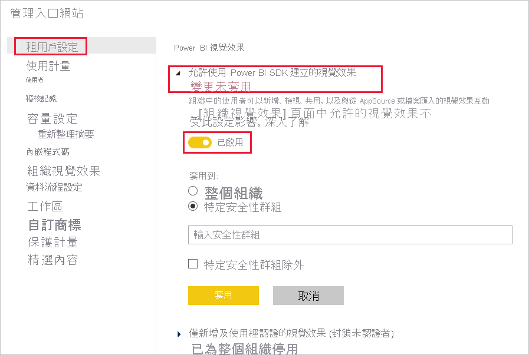
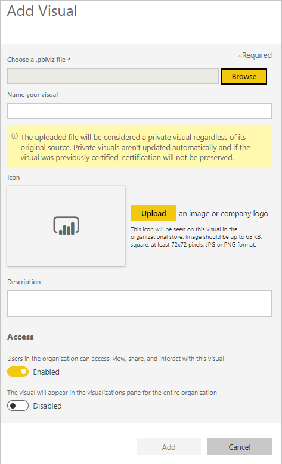
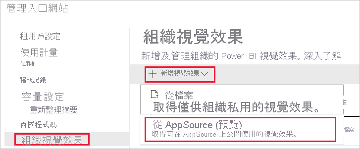

# 管理 Power BI 視覺效果系統管理員設定

身為組織的 Power BI 系統管理員，您可控制使用者能夠跨組織存取的 Power BI 視覺效果類型。

若要管理 Power BI 視覺效果，您必須是 Office 365 中的全域系統管理員，或已獲指派 Power BI 服務管理員角色。 如需 Power BI 服務系統管理員角色的詳細資訊，請參閱[了解 Power BI 系統管理員角色](service-admin-role.md)。

## 存取管理入口網站

若要啟用文章中所述的設定，您必須存取管理入口網站。

1. 在 Power BI 服務中，選取 [設定]。

2. 從 [設定] 下拉式功能表中，選取 [管理入口網站]。

    

## Power BI 視覺效果的租用戶設定

身為組織的 Power BI 系統管理員，您可控制使用者能夠跨組織存取的 Power BI 視覺效果類型。

UI 的 [租用戶設定] 只會影響 Power BI 服務。 如果想要在 Power BI Desktop 中使這些設定生效，請使用群組原則。 每個區段結尾處的表格會提供詳細資料，說明如何在 Power BI Desktop 中啟用設定。

>[!NOTE]
>[租用戶設定] 的變更不會影響 [[組織視覺效果](#organizational-visuals)] 索引標籤中所列 Power BI 視覺效果。

### AppSource 或檔案中的視覺效果

針對下列類型的 Power BI 視覺效果管理組織存取：

* 開發人員建立並儲存為 .pbiviz 檔案的視覺效果。

* 可從 AppSource 取得的視覺效果。

請遵循下列指示，讓組織中的使用者上傳 .pbiviz 檔案，並將視覺效果從 AppSource 新增至其報表和儀表板。

1. 展開 [允許使用 Power BI SDK 建立的視覺效果] 設定。

2. 按一下 [啟用]。

3. 選擇誰可上傳 .pbiviz 和 AppSource 視覺效果：

    * 選取 [整個組織] 選項，讓組織中的每個人都能上傳 .pbiviz 檔案，以及從 AppSource 新增視覺效果。

     * 選取 [特定安全性群組] 選項，以管理使用安全性群組上傳 .pbiviz 檔案，以及從 AppSource 新增視覺效果的作業。 請將所要管理的安全性群組新增至「輸入安全性群組」文字列中。 預設會排除所指定的安全性群組。 如果想要包含這些安全性群組並排除組織中的其他人，請選取 [特定安全性群組除外] 選項。

4. 按一下 [套用]。

[租用戶設定] 的 UI 變更僅適用於 Power BI 服務。 若要讓組織中的使用者上傳 .pbiviz 檔案，並將視覺效果從 AppSource 新增至 Power BI Desktop 中的 [視覺效果] 窗格，請使用 [Azure AD 群組原則](/azure/active-directory-domain-services/manage-group-policy)。

|索引鍵  |值名稱  |值  |
|---------|---------|---------|
|Software\Policies\Microsoft\Power BI Desktop\    |EnableCustomVisuals    |0 - 停用  1 - 啟用 (預設)         |
|

### 經認證的 Power BI 視覺效果

啟用這項設定時，只有[經認證 Power BI 視覺效果](../developer/visuals/power-bi-custom-visuals-certified.md)會在組織的報表和儀表板中呈現。 AppSource 或檔案中未經認證的 Power BI 視覺效果將會傳回錯誤訊息。

1. 從管理入口網站中，選取 [僅新增及使用經認證的視覺效果]。

2. 按一下 [啟用]。

3. 按一下 [套用]。

[租用戶設定] 的 UI 變更僅適用於 Power BI 服務。 若要管理 Power BI Desktop 中經認證視覺效果的租用戶設定，請使用 [Azure AD 群組原則](/azure/active-directory-domain-services/manage-group-policy)。

|索引鍵  |值名稱  |值  |
|---------|---------|---------|
|Software\Policies\Microsoft\Power BI Desktop\    |EnableUncertifiedVisuals    |0 - 停用  1 - 啟用 (預設)         |
|

## 組織視覺效果

身為 Power BI 系統管理員，您可管理[組織存放區](../developer/visuals/power-bi-custom-visuals.md#organizational-store)中可用 Power BI 視覺效果的清單。 [管理入口網站] 中的 [組織視覺效果] 索引標籤可供新增及移除視覺效果，並決定哪些視覺效果會自動顯示在組織使用者的 [視覺效果] 窗格中。 您可將任何類型的視覺效果新增至清單中，包括未經認證的視覺效果和 .pbiviz 視覺效果，即使這些視覺效果與組織的[租用戶設定](#power-bi-visuals-tenant-settings)相衝突也一樣。

[組織視覺效果] 設定會自動部署到 Power BI Desktop。

>[!NOTE]
>Power BI 報表伺服器不支援組織視覺效果。

### 從檔案新增視覺效果

使用此方法可從 .pbiviz 檔案新增新的 Power BI 視覺效果。

> [!WARNING]
> 從檔案所上傳 Power BI 視覺效果可能包含具有安全性或隱私權風險的程式碼；在將視覺效果部署到組織存放庫之前，請確定您信任該視覺效果的作者與來源。

1. 選取 [新增視覺效果] > [從檔案]。

    

2. 填寫下列欄位：

    *  - 選取要上傳的視覺效果檔案。

    * **為視覺效果命名** - 提供視覺效果的簡短標題，讓報表作者可輕鬆地了解其用途。

    * **圖示** - 上傳要在 [視覺效果] 窗格中顯示的圖示檔案。

    * **描述** - 提供視覺效果的簡短描述，以提供更多內容給使用者。

    * **存取** - 此區段有兩個選項：
    
        * 選取組織中的使用者可否存取此視覺效果。 此設定預設為啟用狀態。

        * 選取此視覺效果是否會出現在組織使用者的 [視覺效果] 窗格中。 預設會停用此設定。 如需詳細資訊，請參閱[將視覺效果新增至 [視覺效果] 窗格](#add-a-visual-to-the-visualization-pane)。

    

3. 若要起始上傳要求，請選取 [新增]。 上傳之後，視覺效果就會顯示在組織視覺效果清單中。

### 從 AppSource 新增視覺效果 (預覽)

使用此方法可從 AppSource 新增新的 Power BI 視覺效果。

AppSource 的 Power BI 視覺效果會自動更新。 組織中使用者一律會有最新版本的視覺效果。

1. 選取 [新增視覺效果] > [從 AppSource]。

    

2. 在 [Power BI 視覺效果] 視窗中，尋找想要新增的 AppSource 視覺效果，然後按一下 [新增]。 上傳之後，視覺效果就會顯示在組織視覺效果清單中。

### 將視覺效果新增至 [視覺效果] 窗格

您可從 [組織視覺效果] 頁面挑選視覺效果，以自動顯示在組織中所有使用者的 [視覺效果] 窗格上。

1. 在所要新增視覺效果的資料列中，按一下 [設定]。

    組織窗格

2. 啟用視覺效果窗格設定，然後按一下 [更新]。

    ![顯示 [視覺效果設定] 對話方塊的螢幕擷取畫面，您可在此處讓視覺效果顯示給整個組織。](media/organizational-visuals/update-organizational-pane.png)

### 刪除從檔案上傳的視覺效果

若要永久刪除視覺效果，請為存放庫中的視覺效果選取資源回收筒圖示。

> [!IMPORTANT]
> 刪除動作無法復原。 一旦刪除，視覺效果會立即停止在現有的報表中轉譯。 即使重新上傳相同的視覺效果，該視覺效果也不會取代已刪除的視覺效果。 不過，使用者可以重新匯入新視覺效果，並取代他們報表中的執行個體。

### 停用 .pbiviz 視覺效果

您可停用 .pbiviz 視覺效果，使其無法透過[組織存放區](../developer/visuals/power-bi-custom-visuals.md#organizational-store)進行存取，同時將其保留在組織視覺效果清單上。

1. 在所要停用 .pbiviz 視覺效果的資料列中，按一下 [設定]。

2. 在 [存取] 區段中，停用以下設定：[組織中的使用者可以存取、檢視、共用此視覺效果，並與其互動]。

停用 .pbiviz 視覺效果之後，該視覺效果將不會呈現在現有報表中，且會顯示下列錯誤訊息：

*此自訂視覺效果已無法使用。如需詳細資訊，請連絡您的系統管理員。*

>[!NOTE]
>已加入書籤的 .pbiviz 視覺效果可在停用後繼續運作。

### 更新視覺效果

AppSource 視覺效果會自動更新。 當 AppSource 中有新版本可供使用時，該版本會取代透過組織視覺效果清單所部署的較舊版本。

若要更新 .pbiviz 視覺效果，請遵循下列步驟來取代視覺效果。

1. 在所要新增視覺效果的資料列中，按一下 [設定]。

2. 按一下 [瀏覽]，然後選取想要用來取代目前視覺效果的 .pbiviz。

3. 按一下 [更新] 。

## 後續步驟

> [!div class="nextstepaction"]
>[在系統管理入口網站中管理 Power BI](service-admin-portal.md)

> [!div class="nextstepaction"]
>[Power BI 中的視覺效果](../developer/visuals/power-bi-custom-visuals.md)

> [!div class="nextstepaction"]
>[Power BI 中的組織視覺效果](../developer/visuals/power-bi-custom-visuals-organization.md)