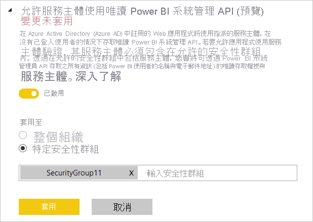

# 針對唯讀管理員 API 啟用服務主體驗證 (預覽)

服務主體是一種驗證方法，可用來讓 Azure Active Directory (Azure AD) 應用程式存取 Power BI 服務內容c API。
當您建立 Azure AD 應用程式時，會建立[服務主體物件](https://docs.microsoft.com/azure/active-directory/develop/app-objects-and-service-principals#service-principal-object) \(部分機器翻譯\)。 服務主體物件 (也簡稱為服務主體) 可讓 Azure AD 驗證您的應用程式。 經過驗證之後，應用程式就可以存取 Azure AD 租用戶資源。

## 方法

若要針對 Power BI 唯讀 API 啟用服務主體驗證，請遵循這些步驟：

1. [建立 Azure AD 應用程式](https://docs.microsoft.com/azure/active-directory/develop/howto-create-service-principal-portal) \(部分機器翻譯\)。 如果您已經擁有想要使用的 Azure AD 應用程式，可以略過此步驟。 記下 App-Id 以供後續步驟使用。 
2. 在 Azure Active Directory 中建立新的 **安全性群組**。 [深入了解如何使用 Azure Active Directory 建立基本群組並新增成員](https://docs.microsoft.com/azure/active-directory/fundamentals/active-directory-groups-create-azure-portal) \(部分機器翻譯\)。 如果您已經擁有想要使用的安全性群組，可以略過此步驟。
    請務必選取 [安全性] 作為 [群組類型]。

    ![Azure 入口網站中 [新增群組] 建立對話方塊的螢幕擷取畫面。](media/read-only-apis-service-principal-auth/azure-portal-new-group-dialog.png)

3. 將您的 App-Id 新增為您所建立之安全性群組的成員。 操作方法：
    1. 瀏覽到 Azure 入口網站 > [Azure Active Directory] > [群組]，然後選擇您在步驟 2 中建立的安全性群組。
    1. 選取 [新增成員]。
    注意:在 Azure 入口網站中，確定未針對您使用的應用程式設定任何 Power BI 管理員角色。 若要檢查這一點： 
       * 以全域管理員、應用程式管理員或雲端應用程式管理員的身分登入 **Azure 入口網站**。 
        * 選取 [Azure Active Directory]，然後選取 [企業應用程式]。 
        * 選取您想要為 Power BI 授與存取權的應用程式。 
        * 選取 [權限]。 確定未針對此應用程式設定任何需要 Power BI 管理員同意的權限。 請參閱[管理針對應用程式的同意和評估同意要求](https://docs.microsoft.com/azure/active-directory/manage-apps/manage-consent-requests) \(部分機器翻譯\) 以取得詳細資訊。 
4. 啟用 Power BI 服務系統管理員設定。 若要這樣做：
    1. 登入 Power BI 管理入口網站。 您必須是 Power BI 管理員，才能看到租用戶設定頁面。
    1. 在 [管理員 API 設定] 底下，您將會看到 [允許服務主體使用唯讀 Power BI 系統管理 API (預覽)]。 將切換設定為 [已啟用]，然後選取 [特定安全性群組] 選項按鈕，並在其下方顯示的文字欄位中新增您在步驟 2 中建立的安全性群組，如下圖所示。

        

 5. 開始使用唯讀管理員 API。 請參閱下列支援的 API 清單。

    >[!IMPORTANT]
    >一旦您啟用要與 Power BI 搭配使用的服務主體，應用程式的 Azure AD 權限就不再有任何效果。 然後，應用程式的使用權限會透過 Power BI 系統管理入口網站管理。

## 考量與限制
* 您無法使用服務主體登入 Power BI 入口網站。
* 需有 Power BI 管理員權限，才能在 Power BI 管理入口網站的 [管理員 API 設定] 中啟用服務主體。
* 服務主體目前支援下列 API：
    * [GetGroupsAsAdmin](https://docs.microsoft.com/rest/api/power-bi/admin/groups_getgroupsasadmin) \(英文\)，搭配適用於儀表板、資料集、報表與資料流程的 $expand 
    * [GetDashboardsAsAdmin](https://docs.microsoft.com/rest/api/power-bi/admin/dashboards_getdashboardsasadmin) \(英文\)，搭配 $expand 磚
    * [GetDatasourcesAsAdmin](https://docs.microsoft.com/rest/api/power-bi/admin/datasets_getdatasourcesasadmin) \(英文\) 
    * [GetDatasetToDataflowsLinksAsAdmin](https://docs.microsoft.com/rest/api/power-bi/admin/datasets_getdatasettodataflowslinksingroupasadmin) \(英文\)
    * [GetDataflowDatasourcesAsAdmin](https://docs.microsoft.com/rest/api/power-bi/admin/dataflows_getdataflowdatasourcesasadmin) \(英文\) 
    * [GetDataflowUpstreamDataflowsAsAdmin](https://docs.microsoft.com/rest/api/power-bi/admin/dataflows_getupstreamdataflowsingroupasadmin) \(英文\) 
    * [GetCapacitiesAsAdmin](https://docs.microsoft.com/rest/api/power-bi/admin/getcapacitiesasadmin) \(英文\)
    * [GetActivityLog](https://docs.microsoft.com/rest/api/power-bi/admin/getactivityevents) \(英文\)
    * [GetModifiedWorkspaces](https://docs.microsoft.com/rest/api/power-bi/admin/workspaceinfo_getmodifiedworkspaces)
    * [WorkspaceGetInfo](https://docs.microsoft.com/rest/api/power-bi/admin/workspaceinfo_postworkspaceinfo)
    * [WorkspaceScanStatus](https://docs.microsoft.com/rest/api/power-bi/admin/workspaceinfo_getscanstatus)
    * [WorkspaceScanResult](https://docs.microsoft.com/rest/api/power-bi/admin/workspaceinfo_getscanresult)
