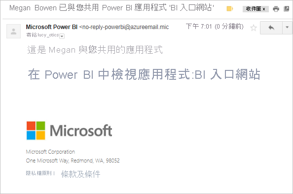
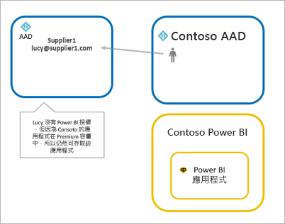
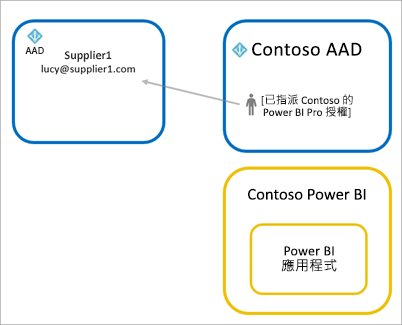

# 使用 Azure AD B2B 將 Power BI 內容散發給外部來賓使用者

Power BI 可透過 Azure Active Directory 企業對企業 (Azure AD B2B) 來與外部來賓使用者共用內容。 藉由使用 Azure AD B2B，組織就能在中央位置啟用並控管與外部使用者共用的功能。 根據預設，外部來賓僅具有使用體驗。 此外，您可以允許外部來賓使用者編輯和管理組織中的內容。

本文提供 Power BI 中 Azure AD B2B 的基本簡介。 如需詳細資訊，請參閱[使用 Azure Active Directory B2B 將 Power BI 內容散發給外部來賓使用者](../guidance/whitepaper-azure-b2b-power-bi.md)。

## 啟用存取

邀請來賓使用者之前，請確定您已在 Power BI 管理入口網站中啟用[與外部使用者共用內容](service-admin-portal.md#export-and-sharing-settings)的功能。 即使已啟用此選項，還是必須在 Azure Active Directory 中為使用者授與「來賓邀請者」角色，才能邀請來賓使用者。

[允許外部來賓使用者編輯和管理組織中的內容](service-admin-portal.md#allow-external-guest-users-to-edit-and-manage-content-in-the-organization)選項，可讓您允許來賓使用者在工作區中查看和建立內容，包括瀏覽您組織的 Power BI。

> [!NOTE]
> [與外部使用者共用內容](service-admin-portal.md#export-and-sharing-settings)設定，可控制 Power BI 是否允許邀請外部使用者到您的組織。 當外部使用者接受邀請之後，其即會成為您組織中的 Azure AD B2B 來賓使用者。 在整個 Power BI 體驗中，這些使用者都會出現在人員選擇器中。 如果停用此設定，則您組織中的現有來賓使用者就能繼續存取其先前已經有權存取的所有項目，並繼續列在人員選擇器體驗中。 此外，如果您是透過[計劃性邀請](#planned-invites)方法新增來賓，則他們也會出現在人員選擇器中。 若要防止來賓使用者存取 Power BI，請使用 Azure AD 條件式存取原則。

## 您可以邀請哪些人？

來賓使用者邀請支援大多數電子郵件地址，包括 gmail.com、outlook.com 和 hotmail.com 等個人電子郵件帳戶。 Azure AD B2B 會將這些地址稱為「社交身分識別」。

您無法邀請與政府雲端 (例如 [Power BI for US Government](service-govus-overview.md)) 相關聯的使用者。

## 邀請來賓使用者

您只需在首次邀請來賓使用者存取您組織時傳送邀請給他們。 若要邀請使用者，請使用計劃性邀請或臨時邀請。

若要使用臨時邀請，請使用下列功能：

* 報表和儀表板共用
* 應用程式存取清單

工作區存取清單不支援臨時邀請。 使用[計劃性邀請方法](#planned-invites)，以將這些使用者新增至您的組織。 當外部使用者成為您組織中的來賓之後，請將其新增至工作區存取清單。

### 計劃性邀請

如果您知道要邀請哪些使用者，可以使用計劃性邀請。 您可以使用 Azure 入口網站或 PowerShell 來傳送邀請。 您必須獲指派使用者管理員角色，才能邀請人員。

請遵循下列步驟，以在 Azure 入口網站中傳送邀請。

1. 在 [Azure 入口網站](https://portal.azure.com) 中，選取 [Azure Active Directory]。

1. 在 [管理] 底下，選取 [使用者] > [所有使用者] > [新增來賓使用者]。

    ![顯示 [新增來賓使用者] 選項的 Azure 入口網站螢幕擷取畫面。](media/service-admin-azure-ad-b2b/azure-ad-portal-new-guest-user.png)

1. 輸入 [電子郵件地址] 和 [個人訊息]。

    ![[新增來賓使用者] 對話方塊的螢幕擷取畫面，包含醒目提示的 [電子郵件] 和 [訊息] 欄位。](media/service-admin-azure-ad-b2b/azure-ad-portal-invite-message.png)

1. 選取 [邀請]。

若要邀請一位以上的來賓使用者，請使用 PowerShell 或在 Azure AD 中建立大量邀請。 若要使用 PowerShell 進行大量邀請，請遵循[教學課程：使用 PowerShell 大量邀請 Azure AD B2B 共同作業使用者](/azure/active-directory/b2b/bulk-invite-powershell/)中的步驟。 若要使用 Azure 入口網站進行大量邀請，請遵循[教學課程：大量邀請 Azure AD B2B 共同作業使用者](/azure/active-directory/b2b/tutorial-bulk-invite/)中的步驟。

來賓使用者必須在收到的電子郵件邀請中選取 [開始使用]。 系統即會將該來賓使用者新增至組織。

![來賓使用者電子郵件邀請的螢幕擷取畫面，包含醒目提示的 [開始使用]。](media/service-admin-azure-ad-b2b/guest-user-invite-email.png)

### 臨時邀請

若要隨時邀請外部使用者，請透過共用功能將其新增至您的儀表板或報表，或透過存取頁面新增至您的應用程式。 以下範例是邀請外部使用者使用應用程式時該執行的作業。

來賓使用者會收到電子郵件，指出您已與其共用應用程式。

來賓使用者必須使用其組織電子郵件地址來登入。 系統會在他們登入之後提示他們接受邀請。 登入之後，系統會為來賓使用者開啟應用程式。 若要返回應用程式，則來賓使用者需將連結加入書籤，或儲存電子郵件。

## 授權

來賓使用者必須有適當授權才能檢視您所共用的內容。 有三種選項可以確定使用者具有適當授權：使用 Power BI Premium、指派 Power BI Pro 授權，或使用來賓的 Power BI Pro 授權。

[可以編輯和管理組織中內容的來賓使用者](service-admin-portal.md#allow-external-guest-users-to-edit-and-manage-content-in-the-organization)需要 Power BI Pro 授權，才能將內容提供給工作區，或與其他人共用內容。

### 使用 Power BI Premium

將工作區指派給 [Power BI Premium 容量](service-premium-what-is.md)能讓來賓使用者使用應用程式，而不需要 Power BI Pro 授權。 Power BI Premium 還可讓應用程式充分利用其他功能，像是增加重新整理頻率、專用容量和大型模型等。

### 將 Power BI Pro 授權指派給來賓使用者

將組織的 Power BI Pro 授權指派給來賓使用者，讓該來賓使用者能夠檢視與其共用的內容。 如需指派授權的詳細資訊，請參閱[在 [授權] 頁面上將授權指派給使用者](/office365/admin/manage/assign-licenses-to-users#assign-licenses-to-users-on-the-licenses-page)。 將 Pro 授權指派給來賓使用者之前，請參閱[授權條款網站](https://www.microsoft.com/licensing/terms)，以確保符合 Microsoft 授權合約的規範。

### 來賓使用者帶來自己的 Power BI Pro 授權

來賓使用者可能已經擁有透過其自己組織獲得指派的 Power BI Pro 授權。

## 可以編輯和管理內容的來賓使用者

使用[允許外部來賓使用者編輯和管理組織中的內容](service-admin-portal.md#allow-external-guest-users-to-edit-and-manage-content-in-the-organization)功能時，所指定來賓使用者將能取得您組織的 Power BI 額外存取權。 允許的來賓可以查看所有授權內容、存取首頁、瀏覽工作區、安裝應用程式、查看自己在存取清單上的位置，並為工作區提供內容。 這些來賓可以建立使用新工作區體驗的工作區，或是成為該工作區的管理員。 適用某些限制。 ＜考量與限制＞一節會列出那些限制。

若要協助授權的來賓登入 Power BI，請提供其租用戶 URL。 若要尋找租用戶 URL，請遵循下列步驟。

1. 在 Power BI 服務的標題功能表中，選取說明 ( **?** )，然後選取 [關於 About Power BI]。

2. 尋找 [租用戶 URL] 旁邊的值。 與您所授權的來賓使用者共用租用戶 URL。

    ![[關於 Power B I] 對話方塊的螢幕擷取畫面，包含醒目提示的來賓使用者租用戶 U R L 。](media/service-admin-azure-ad-b2b/power-bi-about-dialog.png)

## 考量與限制

* 根據預設，外部 Azure AD B2B 會將來賓限制為僅能使用內容。 外部 Azure AD B2B 來賓可以檢視應用程式、儀表板、報表、匯出資料，並針對儀表板和報表建立電子郵件訂閱。 他們無法存取工作區或發行其專屬內容。 若要移除這些限制，您可以使用[允許外部來賓使用者編輯和管理組織中的內容](service-admin-portal.md#allow-external-guest-users-to-edit-and-manage-content-in-the-organization)功能。

* 若要邀請來賓使用者，則需要 Power BI Pro 授權。 Pro 試用版使用者無法在 Power BI 中邀請來賓使用者。

* 某些體驗無法供[可編輯和管理組織中內容的來賓使用者](service-admin-portal.md#allow-external-guest-users-to-edit-and-manage-content-in-the-organization)使用。 若要更新或發佈報表，來賓使用者需要使用 Power BI 服務，包括 [取得資料] 以上傳 Power BI Desktop 檔案。  不支援下列體驗：
  * 從 Power BI Desktop 直接發佈至 Power BI 服務
  * 來賓使用者無法使用 Power BI Desktop 來連線至 Power BI 服務中的服務資料集
  * 繫結至 Microsoft 365 群組的傳統工作區
    * 來賓使用者無法建立這些工作區，或是成為這些工作區的管理員
    * 來賓使用者可以成為成員
  * 工作區的存取清單不支援傳送臨時邀請
  * Power BI Publisher for Excel 不支援來賓使用者
  * 來賓使用者無法安裝 Power BI Gateway，並將它連線至您的組織
  * 來賓使用者無法安裝應用程式並發佈到整個組織
  * 來賓使用者無法使用、建立、更新或安裝組織內容套件
  * 來賓使用者無法使用 [使用 Excel 分析]
  * 無法在註解中對來賓使用者進行 @mentioned
  * 來賓使用者無法使用訂用帳戶
  * 如果來賓使用者要使用此功能，則應具備公司或學校帳戶

* 由於登入限制，使用社交身分識別的來賓使用者將會受到更多限制。
  * 來賓使用者可以透過網頁瀏覽器來使用 Power BI 服務中的使用體驗
  * 其無法使用 Power BI 行動裝置應用程式
  * 其將無法登入需要公司或學校帳戶的認證

* Power BI SharePoint Online 報表網頁組件目前不提供此功能。

* Azure Active Directory 設定可以限制外部來賓使用者能夠在整個組織內完成的作業。 那些設定也適用於您的 Power BI 環境。 下列文件會討論這些設定：
  * [管理外部共同作業設定](/azure/active-directory/b2b/delegate-invitations#configure-b2b-external-collaboration-settings)
  * [允許或封鎖對特定組織 B2B 使用者的邀請](https://docs.microsoft.com/azure/active-directory/b2b/allow-deny-list)
  * [使用條件式存取來允許或封鎖存取](/azure/active-directory/conditional-access/concept-conditional-access-cloud-apps)

* 您可以將政府雲端 (例如 GCC) 的內容與外部商業雲端使用者共用。 不過，來賓使用者無法使用自己的授權。 內容必須位於已指派給 Premium 的容量中，才能啟用存取。 或者，您可以將 Power BI Pro 授權指派給來賓帳戶。

* 國家雲端 (例如，德國或中國雲端執行個體) 不支援在組織外部共用。 相反地，請在組織中建立使用者帳戶，以供外部使用者用來存取內容。

* 如果您直接與來賓使用者共用，Power BI 會將附有連結的電子郵件傳送給他們。 若要避免傳送電子郵件，請將來賓使用者新增到安全性群組，並共用至安全性群組。  

## 後續步驟

如需詳細資訊，包括資料列層級安全性的運作方式，請參閱白皮書：[使用 Azure AD B2B 將 Power BI 內容散發給外部來賓使用者](https://aka.ms/powerbi-b2b-whitepaper)。

如需有關 Azure AD B2B 的相關資訊，請參閱[什麼是 Azure AD B2B 共同作業？](/azure/active-directory/active-directory-b2b-what-is-azure-ad-b2b/)。
