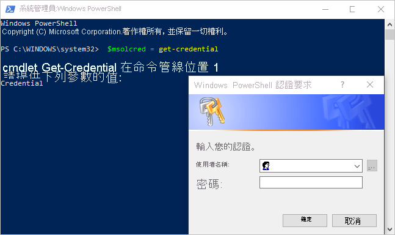

# <a name="administering-power-bi---frequently-asked-questions-faq"></a>管理 Power BI - 常見問題集 (FAQ)

本文可解決 Power BI 管理的常見問題。 如需 Power BI 管理的概觀，請參閱[什麼是 Power BI 管理？](service-admin-administering-power-bi-in-your-organization.md)。

## <a name="whats-in-this-article"></a>本文內容

### <a name="sign-up-for-power-bi-section"></a>註冊 Power BI 小節

* [使用 PowerShell](#using-powershell)
* [使用者如何註冊 Power BI？](#how-do-users-sign-up-for-power-bi)
* [個人使用者如何在我的組織中註冊？](#how-do-individual-users-in-my-organization-sign-up)
* [我該如何防止使用者加入現有的組織？](#how-can-i-prevent-users-from-joining-my-existing-microsoft-365-tenant)
* [我該如何允許使用者加入現有的組織？](#how-can-i-allow-users-to-join-my-existing-microsoft-365-tenant)
* [我該如何檢查租用戶是否開啟了封鎖？](#how-do-i-check-if-i-have-the-block-on-in-the-tenant)
* [我該如何不讓現有的使用者開始使用 Power BI？](#how-can-i-prevent-my-existing-users-from-starting-to-use-power-bi)
* [我要如何允許現有的使用者註冊 Power BI？](#how-can-i-allow-my-existing-users-to-sign-up-for-power-bi)

### <a name="administration-of-power-bi-section"></a>Power BI 的系統管理小節

* [這會怎麼改變我目前管理組織中使用者身分識別的方式？](#how-will-this-change-the-way-i-manage-identities-for-users-in-my-organization-today)
* [要如何管理 Power BI？](#how-do-we-manage-power-bi)
* [管理 Microsoft 為使用者所建之租用戶的程序為何？](#what-is-the-process-to-manage-a-tenant-created-by-microsoft-for-my-users)
* [我如有多個網域，可以控制使用者所要加入的 Microsoft 365 租用戶嗎？](#if-i-have-multiple-domains-can-i-control-the-microsoft-365-tenant-that-users-get-added-to)
* [如何移除已註冊使用者的 Power BI？](#how-do-i-remove-power-bi-for-users-that-already-signed-up)
* [我如何知道有新的使用者加入我的租用戶？](#how-do-i-know-when-new-users-have-joined-my-tenant)
* [我還應該準備什麼？](#are-there-any-additional-things-i-should-prepare-for)
* [我的 Power BI 租用戶位於何處？](#where-is-my-power-bi-tenant-located)
* [什麼是 Power BI SLA (服務等級協定)？](#what-is-the-power-bi-sla)
* [Power BI 如何處理高可用性和容錯移轉？](#how-does-power-bi-handle-high-availability-and-failover)

### <a name="security-in-power-bi-section"></a>Power BI 中的安全性小節

* [Power BI 是否符合國家、地區和業界的特定法規要求？](#does-power-bi-meet-national-regional-and-industry-specific-compliance-requirements)
* [Power BI 安全性如何運作？](#how-does-security-work-in-power-bi)

## <a name="sign-up-for-power-bi"></a>註冊 Power BI

### <a name="using-powershell"></a>使用 PowerShell

此節中的一些程序需要 Windows PowerShell 指令碼。 如果您不熟悉 PowerShell，我們建議您參閱 [PowerShell 入門手冊](/powershell/scripting/overview)。 若要執行指令碼，請先安裝[適用於 Graph 的 Azure Active Directory PowerShell](/powershell/azure/active-directory/overview) 的最新 64 位元版本。

### <a name="how-do-users-sign-up-for-power-bi"></a>使用者如何註冊 Power BI？

Microsoft 365 系統管理員可以透過 [Power BI 網站](https://powerbi.microsoft.com)或 Microsoft 365 系統管理中心上的[購買服務](https://admin.microsoft.com/AdminPortal/Home#/catalog)頁面註冊 Power BI。 Microsoft 365 系統管理員可以在註冊 Power BI 時，將使用者授權指派給需要存取權的使用者。

貴組織中的個人使用者也可以透過 [Power BI 網站](https://powerbi.microsoft.com)註冊 Power BI。 當貴組織中使用者註冊 Power BI 時，服務會自動將 Power BI 授權指派給該使用者。 如需詳細資訊，請參閱[以個人身分註冊 Power BI](../fundamentals/service-self-service-signup-for-power-bi.md) 與[組織中的 Power BI 授權](service-admin-licensing-organization.md)。

### <a name="how-do-individual-users-in-my-organization-sign-up"></a>個人使用者如何在我的組織中註冊？

貴組織使用者有三種適用案例︰

* **案例 1**︰您的組織已有 Microsoft 365 環境，且要註冊 Power BI 的使用者也有 Microsoft 365 帳戶。
    在此案例中，若使用者在租用戶中已經有公司或學校帳戶 (例如 contoso.com)，但還沒有 Power BI，則 Microsoft 只會為該帳戶啟用 Power BI (免費) 方案。 系統會自動通知使用者如何使用 Power BI 服務的資訊。

* **案例 2**︰您的組織已有 Microsoft 365 環境，但要註冊 Power BI 的使用者沒有 Microsoft 365 帳戶。
    在此案例中，使用者使用您組織網域的電子郵件地址 (例如 contoso.com)，但還沒有 Microsoft 365 帳戶。 在此情況下，使用者可以註冊 Power BI，且會自動獲得帳戶。 這個動作可讓使用者存取 Power BI 服務。 例如，假設員工 Nancy 使用她的公司電子郵件地址 (例如 nancy@contoso.com) 註冊，Microsoft 就會自動將 Nancy 新增為 Contoso 之 Microsoft 365 環境的使用者，並為該帳戶啟用 Power BI。

* **案例 3**︰您組織的 Microsoft 365 環境未連線到您電子郵件網域。
    貴組織不需要執行任何管理動作來利用 Power BI。 服務會將使用者新增至僅限雲端的新使用者目錄。 您也可以選擇接管該租用戶，成為其 Microsoft 365 全域管理員來管理該環境。

> [!IMPORTANT]
> 如果貴組織有多個電子郵件網域，而您希望所有的電子郵件地址擴充功能都在相同的租用戶中，請先將所有電子郵件地址網域新增至 Azure Active Directory 租用戶中，再讓使用者註冊。 使用者建立後，沒有自動化的機制可在租用戶之間移動使用者。 如需此流程的詳細資訊，請參閱後文中的[我如有多個網域，可以控制使用者所要加入的 Microsoft 365 租用戶嗎？](#if-i-have-multiple-domains-can-i-control-the-microsoft-365-tenant-that-users-get-added-to)一文，以及[將網域新增至 Microsoft 365](/office365/admin/setup/add-domain/)。

### <a name="how-can-i-prevent-users-from-joining-my-existing-microsoft-365-tenant"></a>如何才能禁止使用者加入我現有的 Microsoft 365 租用戶？

全域管理員可採取幾項步驟，以禁止使用者加入現有的 Microsoft 365 租用戶。 如果您封鎖存取，則使用者嘗試註冊會失敗，且會出現訊息，將他們導向至連絡組織系統管理員。如果您已停用自動授權發佈 (例如透過學生用、教職員用 Office 365 教育版)，就不需要重複此程序。

您可以使用下列 PowerShell 指令碼來防止新使用者加入受控租用戶。 ([深入了解 PowerShell][1]。)

```powershell
$msolcred = get-credential
connect-msolservice -credential $msolcred

Set-MsolCompanySettings -AllowEmailVerifiedUsers $false
```

> [!NOTE]
> 封鎖存取會防止您組織的新使用者註冊 Power BI。 在您停用組織的新註冊前即已註冊 Power BI 的使用者，仍然保留其授權。 若要移除使用者，請參閱此文章稍後的[如何移除已註冊使用者的 Power BI？](#how-do-i-remove-power-bi-for-users-that-already-signed-up)。

### <a name="how-can-i-allow-users-to-join-my-existing-microsoft-365-tenant"></a>我該如何允許使用者加入我現有的 Microsoft 365 租用戶？

使用下列 PowerShell 指令碼讓新使用者加入受控租用戶。 ([深入了解 PowerShell][1]。)

```powershell
$msolcred = get-credential
connect-msolservice -credential $msolcred

Set-MsolCompanySettings -AllowEmailVerifiedUsers $true
```

### <a name="how-do-i-check-if-i-have-the-block-on-in-the-tenant"></a>我該如何檢查租用戶是否開啟了封鎖？

使用下列 PowerShell 指令碼來檢查設定。 *AllowEmailVerifiedUsers* 應為 false。 ([深入了解 PowerShell][1]。)

```powershell
$msolcred = get-credential
connect-msolservice -credential $msolcred

Get-MsolCompanyInformation | fl allow*
```

### <a name="how-can-i-prevent-my-existing-users-from-starting-to-use-power-bi"></a>我該如何不讓現有的使用者開始使用 Power BI？

控制此項的 Azure AD 設定是 **AllowAdHocSubscriptions**。 大部分的租用戶都會將此設定為 *true*，表示已啟用此設定。 如果您是透過合作夥伴取得 Power BI，這可能已設定為 *false*，表示已停用此設定。

您可以使用下列 PowerShell 指令碼來停用隨選訂閱。([深入了解 PowerShell][1]。)

1. 使用 Microsoft 365 認證登入 Azure Active Directory。 下列 PowerShell 指令碼的第一行會提示您輸入您的認證。 第二行連接到 Azure Active Directory。

    ```powershell
     $msolcred = get-credential
     connect-msolservice -credential $msolcred
    ```

   

1. 當您登入之後，請執行下列命令，查看租用戶目前的設定情形。

    ```powershell
     Get-MsolCompanyInformation | fl AllowAdHocSubscriptions
    ```

1. 請執行下列命令啟用 (`$true`) 或停用 (`$false`) **AllowAdHocSubscriptions**。

    ```powershell
     Set-MsolCompanySettings -AllowAdHocSubscriptions $false
    ```

> [!NOTE]
> **AllowAdHocSubscriptions** 旗標可用以控制貴組織的數個使用者功能，包括使用者能否註冊 Azure Rights Management Service。 變更此旗標會影響所有這些功能。 請注意，若設定為 *false*，使用者仍能註冊 Power BI Pro 試用版。

### <a name="how-can-i-allow-my-existing-users-to-sign-up-for-power-bi"></a>我要如何允許現有的使用者註冊 Power BI？

若要讓現有的使用者註冊 Power BI，請執行前個問題所列的命令，但在最後一個步驟中傳遞 `$true`，而不傳遞 `$false`。

## <a name="administration-of-power-bi"></a>管理 Power BI

### <a name="how-will-this-change-the-way-i-manage-identities-for-users-in-my-organization-today"></a>這會怎麼改變我目前管理組織中使用者身分識別的方式？

貴組織使用者有三種適用案例︰

* **案例 1**︰若您的組織已有 Microsoft 365 環境，且組織中的所有使用者都有 Microsoft 365 帳戶，則您對於身分識別的管理方式不會有任何變更。

* **案例 2**︰若您的組織已有 Microsoft 365 環境，但組織中並非所有使用者都有 Microsoft 365 帳戶，則我們會在租用戶中建立使用者，然後依據使用者的公司或學校電子郵件地址指派授權。

    因此，您在任何特定時間內管理的使用者數目，會隨組織中的使用者註冊服務而成長。

* **案例 3**︰若您組織的 Microsoft 365 環境未連線到您的電子郵件網域，則您對於身分識別的管理方式不會有任何變更。

    此服務會將使用者新增至僅限雲端的新使用者目錄；您可以選擇是否要接管該目錄，成為 Microsoft 365 全域管理員進行管理。

### <a name="how-do-we-manage-power-bi"></a>要如何管理 Power BI？

Power BI 提供 Power BI 管理入口網站，供 Microsoft 365 全域管理員角色中的使用者及 Power BI 服務系統管理員角色中的使用者使用。 若要使用 Power BI 管理入口網站，必須在 Microsoft 365 或 Azure Active Directory 中，將您的帳戶標示為**全域管理員**，或者必須有人將 Power BI 服務系統管理員角色指派給您的使用者帳戶。 如需詳細資訊，請參閱[了解 Power BI 系統管理員角色](service-admin-role.md)與 [Power BI 系統管理入口網站](service-admin-portal.md)。 此入口網站可以讓您控制影響遍及整個租用戶的設定、檢視 Power BI 使用量統計資料，並提供 Microsoft 365 系統管理中心連結，讓您管理使用者與群組。

### <a name="what-is-the-process-to-manage-a-tenant-created-by-microsoft-for-my-users"></a>管理 Microsoft 為使用者所建之租用戶的程序為何？

當自助使用者註冊使用 Azure AD 的雲端服務時，服務會根據他們的電子郵件網域將他們新增到非受控 Azure AD 目錄。 您可以要求或管理他人使用*系統管理員接管*流程所建立的租用戶。 如需詳細資訊，請參閱[使用 Azure Active Directory 中的系統管理員身分接管非受控目錄](/azure/active-directory/users-groups-roles/domains-admin-takeover)。 您所執行接管類型取決於是否有與您網域建立關聯的現有受控租用戶：

* Power BI 支援內部系統管理員接管。 當您執行非受控 Azure 目錄的「內部」系統管理員接管時，系統會將您新增為非受控目錄的全域管理員。 系統不會將任何使用者、網域或服務方案移轉至您所管理的其他目錄。

* Power BI 不再支援外部系統管理員接管。 當您執行非受控 Azure 目錄的「外部」系統管理員接管時，您會將非受控目錄的 DNS 網域名稱新增至受控 Azure 目錄。 外部接管將導致無法存取原始未受控之租用戶上的所有 Power BI 內容。 Power BI 報表必須重新發佈給新的租用戶，並須在新的租用戶中重新建立 Power BI 儀表板與應用程式。

### <a name="if-i-have-multiple-domains-can-i-control-the-microsoft-365-tenant-that-users-get-added-to"></a>我如有多個網域，可以控制使用者所要加入的 Microsoft 365 租用戶嗎？

如果不執行任何動作，服務會為每個使用者電子郵件網域和子網域建立租用戶。 如果不論電子郵件地址擴充功能為何，希望所有使用者都在相同的租用戶中︰預先建立目標租用戶，或使用現有的租用戶。 然後新增您想要在該租用戶內彙總的所有現有網域和子網域。 電子郵件地址結尾是那些網域與子網域的所有使用者，都會在他們註冊時自動加入目標租用戶。

> [!IMPORTANT]
> 建立使用者後，支援的自動化機制沒有在租用戶之間移動使用者。 若要深入了解如何將網域新增至單一 Microsoft 365 租用戶，請參閱[將使用者與網域新增至 Microsoft 365](/office365/admin/setup/add-domain/)。

### <a name="how-do-i-remove-power-bi-for-users-that-already-signed-up"></a>如何移除已註冊使用者的 Power BI？

如果使用者已註冊 Power BI，但您不希望他們繼續存取 Power BI，您可以移除該使用者的 Power BI 授權。

1. 移至 [MIcrosoft 365 系統管理中心](https://admin.microsoft.com/AdminPortal/Home#/homepage)。

1. 請在瀏覽窗格中選取 [使用者] > [作用中使用者]。

1. 找到您要移除授權的使用者，然後選取其名稱。

    您也可以對使用者執行大量授權管理。 若要這樣做，請選取多個使用者，然後選取 [編輯產品授權]。

1. 在使用者詳細資料頁面上的 [產品授權] 旁邊，選取 [編輯]。

1. 視您對帳戶套用的授權而定，將 [Power BI (免費)] 或 [Power BI Pro] 設定為 [關閉]。

1. 選取 [儲存]。

### <a name="how-do-i-know-when-new-users-have-joined-my-tenant"></a>我怎麼知道有新的使用者加入我的租用戶？

透過自助式註冊加入您租用戶的使用者，將獲指派一份專用授權，而您可以在系統管理儀表板的有效使用者窗格中加以篩選。 若要建立這個新檢視，請依照下列步驟執行。

1. 巡覽至 [MIcrosoft 365 系統管理中心](https://admin.microsoft.com/AdminPortal/Home#/homepage)。

1. 請在瀏覽窗格中選取 [使用者] > [作用中使用者]。

1. 在 [檢視] 功能表上，選取 [新增自訂檢視]。

1. 為新的檢視命名，然後在 [已指派的產品授權] 下選取 [Power BI (免費)] 或 [Power BI Pro]。

    每個檢視只能選取一個授權。 如果您的組織同時有 [Power BI (免費)] 與 [Power BI Pro] 授權，則您可以建立兩個檢視。

1. 輸入您想要的任何其他條件，然後選取 [新增]。

1. 建立新檢視之後，即可在 [檢視] 功能表中取得該檢視。

### <a name="are-there-any-additional-things-i-should-prepare-for"></a>我還應該準備什麼？

您可能會遇到密碼重設要求增加的情況。 如需這個程序的詳細資訊，請參閱[重設使用者密碼](/office365/admin/add-users/reset-passwords)。

您可以透過 Microsoft 365 系統管理中心的標準程序來移除租用戶使用者。 不過，如果使用者仍有您組織的有效電子郵件地址，除非您封鎖所有使用者加入，否則他們可以重新加入。

### <a name="where-is-my-power-bi-tenant-located"></a>我的 Power BI 租用戶位於何處？

如需 Power BI 租用戶位在哪個資料區中的資訊，請參閱[我的 Power BI 租用戶位於何處？](service-admin-where-is-my-tenant-located.md)。

### <a name="what-is-the-power-bi-sla"></a>什麼是 Power BI SLA？

如需 Power BI SLA (服務等級協定) 的相關資訊，請參閱 Microsoft Licensing 網站 **Licensing** (授權) 一節中的 [Licensing Terms and Documentation](https://www.microsoftvolumelicensing.com/DocumentSearch.aspx?Mode=3&DocumentTypeId=37) (授權條款與文件) 文章。

### <a name="how-does-power-bi-handle-high-availability-and-failover"></a>Power BI 如何處理高可用性和容錯移轉？

如需高可用性和容錯移轉的資訊，請參閱 [Power BI 的高可用性、容錯移轉和災害復原常見問題集](service-admin-failover.md)。

## <a name="security-in-power-bi"></a>Power BI 的安全性

### <a name="does-power-bi-meet-national-regional-and-industry-specific-compliance-requirements"></a>Power BI 是否符合國家、地區和業界的特定法規要求？

若要深入了解 Power BI 相容性，請參閱 [Microsoft 信任中心](https://www.microsoft.com/TrustCenter/CloudServices/business-application-platform/default.aspx)。

### <a name="how-does-security-work-in-power-bi"></a>Power BI 安全性如何運作？

Microsoft Power BI 以 Microsoft 365 為建置基礎上，而 Microsoft 365 則是以 Azure Active Directory 等 Azure 服務為建置基礎。 如需 Power BI 架構的概觀，請參閱 [Power BI 安全性](service-admin-power-bi-security.md)。

## <a name="next-steps"></a>後續步驟

[Power BI 管理入口網站](service-admin-portal.md)  
[了解 Power BI 系統管理員角色](service-admin-role.md)  
[Power BI 的自助式註冊](../fundamentals/service-self-service-signup-for-power-bi.md)  
[購買 Power BI Pro](service-admin-purchasing-power-bi-pro.md)  
[什麼是 Power BI Premium？](service-premium-what-is.md)  
[如何購買 Power BI Premium](service-admin-premium-purchase.md)  
[Power BI Premium 技術白皮書](https://aka.ms/pbipremiumwhitepaper)  
[管理 Power BI 和 Microsoft 365 中的群組](../collaborate-share/service-manage-app-workspace-in-power-bi-and-office-365.md)  
[公司或學校帳戶管理](/office365/servicedescriptions/office-365-platform-service-description/user-account-management/)  
[Microsoft 365 群組管理](/office365/admin/email/create-edit-or-delete-a-security-group/)  

有其他問題嗎？ [嘗試在 Power BI 社群提問](https://community.powerbi.com/)

[1]: /powershell/scripting/overview