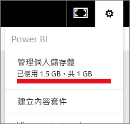

# 管理 Power BI 工作區中的資料儲存體

了解如何管理個人或工作區中的資料儲存空間，讓您可以繼續發佈報表和資料集。

## 容量限制

工作區儲存空間限制 (不論是 [我的工作區] 或應用程式工作區) 取決於該工作區是在[共用或 Premium 容量](../fundamentals/service-basic-concepts.md#capacities)中。

### 共用容量限制
針對共用容量中的工作區： 

- 每個工作區的儲存體限制為 100 GB。
- 針對應用程式工作區，總使用量不能超過 10 GB 租用戶儲存體限制乘以租用戶中的 Pro 授權數目。

### Premium 容量限制
針對 Premium 容量中的工作區：
- 每個 Premium 容量的限制為 100 TB。
- 沒有個別使用者的儲存空間限制。

請閱讀 [Power BI 定價模型](https://powerbi.microsoft.com/pricing)之其他功能的相關資訊。

## 儲存空間中包含的內容

資料儲存空間包含您自己的資料集和 Excel 報表，以及其他人已與您共用的項目。 資料集可以是您已上傳或連線到的任何資料來源。 這些資料來源包含您正在使用的 Power BI Desktop 檔案和 Excel 活頁簿。 下列項目也包含在資料容量中。

* 已釘選到儀表板的 Excel 範圍。
* 已釘選到 Power BI 儀表板的 Reporting Services 內部部署視覺效果。
* 已上傳的影像。

您所共用儀表板大小會因釘選到儀表板的內容而有所不同。 例如，如果您釘選屬於兩個不同資料集之兩份報表中的項目，則大小會包含這兩個資料集。

## 管理您擁有的項目

查看您在 Power BI 帳戶中使用的資料儲存空間，並管理您的帳戶。

1. 若要管理您自己的儲存空間，請移至瀏覽窗格中的 [我的工作區]。
   
    ![螢幕擷取畫面，其中為具有 [我的工作區] 呼叫的功能窗格。](media/service-admin-manage-your-data-storage-in-power-bi/pbi_myworkspace.png)

2. 選取右上角的齒輪圖示 [管理個人儲存體]。
   
    頂端列會顯示您已使用的儲存空間限制量。
   
    ![[管理儲存體限制] 的螢幕擷取畫面，其中顯示已使用的儲存體數量。](media/service-admin-manage-your-data-storage-in-power-bi/pbi_persnlstorage.png)
   
    資料集和報表會分成兩個索引標籤：
   
    **由我所擁有：** 您已將這些報表和資料集上傳至 Power BI 帳戶，包括 Salesforce 和 Dynamics CRM 等服務資料集。  

    **由他人所擁有：** 其他人已與您共用這些報表和資料集。
1. 若要刪除資料集或報表，請選取垃圾桶圖示 .

請記住，您或其他人可能會有依據某個資料集的報表和儀表板。 如果您刪除該資料集，這些報表和儀表板將無法再運作。

## 管理工作區
1. 選取 [工作區] 旁的箭號，然後選取工作區的名稱。
   
    ![[工作區] 選取項目的螢幕擷取畫面，其中顯示 [銷售群組] 工作區。](media/service-admin-manage-your-data-storage-in-power-bi/pbi_groupworkspaces.png)
2. 選取右上角的齒輪圖示 [管理群組儲存體]。
   
    頂端列會顯示已使用的群組儲存空間限制量。
   
    ![[管理儲存體] 的螢幕擷取畫面，其中顯示銷售群組儲存體限制已使用的數量。](media/service-admin-manage-your-data-storage-in-power-bi/pbi_groupstorage.png)
   
    資料集和報表會分成兩個索引標籤：
   
    **由我們所擁有：** 您或其他人已將這些報表和資料集上傳至群組的 Power BI 帳戶，包括 Salesforce 和 Dynamics CRM 等服務資料集。

    **由他人所擁有：** 其他人已與您的群組共用這些報表和資料集。

3. 若要刪除資料集或報表，請選取垃圾桶圖示 .
   
   > [!NOTE]
   > 請記住，您或群組中的其他人可能會有依據某個資料集的報表和儀表板。 如果您刪除該資料集，這些報表和儀表板將無法再運作。
   
   工作區中具有系統管理員、成員或參與者角色的任何成員都有權從工作區刪除資料集和報表。

## 資料集限制
可匯入 Power BI 的每個資料集限制為 1 GB。 如果您選擇保留 Excel 體驗，而不是匯入資料，則資料集的限制為 250 MB。

## 達到限制時會發生什麼事
當您達到可執行的資料容量限制時，您會在服務中看到提示。 

當您選取齒輪圖示 時，您會看到一個紅色橫條，指出您已超出資料容量限制。

這項限制也會在 [管理個人儲存體] 中指出。

 

 當您嘗試執行將會達到其中一個限制的動作時，您會看到訊息，指出您已超過限制。 您可[管理儲存體](#manage-items-you-own)，以減少儲存體數量，從而通過限制。

 ![[超過儲存體限制] 對話方塊的螢幕擷取畫面，其中顯示已達到限制。](media/service-admin-manage-your-data-storage-in-power-bi/powerbi-pro-over-limit.png)

 ## 後續步驟

 有其他問題嗎？ [嘗試在 Power BI 社群提問](https://community.powerbi.com/)
