# 在系統管理入口網站中管理 Power BI

此管理入口網站可讓您管理組織的 Power BI 設定。 入口網站包含許多項目，例如使用計量、存取 Microsoft 365 系統管理中心，以及可管理所有使用者之 Power BI 的設定等。

全域管理員和具有 Power BI 服務管理員角色的使用者，都可存取完整的管理入口網站。 若您不屬於任何這些角色，您只會看到入口網站中的 [容量設定]。 如需 Power BI 服務系統管理員角色的詳細資訊，請參閱[了解 Power BI 系統管理員角色](service-admin-role.md)。

## 如何取得管理入口網站

您必須是全域管理員或 Power BI 服務管理員，才能存取 Power BI 管理入口網站。 如需 Power BI 服務系統管理員角色的詳細資訊，請參閱[了解 Power BI 系統管理員角色](service-admin-role.md)。 若要存取 Power BI 管理入口網站，請遵循這些步驟：

1. 使用管理帳戶認證登入 [Power BI](https://app.powerbi.com)。

1. 從頁首選取 [設定] > [管理入口網站]。

   :::image type="content" source="media/service-admin-portal/settings-portal.png" alt-text="已選取管理入口網站的 [設定] 功能表。":::

管理入口網站中有數個區段。 此文章其餘部分會提供有關這其中每個區段的資訊。

   :::image type="content" source="media/service-admin-portal/portal-menu.png" alt-text="管理入口網站功能表。":::

* [使用計量](#usage-metrics)
* [使用者](#users)
* [Premium Per User (預覽)](#premium-per-user-preview)
* [稽核記錄](#audit-logs)
* [租用戶設定](#tenant-settings)
* [容量設定](#capacity-settings)
* [內嵌程式碼](#embed-codes)
* [組織視覺效果](organizational-visuals.md#organizational-visuals)
* [Azure 連線 (預覽)](#azure-connections-preview)
* [工作區](#workspaces)
* [自訂商標](#custom-branding)
* [保護計量](#protection-metrics)
* [精選內容](#featured-content)

## 使用計量

[使用計量] 可讓您監視組織的 Power BI 使用狀況。 其也會顯示組織中哪些使用者與群組在 Power BI 中最活躍。

> [!NOTE]
> 第一次存取儀表板，或經過長時間未檢視儀表板而再次瀏覽時，您可能會在載入儀表板時看到載入畫面。

當儀表板載入之後，您就能看到兩個區段的圖格。 第一個區段包含個別使用者的使用狀況資料，第二個區段則是群組的類似資訊。

以下是可在每個磚中看到的內容明細︰

* 使用者工作區中所有儀表板、報表和資料集的相異計數。
  
    

* 最常用儀表板，依有其存取權限的使用者數目排列。 例如：您擁有與三個使用者共用的儀表板。 您也將儀表板新增至兩個不同使用者所連線的內容套件。 儀表板的計數會是 6 (1 + 3 + 2)。
  
    

* 使用者連接的最受歡迎內容。 此內容可以是使用者能夠透過「取得資料」程序觸達的任何項目，例如 SaaS 內容套件、組織內容套件、檔案或資料庫。

  
    

* 使用者排行榜檢視，名次根據他們擁有的儀表板數排列，包括自己建立和共用的儀表板。
  
    

* 使用者排行榜檢視，名次排列依據為報表數。
  
    

第二個區段顯示相同類型的資訊，但以群組為依據。 此區段可讓您查看組織中最活躍的群組與其取用的內容種類。

利用此資訊，您可以獲得人們如何在組織中使用 Power BI 的真正見解。

## 控制使用計量

使用計量報表是 Power BI 系統管理員或全域管理員可以開啟或關閉的功能。 系統管理員可以更精細地控制有哪些使用者可以存取使用計量。 它們針對組織中的所有使用者預設為 [開啟]。

系統管理員也可以決定內容建立者是否能在使用計量中看見個別使用者資料。 

請參閱[監視 Power BI 儀表板和報表的使用計量](../collaborate-share/service-usage-metrics.md)以取得關於報表本身的詳細資料。

### 內容建立者的使用計量

1. 從管理入口網站中，選取 [租用戶設定] > [稽核與使用方式設定] > [內容創作者的使用計量]。

    

1. 啟用 (或停用) 使用計量 > [套用]。

    

### 內容建立者的使用計量中個別使用者資料

預設會針對使用計量啟用個別使用者資料，而且會將帳戶資訊納入計量報表。 如果您不想針對部分或所有使用者納入帳戶資訊，請停用指定安全性群組或整個組織的功能。 帳戶資訊接著會在報表中顯示為「未命名」。

### 刪除所有現有使用計量內容

當系統管理員針對其整個組織停用使用計量時，他們也可以選擇下列一或兩個選項來：

- [刪除所有現有的使用計量內容] 以刪除利用使用計量報表和資料集所建置的所有現有報表和儀表板磚。 此選項會移除組織中可能已使用它之所有使用者的使用計量資料之所有存取權。
- [刪除目前使用計量內容中所有現有的每位使用者資料]，以移除組織中可能已在使用它之所有使用者的所有個別使用者資料存取權。

請小心，因為刪除現有使用量和個別使用者計量內容是無法復原的。

## 使用者

您可以在 Microsoft 365 系統管理中心管理 Power BI 使用者、群組與管理員。 [使用者] 索引標籤會提供該系統管理中心的連結。

## Premium Per User (預覽)

Premium Per User 是以個別使用者為基礎對 Premium 功能進行授權的新方式。 此功能目前為預覽狀態。 在至少有一個使用者獲指派 Premium Per User 授權之後，即可在任何工作區中開啟相關聯的功能。 系統管理員可以管理顯示給使用者的自動重新整理與資料集工作負載設定及其預設值。 例如，可以關閉 XMLA 端點的存取、設定為唯讀，或設定為讀寫。

   :::image type="content" source="media/service-admin-portal/premium-per-user-options.png" alt-text="Premium Per User 設定。":::

若要深入了解此授權模型，請參閱 [Power BI Premium Per User 常見問題集 (預覽)](service-premium-per-user-faq.md)。

## 稽核記錄

您可以在 Office 365 安全性與合規性中心管理 Power BI 稽核記錄。 [稽核記錄] 索引標籤會提供安全性與合規性中心的連結。 若要深入了解，請參閱[追蹤 Power BI 中的使用者活動](service-admin-auditing.md)。

若要使用稽核記錄，請確定已啟用 [**建立內部活動稽核以及合規性的稽核記錄**](#create-audit-logs-for-internal-activity-auditing-and-compliance)設定。

## 租用戶設定

[租用戶設定] 可讓您更精細地控制為組織提供的功能。 如果您對敏感性資料有疑慮、我們的某些功能可能不適合您的組織，或您可能希望特定群組只能使用特定功能。

> [!NOTE]
> 控制 Power BI 使用者介面中功能可用性的租用戶設定，有助於建立治理原則，但其並非安全措施。 例如，[匯出資料] 設定不會限制 Power BI 使用者對資料集的權限。 具有資料集讀取權限的 Power BI 使用者即有權查詢此資料集，而且不必使用 Power BI 使用者介面中的 [匯出資料] 功能就能保存結果。

下列各節將詳細說明 [租用戶設定] 索引標籤上的設定。

> [!NOTE]
> 設定變更最多可能需要 15 分鐘，才會套用到組織中的所有使用者。

許多設定可具有下列三種狀態的其中一種：

* **已為整個組織停用**：組織中沒有人可以使用這項功能。

    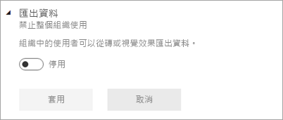

* **已為整個組織啟用**：組織中每個人都可以使用這項功能。

    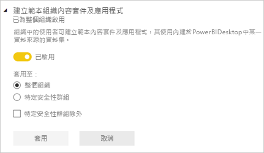

* **已為組織子集合啟用**：貴組織中的特定安全性群組可以使用這項功能。

    您也可以為整個組織啟用功能，但 **特定安全性群組除外**。

    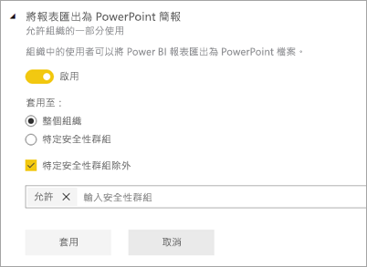

    您也可以合併設定，以便只針對特定使用者群組啟用功能，同時為另一個使用者群組停用該功能。 使用此方法可確保特定使用者不具功能的存取權，即使其位於允許的群組中亦然。 系統會針對使用者套用最嚴格的設定。

    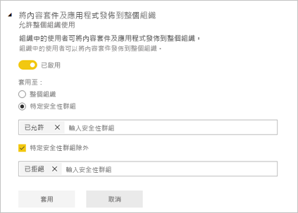

下面幾節將提供不同類型的租用戶設定概觀。

## 全租用戶的新外觀設定

停用 [新外觀] 選項時，此組織中使用者可開啟和關閉 Power BI 的新外觀。 當啟用 [新外觀] 選項時，此組織中「所有」使用者始終都會看到 Power BI 新外觀的新式控制項。 其再也無法關閉新外觀。 [新外觀] 選項預設為啟用。

:::image type="content" source="media/service-admin-portal/admin-portal-new-look-disable.png" alt-text="管理入口網站中停用 [新外觀] 選項的螢幕擷取畫面。":::

## 說明及支援設定

### 發佈「取得說明」資訊

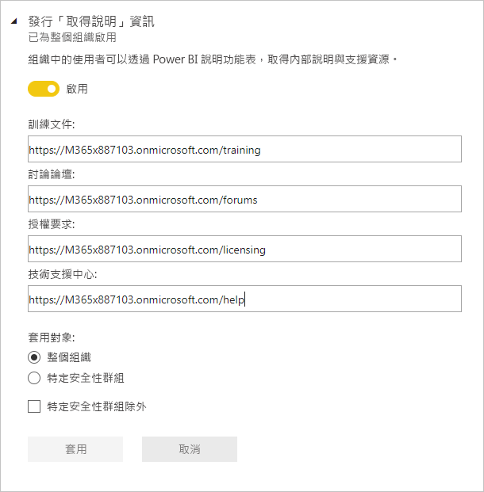

管理員可以指定內部 URL，以覆寫 Power BI [說明] 功能表上的連結目的地，以及進行授權升級。 如果設定了自訂 URL，組織中的使用者就會移至內部說明和支援資源，而非預設目的地。 您可以自訂下列資源目的地：

* **Learn**。 根據預設，此說明功能表連結會以[所有 Power BI 學習路徑和模組的清單](/learn/browse/?products=power-bi)為目標。 若要改為將此連結導向至內部訓練資源，請設定 [訓練文件] 的自訂 URL。

* **社群**。 若要讓使用者從 [說明] 功能表前往內部論壇，而不是 [Power BI 社群](https://community.powerbi.com/) \(英文\)，請設定 [討論論壇] 的自訂 URL。

* **授權升級**。 具有 Power BI (免費) 授權的使用者在使用服務時，可能有機會將帳戶升級為 Power BI Pro。 如果您針對 [授權要求] 指定內部 URL，即可將使用者重新導向至內部要求並購買流程，以防止自助式購買。 如果您想要防止使用者購買授權，但要讓使用者開始試用 Power BI Pro，請參閱[允許使用者試用 Power BI Pro](#allow-users-to-try-power-bi-pro) 以區隔購買和試用體驗。

* **取得說明**。 若要讓使用者從 [說明] 功能表前往內部技術支援中心，而不是 [Power BI 支援](https://powerbi.microsoft.com/support/)，請設定 [支援人員] 的自訂 URL。

### 接收服務中斷或事件的電子郵件通知

若此租用戶受到服務中斷或事件的影響，則擁有郵件功能的安全性群組將會收到電子郵件通知。 請深入了解[服務中斷通知](service-interruption-notifications.md)。

### 允許使用者試用 Power BI Pro

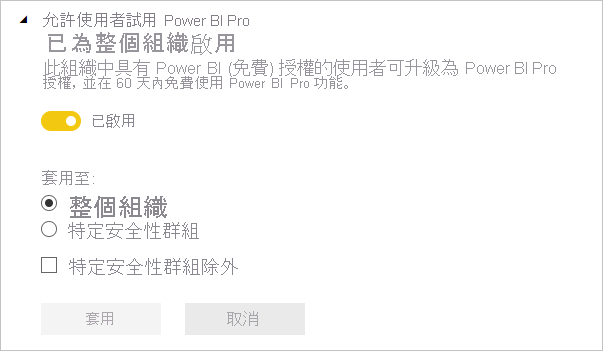

預設情況下，會啟用 [允許使用者試用 Power BI Pro] 的設定。 此設定可讓您進一步控制使用者取得 Power BI Pro 授權的方式。 在您已禁止自助式購買的案例中，此設定可讓使用者開始試用 Power BI Pro。 使用者體驗取決於您合併授權設定的方式。 下表顯示從 Power BI (免費) 升級到 Power BI Pro 的體驗會受到不同設定組合所影響：

| 自助式購買設定 | 允許使用者試用 Power BI Pro 設定 | 使用者體驗 |
| ------ | ------ | ----- |
| 啟用 | 已停用 | 使用者可以購買 Pro 授權，但無法開始試用 |
| 啟用 | 啟用 | 使用者可以開始免費試用 Pro，並可升級為付費授權 |
| 已停用 | 已停用 | 使用者看到一則訊息，表示可洽詢 IT 管理員以要求授權 |
| 已停用 | 啟用 | 使用者可以開始試用 Pro，但必須洽詢 IT 管理員以取得付費授權 |

> [!NOTE]
> 您可以在[說明及支援設定](#help-and-support-settings)中，新增內部 URL 以用於授權要求。 如果您設定 URL，其會覆寫預設的自助購買體驗， 不會重新導向至 Power BI Pro 授權試用版的註冊操作。 可在上表所述的案例中購買授權的使用者，會被重新導向至您的內部 URL。

若要深入了解，請參閱[啟用或停用自助式註冊與購買](service-admin-disable-self-service.md)。

## 工作區設定

在 [租用戶設定] 中，管理入口網站有三個可控制工作區的區段：

- [建立新的工作區體驗](#create-the-new-workspaces)。
- [跨工作區使用資料集](#use-datasets-across-workspaces)。
- [禁止建立典型工作區](#block-classic-workspace-creation)。

### 建立新的工作區

工作區是使用者在儀表板、報表與其他內容上共同作業的地方。 系統管理員可以使用 [建立工作區 (新的工作區體驗)] 設定來指出組織中哪些使用者可以建立工作區。 系統管理員可讓組織中的所有人或不讓任何人建立新的工作區體驗工作區。 他們也可以限制只有特定安全性群組的成員才能建立。 深入了解[工作區](../collaborate-share/service-new-workspaces.md)。

:::image type="content" source="media/service-admin-portal/power-bi-admin-workspace-settings.png" alt-text="建立新的工作區體驗":::

針對以 Microsoft 365 群組為基礎的典型工作區，可在管理入口網站和 Azure Active Directory 中繼續進行管理。

> [!NOTE]
> 根據預設，[建立工作區 (新的工作區體驗)] 設定只允許可建立 Microsoft 365 群組的使用者建立新 Power BI 工作區。 請務必在 Power BI 系統管理入口網站中設定值，以確保適當的使用者可以建立工作區。

**工作區清單**

管理入口網站會有關於您租用戶中工作區的另一個設定區段。 在該區段中，您可以排序和篩選工作區的清單，以及顯示各工作區的詳細資料。 如需詳細資訊，請參閱此文章中的[工作區](#workspaces)。

**發佈內容套件和應用程式**

在管理入口網站中，您也可以控制哪些使用者有權將應用程式散發給組織。 如需詳細資訊，請參閱本文中的[將內容套件及應用程式發佈到整個組織](#publish-content-packs-and-apps-to-the-entire-organization)。

### 跨工作區使用資料集

系統管理員可以控制組織中的哪些使用者能夠跨工作區使用資料集。 啟用此設定時，使用者仍然需要特定資料集的必要建置權限。

:::image type="content" source="media/service-admin-portal/power-bi-admin-datasets-workspaces.png" alt-text="跨工作區使用資料集":::

如需詳細資訊，請參閱[跨工作區的資料集簡介](../connect-data/service-datasets-across-workspaces.md)。

### 禁止建立典型工作區

系統管理員可控制組織能否建立典型工作區。 啟用此設定後，建立工作區的使用者將只能建立新工作區體驗工作區。 

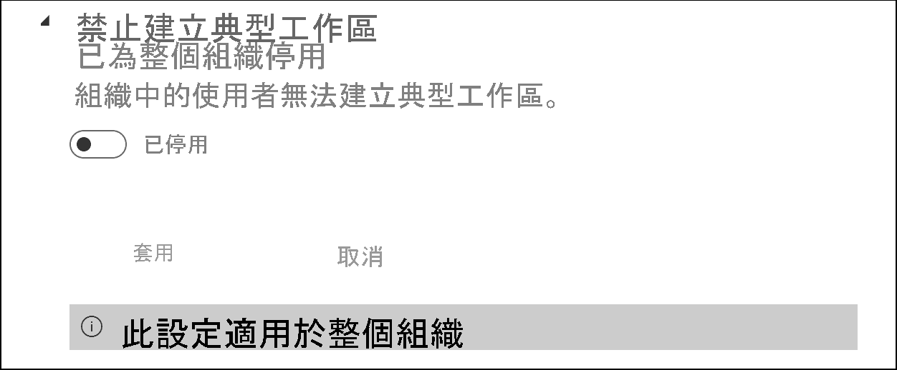

啟用後，新建立的 Office 365 群組不會顯示在 Power BI 工作區清單中。 清單仍會繼續顯示現有的典型工作區。 停用此設定後，使用者為所屬成員的所有 Office 365 群組都會出現在工作區的清單中。 深入了解[新工作區體驗工作區](../collaborate-share/service-new-workspaces.md)。

## 匯出及共用設定

### 允許 Azure Active Directory 來賓使用者存取 Power BI

啟用此設定可供 Azure Active Directory 企業對企業 (Azure AD B2B) 來賓使用者存取 Power BI。 如果您停用此設定，當來賓使用者嘗試存取 Power BI 時，會收到錯誤。 針對整個組織停用此設定時，也會讓使用者無法邀請來賓至組織。 使用特定安全性群組選項來控制哪些來賓使用者可存取 Power BI。

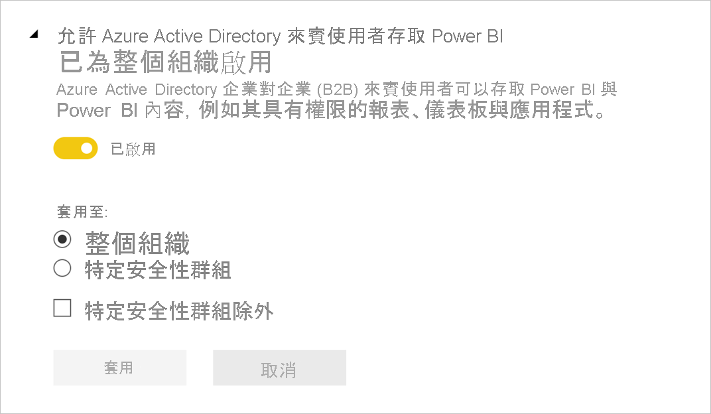

### 邀請外部使用者到組織 

[邀請外部使用者到組織] 設定可協助組織選擇是否可透過 Power BI 共用與權限體驗來邀請新的外部使用者加入組織。 如果設定已停用，外部使用者若不是組織中的來賓使用者，則無法透過 Power BI 將其新增至組織。

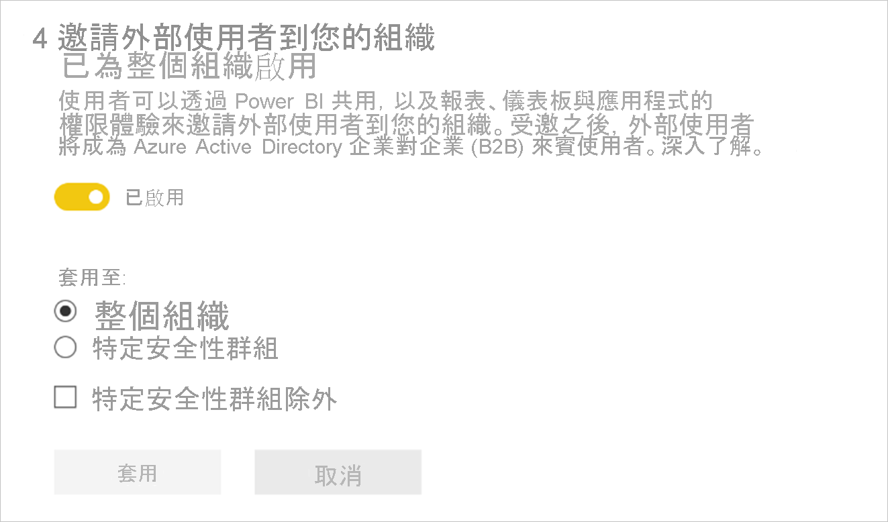

> [!IMPORTANT]
> 此設定先前稱為「與外部使用者共用內容」。 修訂的名稱會更精確地反映設定的用途。

若要邀請外部使用者到組織，使用者也需要 Azure Active Directory 來賓邀請者角色。 此設定只會控制透過 Power BI 邀請的能力。 

### 允許外部來賓使用者編輯和管理組織中的內容

Azure AD B2B 來賓使用者可編輯及管理組織中的內容。 [深入了解](service-admin-azure-ad-b2b.md)

以下影像顯示可讓外部來賓使用者編輯及管理組織中內容的選項。

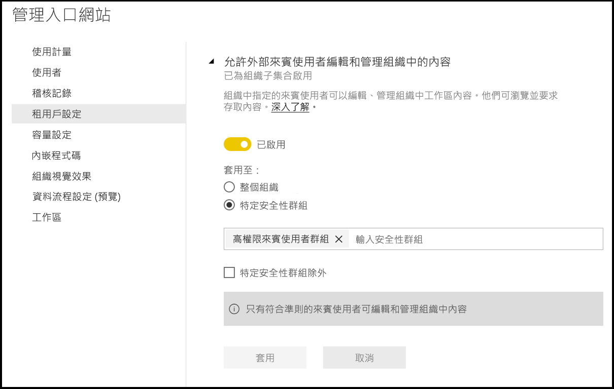

在管理入口網站中，您也可控制哪些使用者有權邀請外部使用者加入組織。 如需詳細資訊，請參閱本文中的[與外部使用者共用內容](#export-and-sharing-settings)。

### 發行至 Web

身為 Power BI 系統管理員，[發佈到 Web] 設定會提供讓使用者建立內嵌程式碼來將報表發佈到 Web 的選項。 這個功能可將報表及其資料提供網上所有人使用。 深入了解[發行至 Web](../collaborate-share/service-publish-to-web.md)。

> [!NOTE]
> 僅 Power BI 系統管理員可允許建立新的 [發行至 Web] 內嵌程式碼。 組織可能擁有現有的內嵌程式碼。 請參閱系統管理員入口網站的[內嵌程式碼](service-admin-portal.md#embed-codes)一節，以檢閱目前發行的報表。

下圖顯示當啟用 [發佈至 Web] 設定時，報表的 [更多選項 (...)] 功能表。

![[更多選項] 功能表中的 [發行至 Web]](media/service-admin-portal/power-bi-more-options-publish-web.png)

系統管理員入口網站中的 [發行至 Web] 設定，讓您選擇可以建立內嵌程式碼的使用者。

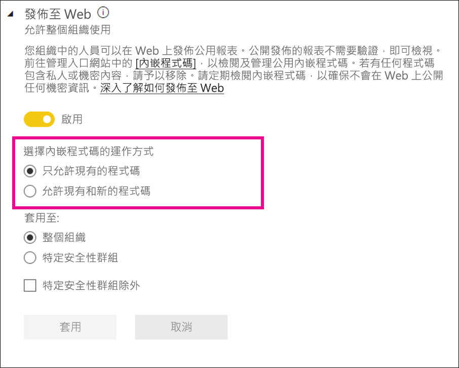

系統管理員可以將 [發行至 Web] 設定為 [啟用]，將 [選擇內嵌程式碼的運作方式] 設定為 [Allow only existing embed codes] \(僅允許現有的內嵌程式碼\)。 在此情況下，使用者可建立內嵌程式碼，但必須先連絡 Power BI 管理員獲得執行權限。

![[發行至 Web] 提示](../collaborate-share/media/service-publish-to-web/publish_to_web_admin_prompt.png)

視 [發行到 Web] 設定而定，使用者會在 UI 中看到不同的選項。

|特徵 |允許整個組織使用 |不允許整個組織使用 |特定安全性群組   |
|---------|---------|---------|---------|
|報表 [更多選項 (...)] 功能表下的 [發行至 Web]|針對全部啟用|並非所有人都可看到|只有經授權的使用者或群組才可看到。|
|[設定] 下的 [管理內嵌程式碼]|針對全部啟用|針對全部啟用|針對全部啟用  [刪除]*  選項僅適用於經授權的使用者或群組。 針對全部啟用 [取得驗證碼]* 。|
|系統管理員入口網站內的 [內嵌程式碼]|狀態具有下列其中一個值： * 使用中 * 不支援 * 已封鎖|狀態顯示「已停用」|狀態具有下列其中一個值： * 使用中 * 不支援 * 已封鎖  如果使用者不是依租用戶設定獲得授權，狀態會顯示為 **受到侵害**。|
|現有的已發佈報告|全部已啟用|全部已停用|報告會繼續針對全部項目呈現。|

### 複製並貼上視覺效果

組織中的使用者可以從磚或報表視覺效果複製視覺效果，並將其貼入外部應用程式中作為靜態影像。

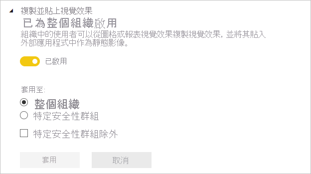

### 匯出至 Excel

組織中的使用者可以將資料從視覺效果匯出至 Excel 檔案。

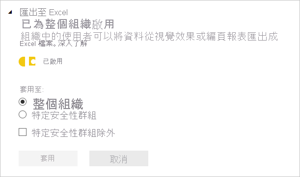

### 匯出至 .csv

組織中的使用者可以從磚、視覺效果或 .csv 檔案的編頁報表匯出資料。

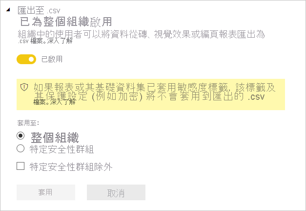

### 下載報表

組織中的使用者可以下載 .pbix 檔案與編頁報表。

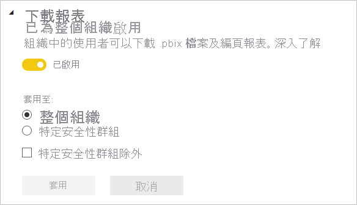

### 允許即時連線

組織中的使用者可以使用 Power BI 服務即時連線。 允許即時連線也可讓使用者在 Excel 中進行分析。

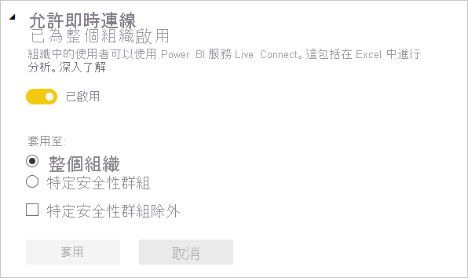

### 將報表匯出成 PowerPoint 簡報或 PDF 文件

組織中的使用者可以將報表匯出成 PowerPoint 檔案或 PDF 文件。

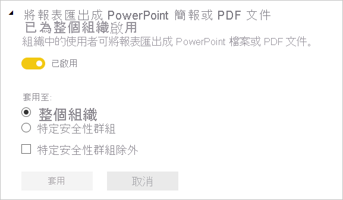

### 將報表匯出成 MHTML 文件

組織中的使用者可以將編頁報表匯出成 MHTML 文件。

### 將報表匯出成 Word 文件

組織中的使用者可以將編頁報表匯出成 Word 文件。

### 將報表匯出成 XML 文件

組織中的使用者可以將編頁報表匯出成 XML 文件。

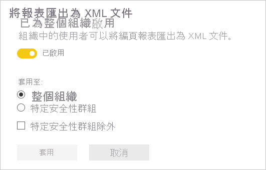

### 將報表匯出成影像檔案 (預覽)

組織中的使用者可以使用 [將報表匯出至檔案 API]，將報表匯出成影像檔案。

### 列印儀表板與報表

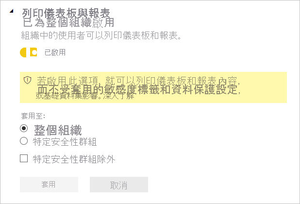

### 認證
可供此組織中的使用者認證資料集、資料流程、報表與應用程式。 如需詳細資料，請參閱[啟用內容認證](service-admin-setup-certification.md)。

### 電子郵件訂閱
組織中的使用者可建立電子郵件訂閱。 深入了解[訂閱](../collaborate-share/service-publish-to-web.md)。

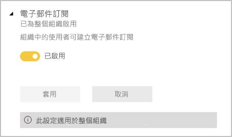

### 精選內容

允許組織中部分或所有報表作者在 Power BI 首頁的 [精選] 區段上提供其內容。 新使用者會在其 Power BI 首頁頂端看到精選內容。 當使用者新增 [我的最愛]、[常用項目] 和 [最近項目] 時，精選內容會將首頁向下移動。 

建議先從一小組推廣者開始。 如果讓整個組織在首頁提供內容，可能會讓您難以追蹤所有推廣的內容。 

啟用精選內容之後，您也可以在系統管理員入口網站中進行管理。 請參閱本文中的[管理精選內容](#manage-featured-content)，以了解如何在網域中控制精選內容。

### 允許精選資料表的連線

此設定可讓 Power BI 系統管理員控制組織中哪些人可使用 Excel 資料類型資源庫中的精選資料表。 

>[!NOTE]
>若將 [[允許即時連線]](#allow-live-connections) 設定設為 [停用]，則也會停用對精選資料表的連線。

深入閱讀 [Excel 中的 Power BI 精選資料表](../collaborate-share/service-excel-featured-tables.md)。

### 共用到 Teams

此設定可供組織在 Power BI 服務中隱藏 [共用到 Teams] 按鈕。 設定為停用時，使用者在 Power BI 服務中檢視報表和儀表板時，不會在動作列或操作功能表中看見 [共用到 Teams] 按鈕。

![Power BI 管理入口網站中 [共用到 Teams] 租用戶設定的螢幕擷取畫面。](media/service-admin-portal/service-teams-share-to-teams-tenant-setting.png)

深入了解[將 Power BI 內容共用到 Teams](../collaborate-share/service-share-report-teams.md)。

## 內容套件及應用程式設定

### 將內容套件及應用程式發佈到整個組織

管理員使用此設定來決定哪些使用者可將內容套件與應用程式發佈到整個組織，而非發佈到特定群組。 深入了解[發佈應用程式](../collaborate-share/service-create-distribute-apps.md)。

下圖顯示建立內容套件時的 [我的整個組織] 選項。

### 建立範本應用程式和組織內容套件

組織中的使用者可建立範本應用程式和組織內容套件，其中使用建基於 Power BI Desktop 中一個資料來源的資料集。 深入了解[範本應用程式](../connect-data/service-template-apps-create.md)。

### 將應用程式推送給終端使用者

報表建立者無須從 [AppSource](https://appsource.microsoft.com) 進行安裝，就能將應用程式直接提供給終端使用者共用。 深入了解[自動為終端使用者安裝應用程式](../collaborate-share/service-create-distribute-apps.md#automatically-install-apps-for-end-users)。

## 整合設定

### 允許內部部署資料集的 XMLA 端點，以及在 Excel 中進行分析

組織中的使用者可以使用 Excel 來檢視內部部署 Power BI 資料集，並與其互動。 這也允許 XMLA 端點的連線。 [深入了解](../collaborate-share/service-analyze-in-excel.md)

### 使用 ArcGIS Maps for Power BI

組織中的使用者可使用由 Esri 所提供的 ArcGIS Maps for Power BI 視覺效果。 [深入了解](../visuals/power-bi-visualizations-arcgis.md)

### 為 Power BI 使用全域搜尋 (預覽)

組織中的使用者可以使用依賴 Azure 搜尋的外部搜尋功能。

## R 視覺效果設定

### 共用 R 視覺效果並與其互動

組織中的使用者可以共用以 R 指令碼建立的視覺效果，並與其互動。 [深入了解](../visuals/service-r-visuals.md)

> [!NOTE]
> 這項設定適用於整個組織，而無法限於特定群組。

## 稽核與使用量設定

### 建立稽核記錄以進行內部活動稽核與合規性

組織中的使用者可以使用稽核來監視組織中其他使用者在 Power BI 中執行的動作。 [深入了解](service-admin-auditing.md)

必須啟用此設定，才能記錄稽核記錄項目。 啟用稽核到能夠檢視稽核資料之間，有最多 48 小時的延遲。 若您未立即看到資料，請稍候再查看稽核記錄。 取得檢視稽核記錄的權限，以及能夠存取記錄的延遲可能相近。

> [!NOTE]
> 這項設定適用於整個組織，而無法限於特定群組。

### 內容建立者的使用計量

組織中的使用者可以看到自己所建立之儀表板與報表的使用計量。 [深入了解](../collaborate-share/service-usage-metrics.md)

### 內容建立者的使用計量中個別使用者資料

內容建立者的使用計量，會公開正在存取內容的使用者顯示名稱與電子郵件地址。 [深入了解](../collaborate-share/service-usage-metrics.md)

根據預設，已啟用使用計量的個別使用者資料，而且會將內容建立者帳戶資訊併入計量報表中。 如果您不想要針對所有使用者收集這項資訊，則可以針對指定安全性群組或整個組織停用該功能。 遭排除使用者的帳戶資訊接著會在報表中顯示為「未命名」。

## 儀表板設定

### 儀表板的資料分類

組織中的使用者可以用指出儀表板安全性層級的分類來標記儀表板。 [深入了解](../create-reports/service-data-classification.md)

> [!NOTE]
> 這項設定適用於整個組織，而無法限於特定群組。

### 儀表板磚上的 Web 內容

組織中的使用者可以在 Power BI 儀表板上新增及檢視 Web 內容。 [深入了解](../create-reports/service-dashboard-add-widget.md)

> [!NOTE]
> 這可能會透過惡意的 Web 內容讓您的組織暴露在安全性風險下。

## 開發人員設定

### 在應用程式中內嵌內容

組織中的使用者可以在軟體即服務 (SaaS) 應用程式中內嵌 Power BI 儀表板和報告。 停用此設定會讓使用者無法使用 REST API 在其應用程式中內嵌 Power BI 內容。 [深入了解](../developer/embedded/embedding.md)

### 允許服務主體使用 Power BI API

在 Azure Active Directory (Azure AD) 中註冊的 Web 應用程式將使用指派的服務主體，在沒有已登入使用者的情況下存取 Power BI API。 若要允許應用程式使用服務主體驗證，其服務主體必須包含在允許的安全性群組內。 [深入了解](../developer/embedded/embed-service-principal.md)

> [!NOTE]
> 服務主體會從其安全性群組繼承所有 Power BI 租用戶設定的使用權限。 若要限制使用權限，請建立服務主體專屬的安全性群組，並將它新增至相關已啟用 Power BI 設定的 [特定安全性群組除外] 清單。

## 資料流程設定

### 建立及使用資料流程

組織內的使用者可建立及使用資料流程。 如需資料流程的概觀，請參閱 [Power BI 的自助資料準備](../transform-model/dataflows/dataflows-introduction-self-service.md)。 若要啟用 Premium 容量中的資料流程，請參閱[設定工作負載](service-admin-premium-workloads.md)。

> [!NOTE]
> 這項設定適用於整個組織，而無法限於特定群組。

## 範本應用程式設定

下列三項設定控制範本應用程式發佈或安裝範本應用程式的能力。

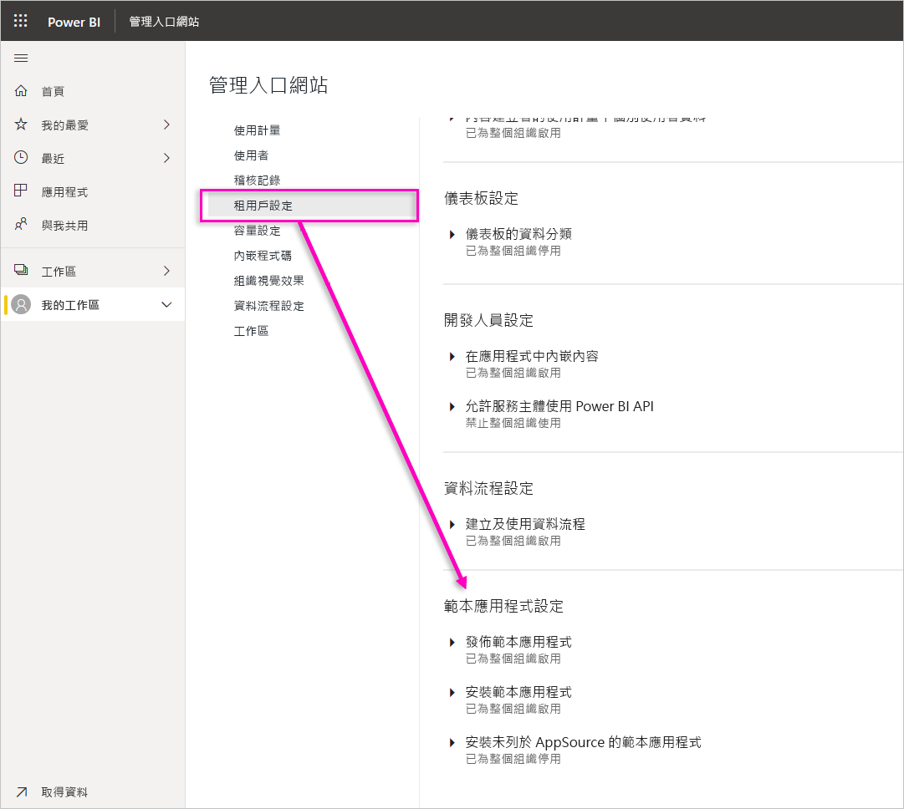

### 發佈範本應用程式

組織中的使用者可建立範本應用程式工作區。 控制哪些使用者可以發佈範本應用程式，或是透過 [AppSource](https://appsource.microsoft.com) 或其他散發方法，將這些應用程式散發至組織外部的用戶端。

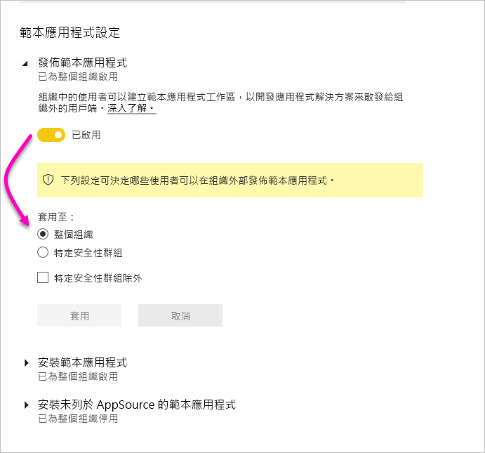

### 安裝列於 AppSource 的範本應用程式

組織中的使用者 **只能** 從 [AppSource](https://appsource.microsoft.com) 下載並安裝範本應用程式。 控制哪些特定使用者或安全性群組可以從 AppSource 安裝範本應用程式。

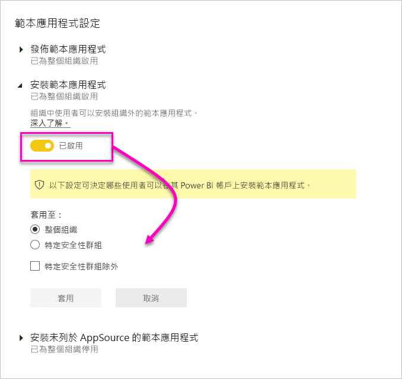

### 安裝未列於 AppSource 的範本應用程式

控制組織中的哪些使用者可以下載並安裝 **未列於 [AppSource](https://appsource.microsoft.com)** 的範本應用程式。

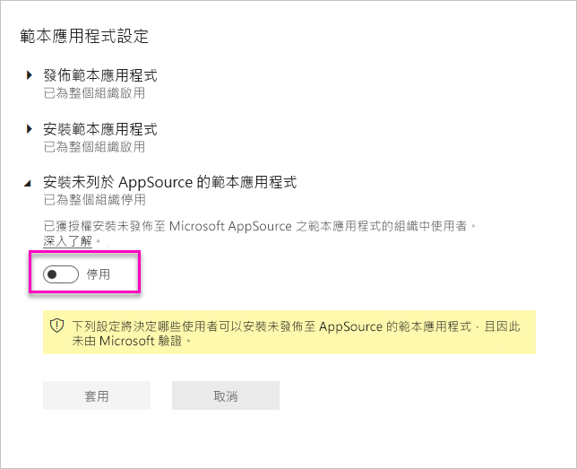

## 容量設定

### Power BI Premium

[Power BI Premium] 索引標籤可讓您管理已為您的組織購買的任何 Power BI Premium 容量 (EM 或 P SKU)。 組織內的所有使用者都可以看到 [Power BI Premium] 索引標籤，但如果他們被指派為 *容量系統管理員* 或具有指派權限的使用者，則只會看到其中的內容。 如果使用者沒有任何權限，系統會顯示下列訊息。

### Power BI Embedded

[Power BI Embedded] 索引標籤可讓您檢視您已為您的客戶購買的 Power BI Embedded (A SKU) 容量。 因為您只能從 Azure 購買 A SKU，您可以從 **Azure 入口網站**[管理 Azure 中的內嵌容量](../developer/embedded/azure-pbie-create-capacity.md)。

如需有關如何管理 Power BI Embedded (A SKU) 設定的詳細資訊，請參閱[什麼是 Power BI Embedded](../developer/embedded/azure-pbie-what-is-power-bi-embedded.md)。

## 內嵌程式碼

身為系統管理員，您可以檢視針對您租用戶產生的內嵌程式碼，以公開共用報表。 您也可以撤銷或刪除程式碼。 [深入了解](../collaborate-share/service-publish-to-web.md)

## 組織視覺效果

所有的 Power BI 視覺效果管理設定 (包括 Power BI 視覺效果租用戶設定) 都會在[管理 Power BI 視覺效果系統管理員設定](organizational-visuals.md)中加以描述。

## Azure 連線 (預覽)

### 租用戶層級儲存體 (預覽)

根據預設，搭配 Power BI 使用的資料儲存在 Power BI 提供的內部儲存體中。 透過整合資料流程與 Azure Data Lake Storage Gen2 (ADLS Gen2)，您可以在組織的 Azure Data Lake Storage Gen2 帳戶中儲存資料流程。 如需詳細資訊，請參閱[資料流程及 Azure Data Lake 整合 (預覽)](../transform-model/dataflows/dataflows-azure-data-lake-storage-integration.md)。

### 工作區層級儲存體權限 (預覽)

根據預設，工作區管理員無法連線到自己的儲存體帳戶。 此預覽功能可讓您開啟允許工作區管理員連線自己儲存體帳戶的設定。

## 工作區

身為管理員，您可以在 [工作區] 索引標籤上檢視存在於租用戶中的工作區。在此索引標籤上，您可以執行這些動作：

- 重新整理工作區清單及其詳細資料。
- 將工作區的相關資料匯出至 .csv 檔案。 
- 查看有關工作區的詳細資料，包括其識別碼、其使用者及其角色，以及其儀表板、報表和資料集。
- 編輯具有存取權的人員清單。 這表示您可以刪除工作區。 您可以將自己新增至工作區以作為管理員，然後開啟工作區並將其刪除。
- 編輯 [名稱] 和 [描述] 欄位。
- 將傳統工作區升級至新的工作區體驗

管理員也可以控制使用者建立新工作區體驗工作區，以及傳統工作區的能力。 如需詳細資訊，請參閱此文章中的[工作區設定](#workspace-settings)。

[工作區] 索引標籤上的資料表資料行會對應到工作區 [Power BI 管理 Rest API](/rest/api/power-bi/admin) 傳回的屬性。 個人工作區的類型為 **PersonalGroup**，傳統工作區的類型為 **Group**，新工作區體驗工作區的類型為 **Workspace**。 如需詳細資訊，請參閱[在新的工作區中組織工作](../collaborate-share/service-new-workspaces.md)。

在 [工作區] 索引標籤上，您會看到每個工作區的「狀態」。 下表提供有關這些狀態意義的更多詳細資料。

|州  |描述  |
|---------|---------|
| **使用中** | 正常工作區。 它不會指出使用方式或其中內容的相關資訊，只表示工作區本身是「正常」的。 |
| **孤立** | 沒有管理使用者的工作區。 |
| **已刪除** | 已刪除的工作區。 如有需要，我們會維護足夠的中繼資料 (最長保留 90 天) 來還原工作區。 |
| **正在移除** | 在刪除程序中但尚未完成的工作區。 使用者可以刪除自己的工作區，使其進入「移除中」，最後進入「已刪除」。 |

系統管理員也可使用管理入口網站或 PowerShell Cmdlet 來管理及復原工作區。 

管理員可將傳統工作區升級至新的工作區體驗。 管理員可選取一或多個類型為 [群組] 的工作區進行升級。 升級會排入佇列並以非同步方式執行。 可能需要幾分鐘到幾天時間才能完成所有 [擱置] 的升級，因為管理員起始的升級整體速度會受到限制，以讓服務順利執行。 [工作區升級狀態] 資料行可協助管理員追蹤管理員起始的升級進度。 若管理員起始的升級為 [擱置]，則管理員可取消這些升級。 若要立即升級工作區，請連絡工作區管理員，並使其透過 [工作區設定] 窗格開始升級。 [開始 Power BI 管理員起始的工作區升級之前，請先深入了解工作區升級](../collaborate-share/service-upgrade-workspaces.md)。

下表提供有關升級狀態的更多詳細資料。

|狀態  |描述  |
|---------|---------|
| **(空白)** | Power BI 管理員未升級工作區。 |
| **擱置** | 工作區已排入佇列等候升級。 可取消升級。 |
| **進行中** | 工作區正在升級中。 無法取消升級。 |
| **Completed** | Power BI 管理員已在過去 30 天內升級工作區。工作區管理員可在工作區升級後的 30 天內，視需要返回 [傳統] 選項。 |

## 自訂商標

您身為系統管理員，可以為整個組織自訂 Power BI 的外觀。 目前有三個主要選項：

![[自訂商標] 選項](media/service-admin-portal/power-bi-custom-branding.png)

* **上傳標誌**：為取得最佳結果，請上傳儲存為 .png、10 KB 或更小，且至少為 200 x 30 像素的標誌。

* **上傳封面影像**：為取得最佳結果，請上傳儲存為 .jpg 或 .png、1 MB 或更小，且至少為 1920 x 160 像素的封面影像。

* **選取佈景主題色彩**：您可以根據十六進位 #、RGB、值或從提供的調色盤中選取您的佈景主題。

如需詳細資訊，請參閱[為貴組織自訂商標](https://aka.ms/orgBranding)。

## 保護計量

啟用 Power BI 的資訊保護之後，資料保護計量即會顯示於管理入口網站中。 此報表會顯示敏感度標籤如何協助保護您的內容。

## 管理精選內容

身為 Power BI 系統管理員，您可管理所有已推廣到組織中 Power BI 首頁精選區段的報表、儀表板和應用程式。

- 在管理入口網站中，選取 [精選內容]。

在這裡，您會看到是誰精選了內容、精選時間及其所有相關中繼資料的概觀。 如果某項目看起來有問題，或您想要清除 [精選] 區段，則可視需要來刪除推廣的內容。

如需啟用精選內容的資訊，請參閱本文中的[精選內容](#featured-content)。

## 後續步驟

[管理貴組織中的 Power BI](service-admin-administering-power-bi-in-your-organization.md)  
[了解 Power BI 系統管理員角色](service-admin-role.md)  
[稽核貴組織的 Power BI](service-admin-auditing.md)  

有其他問題嗎？ [嘗試在 Power BI 社群提問](https://community.powerbi.com/)
