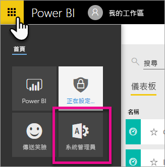
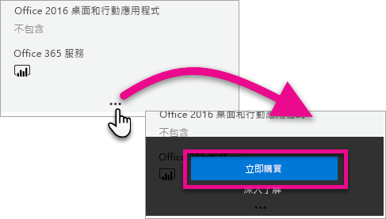
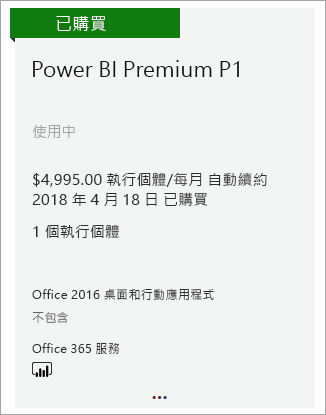
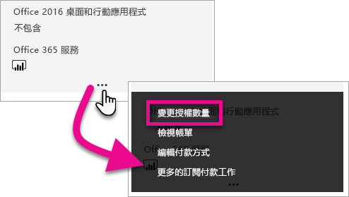
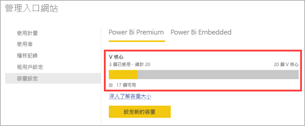

# 如何購買 Power BI Premium

本文描述如何為貴組織購買 Power BI Premium 容量。 此文章涵蓋下列案例：

- 使用 P SKU 處理一般生產案例。 P SKU 需要每月或每年履約承諾，按月計費。

如需 Power BI Premium 的詳細資訊，請參閱 [什麼是 Power BI Premium？](service-premium-what-is.md)。 如需目前的定價和規劃資訊，請參閱 [Power BI 定價頁面](https://powerbi.microsoft.com/pricing/)和 [Power BI Premium 計算機](https://powerbi.microsoft.com/calculator/)。 即使您的組織使用 Power BI Premium，內容的作者仍然需要 [Power BI Pro 授權](service-admin-purchasing-power-bi-pro.md)。 請確定您為貴組織購買至少一個 Power BI Pro 授權。 使用 A SKU 時，_取用內容的所有使用者_ 也都需要 Pro 授權。

> [!NOTE]
> 如果 Premium 訂用帳戶過期，您仍有 30 天可完整存取您的容量。 在該期限之後，您的內容會還原至共用的容量。 共用容量不支援 1 GB 以上的模型。

> [!NOTE]
> Power BI Premium 最近已發行名叫 **Premium Gen2** 的新版本 Premium，其目前處於預覽狀態。 Premium Gen2 將能簡化 Premium 容量的管理，並減少管理負擔。 如需詳細資訊，請參閱 [Power BI Premium 第 2 代 (預覽)](service-premium-what-is.md#power-bi-premium-generation-2-preview)。

## 一般生產案例請購買 P SKU

您可以建立已設定 Power BI Premium P1 SKU 建立的新租使用者，也可以為現有的組織購買 Power BI Premium 容量。 如有需要，這兩種情況都可以新增容量。

### 建立具有 Power BI Premium P1 的新租用戶

如果您目前沒有租用戶並想建立一個，您可以同時購買 Power BI Premium。 下列連結會引導您完成建立新租用戶的程序，並可讓您購買 Power BI Premium：[Power BI Premium P1 供應項目](https://signup.microsoft.com/Signup?OfferId=b3ec5615-cc11-48de-967d-8d79f7cb0af1)。 當您建立租用戶時，系統會自動將該租用戶的 Microsoft 365 全域管理員角色指派給您。

購買容量之後，請了解如何[管理容量](service-admin-premium-manage.md#manage-capacity)並針對容量來[指派工作區](service-admin-premium-manage.md#assign-a-workspace-to-a-capacity)。

### 為現有的組織購買 Power BI Premium 容量

如果您有現有的組織 (租用戶)，則您必須是 Microsoft 365 全域管理員角色或計費管理員角色才能購買訂閱和授權。 如需詳細資訊，請參閱[關於 Microsoft 365 系統管理員角色](https://support.office.com/article/About-Office-365-admin-roles-da585eea-f576-4f55-a1e0-87090b6aaa9d)。

若要購買 Premium 容量，請遵循下列步驟。

1. 從 Power BI 服務內選取 Microsoft 365 應用程式選擇器，然後選取 [系統管理員]  。

    

    或者，您可以瀏覽至 Microsoft 365 系統管理中心。

1. 選取 [計費]   > [購買服務]  。

1. 在 [其他方案]  下，尋找 Power BI Premium 供應項目。 如此會列出 P1 到 P3、EM3 以及 P1 (逐月)。

1. 將滑鼠停留在省略符號 ( **. . .** )，然後選取 [立即購買]  。

    

1. 請依照下列步驟完成購買程序。

完成購買之後，[購買服務]  頁面會顯示項目已購買且在使用中。

購買容量之後，請了解如何[管理容量](service-admin-premium-manage.md#manage-capacity)並針對容量來[指派工作區](service-admin-premium-manage.md#assign-a-workspace-to-a-capacity)。

### 購買額外的容量

現在您有了容量，您可以依照需求的增長來新增更多容量。 在您的組織內，您可以使用 Premium 容量 SKU 的任意組合 (P1 至 P3)。 不同的 SKU 可提供不同資源容量。

1. 在 Microsoft 365 系統管理中心內，選取 [帳單]   > [購買服務]  。

1. 在 [其他方案]  下，尋找您要購買更多的 Power BI Premium 項目。

1. 將滑鼠暫留在 [更多選項]  (...)，然後選取 [變更授權數量]  。

    

1. 針對此項目，變更為您想要的執行個體數目。 完成時選取 [送出]  。

   > [!IMPORTANT]
   > 選取 [送出]  會對信用卡收取費用。

[購買服務]  頁面將會指出您擁有的執行個體數目。 在 Power BI 管理入口網站的 [容量設定]  下，可用的 V 核心反映新購買的容量。

### 取消您的訂用帳戶

您可以從 Microsoft 365 系統管理中心取消訂用帳戶。 若要取消您的 Premium 訂閱，請執行下列動作。

1. 瀏覽至 MIcrosoft 365 系統管理中心。

1. 選取 [計費]   > [訂用帳戶]  。

1. 從清單中選取您的 Power BI Premium 訂用帳戶。

1. 選取 [More actions] \(其他動作\)   > [Cancel subscription] \(取消訂閱\)  。

1. [取消訂用帳戶]  頁面會指出您是否對[提早取消費用](https://support.office.com/article/early-termination-fees-6487d4de-401a-466f-8bc3-c0beb5cc40d3)負有責任。 此頁面也會讓您知道何時將會刪除訂用帳戶的資料。

1. 請完成閱讀此資訊，如果您想要繼續，請選取 [取消訂用帳戶]  。

#### 取消或授權到期時

當您取消 Premium 訂閱，或您的容量授權到期時，自取消或授權到期的日期起，可以繼續存取進階容量 30 天。 30 天後，您將不再能夠存取您的進階容量或其中的工作區。

## 購買用於測試和其他案例的 A SKU

您也可以購買 A SKU 以用於測試與其他案例，其能提供以小時為基礎的 Premium 容量。 如需詳細資訊和步驟，請參閱[購買 Power BI Premium 以進行測試](service-admin-premium-testing.md)。

## 後續步驟

[設定及管理 Power BI Premium 中的容量](service-admin-premium-manage.md)\
[Power BI 定價頁面](https://powerbi.microsoft.com/pricing/)\
[Power BI Premium 計算機](https://powerbi.microsoft.com/calculator/)\
[Power BI Premium 常見問題集](service-premium-faq.md)\
[Planning a Power BI Enterprise Deployment (規劃 Power BI 企業部署) 技術白皮書](https://aka.ms/pbienterprisedeploy)

有其他問題嗎？ [嘗試在 Power BI 社群提問](https://community.powerbi.com/)

Power BI 已推出 Power BI Premium Gen2 作為預覽供應項目，其能透過對下列領域的改進來改善 Power BI Premium 體驗：
* 效能
* 個別使用者授權
* 範圍更大的擴縮
* 改善的計量
* 自動調整
* 降低管理負擔

如需 Power BI Premium Gen2 的詳細資訊，請參閱 [Power BI Premium 第 2 代 (預覽)](service-premium-what-is.md#power-bi-premium-generation-2-preview)。