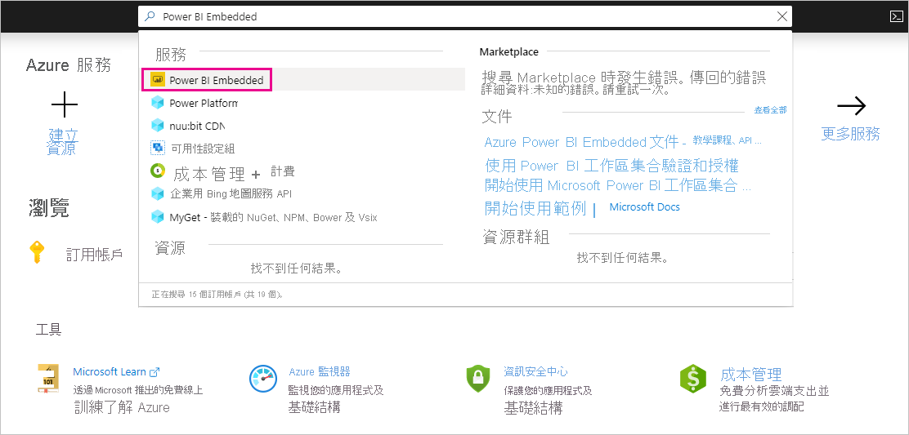
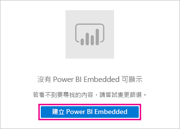
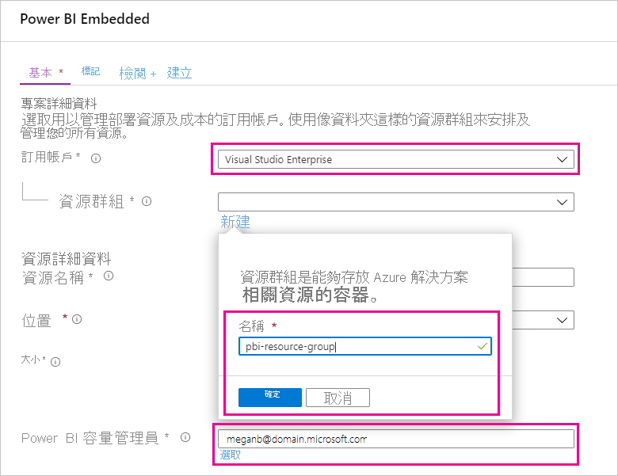
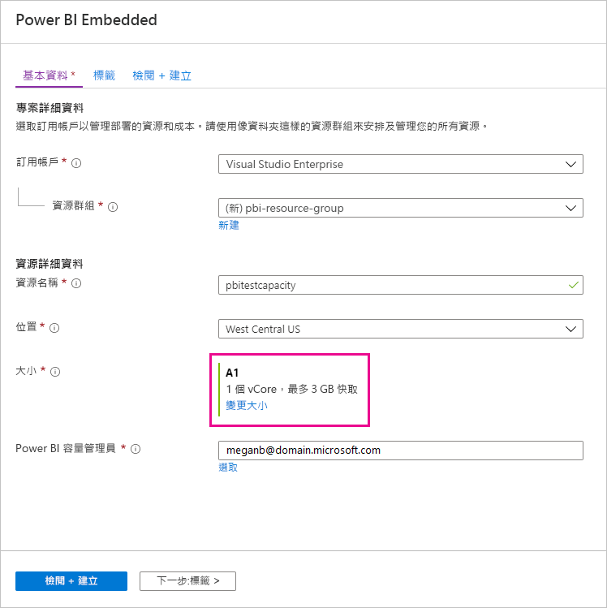
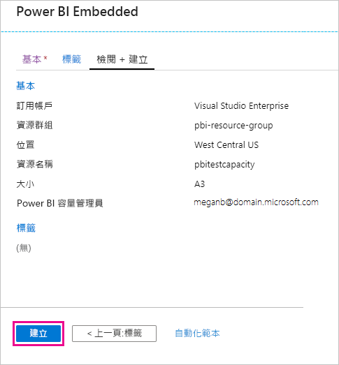
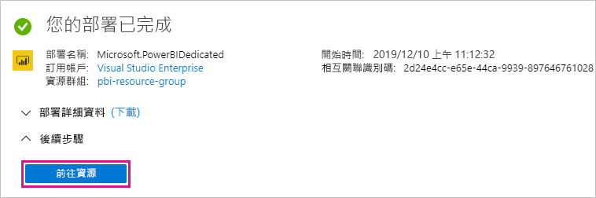
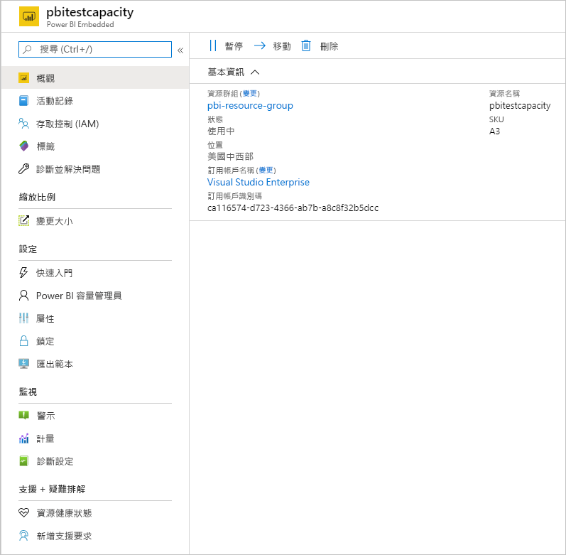

# 購買 Power BI Premium 以進行測試

此文章描述如何購買 Power BI Premium A SKU 以用於測試案例，以及您沒有購買 P SKU 的必要權限 (Microsoft 365 全域管理員角色或計費管理員角色) 的案例。 A SKU 不需要任何時限的履約承諾，按小時計費。 A SKU 在 [Azure 入口網站](https://portal.azure.com)中購買。

如需 Power BI Premium 的詳細資訊，請參閱 [什麼是 Power BI Premium？](service-premium-what-is.md)。 如需目前的定價和規劃資訊，請參閱 [Power BI 定價頁面](https://powerbi.microsoft.com/pricing/)和 [Power BI Premium 計算機](https://powerbi.microsoft.com/calculator/)。 即使您的組織使用 Power BI Premium，內容的作者仍然需要 [Power BI Pro 授權](service-admin-purchasing-power-bi-pro.md)。 請確定您為貴組織購買至少一個 Power BI Pro 授權。 使用 A SKU 時，_取用內容的所有使用者_ 也都需要 Pro 授權。

> [!NOTE]
> 如果 Premium 訂用帳戶過期，您仍有 30 天可完整存取您的容量。 在該期限之後，您的內容會還原至共用的容量。 共用容量不支援 1 GB 以上的模型。

## 購買用於測試和其他案例的 A SKU

A SKU 可透過 Azure Power BI Embedded 服務取得。 您可以透過下列方式使用 A SKU︰

- 將 Power BI 內嵌在協力廠商應用程式中。 如需詳細資訊，請參閱 [Power BI Embedded](../developer/embedded/azure-pbie-what-is-power-bi-embedded.md)。

- 購買 P SKU 之前，請先測試 Premium 功能。

- 在使用 P SKU 的生產環境中，建立開發和測試環境。

- 即使您不具有 Microsoft 365 全域管理員角色或計費管理員角色，也請購買 Power BI Premium。

> [!NOTE]
> 如果購買 A4 或更高等級的 SKU，您可以利用除無限制共用內容外的所有高階功能。 使用 A SKU 時，_取用內容的所有使用者_ 都需要 Pro 授權。

遵循下列步驟在 Azure 入口網站中購買 A SKU：

1. 使用在 Power BI 中至少具有容量系統管理員權限的帳戶，登入 [Azure 入口網站](https://portal.azure.com)。

1. 搜尋 _Power BI Embedded_ 並在搜尋結果中選取服務。

    

1. 選取 [Create Power BI Embedded] \(建立 Power BI Embedded\)。

    

1. 在建立 **Power BI Embedded** 的畫面中，指定下列資訊：

    - 要建立 Power BI Embedded 服務的 **訂閱**。

    - 建立包含服務的資源群組所在實體 **位置**。 為了達到較佳的效能，此位置應該接近您 Power BI 的 Azure Active Directory 租用戶位置。

    - 要使用的現有 **資源群組**，或如範例所示建立一個新的資源群組。

    - **Power BI 容量管理員**。 容量管理員必須是您 Azure AD 租用戶的成員使用者或服務主體。

    

1. 若要使用 Power BI Premium 的所有功能 (無限制共用除外)，您至少需要一個 A4 SKU。 選取 [變更大小]。

    

1. 選取對應 P1、P2 和 P3 的 [A4]、[A5] 或 [A6] 容量大小。

    ![選取 [A3] 容量](media/service-admin-premium-purchase/select-a3-capacity.png)

1. 選取 [檢閱 + 建立]，檢閱所選選項，然後選取 [建立]。

    

1. 完成部署需要幾分鐘。 一切準備就緒後，請選取 [前往資源]。

    

1. 在管理畫面中，檢閱用於管理服務的選項，包括暫停未使用的服務。

    

購買容量之後，請了解如何[管理容量](service-admin-premium-manage.md#manage-capacity)並針對容量來[指派工作區](service-admin-premium-manage.md#assign-a-workspace-to-a-capacity)。

## 後續步驟

[什麼是 Power BI Premium？](service-premium-what-is.md)
[如何購買 Power BI Premium](service-admin-premium-purchase.md)
[設定及管理 Power BI Premium 中的容量](service-admin-premium-manage.md)\
[Power BI 定價頁面](https://powerbi.microsoft.com/pricing/)\
[Power BI Premium 計算機](https://powerbi.microsoft.com/calculator/)\
[Power BI Premium 常見問題集](service-premium-faq.md)\
[Planning a Power BI Enterprise Deployment (規劃 Power BI 企業部署) 技術白皮書](https://aka.ms/pbienterprisedeploy)

有其他問題嗎？ [嘗試在 Power BI 社群提問](https://community.powerbi.com/)
