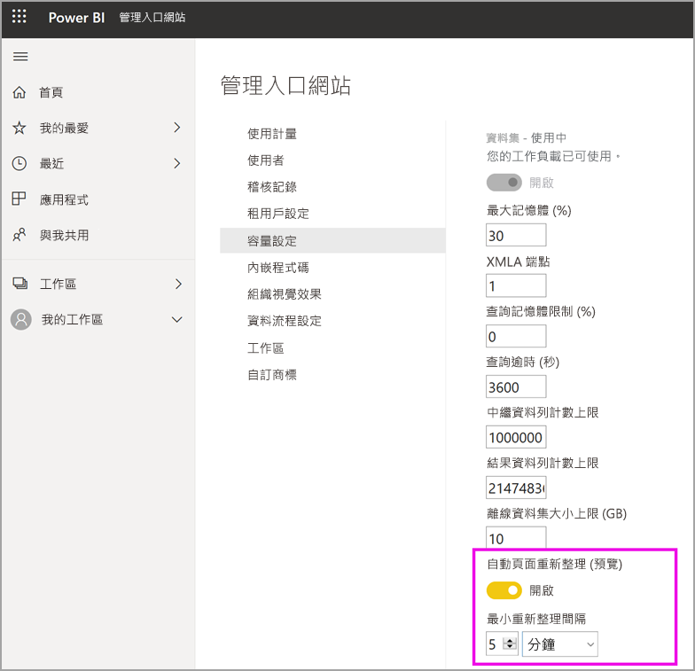

# 設定 Premium 容量中的工作負載

本文描述如何啟用及設定 Power BI Premium 容量的工作負載。 根據預設，容量僅支援與執行 Power BI 查詢建立關聯的工作負載。 您也可以啟用及設定 **[AI (認知服務)](../transform-model/service-cognitive-services.md)** 、 **[資料流程](../transform-model/service-dataflows-overview.md#dataflow-capabilities-on-power-bi-premium)** 和 **[分頁報表](../paginated-reports/paginated-reports-save-to-power-bi-service.md)** 的其他工作負載。

## 預設記憶體設定

查詢工作負載針對 Premium 容量 SKU 決定的資源進行最佳化和限制。 Premium 容量也支援可以使用容量資源的其他工作負載。 這些工作負載之預設記憶體值是根據您 SKU 的可用容量節點。 最大記憶體設定不是累計的。 上限為指定最大值的記憶體，會以動態方式配置給 AI 及資料流程，但是以靜態方式配置給編頁報表。

|                   | EM1 / A1                  | EM2 / A2                  | EM3 / A3                  | P1 / A4                  | P2 / A5                  | P3 / A6                   |
|-------------------|---------------------------|---------------------------|---------------------------|--------------------------|--------------------------|---------------------------|
| AI                | 不支援               | 40% 預設值；40% 最小值  | 20% 預設值；20% 最小值  | 預設 20%；最小 8%  | 預設 20%；最小 4%  | 預設 20%；最小 2%   |
| 資料集          | 100% 預設值；67% 最小值 | 100% 預設值；40% 最小值 | 100% 預設值；20% 最小值 | 100% 預設值；8% 最小值 | 100% 預設值；4% 最小值 | 100% 預設值；2% 最小值  |
| 資料流程         | 40% 預設值；40% 最小值  | 24% 預設值；24% 最小值  | 20% 預設值；12% 最小值  | 20% 預設值；5% 最小值  | 20% 預設值；3% 最小值  | 預設 20%；最小 2%   |
| 編頁報表 | 不支援               | 不支援               | 不支援               | 20% 預設值；10% 最小值 | 20% 預設值；5% 最小值  | 20% 預設值；2.5% 最小值 |
|                   |                           |                           |                           |                          |                          |                           |

## 工作負載設定

### AI (預覽)

AI 工作負載可讓您使用 Power BI 中的認知服務和自動化機器學習。 使用下列設定來控制工作負載行為。

| 設定名稱 | 描述 |
|---------------------------------|----------------------------------------|
| **最大記憶體 (%)** | AI 處理序可在容量中使用的可用記憶體百分比上限。 |
| **允許從 Power BI Desktop 使用** | 此設定會保留供日後使用，且不會出現在所有租用戶中。 |
| **允許建置機器學習模型** | 指定商務分析師是否可以直接在 Power BI 中定型、驗證和叫用機器學習模型。 如需詳細資訊，請參閱 [Power BI 中的自動化機器學習 (預覽)](../transform-model/service-machine-learning-automated.md)。 |
| **啟用 AI 要求的平行處理原則** | 指定 AI 要求是否可以平行執行。 |
|  |  |

### 資料集

預設會啟用資料集工作負載，且無法加以停用。 使用下列設定來控制工作負載行為。 表格下方有其他的使用方式資訊，可進行一些設定。

| 設定名稱 | 描述 |
|---------------------------------|----------------------------------------|
| **最大記憶體 (%)** | 資料集可在容量中使用的可用記憶體百分比上限。 |
| **XMLA 端點** | 指定從用戶端應用程式的連線，接受在工作區和應用程式層級設定的安全性群組成員資格。 如需詳細資訊，請參閱[使用用戶端應用程式與工具連線至資料集](service-premium-connect-tools.md)。 |
| **中繼資料列集計數上限** | DirectQuery 傳回的中繼資料列數目上限。 預設值為 1000000，允許的範圍介於 100000 到 2147483647 之間。 |
| **離線資料集大小上限 (GB)** | 記憶體中的離線資料集大小上限。 這是磁碟上的壓縮大小。 預設值為 0，這是由 SKU 定義的最高限制。 允許的範圍介於 0 與容量大小限制之間。 |
| **結果資料列集計數上限** | DAX 查詢中傳回的資料列數目上限。 預設值為 -1 (沒有限制)，且允許的範圍介於 100000 到 2147483647 之間。 |
| **查詢記憶體限制 (%)** | 工作負載中可用於執行 MDX 或 DAX 查詢的可用記憶體百分比上限。 預設值為 0，這會導致套用 SKU 特定的自動查詢記憶體限制。 |
| **查詢逾時 (秒)** | 查詢逾時前的最大時間量。預設值為 3600 秒 (1 小時)。 值 0 指定查詢不會逾時。 |
| **自動重新整理頁面** | 切換開/關讓進階工作區根據固定間隔，產生自動重新整理頁面的報表。 |
| **最小重新整理間隔** | 若自動頁面重新整理已開啟，則為頁面重新整理間隔所允許的最小間隔。 預設值為 5 分鐘，而允許的下限為一秒。 |
| **變更偵測量值** | 切換開/關讓進階工作區根據變更偵測，產生自動重新整理頁面的報表。 |
| **最小執行間隔** | 若已開啟 [變更偵測量值]，則允許輪詢資料變更的最小執行間隔。 預設值為五秒，允許的最小值為一秒。 |
|  |  |  |

#### 中繼資料列集計數上限

使用此設定可控制耗用大量資源或設計不佳的報表影響。 當 DirectQuery 資料集的查詢導致源資料庫產生龐大結果時，可能會造成記憶體使用量突然增加和處理額外負荷。 這種情況可能會導致其他使用者和報表的資源不足。 此設定可讓容量管理員調整個別查詢可從資料來源中擷取的資料列數目。

或者，如果容量可支援超過一百萬個資料列的預設值，且您擁有大型資料集，請增加此設定以擷取更多資料列。

請注意，此設定只會影響 DirectQuery 查詢，而[結果資料列集計數上限](#max-result-row-set-count)會影響 DAX 查詢。

#### 離線資料集大小上限

使用此設定可防止報表建立者發佈可能會對容量造成負面影響的大型資料集。 請注意，除非將資料集載入記憶體中，否則 Power BI 無法判斷實際的記憶體內部大小。 離線大小較小的資料集，可能會比具有較大離線大小的資料集具有更大記憶體使用量。

如果您現有資料集大於您為此設定所指定的大小，則當使用者嘗試存取資料集時，會無法載入資料集。 如果資料集大於針對資料集工作負載所設定的最大記憶體，也可能無法載入資料集。

為了保護系統的效能，不論設定的值為何，都會針對最大離線資料集大小套用額外 SKU 特定的硬上限。 此硬上限不適用於針對大型資料大小最佳化的 Power BI 資料集。 如需詳細資訊，請參閱 [Power BI Premium 中的大型模型](service-premium-large-models.md)。

|                                           | EM1 / A1 | EM2 / A2 | EM3 / A3 | P1 / A4 | P2 / A5 | P3 / A6 |   
|-------------------------------------------|----------|----------|----------|---------|---------|---------|
| 最大離線資料集大小的硬上限 | 3 GB     | 5 GB     | 6 GB     | 10 GB   | 10 GB   | 10 GB   |
|                                           |          |          |          |         |         |         |

#### 結果資料列集計數上限

使用此設定可控制耗用大量資源或設計不佳的報表影響。 如果在 DAX 查詢中達到此限制，報表使用者會看到下列錯誤。 他們應複製錯誤詳細資料，並連絡系統管理員。

請注意，此設定只會影響 DAX 查詢，而[中繼資料列集計數上限](#max-intermediate-row-set-count)會影響 DirectQuery 查詢。

#### 查詢記憶體限制

使用此設定可控制耗用大量資源或設計不佳的報表影響。 某些查詢和計算可能會導致中繼結果在容量上使用大量記憶體。 這種情況可能會導致其他查詢執行速度緩慢、從容量收回其他資料集，並造成容量其他使用者發生記憶體不足的錯誤。

此設定會套用至 Power BI 報表所執行、在 Excel 報表中分析，以及可能透過 XMLA 端點連線的其他工具所執行的所有 DAX 和 MDX 查詢。

請注意，當資料集中的資料重新整理之後，資料重新整理作業也可能執行 DAX 查詢，作為重新整理儀表板圖格和視覺效果快取的一部分。 這類查詢也可能因為此設定而潛在地失敗，此強況可能導致資料重新整理作業顯示為失敗狀態，即使資料集中的資料已成功地更新。

預設設定為 0，這會導致套用下列 SKU 特定的自動查詢記憶體限制。

|                              | EM1 / A1 | EM2 / A2 | EM3 / A3 | P1 / A4 | P2 / A5 | P3 / A6 |   
|------------------------------|----------|----------|----------|---------|---------|---------|
| 自動查詢記憶體限制 | 1 GB     | 2 GB     | 2 GB     | 6 GB    | 6 GB    | 10 GB   |
|                              |          |          |          |         |         |         |

為了保護系統的效能，無論使用者設定的查詢記憶體限制為何，皆會針對 Power BI 報表執行的所有查詢強制執行 10 GB 的硬上限。 使用 Analysis Services 通訊協定 (也稱為 XMLA) 之工具所發出的查詢不適用此固定最高限額。 如果查詢的記憶體用量太高，使用者應考慮簡化查詢或其計算。

#### 查詢逾時

使用此設定以更有效地控制長時間執行的查詢，這可能會造成使用者載入報表的速度緩慢。

此設定會套用至 Power BI 報表所執行、在 Excel 報表中分析，以及可能透過 XMLA 端點連線的其他工具所執行的所有 DAX 和 MDX 查詢。

請注意，當資料集中的資料重新整理之後，資料重新整理作業也可能執行 DAX 查詢，作為重新整理儀表板圖格和視覺效果快取的一部分。 這類查詢也可能因為此設定而潛在地失敗，此強況可能導致資料重新整理作業顯示為失敗狀態，即使資料集中的資料已成功地更新。

這項設定適用於單一查詢，而不是執行與更新資料集或報表建立關聯的所有查詢所需時間長度。 請考慮下列範例：

- **查詢逾時**設定為 1200 (20 分鐘)。
- 有五個要執行的查詢，每個都執行 15 分鐘。

所有查詢的時間總和為 75 分鐘，但並未達到設定限制，因為所有個別查詢執行都少於 20 分鐘。

請注意，針對容量查詢，Power BI 報表會以較小的逾時覆寫此預設值。 每個查詢的逾時時間通常為三分鐘。

#### 自動頁面重新整理 (預覽)

啟用時，自動頁面重新整理可讓您 Premium 容量中的使用者以定義的間隔 (針對 DirectQuery 來源) 重新整理其報表中的頁面。 身為容量管理員，您可以執行下列動作：

- 開啟及關閉自動頁面重新整理
- 定義最小重新整理間隔

下列影像顯示 [自動重新整理間隔] 設定的位置：

自動頁面重新整理所建立的查詢會直接移至資料來源，因此在您的組織中允許自動頁面重新整理時，請務必考慮這些來源的可靠性與負載。 

### 資料流程

資料流程工作負載可讓您使用資料流程的自助資料準備，來內嵌、轉換、整合和擴充資料。 使用下列設定來控制工作負載行為。

| 設定名稱 | 描述 |
|---------------------------------|----------------------------------------|
| **最大記憶體 (%)** | 資料流程可在容量中使用的可用記憶體百分比上限。 |
| **強化的資料流程計算引擎 (預覽)** | 啟用此選項可讓您在處理大型資料量時，提高計算實體的計算速度高達 20 倍。 **您必須重新啟動容量，才能啟動新的引擎。** 如需詳細資訊，請參閱[強化的資料流程計算引擎](#enhanced-dataflows-compute-engine)。 |
| **容器大小** | 資料流程針對資料流程中每個實體所使用的容器大小上限。 預設值為 700 MB。 如需詳細資訊，請參閱[容器大小](#container-size)。 |
|  |  |

#### 強化的資料流程計算引擎

若要從新的計算引擎中受益，請將資料擷取分成個別的資料流程，並將轉換邏輯放入不同資料流程中的計算實體。 因為計算引擎會在參考現有資料流程的資料流程上運作，所以建議此方法。 它無法在擷取資料流程上運作。 遵循此指引可確保新的計算引擎會處理轉換步驟 (例如聯結與合併)，以獲得最佳效能。

#### 容器大小

重新整理資料流程時，資料流程工作負載會為資料流程中的每個實體繁衍一個容器。 每個容器可佔用的記憶體上限大小，即 [容器大小] 設定中所指定的量。 所有 SKU 的預設值都是 700 MB。 在下列情況下，您可能會想要變更此設定：

- 資料流程花太多時間重新整理，或資料流程重新整理因逾時而失敗。
- 資料流程實體包含計算步驟，例如聯結。  

建議您使用 [Power BI Premium 容量計量](service-admin-premium-monitor-capacity.md)應用程式來分析資料流程工作負載效能。

在某些情況下，增加容器大小可能不會改善效能。 例如，如果資料流程只會從來源取得資料，而不會執行大量計算，則變更容器大小可能不會有幫助。 如果增加容器大小可讓資料流程工作負載為實體重新整理作業配置更多記憶體，則可能有幫助。 藉由配置更多記憶體，則可縮短重新整理需要大量計算的實體所需時間。

[容器大小] 值不能超過資料流程工作負載的最大記憶體。 例如，P1 容量具有 25 GB 的記憶體。 如果資料流程工作負載的 [最大記憶體] (%) 設定為 20%，則 [容器大小] (MB) 不能超過 5000。 在所有情況下，[容器大小] 不能超過 [最大記憶體]，即使您設定較高的值也一樣。

### 編頁報表

編頁報表工作負載可讓您根據標準 SQL Server Reporting Services 格式，在 Power BI 服務中執行編頁報表。 使用下列設定來控制工作負載行為。

| 設定名稱 | 描述 |
|---------------------------------|----------------------------------------|
| **最大記憶體 (%)** | 編頁報表可在容量中使用的可用記憶體百分比上限。 |
|  |  |

編頁報表現在可提供與 SQL Server Reporting Services (SSRS) 報表相同的功能，包括報表作者新增自訂程式碼的功能。  這可讓作者動態變更報表，例如根據程式碼運算式變更文字色彩。  為確保適當的距離，編頁報表會依容量在受保護的沙箱中執行。 以相同容量執行的報表，彼此間可能會產生副作用。 就像您限制可將內容發佈至 SSRS 執行個體的作者一樣，我們建議您對編頁報表也採取類似的作法。 確保將內容發佈至容量的作者是組織所信任作者。 您可以佈建多個容量並為其指派不同的作者，以進一步保護環境。 

在某些情況下，編頁報表工作負載可能會變成無法使用。 此時，工作負載會在管理入口網站中顯示錯誤狀態，且使用者會看到報表轉譯逾時。 若要緩解此問題，請停用工作負載，然後再次啟用它。

## 設定工作負載

透過只在使用時才啟用工作負載，最大限度地提高容量的可用資源。 請只在已確定預設設定不符合您的容量資源需求時，才變更記憶體及其他設定。

### 在 Power BI 管理入口網站設定工作負載

1. 在 [容量設定] > [PREMIUM 容量] 中選取容量。

1. 在 [更多選項] 底下，展開 [工作負載]。

1. 啟用一或多個工作負載，並設定 [最大記憶體] 及其他設定的值。

1. 選取 [ **套用**]。

### REST API

使用[Capacities](/rest/api/power-bi/capacities) (容量) REST API 可以啟用工作負載並將其指派給容量。

## 監視工作負載

[Power BI Premium 容量計量應用程式](service-admin-premium-monitor-capacity.md)提供資料集、資料流程，以及分頁報表計量，以監視針對您的容量啟用的工作負載。 

> [!IMPORTANT]
> 如果 Power BI Premium 容量遇到高資源使用量，因而發生效能或可靠性問題，您可收到通知電子郵件以找出問題並加以解決。 這是對超載容量進行疑難排解的簡單方式。 如需詳細資訊，請參閱[容量和可靠性通知](service-interruption-notifications.md#capacity-and-reliability-notifications)。

## 後續步驟

[將 Power BI Premium 容量最佳化](service-premium-capacity-optimize.md)
[Power BI 中透過資料流程進行的自助資料準備](../transform-model/service-dataflows-overview.md)
[什麼是 Power BI Premium 中的編頁報表？](../paginated-reports/paginated-reports-report-builder-power-bi.md)
[Power BI Desktop 自動重新整理頁面 (預覽)](../create-reports/desktop-automatic-page-refresh.md)

有其他問題嗎？ [詢問 Power BI 社群](https://community.powerbi.com/)