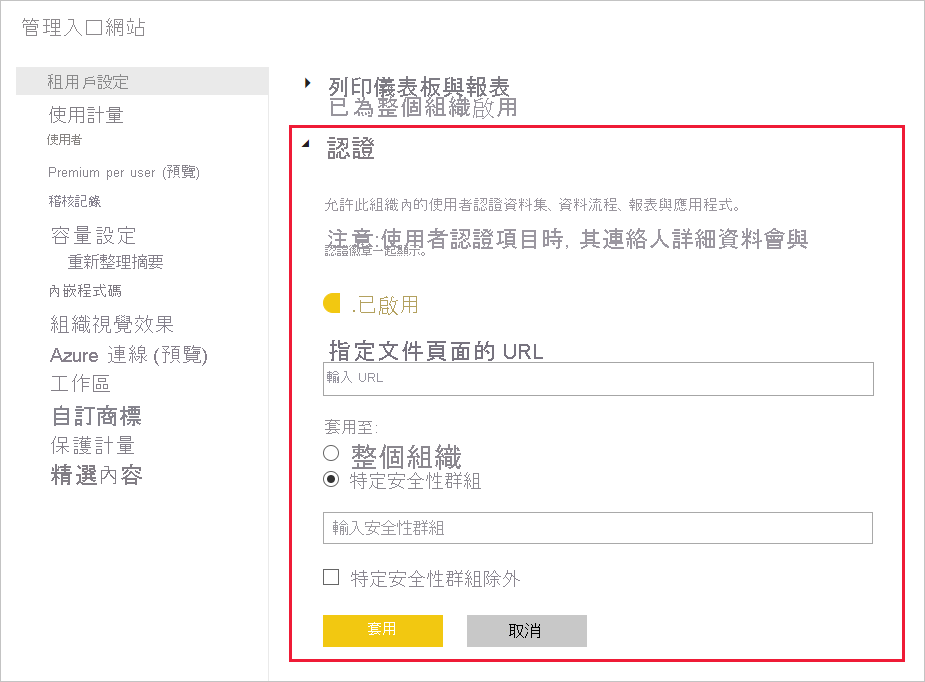

# 啟用內容認證

組織可以認證選取的內容，作為重要資訊的權威性來源。 目前，可接受認證的內容類型如下：
* 資料集
* 資料流程 (預覽)
* 報表 (預覽)
* 應用程式 (預覽)

身為 Power BI 管理員，您肩負為組織啟用並設定認證程序的責任。 這表示：
* 在租用戶上啟用認證。
* 定義安全性群組清單，該群組成員將獲授權進行內容認證。
* 提供指向組織內容認證程序文件 (若這類文件存在) 的 URL。

認證是 Power BI 「簽署」功能的一部分。 如需詳細資訊，請參閱[簽署：推廣及認證 Power BI 內容](../collaborate-share/service-endorsement-overview.md)。

## 設定認證

1. 在管理入口網站中，選取 [租用戶設定]。
1. 在 [匯出和共用設定] 區段底下，展開 [認證] 區段。

   

1. 切換設定為 [啟用]。
1. 如果組織有已發佈的認證原則，請在這裡提供其 URL。 在 [[簽署設定] 對話方塊](../collaborate-share/service-endorse-content.md#request-content-certification)的 [憑證] 區段中，此處會變為 **深入了解** 連結。 如果未提供連結，則當使用者要求為其內容取得認證時，將會建議這些使用者連絡其 Power BI 系統管理員。
1. 指定一或多個安全性群組，該群組成員將獲授權進行內容認證。 這些獲授權認證者可使用 [[簽署設定] 對話方塊](../collaborate-share/service-endorse-content.md#certify-content)中 [認證] 區段的 [認證] 按鈕。
    
    如果安全性群組包含您不想要授與認證權限的子安全性群組，您可選取 [特定安全性群組除外] 方塊，然後在出現的文字方塊中，輸入這些安全性群組的名稱。
1. 按一下 [套用]。

## 後續步驟
* [升階或認證內容](../collaborate-share/service-endorse-content.md)
* [閱讀 Power BI 中的簽署](../collaborate-share/service-endorsement-overview.md)
* 有問題嗎？ [嘗試在 Power BI 社群提問](https://community.powerbi.com/)
