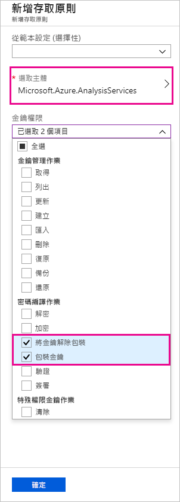
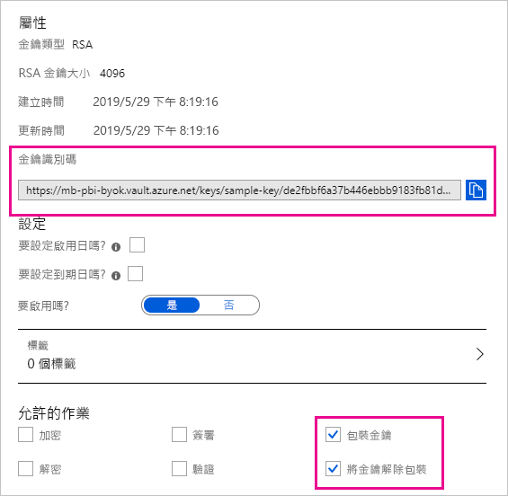

# <a name="bring-your-own-encryption-keys-for-power-bi"></a>攜帶您自己的加密金鑰以用於 Power BI

Power BI 會加密「待用」  與「處理中」  的資料。 根據預設，Power BI 會使用 Microsoft 管理的金鑰來為您加密資料。 在 Power BI Premium 中，您也可以為匯入資料集之待用資料使用您自己的金鑰 (請參閱[資料來源和儲存考量](#data-source-and-storage-considerations)以取得詳細資訊)。 這種方法通常稱為_攜帶您自己的金鑰_ (BYOK)。

## <a name="why-use-byok"></a>為何要使用 BYOK？

BYOK 可更輕鬆地滿足透過雲端服務提供者 (在此案例中為 Microsoft) 指定金鑰排列的合規性需求。 使用 BYOK，您可以在應用程式層級提供並控制待用 Power BI 資料的加密金鑰。 如此一來，如果您決定結束服務，您可以控制並撤銷組織的金鑰。 撤銷金鑰後，服務在 30 分鐘內便會無法讀取資料。

## <a name="data-source-and-storage-considerations"></a>資料來源和儲存體考量

若要使用 BYOK，您必須將資料從 Power BI Desktop (PBIX) 檔案上傳至 Power BI 服務。 在下列情況下，您無法使用 BYOK：

- Analysis Services 即時連線
- Excel 活頁簿 (除非資料先匯入 Power BI Desktop)
- [推送資料集](/rest/api/power-bi/pushdatasets)
- [串流資料集](../connect-data/service-real-time-streaming.md#set-up-your-real-time-streaming-dataset-in-power-bi)
- [大型模型](service-premium-large-models.md)

BYOK 僅適用於資料集。 使用者可以上傳至服務的推送資料集、Excel 檔案和 CSV 檔案不會使用您自己的金鑰進行加密。 如要識別哪些成品儲存在您的工作區中，請使用下列 PowerShell 命令：

```PS C:\> Get-PowerBIWorkspace -Scope Organization -Include All```

> [!NOTE]
> 此 Cmdlet 需要 Power BI 管理模組 v1.0.840。 您可以透過執行 Get-InstalledModule -Name MicrosoftPowerBIMgmt 來查看所擁有的版本。 透過執行 Install-Module -Name MicrosoftPowerBIMgmt 來安裝最新版本。 您可以在 [Power BI PowerShell Cmdlet 模組](https://docs.microsoft.com/powershell/power-bi/overview)中取得更多 Power BI Cmdlet 及其參數的資訊。

## <a name="configure-azure-key-vault"></a>設定 Azure Key Vault

在此節中，您已了解如何設定 Azure Key Vault 這個可用來安全地儲存並存取祕密 (例如加密金鑰) 的工具。 您可以使用現有的金鑰保存庫來儲存加密金鑰，或者您也可以建立一個新的來專門用於 Power BI。

本節中的指示假設您已具備 Azure Key Vault 基本知識。 如需詳細資訊，請參閱[什麼是 Azure Key Vault？](/azure/key-vault/key-vault-whatis)。 以下列方式設定您的金鑰保存庫：

1. 將 Power BI 服務新增為金鑰保存庫的服務主體，包含包裝和解除包裝的權限。

1. 建立長度為 4096 位元的 RSA 金鑰 (或使用此類型的現有金鑰)，包含包裝和解除包裝的權限。

    > [!IMPORTANT]
    > Power BI BYOK 僅支援 4096 位元長度的 RSA 金鑰。

1. 建議︰確認金鑰保存庫已啟用「虛刪除」  選項。

### <a name="add-the-service-principal"></a>新增服務主體

1. 在 Azure 入口網站中，於您的金鑰保存庫內，選取位於 [存取原則]  下方的 [新增]  。

1. 在 [選取主體]  下方搜尋並選取 Microsoft.Azure.AnalysisServices。

    > [!NOTE]
    > 如果您找不到 "Microsoft.Azure.AnalysisServices"，可能是與 Azure Key Vault 建立關聯的 Azure 訂用帳戶從未具有與其建立關聯的 Power BI 資源。 請嘗試改為搜尋下列字串：00000009-0000-0000-c000-000000000000。

1. 在 [金鑰權限]  下方選取 [解除包裝金鑰]  和 [包裝金鑰]  。

    

1. 選取 [確定]  ，然後 [儲存]  。

> [!NOTE]
> 若要撤銷 Power BI 未來對您資料的存取權限，請從 Azure Key Vault 移除對此服務主體的存取權限。

### <a name="create-an-rsa-key"></a>建立 RSA 金鑰

1. 在您的金鑰保存庫中，選取 [金鑰]  下方的 [產生/匯入]  。

1. 選取 RAS 的 [金鑰類型]  ，且 [RSA 金鑰大小]  為 4096。

    

1. 選取 [建立]  。

1. 在 [金鑰]  下方，選取您建立的金鑰。

1. 選取金鑰 [目前版本]  的 GUID。

1. 確認已選取 [包裝金鑰]  和 [解除包裝金鑰]  。 複製 [金鑰識別碼]  ，在您啟用 Power BI 中的 BYOK 時使用。

    

### <a name="soft-delete-option"></a>虛刪除選項

我們建議在您的金鑰保存庫中啟用[虛刪除](/azure/key-vault/key-vault-ovw-soft-delete)，在意外刪除金鑰 (或金鑰保存庫) 時防止資料遺失。 您必須在金鑰保存庫使用 [PowerShell 以啟用「虛刪除」屬性](/azure/key-vault/key-vault-soft-delete-powershell)，因為 Azure 入口網站尚未提供此選項。

正確設定 Azure Key Vault 後，您即已準備好在您的租用戶上啟用 BYOK。

## <a name="enable-byok-on-your-tenant"></a>在您的租用戶上啟用 BYOK

首先，將您在 Azure Key Vault 中建立並儲存的加密金鑰引入 [Power BI](https://www.powershellgallery.com/packages/MicrosoftPowerBIMgmt.Admin) 租用戶，以使用 PowerShell 在租用戶層級啟用 BYOK。 接著，為每個 Premium 容量指派這些加密金鑰以加密容量中的內容。

### <a name="important-considerations"></a>重要考量

啟用 BYOK 之前，請記住下列考量：

- 在此階段中，啟動 BYOK 後即無法將其停用。 根據您如何指定 `Add-PowerBIEncryptionKey` 的參數，您可以控制如何將 BYOK 用於您的一或多個容量。 不過，您無法復原將金鑰引入租用戶的動作。 如需詳細資訊，請參閱[啟用 BYOK](#enable-byok)。

- 您不能「直接」  將使用 BYOK 之工作空間從 Power BI Premium 中的專用容量移至共用容量。 您必須先將工作區移至未啟用 BYOK 的專用容量。

- 如果您將使用 BYOK 的工作區從 Power BI Premium 中專用容量移到共用區，由於報表和資料集已使用金鑰進行加密，因此這些報表和資料集會變成無法存取。 若要避免這種情況，您必須先將工作區移至未啟用 BYOK 的專用容量。

### <a name="enable-byok"></a>啟用 BYOK

您必須是 Power BI 服務的租用戶系統管理員，並使用 `Connect-PowerBIServiceAccount` Cmdlet 登入，才能啟用 BYOK。 接著，使用 [`Add-PowerBIEncryptionKey`](/powershell/module/microsoftpowerbimgmt.admin/Add-PowerBIEncryptionKey) 來啟用 BYOK，如下列範例所示：

```powershell
Add-PowerBIEncryptionKey -Name'Contoso Sales' -KeyVaultKeyUri'https://contoso-vault2.vault.azure.net/keys/ContosoKeyVault/b2ab4ba1c7b341eea5ecaaa2wb54c4d2'
```

若要新增多個金鑰，請使用不同的 `-Name` 和 `-KeyVaultKeyUri` 值來執行 `Add-PowerBIEncryptionKey`。 

此 Cmdlet 接受兩個參數，這些參數影響目前和未來容量的加密。 根據預設，不會設定任何切換：

- `-Activate`：表示此金鑰會用於租用戶中所有尚未加密的現有容量。

- `-Default`：表示此金鑰現在是整個租用戶的預設值。 當您建立新的容量時，該容量會繼承此金鑰。

> [!IMPORTANT]
> 如果您指定 `-Default`，即刻起所有在您租用戶上建立的容量都會使用您所指定金鑰 (或更新的預設金鑰) 來加密。 您無法復原預設作業，因此您將無法在租用戶中建立未使用 BYOK 的 Premium 容量。

在您於租用戶上啟用 BYOK 後，請設定一或多個 Power BI 容量的加密金鑰：

1. 使用 [`Get-PowerBICapacity`](/powershell/module/microsoftpowerbimgmt.capacities/get-powerbicapacity) 來取得下一個步驟所需的容量識別碼。

    ```powershell
    Get-PowerBICapacity -Scope Individual
    ```

    此 Cmdlet 會傳回如下輸出：

    ```
    Id              : xxxxxxxx-xxxx-xxxx-xxxx-xxxxxxxxxxxx
    DisplayName     : Test Capacity
    Admins          : adam@sometestdomain.com
    Sku             : P1
    State           : Active
    UserAccessRight : Admin
    Region          : North Central US
    ```

1. 使用 [`Set-PowerBICapacityEncryptionKey`](/powershell/module/microsoftpowerbimgmt.admin/set-powerbicapacityencryptionkey) 設定加密金鑰：

    ```powershell
    Set-PowerBICapacityEncryptionKey -CapacityId xxxxxxxx-xxxx-xxxx-xxxx-xxxxxxxxxxxx -KeyName 'Contoso Sales'
    ```

您可以控制如何在您的租用戶中使用 BYOK。 例如，若要加密單一容量，請呼叫 `Add-PowerBIEncryptionKey` 而不使用 `-Activate`或 `-Default`。 然後，為您要啟用 BYOK 的容量呼叫 `Set-PowerBICapacityEncryptionKey`。

## <a name="manage-byok"></a>管理 BYOK

Power BI 也提供其他的 Cmdlet 以協助您管理租用戶中的 BYOK：

- 使用 [`Get-PowerBICapacity`](/powershell/module/microsoftpowerbimgmt.capacities/get-powerbicapacity) 以取得容量目前正在使用的金鑰：

    ```powershell
    Get-PowerBICapacity -Scope Organization -ShowEncryptionKey
    ```

- 使用 [`Get-PowerBIEncryptionKey`](/powershell/module/microsoftpowerbimgmt.admin/get-powerbiencryptionkey) 以取得您租用戶目前正在使用的金鑰：

    ```powershell
    Get-PowerBIEncryptionKey
    ```

- 使用 [`Get-PowerBIWorkspaceEncryptionStatus`](/powershell/module/microsoftpowerbimgmt.admin/get-powerbiworkspaceencryptionstatus) 以查看工作區中的資料集是否已加密，以及其加密狀態是否與工作區同步：

    ```powershell
    Get-PowerBIWorkspaceEncryptionStatus -Name'Contoso Sales'
    ```

    請注意，加密是在容量層級啟用，但您會在指定工作區的資料集層級取得加密狀態。

- 使用 [`Switch-PowerBIEncryptionKey`](/powershell/module/microsoftpowerbimgmt.admin/switch-powerbiencryptionkey) 以切換 (或變換  ) 用於加密的金鑰版本。 此 Cmdlet 只會更新金鑰 `-Name` 的 `-KeyVaultKeyUri`：

    ```powershell
    Switch-PowerBIEncryptionKey -Name'Contoso Sales' -KeyVaultKeyUri'https://contoso-vault2.vault.azure.net/keys/ContosoKeyVault/b2ab4ba1c7b341eea5ecaaa2wb54c4d2'
    ```


## <a name="next-steps"></a>後續步驟

* [Power BI PowerShell Cmdlet 模組](https://docs.microsoft.com/powershell/power-bi/overview) 

* [在 Power BI 中共用成品的方式](../collaborate-share/service-how-to-collaborate-distribute-dashboards-reports.md)

* [在 URL 中使用查詢字串參數來篩選報表](../collaborate-share/service-url-filters.md)

* [在 SharePoint Online 中嵌入報表網頁組件](../collaborate-share/service-embed-report-spo.md)

* [從 Power BI 發佈至 Web](../collaborate-share/service-publish-to-web.md)

