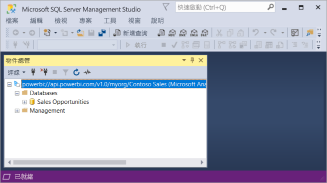
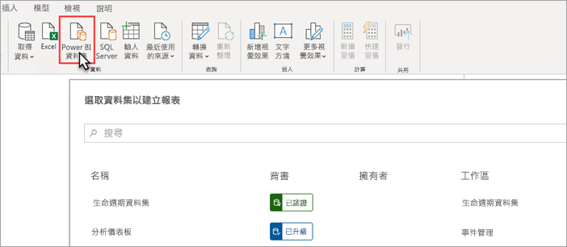
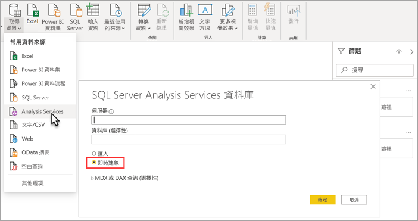

# 使用 XMLA 端點連線至資料集 (預覽)

1500 和更高相容性層級的 Power BI Premium 工作區和資料集，可藉由使用 *XMLA 端點* ，支援 Microsoft 和第三方用戶端應用程式和工具的開放平台連線。

> [!NOTE]
> 這是 **預覽** 功能。 「預覽」中的功能不應在生產環境中使用。 某些功能、支援和文件受到限制。  如需詳細資訊，請參閱 [Microsoft Online Services 條款 (OST)](https://www.microsoft.com/licensing/product-licensing/products?rtc=1)。

## 什麼是 XMLA 端點？

Power BI Premium 使用 [XML for Analysis](/analysis-services/xmla/xml-for-analysis-xmla-reference?view=power-bi-premium-current) (XMLA) (部分機器翻譯) 通訊協定來在用戶端應用程式與管理您 Power BI 工作區及資料集的引擎間進行通訊。 這些通訊是透過通常稱為 XMLA 端點的項目進行。 XMLA 與 Microsoft Analysis Services 引擎所使用的通訊協定相同，其幕後的運作原理是會執行 Power BI 的語意模型、控管、生命週期及資料管理。

根據預設，會針對容量中的 **資料集工作負載** ，啟用使用端點的「唯讀」連線。 使用唯讀，資料視覺效果應用程式和工具就可以查詢資料集模型資料、中繼資料、事件和結構描述。 使用端點的「讀寫」作業可以啟用，以提供額外的資料集管理、治理、進接語義模型化、偵錯和監視。 啟用讀寫功能之後，Power BI Premium 資料集與 Azure Analysis Services 和 SQL Server Analysis Services 企業級表格式模型工具和程序就會有更多相同處。

> [!NOTE]
> 建議您使用新式工作區體驗，特別是在使用 XMLA 端點連線到資料集時。 傳統工作區不支援建立或刪除資料集之類的作業。 若要將傳統工作區升級為新式體驗，請參閱[在 Power BI 中升級傳統工作區](../collaborate-share/service-upgrade-workspaces.md)。

## 資料模型和管理工具

以下是一些與 Azure Analysis Services 和 SQL Server Analysis Services 搭配使用的最常見工具，現在已由 Power BI Premium 資料集支援：

**具有 Analysis Services 專案的 Visual Studio**  (也稱為 SQL Server Data Tools，或簡稱為 **SSDT** )，是適用於 Analysis Services 表格式模型的企業級模型製作工具。 所有 Visual Studio 2017 和更新版本都支援 Analysis Services 專案延伸模組，包括免費的社群版本。 需要延伸模組版本 2.9.6 或更高版本，才能將表格式模型部署到 Premium 工作區。 部署到 Premium 工作區時，此模型必須是 1500 或更高的相容性層級。 資料集工作負載需要 XMLA 讀寫。 若要深入了解，請參閱[適用於 Analysis Services 的工具](/analysis-services/tools-and-applications-used-in-analysis-services?view=power-bi-premium-current) (部分機器翻譯)。

**SQL Server Management Studio (SSMS)**   - 支援 DAX、MDX 和 XMLA 查詢。 使用[表格式模型指令碼語言](/analysis-services/tmsl/tabular-model-scripting-language-tmsl-reference) (TMSL) (部分機器翻譯)，執行資料集中繼資料的精細重新整理作業和指令碼處理。 查詢作業需要唯讀。 指令碼中繼資料需要讀寫。 需要 SSMS 18.4 版或更新版本。 在 [這裡](/sql/ssms/download-sql-server-management-studio-ssms)下載。

**SQL Server Profiler**  - 與 SSMS 一起安裝，這項工具可提供資料集事件的追蹤和偵錯。 雖然 SQL Server 已經正式淘汰這項工具，但 Profiler 會繼續包含在 SSMS 中，並針對 Analysis Services 以及 Power BI Premium 繼續獲得支援。 需要 XMLA 唯讀。 若要深入了解，請參閱  [Analysis Services 的 SQL Server Profiler](/analysis-services/instances/use-sql-server-profiler-to-monitor-analysis-services?view=power-bi-premium-current) (部分機器翻譯)。

**Analysis Services 部署精靈**  - 隨 SSMS 一起安裝，這項工具可將 Visual Studio 撰寫表格式模型專案部署到 Analysis Services 和 Power BI Premium 工作區。 其可以透過互動方式或從命令列執行以進行自動化。 需要 XMLA 讀寫。 若要深入了解，請參閱 [Analysis Services 部署精靈](/analysis-services/deployment/deploy-model-solutions-using-the-deployment-wizard?view=power-bi-premium-current) (部分機器翻譯)。

**PowerShell Cmdlet**  - Analysis Services Cmdlet 可以用來將資料集管理工作自動化，例如重新整理作業。 需要 XMLA 讀寫。 需要 [SqlServer PowerShell 模組](https://www.powershellgallery.com/packages/SqlServer/) (英文) 的 **21.1.18221** 版本或更高版本。 Power BI Premium 不支援 Az.AnalysisServices 模組中的 Azure Analysis Services Cmdlet。 若要深入了解，請參閱 [Analysis Services PowerShell 參考](/analysis-services/powershell/analysis-services-powershell-reference?view=power-bi-premium-current) (部分機器翻譯)。

**Power BI 報表產生器**  - 用於撰寫分頁報表的工具。 建立報表定義，指定要擷取的資料、要取得資料的位置，以及資料的顯示方式。 您可以在報表產生器中預覽報表，然後將其發佈至 Power BI 服務中。 需要 XMLA 唯讀。 若要深入了解，請參閱  [Power BI 報表產生器](../paginated-reports/report-builder-power-bi.md)。

**表格式編輯器** - 一種開放原始碼工具，可讓您使用直覺、輕量的編輯器來建立、維護及管理表格式模型。 階層式檢視會顯示您表格式模型中的所有物件。 物件是透過顯示資料夾來組織，可支援多重選取屬性編輯和 DAX 語法醒目提示。 查詢作業需要 XMLA 唯讀。 中繼資料作業需要讀寫。 若要深入了解，請參閱 [tabulareditor.github.io](https://tabulareditor.github.io/) (英文)。

**DAX Studio** – DAX 撰寫、診斷、效能調整和分析的開放原始碼工具。 功能包括物件瀏覽、整合式追蹤、具有詳細統計資料的查詢執行明細、DAX 語法醒目提示和格式設定。 查詢作業需要 XMLA 唯讀。 若要深入了解，請參閱  [daxstudio.org](https://daxstudio.org/) (英文)。

**ALM 工具組** - 一個適用於 Power BI 資料集的開放原始碼結構描述比較工具，最常用於應用程式生命週期管理 (ALM) 案例。 跨環境執行部署，並保留累加式重新整理歷程記錄資料。 Diff 和 merge 中繼資料檔案、分支和存放庫。 在資料集之間重複使用一般定義。 查詢作業需要唯讀。 中繼資料作業需要讀寫。 若要深入了解，請參閱  [alm-toolkit.com](http://alm-toolkit.com/) (英文)。

**Microsoft Excel**  - Excel 樞紐分析表是其中一個最常用的工具，用來總結、分析、探索和呈現來自 Power BI 資料集的摘要資料。 查詢作業需要唯讀。 需要 Office 16.0.11326.10000 或更高版本的隨選即用版本。

**第三方**  - 包含用戶端資料視覺效果應用程式和工具，可連線、查詢和取用 Power BI Premium 中的資料集。 大多數工具需要 MSOLAP 用戶端程式庫的最新版本，但有些可以使用 ADOMD。 唯讀或讀寫 XMLA 端點相依於作業。

### 用戶端程式庫

用戶端應用程式不會直接與 XMLA 端點通訊。 相反地，其會使用「用戶端程式庫」作為抽象層。 這些是應用程式用來連線到 Azure Analysis Services 和 SQL Server Analysis Services 的相同用戶端程式庫。 Microsoft 應用程式 (例如 Excel、SQL Server Management Studio (SSMS) 和適用於 Visual Studio 的 Analysis Services 專案延伸模組) 會安裝全部三個用戶端程式庫，並隨著一般應用程式和延伸模組更新來加以更新。 開發人員也可以使用用戶端程式庫來建置自訂應用程式。 在某些情況下 (特別是針對第三方應用程式)，如果未與應用程式一起安裝，可能需要安裝更新版本的用戶端程式庫。 用戶端程式庫會每月進行更新。 若要深入了解，請參閱 [用來連線到 Analysis Services 的用戶端程式庫](/azure/analysis-services/analysis-services-data-providers) (部分機器翻譯)。

## 支援的寫入作業

資料集中繼資料會透過以表格式物件模型 (TOM) 為基礎的用戶端程式庫公開，讓開發人員建置自訂應用程式。 這可讓 Visual Studio 和開放原始碼社群工具 (例如表格式編輯器) 提供 Analysis Services 引擎支援的其他資料模型化和部署功能，但是 Power BI Desktop 尚未支援。 其他資料模型化功能包括：

- [計算群組](/analysis-services/tabular-models/calculation-groups?view=power-bi-premium-current) (部分機器翻譯) 用於計算重複使用性和簡化複雜模型的取用。

- [中繼資料轉譯](/analysis-services/tabular-models/translations-in-tabular-models-analysis-services?view=power-bi-premium-current) (部分機器翻譯)，可支援多種語言的報表和資料集。

- [檢視方塊](/analysis-services/tabular-models/perspectives-ssas-tabular?view=power-bi-premium-current) (部分機器翻譯)，可定義資料集中繼資料的焦點、企業網域特定檢視。

Power BI Premium 資料集尚未支援物件層級安全性 (OLS)。

## 最佳化資料集以進行寫入作業

使用 XMLA 端點進行資料集管理與寫入作業時，建議您針對大型模型啟用資料集。 這樣可減少寫入作業的額外負荷，使其速度變得更快。 針對大小超過 1 GB 的資料集 (在壓縮之後)，差異會很顯著。 若要深入了解，請參閱 [Power BI Premium 中的大型模型](service-premium-large-models.md)。

## 啟用 XMLA 讀寫

根據預設，Premium 容量會將 XMLA 端點屬性設定啟用為唯讀。 這表示應用程式只能查詢資料集。 若要讓應用程式執行寫入作業，必須啟用 XMLA 端點屬性以進行讀寫。 容量的 XMLA 端點屬性設定是在 [資料集工作負載] 中設定。 XMLA 端點設定適用於指派給容量的「所有工作區和資料集」。

### 若要啟用容量的讀寫功能

1. 在系統管理員入口網站中，按一下 [容量設定]  >  [Power BI Premium] > [容量名稱]。
2. 展開 [工作負載]。 在 [XMLA 端點] 設定中，選取 [讀寫]。

    

## 連線到 Premium 工作區

指派給容量的工作區會具備這種 URL 格式的連接字串：`powerbi://api.powerbi.com/v1.0/[tenant name]/[workspace name]`。

連線到工作區的應用程式會使用 URL，因為其為 Analysis Services 伺服器名稱。 例如：`powerbi://api.powerbi.com/v1.0/contoso.com/Sales Workspace`。

在相同租用戶 (非 B2B) 中具有 UPN 的使用者，可以使用 `myorg` 來取代租用戶名稱。 例如， `powerbi://api.powerbi.com/v1.0/myorg/Sales Workspace`。

B2B 使用者必須在租用戶名稱中指定其組織 UPN。 例如， `powerbi://api.powerbi.com/v1.0/fabrikam.com/Sales Workspace`。

### 若要取得工作區連線 URL

在工作區 [設定]  >  [Premium]  >  [工作區連線] 中，按一下 [複製]。

## 連線需求

### 初始目錄

使用某些工具 (例如 SQL Server Profiler) 時，您可能需要指定「初始目錄」。 在您的工作區中指定資料集 (資料庫)。 在 [連線到伺服器] 對話方塊上，按一下 [選項]  >  [連線屬性]  >  [連線到資料庫]，輸入資料集名稱。

### 重複的工作區名稱

[新的工作區](../collaborate-share/service-new-workspaces.md) (使用新的工作區體驗所建立) 在 Power BI 中會強制進行驗證，以禁止建立或重新命名具有重複名稱的工作區。 未遷移的工作區會導致重複的名稱。 連線到與其他工作區具有相同名稱的工作區時，您可能會看到下列錯誤：

**無法連線到 powerbi://api.powerbi.com/v1.0/[tenant name]/[workspace name]。**

若要解決這個錯誤，除了工作區名稱外，請另外指定 ObjectIDGuid，您可以從 URL 中的工作區 objectID 複製這個值。 將 objectID 附加到連線 URL。 例如，  
'powerbi://api.powerbi.com/v1.0/myorg/Contoso Sales - 9d83d204-82a9-4b36-98f2-a40099093830'。

### 重複的資料集名稱

連線到相同工作區中與其他資料集具有相同名稱的資料集時，請將資料集的 guid 附加到資料集的名稱。 您可以在連線到 SSMS 中的工作區時取得資料集名稱和 guid。

### 顯示資料集中的延遲

連線到工作區時，新增、刪除和重新命名資料集的變更可能會需要最多數分鐘才能顯示。

### 不支援的資料集

下列資料集無法透過 XMLA 端點存取。 這些資料集不會出現在 SSMS 的工作區底下或其他工具中：

- 資料集是根據與 Azure Analysis Services 或 SQL Server Analysis Services 模型的即時連線。 
- 資料集是根據與其他工作區中 Power BI 資料集的即時連線。 若要深入了解，請參閱[跨工作區的資料集簡介](../connect-data/service-datasets-across-workspaces.md)。
- 使用 REST API 推送資料的資料集。
- Excel 活頁簿資料集。

## 安全性

除了由容量管理員啟用讀寫功能的 XMLA 端點屬性之外，也必須啟用 Power BI 系統管理員入口網站中的租用戶層級 **匯出資料** 設定 (在 Excel 中進行分析也需要的項目)。

透過 XMLA 端點的存取將會接受在工作區/應用程式層級設定的安全性群組成員資格。

工作區參與者以上層級具有資料集的寫入權限，因此相當於 Analysis Services 資料庫管理員。 他們可以從 Visual Studio 部署新的資料集，並且在 SSMS 中執行 TMSL 指令碼。

Power BI Premium 目前不支援需要 Analysis Services 伺服器管理員權限 (非資料庫管理員) 的作業，例如使用 [EffectiveUserName](/analysis-services/instances/connection-string-properties-analysis-services?view=power-bi-premium-current#bkmk_auth) (部分機器翻譯) 連接字串屬性的伺服器層級追蹤和使用者模擬。

在資料集上具有[建置權限](../connect-data/service-datasets-build-permissions.md)的其他使用者相當於 Analysis Services 資料庫讀者。 他們可以連線到資料集，並加以瀏覽，以取得資料耗用量和視覺效果。 接受資料列層級安全性 (RLS) 規則，而且無法看到內部資料集中繼資料。

### 模型角色

透過 XMLA 端點的資料集中繼資料可以從資料集建立、修改或刪除模型角色，包括設定資料列層級安全性 (RLS) 篩選。 Power BI 中的模型角色僅用於 RLS。 使用 Power BI 安全性模型來控制 RLS 以外的權限。

透過 XMLA 端點使用資料集角色時，會有下列限制：

- **在公開預覽期間，您無法使用 XMLA 端點來指定資料集的角色成員資格** 。 相反地，請在 Power BI 服務中資料集的資料列層級安全性頁面上，指定角色成員。
- 可以針對 Power BI 資料集設定的角色唯一權限是 [讀取] 權限。 不論資料集角色是否存在，都需要資料集的建置權限，才能透過 XMLA 端點進行讀取存取。 使用 Power BI 安全性模型來控制 RLS 以外的權限。
- Power BI 目前不支持物件層級安全性 (OLS) 規則。

### 設定資料來源認證

透過 XMLA 端點指定的中繼資料可以建立與資料來源的連線，但是無法設定資料來源認證。 相反地，可以在 Power BI 服務的 [資料集設定] 頁面中設定認證。

### 服務主體

Azure 服務主體可用來執行自動資源和服務層級作業。 若要深入了解，請參閱[使用服務主體將 Premium 工作區與資料集工作自動化](service-premium-service-principal.md)。

## 從 Visual Studio (SSDT) 部署模型專案

將 Visual Studio 中的表格式模型專案部署至 Power BI Premium 工作區，與部署至 Azure 或 SQL Server Analysis Services 伺服器的方式大致相同。 唯一的差異在於為專案指定的部署伺服器屬性，以及如何指定資料來源認證，讓處理作業可以將資料來源中的資料匯入至工作區上的新資料集。

> [!IMPORTANT]
> 在公開預覽期間，使用 XMLA 端點的工具無法指定角色成員資格。 如果您的模型專案無法部署，請確定未在任何角色中指定任何使用者。 成功部署模型之後，請在 Power BI 服務中指定資料集角色的使用者。 若要深入了解，請參閱本文稍早[模型角色](#model-roles)。

若要部署在 Visual Studio 中撰寫的表格式模型專案，您必須先在專案 [部署伺服器] 屬性中設定工作區連線 URL。 在 Visual Studio 的 [方案總管] 中，以滑鼠右鍵按一下 [專案] > [屬性]。 在 [伺服器] 屬性中，貼上工作區連線 URL。

指定 [部署伺服器] 屬性之後，即可部署專案。

**第一次部署時** ，會使用 model.bim 中的中繼資料，在工作區中建立資料集。 在部署作業中，從模型中繼資料在工作區中建立資料集之後，從資料來源將資料載入至資料集的處理將會失敗。

處理失敗的原因是與部署至 Azure 或 SQL Server Analysis Server 執行個體時不同，在其中進行部署作業時會提示資料來源認證，而在部署至 Premium 工作區時，無法在部署作業中指定資料來源認證。 相反地，在中繼資料部署成功並建立資料集之後，資料來源認證就會在 Power BI 服務中的資料集設定指定。 在工作區中，按一下 [資料集]  >  [設定]  >  [資料來源認證]  >  [編輯認證]。

指定資料來源認證之後，您可以接著重新整理 Power BI 服務中的資料集、設定排程重新整理，或從 SQL Server Management Studio 處理 (重新整理)，將資料載入資料集。

系統會觀察 Visual Studio 專案中所指定的部署 [處理選項] 屬性。 不過，如果資料來源尚未在 Power BI 服務中指定認證，即使中繼資料部署成功，處理也會失敗。 您可以將屬性設定為 [不處理]，防止嘗試在部署過程中進行處理，但是您可能會想要將屬性設定回 [預設]，因為一旦在新資料集的資料來源設定中指定資料來源認證，後續部署作業中的處理就會成功。

## 使用 SSMS 連線

使用 SSMS 連線至工作區，就像連線到 Azure 或 SQL Server Analysis Services 伺服器一樣。 唯一的不同之處在於，您可以在伺服器名稱中指定工作區 URL，而且必須使用 [具 MFA 的 Active Directory - 通用] 驗證。

### 使用 SSMS 連線到工作區

1. 在 SQL Server Management Studio 中，按一下 [連線]  >  [連線到伺服器]。

2. 在 [伺服器類型] 中，選取 [Analysis Services]。 在 [伺服器名稱] 中，輸入工作區 URL。 在 [驗證] 中，選取 [具 MFA 的 Active Directory - 通用]，然後在 [使用者名稱] 中，輸入您的組織使用者識別碼。

    

連線時，工作區會顯示為 Analysis Services 伺服器，且工作區中的資料集也會顯示為資料庫。  

若要深入了解使用 SSMS 來編寫中繼資料的指令碼，請參閱 [建立 Analysis Services 指令碼](/analysis-services/instances/create-analysis-services-scripts-in-management-studio?view=power-bi-premium-current) (部分機器翻譯) 和 [表格式模型指令碼語言 (TMSL)](/analysis-services/tmsl/tabular-model-scripting-language-tmsl-reference?view=power-bi-premium-current) (部分機器翻譯)。

## 資料集重新整理

XMLA 端點可讓您使用 SSMS、使用 PowerShell 的自動化、[Azure 自動化](/azure/automation/automation-intro)，以及使用 TOM 的 [Azure Functions](/azure/azure-functions/functions-overview)，來提供更廣範圍的更細緻重新整理功能案例。 例如，您可以重新整理某些[累加式重新整理](service-premium-incremental-refresh.md)歷程記錄資料分割，而不需要重新載入所有歷程記錄資料。

不同於在 Power BI 服務中設定重新整理，透過 XMLA 端點進行的重新整理作業不限於每天 48 次重新整理，而且不會強制執行[排程重新整理逾時](../connect-data/refresh-troubleshooting-refresh-scenarios.md#scheduled-refresh-timeout)。

## 動態管理檢視 (DMV)

Analysis Services [DMV](/analysis-services/instances/use-dynamic-management-views-dmvs-to-monitor-analysis-services) (部分機器翻譯) 提供資料集中繼資料、資料譜系和資源使用狀況的可見度。 可透過 XMLA 端點在 Power BI 中查詢的 DMV，限制為最多需要資料庫管理員權限的 DMV。 例如，某些 DMV 無法存取，因為其需要 Analysis Services 伺服器管理員權限。

## Power BI Desktop 撰寫的資料集

### 增強型中繼資料

在 Power BI Desktop 中撰寫並發佈至 Premium 工作區的資料集上 XMLA 寫入作業，必須啟用增強型中繼資料。 若要深入了解，請參閱[增強型資料集中繼資料](../connect-data/desktop-enhanced-dataset-metadata.md)。

> [!CAUTION]
> 此時，在 Power BI Desktop 中撰寫的資料集上進行的寫入作業，將會防止其無法以 .PBIX 檔案的形式下載回去。 請務必保留原始的 .PBIX 檔案。

### 資料來源宣告

當連線到資料來源並查詢資料時，Power BI Desktop 會使用 Power Query M 運算式作為內嵌資料來源宣告。 雖然在 Power BI Premium 工作區中受到支援，但是 Azure Analysis Services 或 SQL Server Analysis Services 不支援 Power Query M 內嵌資料來源宣告。 相反地，Analysis Services 資料模型工具 (例如 Visual Studio) 會使用「結構化」和/或「提供者」資料來源宣告來建立中繼資料。 使用 XMLA 端點時，Power BI Premium 也支援結構化和提供者資料來源，但不屬於 Power BI Desktop 模型中的 Power Query M 內嵌資料來源宣告。 若要深入了解，請參閱[了解提供者](/azure/analysis-services/analysis-services-datasource#understanding-providers) (部分機器翻譯)。

### 即時連線模式中的 Power BI Desktop

Power BI Desktop 可使用即時連線來連線到 Power BI Premium 資料集。 使用即時連線時，不需要在本機複寫資料，這讓使用者更容易取用語意模型。 使用者可使用兩種方式連線：

選取 [Power BI 資料集]，然後選取資料集來建立報表。 **建議** 使用者以此方式即時連線到資料集。 這個方法提供改善的探索體驗，可顯示資料集的簽署層級。 使用者不需要尋找及追蹤工作區 URL。 若要尋找資料集，使用者只需要鍵入資料集名稱，或捲動尋找所要尋找的資料集。

使用者可使用的另一種連線方式，是使用 [取得資料] > [Analysis Services]，將 Power BI Premium 工作區名稱指定為 URL，選取 [連接即時資料]，然後在導覽器中選取資料集。 在此情況下，Power BI Desktop 會使用 XMLA 端點即時連線到資料集，就像是 Analysis Services 的資料模型一樣。 

現有報表已即時連線到 Analysis Services 資料模型的組織，若要移轉至 Power BI Premium 資料集，只需要在 [轉換資料] > [資料來源設定] 中變更伺服器名稱 URL 即可。

> [!NOTE]
> 在 XMLA 讀寫公用預覽期間，使用 Power BI Desktop 連線到 Power BI Premium 資料集時，尚不支援使用 [取得資料] > [Analysis Services]，然後選取 [連接即時資料] 選項將報表發佈至 Power BI 服務。

## 稽核記錄

當應用程式連線到工作區時，透過 XMLA 端點的存取會記錄在 Power BI 稽核記錄中，具有以下作業：

|作業易記名稱   |作業名稱   |
|---------|---------|
|從外部應用程式連線到 Power BI 資料集      |  ConnectFromExternalApplication        |
|從外部應用程式要求 Power BI 資料集重新整理      | RefreshDatasetFromExternalApplication        |
|從外部應用程式建立 Power BI 資料集      |  CreateDatasetFromExternalApplication        |
|從外部應用程式編輯 Power BI 資料集     |  EditDatasetFromExternalApplication        |
|從外部應用程式刪除 Power BI 資料集      |  DeleteDatasetFromExternalApplication        |

若要深入了解，請參閱 [稽核 Power BI](service-admin-auditing.md)。

## 另請參閱

有其他問題嗎？ [嘗試在 Power BI 社群提問](https://community.powerbi.com/)