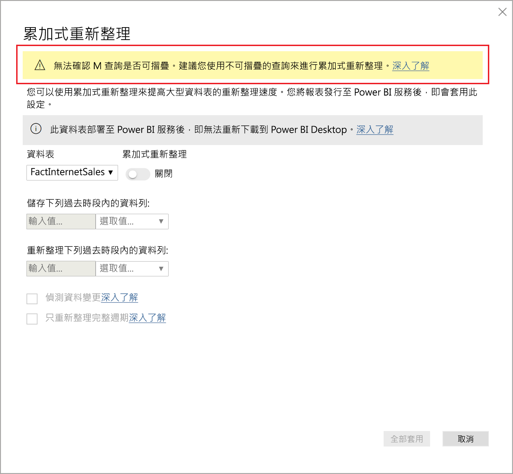
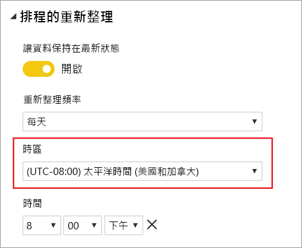
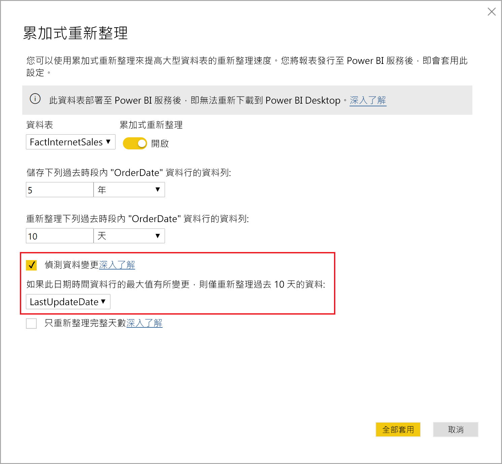
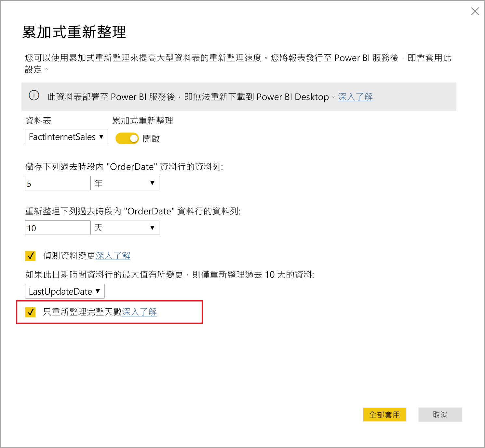

# <a name="incremental-refresh-in-power-bi"></a>Power BI 中的累加式重新整理

累加式重新整理可啟用 Power BI 中的極大型資料集，且具有下列優點：

> [!div class="checklist"]
> * **重新整理會變快** - 只需要重新整理已變更的資料。 例如，只重新整理 10 年資料集的過去 5 天。
> * **重新整理更可靠** - 不需要再維護長時間執行的連線，即可變更來源系統。
> * **減少資源耗用量** - 要重新整理的資料較少可減少記憶體和其他資源的整體耗用。

> [!NOTE]
> 累加式重新整理現在可供 Power BI Pro、Premium 及共用訂用帳戶與資料集使用。 

## <a name="configure-incremental-refresh"></a>設定累加式重新整理

累加式重新整理原則定義於 Power BI Desktop，並在發佈至 Power BI 服務時套用。


### <a name="filter-large-datasets-in-power-bi-desktop"></a>在 Power BI Desktop 中篩選大型資料集

可能有數十億個資料列的大型資料集不一定可以放入 Power BI Desktop 模型中，因為 PBIX 檔案受限於桌上型電腦上可用的記憶體資源。 這類資料集通常是在匯入時進行篩選。 不論是否使用累加式重新整理，這種類型的篩選都適用。 針對累加式重新整理，您會使用 Power Query 日期/時間參數進行篩選。

#### <a name="rangestart-and-rangeend-parameters"></a>RangeStart 和 RangeEnd 參數

針對累加式重新整理，資料集會使用 Power Query 日期/時間參數與保留的區分大小寫名稱 **RangeStart** 和 **RangeEnd** 來進行篩選。 這些參數用來篩選匯入至 Power BI Desktop 的資料，也用來在發佈至 Power BI 服務之後以動態方式將資料分割成範圍。 服務會取代參數值以篩選每個分割區。 不需要在服務中的資料集設定中進行設定。 發佈之後，Power BI 服務會自動覆寫參數值。

若要使用預設值定義參數，請在 [Power Query 編輯器] 中，選取 [管理參數]。


定義參數時，您可以選取資料行的 [自訂篩選] 功能表選項，來套用篩選。


確定已篩選資料列，其中資料行值「之後或等於」**RangeStart** 並「早於」**RangeEnd**。 其他篩選組合可能會導致重複計算資料列數目。


> [!IMPORTANT]
> 確認查詢在 **RangeStart** 或 **RangeEnd** 上具有等號 (=)，而非兩者都有。 如果這兩個參數上都存在等號 (=)，資料列可能會滿足兩個分割的條件，而導致模型中的資料重複。 例如，  
> \#"Filtered Rows" = Table.SelectRows(dbo_Fact, each [OrderDate] **>= RangeStart** and [OrderDate] **<= RangeEnd**) 可能會導致資料重複。

> [!TIP]
> 參數的資料類型必須是日期/時間時，可以將它們轉換成符合資料來源的需求。 例如，下列 Power Query 函式會轉換日期/時間值，以類似 *yyyymmdd* 格式的整數 Surrogate 索引鍵，而此格式常見於資料倉儲。 篩選步驟可以呼叫函式。
>
> `(x as datetime) => Date.Year(x)*10000 + Date.Month(x)*100 + Date.Day(x)`

從 Power Query 編輯器中，選取 [Close and Apply] \(關閉並套用\)。 您在 Power BI Desktop 中應該有資料集的子集。

#### <a name="filter-date-column-updates"></a>篩選日期資料行更新

日期資料行的篩選條件用於在 Power BI 服務中動態地將資料分割至不同範圍。 累加式重新整理設計目的並不是為了支援在來源系統中更新篩選日期資料行的案例。 更新會被解譯為插入及刪除，而不是實際的更新。 若刪除發生在歷史範圍而非累加式範圍中，系統就不會加以揀選。 這可能會因為分割區索引鍵衝突而導致資料重新整理失敗。

#### <a name="query-folding"></a>查詢摺疊

針對重新整理作業提交查詢時，務必將分割區篩選推送到來源系統。 向下推送篩選條件表示資料來源應該支援查詢摺疊功能。 大部分支援 SQL 查詢的資料來源都支援查詢摺疊， 不過，通常不支援一般檔案、Blob 和網頁摘要等資料來源。 如果資料來源後端不支援篩選條件，則其無法向下推送。 在此情況下，交互式引擎可在本機補償並套用篩選，這可能需要從資料來源擷取完整的資料集。 這會導致累加式重新整理非常緩慢，而且在使用時，該程序可能會用盡 Power BI 服務或內部部署資料閘道中的資源。

每個資料來源都有不同的查詢摺疊層級支援，因此建議執行驗證，以確認篩選條件邏輯已包含在來源查詢中。 為了簡化起見，Power BI Desktop 會嘗試為您執行這項驗證。 如果無法驗證，則定義累加式重新整理原則時會在累加式重新整理對話方塊中顯示警告。 SQL 基礎資料來源，例如 SQL、Oracle 和 Teradata 可能會依賴這項警告。 其他資料來源可能必須追蹤查詢才能驗證。 如果 Power BI Desktop 無法確認，則會顯示下列警告。 如果您看到此警告而想要檢查是否發生了必要的查詢折疊，則可使用查詢診斷功能，或追蹤來源資料庫所接收的查詢。

 

### <a name="define-the-refresh-policy"></a>定義重新整理原則

資料表的操作功能表上會有累加式重新整理，但「即時連線」模型除外。


#### <a name="incremental-refresh-dialog"></a>累加式重新整理對話方塊

即會顯示累加式重新整理對話方塊。 使用切換來啟用對話方塊。


> [!NOTE]
> 如果資料表的 Power Query 運算式未參照具有保留名稱的參數，則會停用切換。

標頭文字說明下列資訊：

- 重新整理原則定義於 Power BI Desktop 中，且由服務中的重新整理作業套用。

- 如果您可以從 Power BI 服務下載包含累加式重新整理原則的 PBIX 檔案，則無法在 Power BI Desktop 中開啟該檔案。 雖然這可能會在未來受到支援，但請記住這些資料集可能會成長到很大，因此不適合在典型桌上型電腦下載並開啟它們。

#### <a name="refresh-ranges"></a>重新整理範圍

下列範例會定義重新整理原則，用來儲存 5 個完整日曆年度的資料再加上目前年度到目前日期的資料，並以累加方式重新整理 10 天的資料。 第一次重新整理作業會載入歷程記錄資料。 後續的重新整理是累加式，且 (如果排程為每日執行) 會執行下列作業：

- 新增一天的資料。

- 重新整理 10 天到目前日期為止。

- 移除目前日期之前超過 5 年的日曆年度。 例如，如果目前日期是 2019 年 1 月 1 日，則會移除 2013 年。

Power BI 服務中的第一次重新整理可能需要較長的時間才能匯入全部 5 個完整日曆年度。 後續重新整理只需要較短的時間就能完成。


#### <a name="current-date"></a>目前日期

「目前日期」是以重新整理時的系統日期為基礎。 如果已為 Power BI 服務中的資料集啟用排程重新整理，則在判斷目前日期時，會將指定的時區納入考量。 手動叫用及排程的重新整理都會遵守時區 (如果有的話)。 例如，以指定時區在太平洋時間 (美國和加拿大) 下午 8 點發生的重新整理，將會根據太平洋時間 (而非 GMT) 來判斷目前日期。



> [!NOTE]
> 您可能只需要這些範圍的定義，在此情況下，您可以直接前往下面的發佈步驟。 其他下拉式清單是針對進階功能。

### <a name="advanced-policy-options"></a>進階原則選項

#### <a name="detect-data-changes"></a>偵測資料變更

10 天的累加式重新整理會比 5 年的完整重新整理更具效率。 不過，還可以更好。 如果您選取 [偵測資料變更] 核取方塊，則可以選取用來找出並僅重新整理資料已變更之日期的日期/時間資料行。 這假設這類資料行存在於來源系統中，這通常用於稽核用途。 **這不應該與使用 RangeStart/RangeEnd 參數來分割資料的資料行相同。** 會評估此資料行在累加式範圍之每個週期的最大值。 如果自上次重新整理後尚未進行變更，則不需要重新整理週期。 在範例中，這可能會進一步將累加式重新整理天數從 10 天減少為大約 2 天。



> [!TIP]
> 目前設計需要持續保存要偵測資料變更的資料行，並將其快取到記憶體。 建議您考慮使用下列其中一種技術，減少基數和記憶體耗用量。
>
> 僅持續保存此資料行在重新整理期間的最大值，可能是使用 Power Query 函式。
>
> 將有效位數減少到重新整理頻率需求可接受的層級。
>
> 定義自訂查詢，以使用 XMLA 端點來偵測資料變更，並避免完全保存資料行值。 如需詳細資訊，請參閱以下偵測資料變更的自訂查詢。

#### <a name="only-refresh-complete-periods"></a>只重新整理完整週期

假設您的重新整理排定在每天早上上午 4:00 執行。 如果資料在這 4 小時期間出現在來源系統中，您可能不想要考量它。 某些商務計量 (例如石油和天然氣業的每日桶數) 對於半天不具任何意義。

另一個範例是重新整理財務系統中的資料，而在財務系統中，會在該月的第 12 個日曆日期核准上個月的資料。 您可以將累加式範圍設定為 1 個月，並排定在該月的第 12 天執行重新整理。 舉例來說，核取此選項，即會在 2 月 12 日重新整理 1 月資料。



> [!NOTE]
> 服務中的重新整理作業會在 UTC 時間下執行。 這可以判斷有效日期並影響完整週期。 我們計劃新增覆寫重新整理作業有效日期的能力。

## <a name="publish-to-the-service"></a>發佈至服務

您現在可以重新整理模型。 第一次重新整理可能需要較長的時間才能匯入歷程資料。 後續重新整理可能更快，因為它們使用累加式重新整理。

## <a name="query-timeouts"></a>查詢逾時

[針對重新整理疑難排解](../connect-data/refresh-troubleshooting-refresh-scenarios.md)一文說明 Power BI 服務中的重新整理作業受限於逾時。 查詢也受限於資料來源的預設逾時。 大多數關聯式來源都允許覆寫 M 運算式中的逾時。 例如，下列運算式使用 [SQL Server 資料存取功能](https://docs.microsoft.com/powerquery-m/sql-database)將它設定為 2 小時。 原則範圍所定義的每個週期都會提交查詢，以觀察命令逾時設定。

```powerquery-m
let
    Source = Sql.Database("myserver.database.windows.net", "AdventureWorks", [CommandTimeout=#duration(0, 2, 0, 0)]),
    dbo_Fact = Source{[Schema="dbo",Item="FactInternetSales"]}[Data],
    #"Filtered Rows" = Table.SelectRows(dbo_Fact, each [OrderDate] >= RangeStart and [OrderDate] < RangeEnd)
in
    #"Filtered Rows"
```

## <a name="xmla-endpoint-benefits-for-incremental-refresh"></a>累加式重新整理的 XMLA 端點優點

Premium 容量中資料集的 [XMLA 端點](service-premium-connect-tools.md)可以啟用讀寫作業，這可為累加式重新整理提供相當大的好處。 透過 XMLA 端點進行的重新整理作業不限於[每天 48 次重新整理](../connect-data/refresh-data.md#data-refresh)，而且不會強制執行[排程重新整理逾時](../connect-data/refresh-troubleshooting-refresh-scenarios.md#scheduled-refresh-timeout)，這在累加式重新整理案例中相當有用。

### <a name="refresh-management-with-sql-server-management-studio-ssms"></a>使用 SQL Server Management Studio (SSMS) 的重新整理管理

在啟用 XMLA 端點讀寫功能的情況下，可以使用 SSMS 來檢視和管理累加式重新整理原則應用程式所產生的資料分割。 例如，這可讓您重新整理不在累加式範圍中的特定歷程記錄資料分割，以執行回溯日期更新，而不需要重新整理所有歷程記錄資料。 您也可以使用 SSMS，以批次累加的方式新增/重新整理歷程記錄資料分割，以載入非常大型資料集的歷程記錄資料。


#### <a name="override-incremental-refresh-behavior"></a>覆寫累加式重新整理行為

使用 SSMS，您也可以更充分地控制如何使用[表格式模型指令碼語言 (TMSL)](https://docs.microsoft.com/analysis-services/tmsl/tabular-model-scripting-language-tmsl-reference?view=power-bi-premium-current) (部分機器翻譯) 和[表格式物件模型 (TOM)](https://docs.microsoft.com/analysis-services/tom/introduction-to-the-tabular-object-model-tom-in-analysis-services-amo?view=power-bi-premium-current) (部分機器翻譯)，叫用累加式重新整理。 例如，在 SSMS 的「物件總管」中，以滑鼠右鍵按一下資料表，然後選取 [處理資料表] 功能表選項。 然後按一下 [指令碼] 按鈕，以產生 TMSL 重新整理命令。

![[處理資料表] 對話方塊中的 [指令碼] 按鈕](media/service-premium-incremental-refresh/ssms-process-table.png)

下列參數可以插入 TMSL 重新整理命令，以覆寫預設的累加式重新整理行為。

- **applyRefreshPolicy** - 如果資料表已定義累加式重新整理原則，applyRefreshPolicy 會判斷是否已套用此原則。 如果未套用此原則，則處理完整作業會將資料分割定義保留不變，而且會完整重新整理資料表中的所有資料分割。 預設值為 true。

- **effectiveDate** - 如果套用累加式重新整理原則，其必須知道目前的日期，以判斷歷程記錄範圍和累加式範圍的滾動時段範圍。 effectiveDate 參數可讓您覆寫目前的日期。 這適用於測試、示範和商務案例，其中資料會以累加方式重新整理至過去或未來的日期 (例如，未來的預算)。 預設值是[目前日期](#current-date)。

```json
{ 
  "refresh": {
    "type": "full",

    "applyRefreshPolicy": true,
    "effectiveDate": "12/31/2013",

    "objects": [
      {
        "database": "IR_AdventureWorks", 
        "table": "FactInternetSales" 
      }
    ]
  }
}
```

### <a name="custom-queries-for-detect-data-changes"></a>偵測資料變更的自訂查詢

您可以使用 TMSL 和/或 TOM 來覆寫偵測到的資料變更行為。 這不僅可以用來避免保存記憶體內部快取中的最後更新資料行，也可以啟用由 ETL 程序備妥設定/指令資料表的案例，以便只標記需要重新整理的資料分割。 這樣會建立更有效率的累加式重新整理程序，不論是多久前進行過資料更新，都只會重新整理所需的期間。

pollingExpression 的目標是輕量 M 運算式或另一個 M 查詢的名稱。 其必須傳回純量值，而且會針對每個資料分割執行。 如果傳回的值與上次累加式重新整理的值不同，則會將資料分割標示為完整處理。

下列範例涵蓋回溯日期變更的歷程記錄範圍中所有 120 個月。 指定 120 個月而不是 10 年，表示資料壓縮可能不會相當有效率，但是可避免必須重新整理整個歷程記錄年份，當一個月份就足以進行回溯日期變更時，這樣會更耗費資源。

```json
"refreshPolicy": {
    "policyType": "basic",
    "rollingWindowGranularity": "month",
    "rollingWindowPeriods": 120,
    "incrementalGranularity": "month",
    "incrementalPeriods": 120,
    "pollingExpression": "<M expression or name of custom polling query>",
    "sourceExpression": [
    "let ..."
    ]
}
```

## <a name="metadata-only-deployment"></a>僅限中繼資料部署

從 Power BI Desktop 將新版本 .PBIX 檔案發佈至 Power BI 服務中的工作區時，如果已存在相同名稱的資料集，系統會提示您取代現有的資料集。


在某些情況下，您可能不想要取代資料集，特別是累加式重新整理。 Power BI Desktop 中的資料集可能會比服務中的資料集小很多。 如果服務中的資料集已套用累加式重新整理原則，則在資料集被取代時，可能會遺失數年的歷程記錄資料。 重新整理所有歷程記錄資料可能需要數小時的時間，並且導致使用者的系統停機時間。

相反地，最好是執行僅限中繼資料部署。 這樣可讓您部署新的物件，而不會遺失歷程記錄資料。 例如，如果您已新增幾個量值，則可以只部署新的量值，而不需要重新整理資料，節省大量時間。

當設定為讀寫時，XMLA 端點會提供與執行此動作工具的相容性。 例如，ALM 工具組是用於 Power BI 資料集的結構描述 diff 工具，而且只能用來執行中繼資料的部署。

從 [Analysis Services Git 存放庫](https://github.com/microsoft/Analysis-Services/releases) (英文) 下載並安裝最新版本的 ALM 工具組。 您可以透過 [說明] 功能區取得文件連結和可支援性的資訊。 若要執行僅限中繼資料部署，請執行比較並選取執行中 Power BI Desktop 執行個體作為來源，以及選取服務中現有的資料集作為目標。 請考量顯示的差異，並略過具有累加式重新整理資料分割的資料表更新，或使用 [選項] 對話方塊來保留資料表更新的資料分割。 驗證選取範圍，以確保目標模型的完整性，然後更新。


## <a name="see-also"></a>另請參閱

[與 XMLA 端點的資料集連線能力](service-premium-connect-tools.md)   
[對重新整理進行疑難排解的案例](../connect-data/refresh-troubleshooting-refresh-scenarios.md)   
