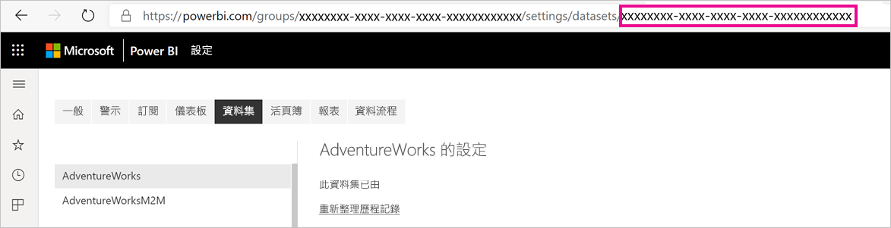
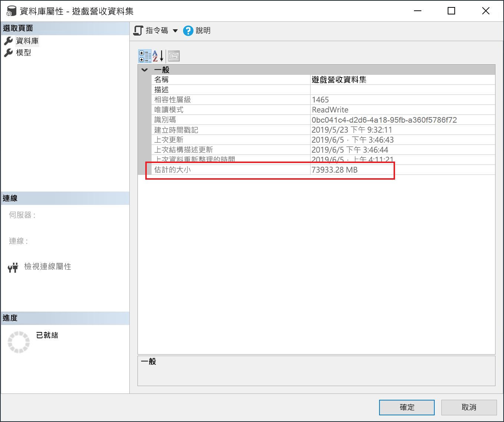

# <a name="large-datasets-in-power-bi-premium"></a>Power BI Premium 中的大型資料集

Power BI 資料集可將資料儲存在高度壓縮的記憶體內部快取中，以獲得最佳化的查詢效能，讓使用者能夠快速互動。 使用 Premium 容量時，您可以使用 **大型資料集儲存格式** 設定來啟用超過預設限制的大型資料集。 啟用時，資料集大小會受限於 Premium「容量」大小或系統管理員所設定的大小上限。

您可為所有 Premium P SKU 和 Embedded A SKU 啟用大型資料集。 Premium 的大型資料集大小限制，相當於 Azure Analysis Services 的資料模型大小限制。

除了需要有大型資料集儲存格式才能讓資料集成長到超過 10 GB 之外，啟用此設定還有其他優點。 如果打算使用 XMLA 端點型工具進行資料集寫入作業，請務必啟用此設定，即使是對不一定描述為「大型」資料集的資料集也一樣。 啟用時，大型資料集儲存格式可提升 XMLA 寫入作業效能。

服務中的大型資料集不會影響 Power BI Desktop 模型上傳大小 (仍限制為 10 GB)。 相反地，在重新整理時，資料集的成長可能會超出服務的限制。

> [!IMPORTANT]
> Power BI Premium 支援大型資料集。 啟用 **大型資料集儲存格式** 選項，以在 Power BI Premium 中使用大於預設限制的資料集。 


## <a name="enable-large-datasets"></a>啟用大型資料集

此處步驟描述如何為發佈至服務的新模型啟用大型資料集。 針對現有的資料集，只需要步驟 3。

1. 在 Power BI Desktop 中建立模型。 如果資料集變得越來越大，且耗用越來越多記憶體，請務必設定[累加式重新整理](service-premium-incremental-refresh.md)。

1. 將模型當作資料集發佈至服務。

1. 在 [服務] > [資料集] > [設定] 中，展開 [大型資料集儲存格式]，按一下滑桿至 [開啟]，然後按一下 [套用]。

    :::image type="content" source="media/service-premium-large-models/enable-large-dataset.png" alt-text="啟用大型資料集滑桿":::

1. 根據累加式重新整理原則，叫用重新整理來載入歷程記錄資料。 第一次重新整理可能需要一段時間來載入歷程記錄。 後續的重新整理應該會更快，視累加式重新整理原則而定。

## <a name="set-default-storage-format"></a>設定預設儲存格式

在指派給 Premium 容量的工作區中所建立所有新資料集，預設都會啟用大型資料集儲存格式。

1. 在工作區中，按一下 [設定] > [Premium]。

1. 在 [預設儲存格式] 中，選取 [大型資料集儲存格式]，然後按一下 [儲存]。

    :::image type="content" source="media/service-premium-large-models/default-storage-format.png" alt-text="啟用預設儲存格式":::

### <a name="enable-with-powershell"></a>使用 PowerShell 啟用

您也可以使用 PowerShell 來啟用大型資料集儲存格式。 您必須擁有容量管理員和工作區管理員的權限，才能執行 PowerShell Cmdlet。

1. 尋找資料集識別碼 (GUID)。 在工作區的 [資料集]  索引標籤的 資料集設定下，可以在 URL 中看到識別碼。

    

1. 在 PowerShell 管理提示中安裝 [MicrosoftPowerBIMgmt](/powershell/module/microsoftpowerbimgmt.data/) 模組。

    ```powershell
    Install-Module -Name MicrosoftPowerBIMgmt
    ```

1. 執行下列 Cmdlet 來登入及檢查資料集儲存模式。

    ```powershell
    Login-PowerBIServiceAccount

    (Get-PowerBIDataset -Scope Organization -Id <Dataset ID> -Include actualStorage).ActualStorage
    ```

    回應應該如下。 儲存模式是 ABF (Analysis Services 備份檔案)，這是預設值。

    ```
    Id                   StorageMode

    --                   -----------

    <Dataset ID>         Abf
    ```

1. 執行下列 Cmdlet 以設定儲存模式。 轉換成 Premium 檔案可能需要幾秒鐘的時間。

    ```powershell
    Set-PowerBIDataset -Id <Dataset ID> -TargetStorageMode PremiumFiles

    (Get-PowerBIDataset -Scope Organization -Id <Dataset ID> -Include actualStorage).ActualStorage
    ```

    回應應該如下。 儲存模式現在已設定為 Premium 檔案。

    ```
    Id                   StorageMode
    
    --                   -----------
    
    <Dataset ID>         PremiumFiles
    ```

您可以使用 [Get-PowerBIWorkspaceMigrationStatus](/powershell/module/microsoftpowerbimgmt.workspaces/get-powerbiworkspacemigrationstatus) Cmdlet 來檢查資料集與 Premium 檔案之間轉換的狀態。

## <a name="dataset-eviction"></a>資料集收回

Power BI 使用動態記憶體管理，從記憶體收回非使用中的資料集。 Power BI 收回資料集，讓它可以載入其他資料集來處理使用者查詢。 動態記憶體管理可讓資料集大小的總和明顯大於容量上可用的記憶體，但是單一資料集必須能放入記憶體中。 如需動態記憶體管理的詳細資訊，請參閱[容量的運作方式](service-premium-what-is.md#how-capacities-function)。

您應該考慮收回對大型模型的影響。 雖然資料集載入時間相當快速，但如果必須等候大量收回的資料集重載，可能還是會有明顯的延遲。 基於這個理由，以大型模型功能目前的形式來說，建議主要用於企業 BI 需求專用的容量，而不是混合了自助 BI 需求的容量。 企業 BI 需求專用的容量比較不會經常觸發收回而需要重載資料集。 另一方面，自助 BI 的容量可能會有許多較常載入和進出記憶體的小型資料集。

## <a name="checking-dataset-size"></a>查看資料集大小

載入歷程記錄資料之後，您可以使用 [SSMS](/sql/ssms/download-sql-server-management-studio-ssms) 透過 [XMLA 端點](service-premium-connect-tools.md)，在模型屬性視窗中查看估計的資料集大小。



您也可以從 SSMS 執行下列 DMV 查詢，以查看資料集大小。 加總輸出中的 DICTIONARY\_SIZE 和 USED\_SIZE 資料行，查看資料集的位元組大小。

```sql
SELECT * FROM SYSTEMRESTRICTSCHEMA
($System.DISCOVER_STORAGE_TABLE_COLUMNS,
 [DATABASE_NAME] = '<Dataset Name>') //Sum DICTIONARY_SIZE (bytes)

SELECT * FROM SYSTEMRESTRICTSCHEMA
($System.DISCOVER_STORAGE_TABLE_COLUMN_SEGMENTS,
 [DATABASE_NAME] = '<Dataset Name>') //Sum USED_SIZE (bytes)
```

## <a name="limitations-and-considerations"></a>限制與考量

使用大型資料集時，請記住下列限制：

- **需要新的工作區**：大型資料集僅適用於 [新的工作區](../collaborate-share/service-create-the-new-workspaces.md)。

- **下載至 Power BI Desktop**：如果資料集儲存在 Premium 檔案上，[下載為 .pbix](../create-reports/service-export-to-pbix.md) 檔案將會失敗。
- **支援的區域**：大型資料集在支援進階檔案儲存體的所有 Azure 區域中受到支援。 若要深入了解，請參閱[依區域提供的產品](https://azure.microsoft.com/global-infrastructure/services/?products=storage)，並參閱下一節中的表格。

- **設定資料集大小上限**：系統管理員可以設定資料集大小上限。 最大值可在 0.1 GB 到 SKU 的最大容量之間加以設定。

## <a name="region-availability"></a>區域可用性

Power BI 中大型資料集僅適用於支援 [Azure Premium 檔案儲存體](/azure/storage/files/storage-files-planning#storage-tiers)的特定 Azure 區域。

下列清單提供可在 Power BI 中使用大型資料集的區域。 大型模型不支援下列清單中的區域：

|Azure 區域  |Azure 區域縮寫  |
|---------|---------|
|澳大利亞東部     | australiaeast        |
|澳大利亞東南部     | australiasoutheast        |
|加拿大東部     | canadaeast        |
|加拿大中部     | canadacentral        |
|印度中部     | centralindia        |
|美國中部     | centralus        |
|東亞     | eastasia        |
|美國東部     | eastus        |
|美國東部 2     | eastus2        |
|日本東部     | japaneast        |
|日本西部     | japanwest        |
|南韓中部     | koreacentral        |
|南韓南部     | koreasouth        |
|美國中北部     | northcentralus        |
|北歐     | northeurope        |
|美國中南部     | southcentralus        |
|東南亞     | southeastasia        |
|英國南部     | uksouth        |
|英國西部     | ukwest        |
|西歐     | westeurope        |
|印度西部     | westindia        |
|美國西部     | westus        |
|美國西部 2     | westus2        |

## <a name="next-steps"></a>後續步驟

下列連結提供的資訊有助於處理大型模型：

* [Azure Premium 檔案儲存體](/azure/storage/files/storage-files-planning#storage-tiers) \(部分機器翻譯\)
* [設定 Power BI Premium 的多地理位置支援](service-admin-premium-multi-geo.md)
* [攜帶您自己的加密金鑰以用於 Power BI](service-encryption-byok.md)
* [容量的運作方式](service-premium-what-is.md#how-capacities-function)
* [累加式重新整理](service-premium-incremental-refresh.md)。

Power BI 已推出 Power BI Premium Gen2 作為預覽供應項目，其能透過對下列領域的改進來改善 Power BI Premium 體驗：
* 效能
* 個別使用者授權
* 範圍更大的擴縮
* 改善的計量
* 自動調整
* 降低管理負擔

如需 Power BI Premium Gen2 的詳細資訊，請參閱 [Power BI Premium 第 2 代 (預覽)](service-premium-what-is.md#power-bi-premium-generation-2-preview)。
