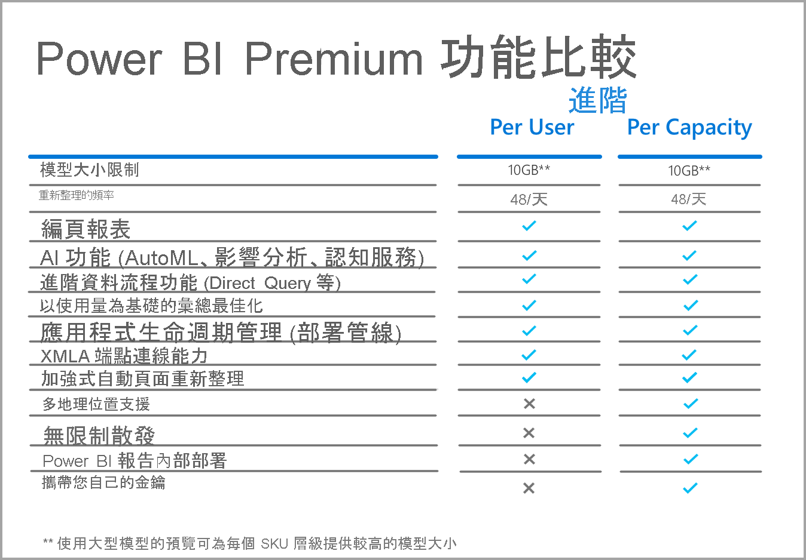
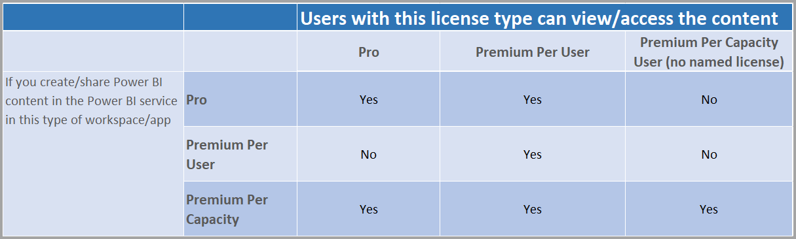

# Power BI Premium Per User 常見問題集 (預覽)

Power BI **Premium Per User** 可讓組織以個別使用者為基礎對 Premium 功能進行授權。 Premium Per User (PPU) 包含所有 Power BI Pro 授權功能，同時加入如編頁報表、AI 與其他僅供 Premium 訂閱者使用的功能。 

此文章提供關於 Premium Per User 授權之常見問題的解答。 隨著 Premium Per User 完成其預覽階段並進入正式發行 (GA) 階段，此文章中的所有資訊都可能會變更及精簡。 

此文章將問題與解答分成下列類別：
* 一般問題 
* 系統管理問題 
* 使用者體驗問題 

## 一般問題

1.  **什麼是 Premium Per User (PPU)？** 

    Premium Per User (PPU) 是以個別使用者為基礎對 Premium 功能進行授權的新方式。 其包含所有的 Power BI Pro 授權功能，以及如編頁報表、AI 與其他目前僅於 Premium 中提供的功能。

2.  **其何時才可供購買？**

    開發仍在進行中，且我們預期 PPU 至少要到 2021 才會進入 GA 階段。 在正式發行之前，公開預覽將可供所有組織免費使用。

3.  **我是否同時需要 Power BI Pro 與 Premium Per User 授權？**

    否，您可以透過 Premium Per User 授權取得 Power BI Pro 的所有功能。

4.  **如何取得試用版？**

    目前有產品內試用體驗，以及透過 Microsoft 365 提供的試用體驗。 在組織未限制 PPU 的情況下，任何使用者都可以針對工作區開啟 Premium Per User 來存取產品內試用體驗。 透過 Microsoft 365 的試用體驗可以透過入口網站啟用，和目前 Power BI Pro 試用的起始方式相同。  

5.  **Premium Per User 中提供那些功能？**

    功能比較方格如下所示：    

    

6.  **我的組織已經有 Power BI Premium。我是否需要 Premium Per User 授權才能將內容發佈到我的容量？**
    
    您的組織可以選擇使用 Premium Per User 授權來補充其 Premium 容量，但是並不需要 Premium Per User 來將內容發佈到現有的容量。  

## 系統管理問題

1.  **我要如何為租用戶啟用 Premium Per User (PPU)？**
    
    在為租用戶佈建 PPU 的授權之後，便可在開啟 PPU 功能的任何工作區中加以使用。 針對預覽，請直接在容量下拉式清單中選取 Premium Per User 項目來啟用 Premium Per User 功能，如下圖所示。

    

2.  **此功能的運作方式是否如同 Premium 容量？是否可以將功能開啟/關閉？**

    否，PPU 並沒有任何記憶體或 CPU 上的管理；就那一方面來說，其運作方式與目前的 Power BI Pro 相同。 您的租用戶管理員可以管理特定的功能設定，但他們無法停用編頁報表之類的工作負載，就像您目前不能關閉儀表板一樣。 

3.  **我要在哪裡管理已公開的 Premium Per User 設定？**

    Premium Per User 租用戶設定中的新功能表選項可讓管理員管理那些設定。

4.  **我是否可以限制有哪些使用者可以建立 PPU 工作區？**

    是，其方法與您目前限制有哪些使用者可以建立工作區的方式相同。

5.  **租用戶管理員是否可以看見有哪些工作區已標示為 Premium Per User？**

    是，這些工作區會在租用戶管理員畫面中的工作區功能表項目中顯示，其位置與向您顯示有哪些工作區已標示為 Premium 的位置相同。

6.  **我是否可以在 Premium Per User 與 Premium 容量之間移動工作區？**

    是。 針對正式發行 (GA)，在您將工作區移回 Premium 容量之後，就必須對位於該工作區中的所有資料集或資料流程執行完整的重新整理。 此需求能防止公司透過濫用手段來嘗試避開 Premium Gen2 的 CPU 收費機制。

7.  **容量 API 是否可供 Premium Per User 使用？**

    有一組有限的 API 可供用來移動工作區，但您無法進行如關閉工作負載之類的活動。  

## 使用者體驗問題

1.  **如果我已將工作區標示為 Premium Per User，其他使用者要如何知道這點？**
    
    已推出新的圖示以顯示有哪些工作區是 Premium Per User，如下圖所示：

        

2.  **有誰可以存取 Premium Per User 工作區/應用程式中的內容？**

    使用者必須具有 Premium Per User 授權，才能檢視 Premium Per User 工作區中的內容。 這包含使用者透過 XMLA 端點、在 Excel 中進行分析、複合模型等來存取內容的案例。 您可以將工作區的權限授與尚未有 PPU 授權的使用者，但他們將會收到指出其無法存取內容的訊息。 若該使用者符合資格的話，系統將會提示他們使用試用授權。 如果他們不符合資格，便需要由其租用戶管理員指派授權。

3.  **在共用內容之後，具有哪些授權類型的人員可以看到哪些內容？**

    下表描述在使用 PPU 時，哪些人可以看到哪些類型的內容：

       

4.  **我是否可以針對內嵌使用案例使用 Premium Per User？**

    Premium Per User 的運作方式，與您使用 Pro 授權時的內嵌使用案例運作方式相同。 您可以內嵌內容，且所有使用者都需要 PPU 授權才能加以檢視。

5.  **在我的試用版到期之後，我的 PPU 工作區會發生什麼事？**

    使用者仍然可以存取該工作區，但是需要該授權類型的內容將無法使用。 您必須將工作區移至 Premium 容量，或是直接將該需求關閉。 
6.  **Premium Per User 所提供的總儲存體為何？**

    就儲存體而言，整個租用戶將會有與 Premium 容量相同的 100 TB 限制。

7.  **匯出 API 是否可供 Premium Per User 使用？**

    此 API 目前可供編頁報表使用，並具有每 5 分鐘呼叫一次的限制。  目前不支援 Power BI 報表。  

8.  **PPU 中的電子郵件訂用帳戶會如何運作？**

    具有 PPU 授權或 Pro 授權的任何人都可以接收訂用帳戶，以及其所包含的任何附件，前提是所有使用者的附件皆相同。 Pro 使用者將無法在產品入口網站中檢視內容。 如果於未來推出允許針對不同收件者提供不同資料檢視的其他訂用帳戶功能，將會要求 PPU 授權 (或 Premium 容量) 以使用那些功能。

9.  **我是否可以使用重新整理 API 來超過透過入口網站的 48 次重新整理限制？**

    重新整理目前並沒有限制。  

10. **我是否可以使用 Power BI Premium 容量計量應用程式來監視 Premium Per User 使用量？**

    Power BI Premium 容量計量應用程式並無法在 Premium Gen2 中運作，因此無法讓您檢視任何 PPU 項目。  

11. **我是否可以將 Power BI 資料集裝載到 PPU 工作區、對其建置報表、在非 PPU 工作區中發佈，然後讓使用者在不需要 PPU 授權的情況下存取此報表？**

    否。 由於資料集是存在於 Premium Per User 工作區中，因此沒有授權的使用者將無法加以檢視，即使他們可以在非 PPU 工作區中存取該報表也一樣。

12. **我是否可以同時重新整理多個 10 GB 資料模型？**

    您會受限於與 Premium Gen2 中針對平行重新整理所強制的相同限制。

13. **我是否可以透過 [發行至 Web] 來共用裝載在 Premium Per User 中的內容？**

    [發行至 Web] 的運作方式會與其目前搭配裝載在 Premium 容量中之內容時的運作方式相同。

14. **我是否可以讓某個資料流程在 Premium Per User 工作區中執行、將其匯入位於另一個工作區中的 Power BI 資料集，來使取用該內容的使用者不需要擁有 Premium Per User 授權？**

    只要 Power BI 報表作者具有 Premium Per User 授權，這在 PPU 預覽期間是可行的。

15. **我是否可以搭配 Premium Per User 使用 Power BI 行動應用程式？**

    是，Power BI 行動應用程式已經更新，以搭配發佈至 Premium Per User 應用程式或工作區的任何內容運作。

**後續步驟**

* [什麼是 Power BI Premium？](service-premium-what-is.md)
* [Microsoft Power BI Premium 白皮書](https://aka.ms/pbipremiumwhitepaper)
* [Planning a Power BI Enterprise Deployment (規劃 Power BI 企業部署) 技術白皮書](https://aka.ms/pbienterprisedeploy)
* [Pro 延長試用版啟用](../fundamentals/service-self-service-signup-for-power-bi.md)
* [Power BI Embedded 常見問題集](../developer/embedded/embedded-faq.md)

有其他問題嗎？ [嘗試在 Power BI 社群提問](https://community.powerbi.com/)
