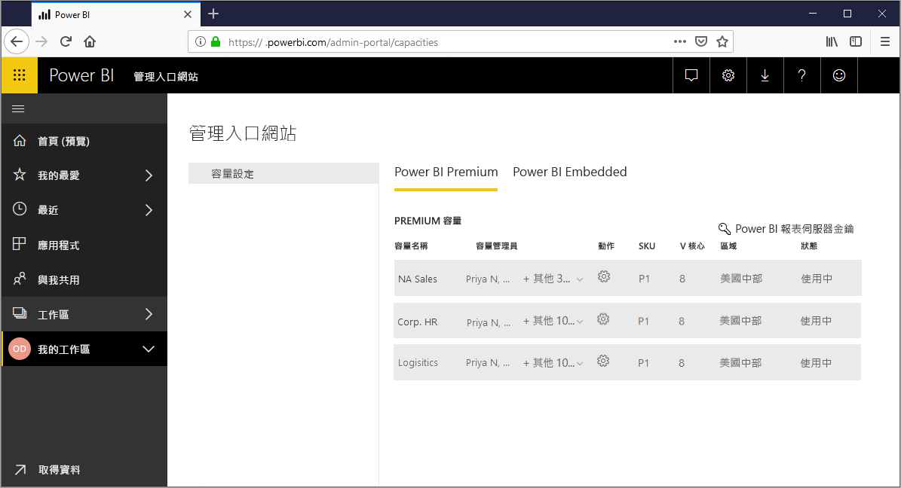
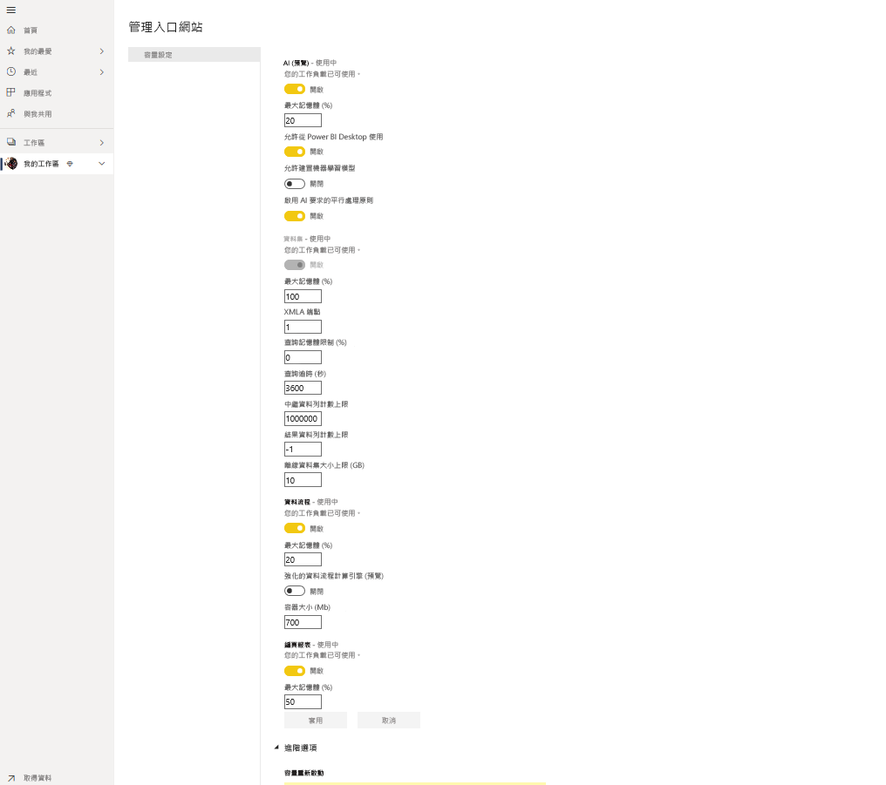
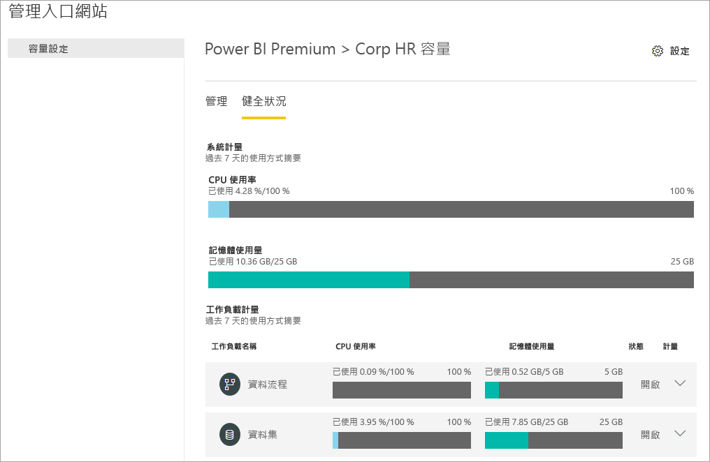
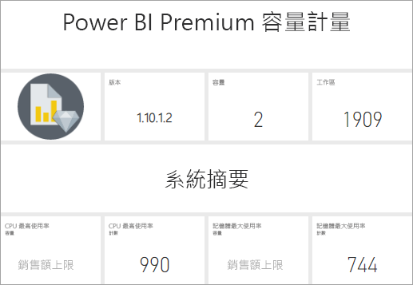
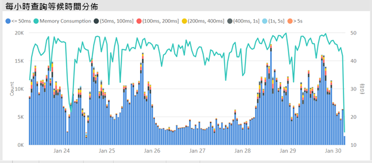
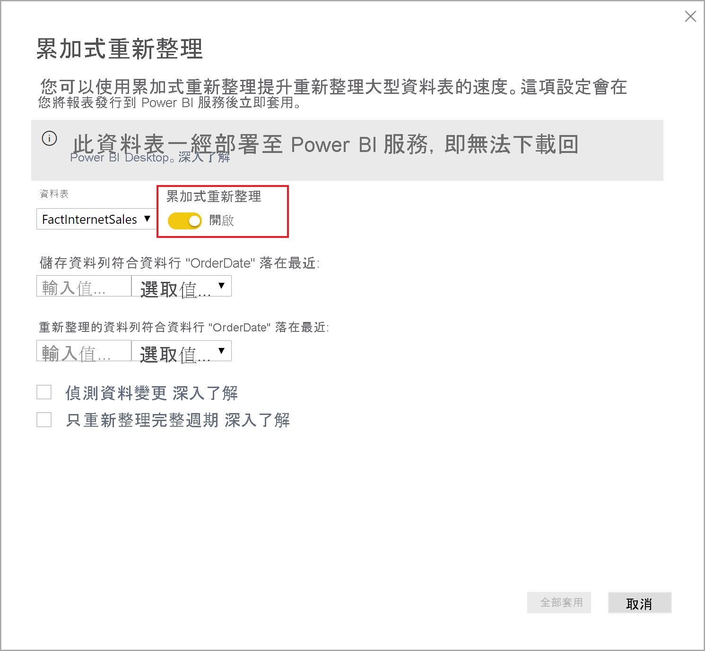
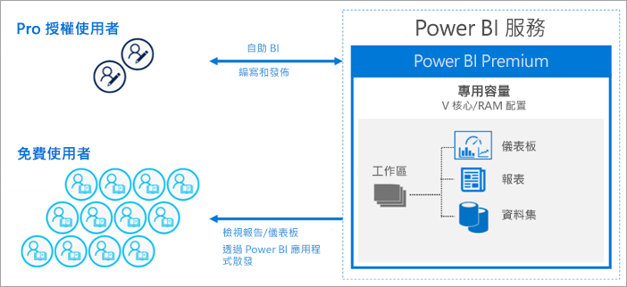
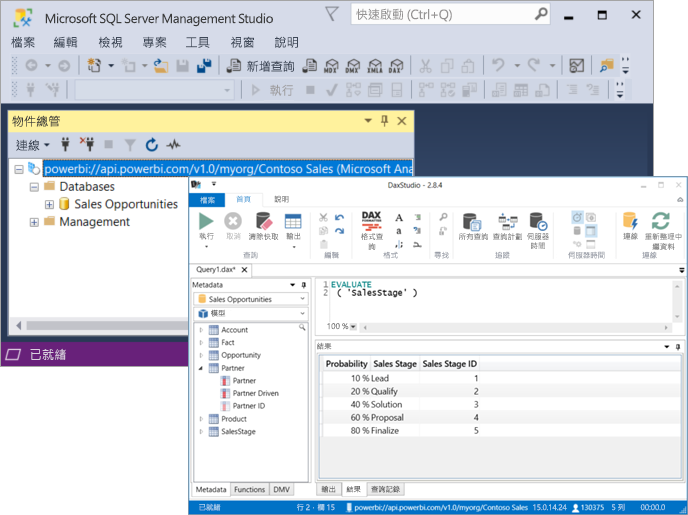

# 什麼是 Power BI Premium？

您可以使用 Power BI Premium 來存取只在 Premium 中提供的功能 (Feature) 和功能 (Capability)，並為組織中的 Power BI 內容提供更大的規模與更好的效能。 Power BI Premium 能讓組織中更多的使用者以更佳的效能和回應性充分利用 Power BI。 例如，使用 Power BI Premium，您和組織的使用者即可取得下列功能：

> [!div class="checklist"]
> * 針對 Power BI 報表取得更大的規模與更好的效能
> * 依容量授權的彈性
> * 業界最佳的資料視覺效果和見解擷取功能，例如 AI 驅動的分析、可組合且可重複使用的資料流程，以及編頁報表
> * 將自助和企業 BI 與支援較繁重的工作負載且需要企業規模的各種 Premium 專屬功能整合
> * 內建授權，以使用 Power BI 報表伺服器來擴充內部部署 BI
> * 支援依區域 (多地理位置) 的資料落地，以及針對待用資料支援客戶管理的加密金鑰 (BYOK)
> * 能夠與任何人 (甚至是組織外部) 共用 Power BI 內容，而不需購買個別使用者授權

 

本文會介紹 Power BI Premium 中的重要功能。 如有需要，請連結到提供更詳細資訊的其他文章。 如需 Power BI Pro 與 Power BI Premium 的詳細資訊，請參閱 [Power BI 定價](https://powerbi.microsoft.com/pricing/)的「Power BI 功能比較」一節。

## Power BI Premium 第 2 代 (預覽)

Power BI Premium 最近已發行新版本的 Power BI Premium，**Power BI Premium 第 2 代**，簡稱 **Premium Gen2**。 Premium Gen2 目前處於預覽狀態，可供 Premium 訂閱者在預覽期間使用。 您可以選擇使用 Premium 的原始版本，或是切換以使用 Premium Gen2。 您只能針對 Premium 容量使用這兩者其中之一。 

Premium Gen2 提供下列更新或改進的體驗：

* 除了依容量，還能夠透過 **Premium Per User**，為個別使用者提供 Premium 授權。

* 無論容量大小或時段為何，皆獲得強化的 **效能**：Premium Gen2 上分析作業的執行速度已提高 16 倍。 作業將一律以最快速度執行，且不會在容量上的負載接近容量限制時變慢。

* **更大的規模**：
    * 重新整理並行「沒有任何限制」，因此您不再需要追蹤在容量上重新整理之資料集的排程
    * 較少的記憶體限制
    * 將報表互動和排程的重新整理完全分隔開來

* **改善的計量**，其具有清楚且正規化的容量使用率資料，且只取決於容量執行分析作業時的複雜度，而非容量大小、執行分析時系統的負載層級，或其他因素。 透過改善的計量，內建報告可清楚顯示使用率分析、預算規劃、退款，以及升級需求。 改善的計量將在預覽期間開放使用並增強。

* **自動調整** 允許在容量上負載超過其限制的 24 小時期間內「自動新增」一個虛擬核心，以防止因多載所造成的速度變慢。 偵測到閒置時間時，系統即會自動移除虛擬核心。 額外的虛擬核心會以隨用隨付的方式，向您的 Azure 訂用帳戶收費。 預覽期間將會提供自動調整。 

* 透過關於容量使用率層級及負載增加的可設定主動管理通知，藉此 **降低管理負擔**。

### 使用 Premium Gen2

啟用 Premium Gen2 以利用其更新。 若要啟用 Premium Gen2，請採取下列步驟：

1. 在管理入口網站中，瀏覽至 [容量設定]。
2. 選取 [Power BI Premium]。
3. 標題為 [Premium Generation 2 (preview)] \(Premium 第 2 代 (預覽)\) 的區段隨即顯示，且該區段中具有啟用 Premium 第 2 代 (預覽) 的滑桿。 
4. 將滑桿移至 [已啟用]。

下圖顯示如何啟用 Premium Gen2。 

 

### Premium Gen2 中的已知限制

下列已知限制目前適用於 Premium Gen2：

1.    計量應用程式中無法追蹤 Premium Gen2 容量使用率。

2.    在管理入口網站的 [Premium Gen2 容量] 設定頁面中，尚未顯示適用於特定工作負載的 Premium Gen2 容量設定。 若要變更設定，請將容量轉換成 Premium 的原始版本，變更設定，然後再次將容量設定為使用 Premium Gen2。 記憶體配置設定不適用於 Premium Gen2 容量。

3.  如果您在 Premium Gen2 上使用 XMLA，請確定您使用的是最新版本的[資料模型化和管理工具](service-premium-connect-tools.md#data-modeling-and-management-tools)。 

4.  只有最新的用戶端程式庫才支援 Premium Gen2 中 Analysis 服務功能。 支援這項需求的相依工具其預估發行日期如下：

    |工具|需要的最低版本|預估發行日期|
    |---|---|---|
    |SQL Server Management Studio (SSMS)|18.8|2020 年 12 月 8 日|
    |SQL Server Data Tools (SSDT)|2.9.15|2020 年 11 月 30 日正式推出|
    | AS PowerShell| 高於 21.1.18229|2020 年 11 月 26 日|

## 訂閱和授權

Power BI Premium 是可供兩個 SKU (庫存單位) 系列使用的租用戶層級 Microsoft 365 訂閱：

- **P** SKU (P1-P5) 用於內嵌和企業功能、需要每月或年度履約承諾、按月計費，且包含在內部部署安裝 Power BI 報表伺服器的授權。

- **EM** SKU (EM1-EM3) 用於「組織」內嵌、需要年度履約承諾，且按月計費。 EM1 和 EM2 SKU 只能透過大量授權方案提供。 您無法直接購買。

### Premium Gen2 (預覽) 的更新
Premium Gen2 目前僅供作為 **P** 與 **EM** SKU 的完全支援預覽功能。 **A** SKU 容量尚未提供 Premium Gen2 預覽更新所引進的所有額外權益。

### 購買

Power BI Premium 訂閱是由管理員在 Microsoft 365 系統管理中心購買。 具體而言，只有全域管理員或計費管理員可以購買 SKU。 購買時，租用戶會收到指派給容量的對應 V 核心數目，稱為「V 核心共用」。 例如，購買 P3 SKU 可提供租用戶 32 個 V 核心。 若要深入了解，請參閱[如何購買 Power BI Premium](service-admin-premium-purchase.md)。

#### Power BI Premium Per User (預覽)

Power BI **Premium Per User** 可讓組織以個別使用者為基礎，對 Premium 功能進行授權。 Premium Per User (PPU) 包含所有 Power BI Pro 授權功能，並新增如編頁報表、AI 與其他僅供 Premium 訂閱者使用的功能。 Premium Per User 目前為預覽狀態。 如需有關 Premium Per User 的詳細資訊，包括功能比較及關於其預覽版本的其他資訊，請參閱 [Power BI Premium Per User 常見問題集 (預覽)](service-premium-per-user-faq.md) 一文。 

## 保留容量

透過 Power BI Premium，您可以取得「保留容量」。 相對於共用容量 (其中工作負載的分析處理會在與其他客戶共用的計算資源上執行)，保留容量僅供組織使用。 其會與保留計算資源一起隔離，以便為裝載的內容提供可靠且一致的效能。 請注意，下列 Power BI 內容類型的處理會儲存於共用容量中，而非保留容量中：

* Excel 活頁簿 (除非資料先匯入 Power BI Desktop)
* [推送資料集](/rest/api/power-bi/pushdatasets)
* [串流資料集](../connect-data/service-real-time-streaming.md#set-up-your-real-time-streaming-dataset-in-power-bi)
* [問與答](../create-reports/power-bi-tutorial-q-and-a.md)

工作區存放在容量中。 每個 Power BI 使用者都有個人工作區，稱為 **我的工作區**。 可建立額外的工作區 (稱為 **工作區**) 來啟用共同作業。 根據預設，工作區 (包括個人工作區) 是在共用容量中建立的。 當具有 Premium 容量時，即可將「我的工作區」和工作區指派給 Premium 容量。

系統會將容量管理員的「我的工作區」自動指派到 Premium 容量。

### Premium Gen2 (預覽) 的更新

Premium Gen 2 節點不再使用保留的基礎結構。 相反地，此服務會從強大計算節點的共用集區中配置足夠的資源，來確保每個執行中的工作負載都會有足夠的計算能力。

### 容量節點

如 [訂閱和授權](#subscriptions-and-licensing)一節中所述，有兩個 Power BI Premium SKU 系列：**EM** 和 **P**。所有 Power BI Premium SKU 都會當成容量「節點」來提供，每個節點代表由處理器、記憶體和儲存體組成的固定數量資源。 除了資源之外，每個 SKU 對於每秒 DirectQuery 和即時連線數目，以及平行模型重新整理數目具有作業限制。

處理是透過在後端與前端之間平均分配的固定數目 V 核心來完成。

**後端 V 核心** 負責核心 Power BI 功能，包括查詢處理、快取管理、執行 R 服務、模型重新整理，以及在伺服器端轉譯報表和影像。 後端 V 核心會獲指派固定數量的記憶體，主要用於裝載模型，也稱為使用中資料集。

**前端 V 核心** 負責 Web 服務、儀表板和報表文件管理、存取權限管理、排程、API、上傳和下載，大致上就是與使用者體驗相關的所有作業。

儲存空間會設定為 **每個容量節點 100 TB**。

下表描述每個 Premium SKU (及同等大小 A SKU) 的資源和限制：

| 容量節點 | V 核心總數 | 後端 V 核心 | RAM (GB) | 前端 V 核心 | DirectQuery/即時連線 (每秒) | 模型重新整理平行處理原則 |
| --- | --- | --- | --- | --- | --- | --- |
| EM1/A1 | 1 | 0.5 | 3 | 0.5 | 3.75 | 1 |
| EM2/A2 | 2 | 1 | 5 | 1 | 7.5 | 2 |
| EM3/A3 | 4 | 2 | 10 | 2 | 15 | 3 |
| P1 | 8 | 4 | 25 | 4 | 30 | 6 |
| P2 | 16 | 8 | 50 | 8 | 60 | 12 |
| P3 | 32 | 16 | 100 | 16 | 120 | 24 |
| P4 [1](#limit)| 64 | 32 | 200 | 32 | 240 | 48 |
| P5 [1](#limit)| 128 | 64 | 400 | 64 | 480 | 96 |
| | | | | | | |

<a name="limit">1</a> - 僅依特殊要求。 超大型模型會大於 100 GB。

>[!NOTE]
>使用單一大型 SKU (例如一個 P2 SKU)，可能比結合小型 SKU (例如兩個 P1 SKU) 更好。 例如，若使用 P2，您可以使用大型模型，並達到更好的平行處理原則。

#### Premium Gen2 (預覽) 的更新

使用 **Premium Gen2**，每個節點大小的可用記憶體數量會設定為單一成品的磁碟使用量限制，而不是記憶體的累計使用量。 例如，在 Premium Gen2 中，只會將單一資料集大小限制為 25 GB，而在原始的 Premium 中，在同一時間所處理之資料集的總磁碟使用量會限制為 25 GB。

### 容量工作負載

容量工作負載是提供給使用者的服務。 根據預設，Premium 和 Azure 容量僅支援與執行 Power BI 查詢建立關聯的資料集工作負載。 不可停用資料集工作負載。 可為 [AI (認知服務)](https://powerbi.microsoft.com/blog/easy-access-to-ai-in-power-bi-preview/)、[資料流程](../transform-model/dataflows/dataflows-introduction-self-service.md)和[編頁報表](../paginated-reports/paginated-reports-save-to-power-bi-service.md)啟用額外的工作負載。 這些工作負載僅在 Premium 訂閱中支援。 

每個額外工作負載都可讓您設定工作負載所能使用的最大記憶體 (以總容量記憶體的百分比表示)。 最大記憶體的預設值是由 SKU 決定。 您可以透過只在使用時才啟用這些額外的工作負載，最大限度地提高容量的可用資源。 此外，只有當判斷預設設定不符合您的容量資源需求時，才應該變更記憶體設定。 容量管理員可以使用[管理入口網站](service-admin-portal.md)中的 [容量設定] 或使用[容量 REST API](/rest/api/power-bi/capacities)，為容量啟用及設定工作負載。  

若要深入了解，請參閱[設定 Premium 容量中的工作負載](service-admin-premium-workloads.md)。 

### 容量的運作方式

不論任何時候，Power BI 服務都會在不超過容量限制的情況下充分利用容量資源。

容量作業可分類為「互動式」或「背景」。 互動式作業包括轉譯要求及回應使用者互動 (篩選、問與答查詢等)。 背景作業包括資料流程和匯入模型重新整理，以及儀表板查詢快取。

請務必了解互動式作業一律會優先於背景作業，以盡可能確保最佳使用者體驗。 如果資源不足，系統會將背景作業新增至等候佇列，直到資源釋出為止。 Power BI 服務可以在背景作業 (例如資料集重新整理) 的程序期間加以中斷、將其新增至佇列，然後稍後再重試。

匯入模型必須完整載入至記憶體，才能進行查詢或重新整理。 Power BI 服務會使用精密的演算法來公平地管理記憶體使用量，但在少數情況下，如果沒有足夠資源來滿足客戶的即時需求，則容量可能會超載。 雖然容量可以將許多匯入模型儲存在永續性儲存體中 (每個 Premium 容量最多 100 TB)，所有模型通常並不會同時存在於記憶體中，否則其記憶體內部資料集大小將會輕易超出容量記憶體限制。 除了載入資料集所需的記憶體外，執行查詢和重新整理作業也需要額外的記憶體。

因此，系統會根據使用量將匯入模型載入記憶體及從中移除。 匯入模型會在系統加以查詢 (互動式作業)，或在需要加以重新整理 (背景作業) 時載入。

從記憶體移除模型稱為「收回」。 視模型的大小而定，Power BI 可能會快速執行此作業。 如果容量未遇到任何記憶體壓力，而且模型不是閒置的 (也就是正在使用中)，該模型便可在未收回的情況下位於記憶體中。 當 Power BI 認為沒有足夠記憶體以載入模型時，Power BI 服務將會嘗試收回非使用中的模型來釋放記憶體；這些非使用中模型的定義通常是針對在過去三分鐘未使用的互動式作業所載入的模型 \[[1](#endnote-1)\]。 如果沒有可收回的非使用中模型，Power BI 服務會嘗試收回針對背景作業所載入的模型。 最後的手段是在嘗試失敗過了 30 秒後 \[[1](#endnote-1)\]，判定互動式作業失敗。 在此情況下，報表使用者會收到失敗通知及稍後再試一次的建議。 在某些情況下，模型可能會由於服務作業而從記憶體卸載。

請注意，資料集收回是容量上的正常行為。 容量會以對使用者而言為透明的方式管理模型的記憶體內部生命週期，來嘗試平衡記憶體使用量。 高收回率不一定代表提供給容量的資源不足。 不過，如果因短時間內重複載入及收回模型的額外負荷，使得查詢或重新整理的效能降低，便可能會造成問題。

匯入模型的重新整理一律會耗用大量記憶體，因為必須將模型載入至記憶體。 處理時也需要額外的中繼記憶體。 比起模型所需的記憶體量，完整的重新整理可能會用上大約兩倍的記憶體，這是因為 Power BI 會在記憶體內部維護模型的現有快照集，直到處理作業完成為止。 這讓我們在系統處理模型期間，仍然可以查詢該模型。 查詢可以傳送到模型的現有快照集，直到重新整理完成且新模型資料已可供使用為止。

累加式重新整理會執行分割區重新整理，而非完整的模型重新整理，且速度通常更快並需要較少記憶體，並可以大幅降低容量的資源使用量。 對模型進行重新整理也可能會耗費大量 CPU，特別是如果模型具有複雜的 Power Query 轉換，或是具有複雜或以大量資料為基礎的計算資料表或資料行。

重新整理 (例如查詢) 需要將模型載入至記憶體。 如果記憶體不足，則 Power BI 服務會嘗試撤出非使用中的模型；如果不可行 (因為所有模型都在使用中)，則會將重新整理作業排入佇列。 重新整理通常會耗用大量 CPU，查詢更是如此。 基於這個理由，會強加並行重新整理數目的限制，上限公式為後端 V 核心數目 x 1.5。 如果有太多並行重新整理，系統會將排程的重新整理排入佇列，直到有重新整理空檔可用為止，導致該作業需要花費較長的時間來完成。 依需求重新整理 (例如由使用者要求或 API 呼叫觸發的重新整理) 會重試三次 \[[1](#endnote-1)\]。 如果仍然沒有足夠的資源，則重新整理會失敗。

#### Premium Gen2 (預覽) 的更新

Premium Gen2 不需要累計記憶體限制，因此並行資料集重新整理不會影響資源條件約束。 每個虛擬核心執行的重新整理數目沒有限制。 不過，個別資料集的重新整理會持續由現有的容量記憶體與 CPU 限制所規範。 您可以在任何指定時間排程並執行所需的重新整理次數，而 Power BI 服務將在排程的時間盡全力執行那些重新整理。

章節附註：   
\[1\] 可能隨時變更。

### 區域支援

建立新容量時，全域管理員與 Power BI 服務管理員可以為指派給容量的工作區指定存放區域。 這稱為 **多地理位置**。 使用多地理位置，組織可透過將內容部署到位於特定區域的資料中心以符合資料落地需求，即使該區域不同於 Microsoft 365 訂閱所在的區域。 若要深入了解，請參閱 [Power BI Premium 的多地理位置支援](service-admin-premium-multi-geo.md)。

### 容量管理

管理 Premium 容量牽涉到建立或刪除容量、指派管理員、指派工作區、設定工作負載、監視，以及進行調整將容量效能最佳化。 

全域管理員和 Power BI 服務管理員可以從可用的 V 核心建立 Premium 容量，或修改現有的 Premium 容量。 建立一個容量時，會指定容量大小和地理區域，並指派至少一個容量管理員。 

建立多個容量時，會在[管理入口網站](service-admin-portal.md)中完成大部分的管理工作。

![顯示 Power BI 管理入口網站的螢幕擷取畫面，其中已選取 [我的工作區]。](media/service-premium-what-is/premium-admin-portal.png)

容量管理員可以將工作區指派給容量、管理使用者權限，以及指派其他管理員。 容量管理員也可以設定工作負載、調整記憶體配置，並視需要在容量超載時重新啟動容量並重設作業。

容量管理員也可以確定容量順暢執行。 他們可以直接在管理入口網站中或使用 Premium 容量計量應用程式來監視容量狀況。

若要深入了解如何建立容量、指派管理員和指派工作區，請參閱[管理 Premium 容量](service-premium-capacity-manage.md)。 若要深入了解角色，請參閱[與 Power BI 相關的管理員角色](service-admin-administering-power-bi-in-your-organization.md#administrator-roles-related-to-power-bi)。

### 監視

監視 Premium 容量可讓管理員了解如何執行容量。 您可以使用管理入口網站和 [Power BI Premium 容量計量應用程式](https://app.powerbi.com/groups/me/getapps/services/capacitymetrics)來監視容量。

在入口網站中監視可讓您快速檢視高階計量，指出過去七天內您容量所產生之負載與使用的資源量。 

> [!NOTE]
> **Premium Gen2 (預覽) 的更新**：Premium Gen2 只需監視單一層面：您的容量在任何時候服務負載所需的 CPU 時間。 如果您超過所購買之每個 SKU 大小的 CPU 時間，則您的容量可以自動調整以符合需求，或根據您的組態設定來對互動式作業進行節流。

**Power BI Premium 容量計量** 應用程式提供您容量如何執行的最深入資訊。 此應用程式提供高階儀表板和更詳細的報表。

您可以從應用程式的儀表板，按一下計量儲存格以開啟深入報表。 這些報表提供深入的計量和篩選功能，以向下鑽研為確保容量順暢執行所需的最重要資訊。

若要深入了解監視功能，請參閱[在 Power BI 管理入口網站中監視](service-admin-premium-monitor-portal.md)和[使用 Power BI Premium 容量計量應用程式監視](service-admin-premium-monitor-capacity.md)。

#### Premium Gen2 (預覽) 的更新
**Premium Gen2** 容量不會使用計量應用程式，而是使用容量使用率應用程式，其將會在預覽期間提供。 您可以針對每個容量，從 **管理入口網站** 的容量管理頁面中啟動容量使用率應用程式。

### 將容量最佳化

充分利用容量是確保使用者取得效能且您取得最大 Premium 投資報酬的關鍵。 藉由監視關鍵計量，管理員就可以決定如何為瓶頸進行疑難排解，並採取必要的動作。 若要深入了解，請參閱[將 Premium 容量最佳化](service-premium-capacity-optimize.md)和 [Premium 容量案例](service-premium-capacity-scenarios.md)。

### 容量 REST API

Power BI REST API 包含[容量 API](/rest/api/power-bi/capacities) 集合。 管理員可以使用這些 API，以程式設計方式管理 Premium 容量的許多層面，包括啟用和停用工作負載、將工作區指派給容量等。

## 大型資料集

視 SKU 而定，Power BI Premium 支援上傳大小最多為 **10 GB** 的 Power BI Desktop (.pbix) 模型檔案。 載入時，模型可接著發佈到指派給 Premium 容量的工作區。 然後，資料集可以重新整理，最多 **12 GB** 的大小。

### 大小考量

大型資料集可能會耗用大量資源。 任何大於 1 GB 的資料集都至少要有 P1 或 A4 SKU。 雖然可將大型資料集發佈到 A SKU 支援的工作區 (最多到 A3)，但無法重新整理這些資料集。

下表顯示將 .pbix 檔案上傳或發行至 Power BI 服務的建議 SKU：

   |SKU  |.pbix 大小   |
   |---------|---------|
   |P1    | < 3 GB        |
   |P2    | < 6 GB        |
   |P3、P4、P5    | 最多 10 GB  |

Power BI Embedded A4 SKU 等同於 P1 SKU、A5 = P2 及 A6 = P3。

### 大型資料集儲存格式

如果針對資料集啟用 [[大型資料集儲存格式](service-premium-large-models.md)] 設定，則 .pbix 檔案大小限制仍適用於檔案上傳或發佈。 上傳大小限制不會受到大型資料集儲存格式的影響。 不過，發佈至服務時，若已啟用累加式重新整理和大型資料集儲存格式，資料集可能會成長到遠超過這些限制。 若使用大型資料集儲存格式，則資料集大小只受限於 Power BI Premium 容量大小。

.pbix 檔案以「高度壓縮狀態」呈現資料。 載入至記憶體時，資料可能會展開，而且從該處，在資料重新整理期間，資料可能會再展開幾次。

排程重新整理大型資料集可能需要很長的時間，且會耗用大量資源。 請務必不要排程太多重疊重新整理。 建議設定[累加式重新整理](service-premium-incremental-refresh.md)，因為其更快速可靠，且耗用較少的資源。

如果自上次使用資料集以來已有一段時間，則大型資料集的初始報表載入可能需要很長的時間。 較長載入之報表的載入列會顯示載入進度。

雖然 Premium 容量中的每個查詢記憶體和時間條件約束較高，但建議您使用篩選和交叉分析篩選器來限制視覺效果只顯示必要項目。

## 累加式重新整理

累加式重新整理是在 Power BI Premium 與 Power BI Pro 中擁有並維護大型資料集不可或缺的一部分。 累加式重新整理有許多好處。例如，重新整理會變快，因為只需要重新整理已變更的資料。 重新整理更可靠，因為不需要維護易變資料來源的長時間執行連線。 減少資源耗用量，因為要重新整理的資料較少可減少記憶體和其他資源的整體耗用。 累加式重新整理原則定義於 **Power BI Desktop**，並在發佈到 Premium 容量中的工作區時套用。 

若要深入了解，請參閱 [Power BI Premium 中的累加式重新整理](service-premium-incremental-refresh.md)。

## 編頁報表

P1-P3 和 A4_A6 SKU 支援的編頁報表採用 SQL Server Reporting Services 中的報表定義語言 (RDL) 技術。 雖然採用 RDL 技術，但與 Power BI 報表伺服器不同，這是可供您下載並在內部部署安裝的報告平台，也隨附於 Power BI Premium。 編頁報表的格式設定為適當符合頁面大小以供列印或共用。 資料會以一個資料表顯示，即使資料表跨越多個頁面也一樣。 使用者可以使用免費的 [**Power BI 報表產生器**](https://aka.ms/pbireportbuilder) Windows 傳統型應用程式來撰寫編頁報表，並將其發佈到服務。

在 Power BI Premium 中，編頁報表是必須使用管理入口網站為容量啟用的工作負載。 容量管理員可以啟用，然後以容量的整體記憶體資源百分比來指定記憶體數量。 不同於其他類型的工作負載，Premium 會在容量內含空間中執行編頁報表。 無論工作負載是否為作用中，都會使用指定給此空間的最大記憶體。 預設值為 20%。 

> [!NOTE]
> 在 **Premium Gen2 (預覽)** 中，沒有適用於編頁報表的記憶體管理。 針對 Premium Gen2，支援編頁報表的 SKU 為 EM1-EM3。

### 編頁報表和 Premium Gen2

使用 Premium Gen2 時，Power BI 中的編頁報表可從在 Premium Gen2 中反映的架構和工程改進中獲益。 下列各節說明適用於編頁報表的 Premium Gen2 優點。

**更廣泛的 SKU 可用性**：在 Premium Gen2 上執行的編頁報表可以跨所有可用的內嵌和 Premium SKU 執行報表。 帳單會以 24 小時為期間，以每個 CPU 小時為單位計算。 這可大幅擴充支援編頁報表的 SKU。

**動態調整**：透過 Premium Gen2，可視需要動態處理與活動尖峰相關的挑戰或資源需求。 

**改進的快取**：在 Premium Gen2 之前，編頁報表必須在工作負載容量上配置的記憶體內容中執行許多作業。 現在，使用 Premium Gen2 時，透過減少許多作業所需的記憶體，可增強客戶執行長時間執行作業的能力，而不會影響其他使用者工作階段。 

**增強的安全性和程式碼隔離**：透過 Premium Gen2，程式碼隔離能在個別使用者 (而非個別容量) 的層級上發生，如同原始 Premium 供應項目中的情況。 

若要深入了解，請參閱 [Power BI Premium 中的編頁報表](../paginated-reports/paginated-reports-report-builder-power-bi.md)。 若要深入了解如何啟用編頁報表工作負載，請參閱[設定工作負載](service-admin-premium-workloads.md)。

## Power BI 報表伺服器
 
隨附於 Power BI Premium 的 Power BI 報表伺服器是具有入口網站的「內部部署」報表伺服器。 您可以建置內部部署 BI 環境並在組織防火牆之後散發報表。 報表伺服器可讓使用者存取 SQL Server Reporting Services 中豐富的互動式企業報告功能。 使用者可以探索視覺效果資料，並快速找出模式以制訂更好且更快速的決策。 報表伺服器會根據您的條件提供治理。 一旦時機成熟，Power BI 報表伺服器可讓您輕鬆地移轉至雲端，讓您的組織可以充分利用所有的 Power BI Premium 功能。

若要深入了解，請參閱 [Power BI 報表伺服器](../report-server/get-started.md)。

## 無限制的內容共用

透過 Premium，不論是組織內或組織外的人員，所有人都無須購買個人授權就能檢視您的 Power BI 內容，包括編頁及互動式報表。 

Premium 讓 Pro 使用者能廣泛散發內容，且檢視內容的收件者並不需要 Pro 授權。 內容建立者需要 Pro 授權。 建立者可以連線到資料來源、建立資料模型，然後建立封裝成工作區應用程式的報表和儀表板。 只要 Power BI Premium 容量中的工作區有檢視者角色，沒有 Pro 授權的使用者就仍然可以加以存取。 

若要深入了解，請參閱 [Power BI 授權](service-admin-licensing-organization.md)。

## Power BI Premium 中的 Analysis Services

實際上，Power BI Premium 工作區和資料集受到經企業實證的 Microsoft **Analysis Services Vertipaq 引擎** 支援。 Analysis Services 透過支援開放標準 XMLA 通訊協定的用戶端程式庫和 API 來提供程式設計功能，以及用戶端應用程式和工具支援。 根據預設，Power BI Premium 容量資料集工作負載透過 **XMLA 端點** 支援來自 Microsoft 和第三方用戶端應用程式與工具的「唯讀」作業。 容量管理員也可以選擇停用或允許透過端點的「讀取/寫入」 作業。

具有唯讀存取權，Microsoft 工具 (例如 SQL Server Management Studio (SSMS) 和 SQL Server Profiler) 和第三方應用程式 (例如 DAX Studio 和資料視覺效果應用程式) 可以連線到 Premium 資料集，並使用 XMLA、DAX、MDX、DMV 和追蹤事件進行查詢。 具有讀取/寫入存取權，企業資料模型工具 (例如 Visual Studio 與 Analysis Services 專案延伸模組或開放原始碼表格式編輯器) 可以將表格式模型當做資料集部署至 Premium 工作區。 使用 SSMS 這類工具，系統管理員可以使用表格式模型指令碼語言 (TMSL) 來編寫中繼資料變更和進階資料重新整理案例的指令碼。 

若要深入了解，請參閱[與 XMLA 端點的資料集連線能力](service-premium-connect-tools.md)。

## 後續步驟

> [!div class="nextstepaction"]
> [管理 Premium 容量](service-premium-capacity-manage.md)
> [Azure Power BI Embedded 文件](https://azure.microsoft.com/services/power-bi-embedded/)

有其他問題嗎？ [嘗試在 Power BI 社群提問](https://community.powerbi.com/)
