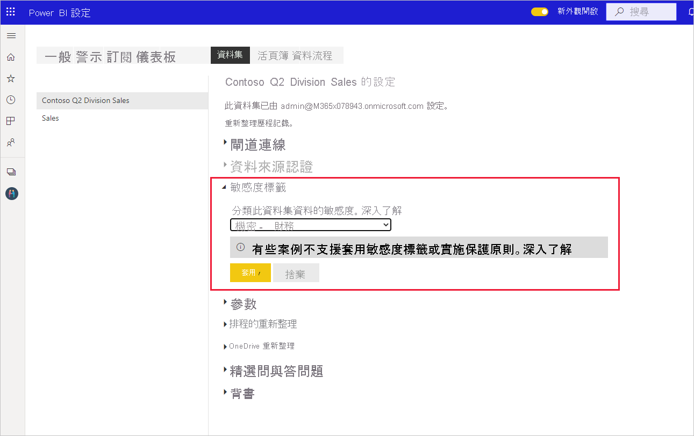

# 如何在 Power BI 中套用敏感度標籤

Microsoft 資訊保護提供報表、儀表板、資料集、資料流程與 .pbix 檔案的敏感度標籤，以保護敏感性內容，防止未經授權的資料存取及外洩。 使用敏感度標籤正確標示資料，可確保只有經過授權的人員才能存取資料。 此文章說明如何在 Power BI 服務與 Power BI Desktop 中套用敏感度標籤。

如需 Power BI 中敏感度標籤的詳細資訊，請參閱 [Power BI 中的敏感度標籤](service-security-sensitivity-label-overview.md)。

## 在 Power BI 服務中套用敏感度標籤

在 Power BI 服務中，您可以將敏感度標籤套用至報表、儀表板、資料集與資料流程。

在 Power BI 服務中套用敏感度標籤：
* 您必須擁有 [Power BI Pro 授權](./service-admin-purchasing-power-bi-pro.md)，以及所要標示的內容編輯權限。
* 貴組織必須啟用敏感度標籤。 如果您不確定貴組織是否已啟用，請連絡您的 Power BI 管理員。
* 您必須屬於有權套用敏感度標籤的安全性群組 (如[在 Power BI 中啟用敏感度標籤](./service-security-enable-data-sensitivity-labels.md)中所述)。
* 您必須符合所有[授權和其他需求](./service-security-enable-data-sensitivity-labels.md#licensing-and-requirements)。

當您的租用戶啟用資料保護時，敏感度標籤會出現在儀表板、報表、資料集與資料流程清單檢視的敏感度資料行中。

**套用或變更報表或儀表板中的敏感度標籤**
1. 按一下 [更多選項 (...)]。
1. 選取 [設定]。
1. 在 [設定] 側邊窗格中，選擇適當的敏感度標籤。
1. 儲存設定。

下圖說明對報表執行此作業的步驟

**套用或變更資料集或資料流程中的敏感度標籤**

1. 按一下 [更多選項 (...)]。
1. 選取 [設定]。
1. 視相關性選取 [資料集] 或 [資料流程] 索引標籤。
1. 展開 [敏感度標籤] 區段，然後選擇適當的敏感度標籤。
1. 套用設定。

下面兩張圖說明對資料集執行此作業的步驟。

依序選擇 [其他選項(...)] 和 [設定]。

在 [設定] 的 [資料集] 索引標籤上，開啟 [敏感度標籤] 區段、選擇所需的敏感度標籤，然後按一下 [套用]。

## 在 Power BI Desktop 中套用敏感度標籤 (預覽)

>[!NOTE]
>在您選用 Power BI Desktop 資訊保護預覽功能後的前 48 小時內，**您可能會在使用已套用敏感度標籤的 .pbix 檔案 (例如將 .pbix 發佈到服務、從服務下載 .pbix 等) 時遇到問題**。 此類問題為正常現象，而且會在 48 小時內自動解決。

在 Power BI Desktop 中使用敏感度標籤：
* 您必須擁有 [Power BI Pro 授權](./service-admin-purchasing-power-bi-pro.md)。
* 貴組織必須啟用敏感度標籤。 如果您不確定貴組織是否已啟用，請連絡您的 Power BI 管理員。
* 您必須屬於有權套用敏感度標籤的安全性群組 (如[在 Power BI 中啟用敏感度標籤](./service-security-enable-data-sensitivity-labels.md)中所述)。
* 您必須符合所有[授權和其他需求](./service-security-enable-data-sensitivity-labels.md#licensing-and-requirements)。
* Power BI Desktop 中的資訊保護預覽功能開關必須為開啟狀態。 如果您在 [常用] 索引標籤上看到 [敏感度] 按鈕，即表示預覽功能已開啟。 如果您沒有看到該按鈕，請前往 [檔案] > [選項及設定] > [選項] > [預覽功能]，然後選取 [資訊保護] 旁的方塊。

    ![Desktop [預覽功能] 頁面的螢幕擷取畫面。](media/service-security-apply-data-sensitivity-labels/desktop-preview-features-page.png)

    如果您沒有看到 [資訊保護] 預覽選項，則資訊保護預覽功能可能已遭封鎖，無法供貴組織使用。 在此情況下，請連絡您的 Power BI 管理員。

    >[!NOTE]
    >開啟資訊保護預覽功能後，您必須重新啟動 Desktop 才能開始使用敏感度標籤。
* 您必須登入。

若要在您正在處理的檔案上套用敏感度標籤，請按一下 [常用] 索引標籤中的 [敏感度] 按鈕，然後從顯示的功能表中選擇所需標籤。

![Desktop 中 [敏感度標籤] 功能表的螢幕擷取畫面。](media/service-security-apply-data-sensitivity-labels/sensitivity-label-menu-desktop.png)

>[!NOTE]
> 如果您已開啟 [預覽功能] 中的敏感度標籤功能，但仍未看到 [敏感度] 按鈕，可能表示您沒有適當的授權，或是您不屬於有權套用敏感度標籤的安全性群組 (如[在 Power BI 中啟用敏感度標籤](./service-security-enable-data-sensitivity-labels.md)中所述)。

當您套用標籤後，標籤會顯示在狀態列中。

### 將 .pbix 檔案上傳到服務或從服務下載 .pbix 檔案時採用的敏感度標籤
* 當您從 Desktop 將 .pbix 檔案發佈到 Power BI 服務，或透過 [取得資料] 直接將 .pbix 檔案上傳到 Power BI 服務時，.pbix 檔案的標籤會套用至服務中所建立的報表與資料集。 如果您發佈或上傳的 .pbix 檔案取代了現有資產 (例如名稱與 .pbix 檔案相同的資產)，則 .pbix 檔案的標籤將會覆寫那些資產上的任何標籤。
* 如果在 Power BI 服務中使用 [下載至 .pbix] 時所下載的報表與資料集擁有不同的標籤，則系統會為 .pbix 檔案套用限制較嚴格的標籤。

## 移除敏感度標籤

### 服務
若要從報表、儀表板、資料集或資料流程中移除敏感度標籤，請遵循[在 Power BI 服務中套用標籤所使用的相同程序](#apply-sensitivity-labels-in-the-power-bi-service)，但當系統提示您分類資料的敏感度時，請選擇 [(無)]。

### 桌上型
目前 Desktop 不支援從隨著敏感度標籤一起儲存的 .pbix 檔案中移除該標籤。 在這種情況下，建議您將檔案發佈到 Power BI 服務，然後在該服務中從後續的報表與資料集移除標籤。

## 考量與限制

如需 Power BI 中的敏感度標籤限制清單，請參閱 [Power BI 中的敏感度標籤](service-security-sensitivity-label-overview.md#limitations)。

## 後續步驟

本文描述如何在 Power BI 中套用敏感度標籤。 下列文章提供 Power BI 資料保護的詳細資料。 

* [Power BI 中的敏感度標籤概觀](./service-security-sensitivity-label-overview.md)
* [在 Power BI 中啟用敏感度標籤](./service-security-enable-data-sensitivity-labels.md)
* [在 Power BI 中使用 Microsoft Cloud App Security 控制項](./service-security-using-microsoft-cloud-app-security-controls.md)