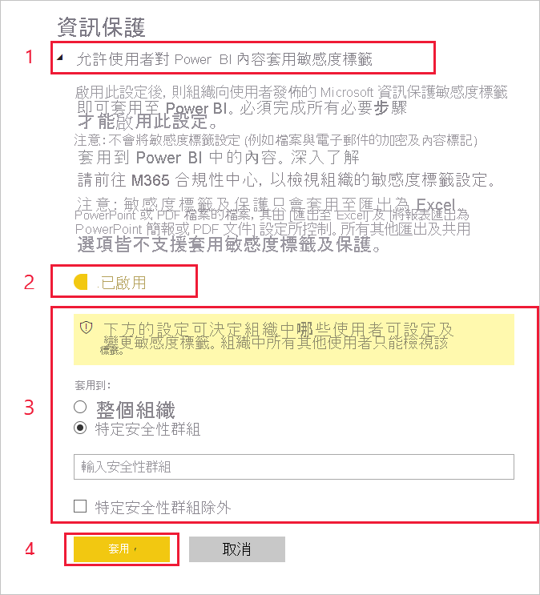

# 在 Power BI 中啟用敏感度標籤

為了讓 [Microsoft 資訊保護的敏感度標籤](/microsoft-365/compliance/sensitivity-labels)可在 Power BI 中使用，必須在租用戶上啟用這些標籤。 此文章說明 Power BI 系統管理員如何執行此操作。 如需 Power BI 中敏感度標籤的概觀，請參閱 [Power BI 中的敏感度標籤](service-security-sensitivity-label-overview.md)。 如需在 Power BI 中套用敏感度標籤的相關資訊，請參閱[在 Power BI 中套用資料敏感度標籤 (預覽)](./service-security-apply-data-sensitivity-labels.md) 

啟用敏感度標籤時：

* 組織中的指定使用者與安全性群組可為敏感度標籤分類，並對其 Power BI 內容[套用敏感度標籤](./service-security-apply-data-sensitivity-labels.md)。 在 Power BI 服務中，此內容表示其報表、儀表板、資料集與資料流程。 在 Power BI Desktop 中則表示其 .pbix 檔案。
* 在服務中，所有組織成員都能看到那些標籤。 在 Desktop 中，只有已發佈標籤的組織成員才能看到標籤。

啟用敏感度標籤需要 Azure 資訊保護授權。 如需詳細資訊，請參閱[授權和需求](#licensing-and-requirements)。

>[!NOTE]
>在使用者選用資訊保護預覽功能後的前 48 小時內，**其可能會在使用已套用敏感度標籤的 .pbix 檔案 (例如將 .pbix 發佈到服務、從服務下載 .pbix) 時遇到問題**。 此類問題為正常現象，而且會在 48 小時內自動解決。

## 授權和需求

* 您必須具備 Azure 資訊保護 Premium P1 或 Premium P2 授權，才能在 Power BI 中套用或檢視 Microsoft 資訊保護敏感度標籤。 您可以單獨購買 Azure 資訊保護，或透過其中一個 Microsoft 授權套件來購買。 如需詳細資訊，請參閱 [Azure 資訊保護定價](https://azure.microsoft.com/pricing/details/information-protection/)。

    >[!NOTE]
    > 如果您的組織使用 Azure 資訊保護敏感度標籤，則必須將其移轉至 Microsoft 資訊保護統一標籤平台，才能用於 Power BI。 深入了解如何[移轉敏感度標籤](/azure/information-protection/configure-policy-migrate-labels) \(部分機器翻譯\)。

* 使用者除了上述其中一個 Azure 資訊保護授權外，還必須擁有 Power BI Pro 授權，才能將標籤套用至 Power BI 內容與檔案。

* Office 應用程式有自己[檢視和套用敏感度標籤的授權需求]( https://docs.microsoft.com/microsoft-365/compliance/get-started-with-sensitivity-labels#subscription-and-licensing-requirements-for-sensitivity-labels )。

* 在您的租用戶上啟用敏感度標籤之前，請確定已針對相關的使用者和群組定義和發佈敏感度標籤。 如需詳細資訊，請參閱[建立及設定敏感度標籤及其原則](/microsoft-365/compliance/create-sensitivity-labels)。

* 您必須擁有 2020 年 12 月與更新的 Desktop 版本，才能在 Desktop 中使用敏感度標籤。

    >[!NOTE]
    > 如果您嘗試使用 2020 年 12 月之前的 Desktop 版本開啟受保護的 .pbix 檔案，檔案將無法開啟，而且系統會提示您升級您的 Desktop 版本。

## 啟用敏感度標籤

您必須在租用戶上啟用敏感度標籤，才能在服務與 Desktop 中加以使用。 此節描述如何在租用戶設定中加以啟用。 如需有關 Desktop 的其他考量，請參閱下方的[在 Desktop 中為整個組織停用敏感度標籤](#disable-sensitivity-labels-in-desktop-across-your-org)。 

若要在租用戶上啟用敏感度標籤，請前往 Power BI **管理入口網站**、開啟 [租用戶設定] 窗格，然後尋找 [資訊保護] 區段。

![尋找 [資訊保護] 區段](media/service-security-enable-data-sensitivity-labels/enable-data-sensitivity-labels-01.png)

在 [資訊保護] 區段中，執行下列步驟：
1. 開啟 [允許使用者對 Power BI 內容套用敏感度標籤]。
1. 啟用切換按鈕。
1. 定義可以在 Power BI 資產中套用及變更敏感度標籤的使用者。 根據預設，組織中的每一位使用者都能套用敏感度標籤。 您也可以選擇只允許特定使用者或安全性群組設定敏感度標籤。 選取了整個組織或特定安全性群組之後，就可以排除特定使用者或安全性群組中的某些人員。
   
   * 若啟用敏感度標籤的對象是整個組織，通常會以安全性群組為例外。
   * 若只為特定使用者或安全性群組啟用敏感度標籤，通常以特定的使用者為例外。  
    此法可以避免屬於有權套用敏感度標籤之群組的特定使用者，無法在 Power BI 中套用敏感度標籤。

1. 按 [套用]。

> [!IMPORTANT]
> 只有有權 *建立* 及 *編輯* 資產的 Power BI Pro 使用者，以及隸屬於您先前在此區段中設定之相關安全性群組的使用者，才能設定及編輯敏感度標籤。 不屬於此群組的使用者無法設定或編輯此標籤。  

## 在 Desktop 中為整個組織停用敏感度標籤

針對想要確保 .pbix 檔案 **無法** 與敏感度標籤搭配使用的組織，Power BI 管理員可建立群組原則，讓 Power BI 禁止使用者分類及保護 .pbix 檔案，或開啟已套用保護的檔案。 建立此類原則：

1. 開啟[登錄編輯程式](https://support.microsoft.com/windows/how-to-open-registry-editor-in-windows-10-deab38e6-91d6-e0aa-4b7c-8878d9e07b11)。

1. 尋找機碼 **HKEY_CURRENT_USER\SOFTWARE\Policies\Microsoft\Microsoft Power BI Desktop**。

1. 尋找 valueName **EnableInformationProtection** 並將其設定為 **false**。

如需有關在 Power BI Desktop 中使用敏感度標籤的進一步限制與考量，請參閱[敏感度標籤概觀](./service-security-sensitivity-label-overview.md#limitations)。

## 疑難排解

Power BI 使用 Microsoft 資訊保護敏感度標籤。 因此，當您在嘗試啟用敏感度標籤時若出現錯誤訊息，有可能是下列其中一項原因所致：

* 您不具 Azure 資訊保護[授權](#licensing-and-requirements)。
* 敏感度標籤尚未[移轉](#enable-sensitivity-labels)至 Power BI 所支援的 Microsoft 資訊保護版本。
* 尚未[在組織中定義](#enable-sensitivity-labels)任何 Microsoft 資訊保護敏感度標籤。

## 考量與限制

如需 Power BI 中的敏感度標籤限制清單，請參閱 [Power BI 中的敏感度標籤](service-security-sensitivity-label-overview.md#limitations)。

## 後續步驟

本文描述如何在 Power BI 中啟用敏感度標籤。 下列文章提供 Power BI 資料保護的詳細資料。 

* [Power BI 中的敏感度標籤概觀](service-security-sensitivity-label-overview.md)
* [如何在 Power BI 中套用敏感度標籤](./service-security-apply-data-sensitivity-labels.md)
* [在 Power BI 中使用 Microsoft Cloud App Security 控制項](service-security-using-microsoft-cloud-app-security-controls.md)
* [保護計量報表](service-security-data-protection-metrics-report.md)