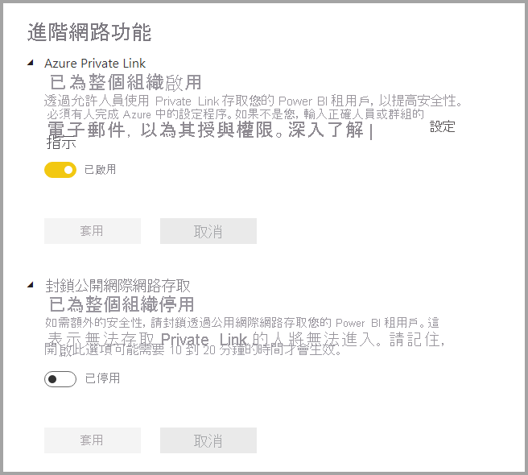
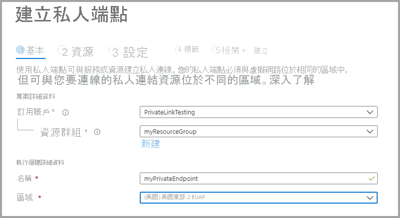
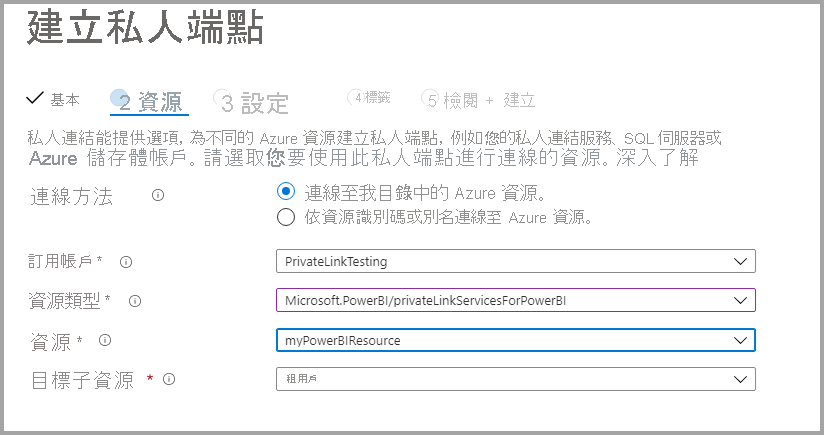

# <a name="private-links-for-accessing-power-bi"></a>使用私人連結存取 Power BI

Azure 網路提供兩個安全性功能：Azure 私人連結和私人端點，其可讓 Power BI 提供安全存取。 使用 Azure 私人連結和私人端點時，會使用 Microsoft 的骨幹網路基礎結構私下傳送資料流量，因此資料不會周遊網際網路。 

私人連結可確保 Power BI 使用者在進入 Power BI 服務的資源時，使用 Microsoft 私人網路骨幹。

您可深入了解 [Azure 私人連結](https://azure.microsoft.com/services/private-link/)。

## <a name="understanding-private-links"></a>了解私人連結

私人連結可保證「進入」組織 Power BI 成品 (例如報表或工作區) 的流量，一律會遵循組織設定的私人連結網路路徑。 Power BI 成品其使用者流量必須來自已建立的私用連結，且您可設定 Power BI 以拒絕所有不是來自所設定網路路徑的要求。 

私人連結「不」保證從 Power BI 到外部資料來源 (不論是在雲端還是內部部署) 的流量都受到保護。 相反地，您必須設定防火牆規則和虛擬網路，以進一步保護資料來源。 

### <a name="power-bi-and-private-links-integration"></a>Power BI 和私人連結整合

適用於 Power BI 的 Azure 私人端點是一種網路介面，可讓您私下且安全地連線到 Azure Private Link 所支援的 Power BI 服務。   

私人端點整合可讓您從客戶的虛擬和內部部署網路私下部署和存取平台即服務 (PaaS) 服務，而該服務仍在客戶網路外部執行。 私人端點是單一方向的技術，可讓用戶端起始與指定服務的連線，但不允許服務起始連線到客戶網路。 由於服務可獨立於客戶網路原則設定運作，因此這個私人端點整合模式提供管理隔離。 針對多租用戶服務，此私人端點模型會提供連結識別碼，以防止存取裝載於相同服務內的其他客戶資源。 使用私人端點時，只能使用整合以從服務存取一組有限的其他 PaaS 服務資源。  

Power BI 服務會實作私人端點，而不是服務端點。  

搭配 Power BI 使用私人連結可提供下列優點：

1. 私人連結可確保流量會透過 Azure 骨幹傳送至 Azure 雲端式資源的私人端點。 

2. 網路流量與非 Azure 架構基礎結構 (例如內部部署存取) 的隔離，將會要求客戶設定 ExpressRoute 或虛擬私人網路 (VPN)。  

## <a name="using-secure-private-links-to-access-power-bi"></a>使用安全的私人連結來存取 Power BI

在 Power BI 中，您可設定並使用端點，讓組織能夠私下存取 Power BI。 若要設定私人連結，您必須是 Power BI 系統管理員，且在 Azure 中具有建立和設定資源 (例如虛擬機器 (VM) 與虛擬網路 (V-Net)) 的權限。 

您可透過下列步驟，安全地從私人連結存取 Power BI：

1. [啟用 Power BI 的私人連結](#enable-private-links-for-power-bi)
2. [在 Azure 入口網站中建立 Power BI 資源](#create-a-power-bi-resource-in-the-azure-portal)
3. [建立虛擬網路](#create-a-virtual-network)
4. [建立虛擬機器 (VM)](#create-a-virtual-machine-vm)
5. [建立私人端點](#create-a-private-endpoint)
6. [使用遠端桌面 (RDP) 連線到 VM](#connect-to-a-vm-using-remote-desktop-rdp)
7. [從虛擬機器私下存取 Power BI](#access-power-bi-privately-from-the-vm)
8. [停用 Power BI 的公用存取](#disable-public-access-for-power-bi)

下列各節提供每個步驟的詳細資訊。

## <a name="enable-private-links-for-power-bi"></a>啟用 Power BI 的私人連結

若要開始設定，請以系統管理員身分登入 app.powerbi.com 中的 Power BI，然後巡覽至管理入口網站。 選取 [租用戶設定] 並捲動至 [進階網路]，然後切換選項按鈕來開啟 [Azure Private Link] ，如下圖所示。 

設定租用戶的私人連結需要大約 15 分鐘時間，包括為租用戶設定個別的 FQDN，以便與 Power BI 服務私下進行通訊。



完成後，即可繼續下一個步驟。

## <a name="create-a-power-bi-resource-in-the-azure-portal"></a>在 Azure 入口網站中建立 Power BI 資源

接下來，登入 [Azure 入口網站](https://portal.azure.com)，並使用 [Azure 範本] 建立 Power BI 資源。 取代 ARM 範本範例中的參數 (如下表所示)，以建立 Power BI 資源。


|**參數**  |**值**  |
|---------|---------|
|```<resource-name>```    | myPowerBIResource         |
|```<tenant-object-id>```     | 52d40f65-ad6d-48c3-906f-1ccf598612d4         |

建立 ARM 範本 

```
{
  "$schema": "http://schema.management.azure.com/schemas/2015-01-01/deploymentTemplate.json#",
  "contentVersion": "1.0.0.0",
  "parameters": {},
  "resources": [
      {
          "type":"Microsoft.PowerBI/privateLinkServicesForPowerBI",
          "apiVersion": "2020-06-01",
          "name" : "<resource-name>",
          "location": "global",
          "properties" : 
          {
               "tenantId": "<tenant-object-id>"
          }
      }
  ]
}
```

在出現的對話方塊中，選取核取方塊以同意條款及條件，然後選取 [購買]。


## <a name="create-a-virtual-network"></a>建立虛擬網路

下一個步驟是建立虛擬網路和子網路。 將下表中範例參數取代為您自己的參數，以建立虛擬網路和子網路。

| 參數 |   值| 
|---------|---------|
| ```<resource-group-name>```   | myResourceGroup |
| ```<virtual-network-name>```  | myVirtualNetwork |
| ```<region-name>```   | 美國中部  |
| ```<IPv4-address-space>```    | 10.1.0.0/16 |
| ```<subnet-name>```   | mySubnet |
| ```<subnet-address-range>```  | 10.1.0.0/24 |

1. 在畫面的左上方，選取 [建立資源] > [網路] > [虛擬網路]  ，或在搜尋方塊中搜尋 [虛擬網路]  。
2. 在 [建立虛擬網路] 的 [基本] 索引標籤中輸入或選取下列資訊：

    |設定 | 值 |
    |-------------------|---------|
    |**專案詳細資料**|
    |訂用帳戶 | 選取您的 Azure 訂用帳戶 |
    |資源群組 |   選取 [建立新物件]，輸入 ```<resource-group-name>```，然後選取 [確定]，或根據參數選取現有的 ```<resource-group-name>```。 |
    |**執行個體詳細資料** |
    | 名稱  | 輸入 ```<virtual-network-name>``` |
    |區域 | 選取 ```<region-name>``` |
    
    下圖顯示 [基本]  索引標籤。
    
    ![建立虛擬網路，[基本] 索引標籤](media/service-security-private-links/service-private-links-03.png)


3. 接下來，選取 [IP 位址] 索引標籤，或選取表單底部的 [下一步: IP 位置] 按鈕。 在 [IP 位址] 索引標籤中，輸入下列資訊：

    |設定 | 值 |
    |-------------------|---------|
    |IPv4 位址空間 |輸入 ```<IPv4-address-space>``` |
    
    ![建立虛擬網路，[IP 位址] 索引標籤](media/service-security-private-links/service-private-links-04.png)
    

4. 在 [子網路名稱] 中，選取 [預設]，然後在 [編輯子網路] 中，輸入下列資訊：

    |設定 | 值 |
    |-------------------|---------|
    | 子網路名稱 |輸入 ```<subnet-name>``` |
    | 子網路位址範圍 | 輸入 ```<subnet-address-range>``` |
    
    
    ![建立虛擬網路，[編輯子網路] 索引標籤](media/service-security-private-links/service-private-links-05.png)

5. 選取 [儲存]，然後選取 [檢閱 + 建立] 索引標籤，或選取 [檢閱 + 建立] 按鈕。 

6. 然後，選取 [Create] \(建立\)。

完成這些步驟之後，即可建立虛擬機器 (VM)，如下一節中所述。

## <a name="create-a-virtual-machine-vm"></a>建立虛擬機器 (VM)


下一個步驟是建立虛擬網路，以及用來裝載該虛擬機器 (VM) 的子網路。

1. 在 Azure 入口網站畫面左上角，選取 [建立資源] > [計算] > [虛擬機器]。

2. 在 [建立虛擬機器 - 基本] 中，輸入或選取下列資訊：

    |設定 | 值 |
    |-------------------|---------|
    |**專案詳細資料**||
    |訂用帳戶 | 選取您的 Azure 訂用帳戶 |
    |資源群組 |   選取在前一節中建立的 **myResourceGroup** 。 |
    |**執行個體詳細資料** ||
    |名稱 | 輸入 **myVm** |
    |區域 | 選取 [美國中部] |
    |可用性選項| 保留預設值 [不需要基礎結構備援] |
    |映像 | 選取 [Windows 10 專業版] |
    |大小 | 保留預設值 [標準 DS1 v2] |
    |系統管理員帳戶 ||
    |使用者名稱 |輸入所選的使用者名稱 |
    |密碼 | 輸入您選擇的密碼。 密碼長度至少必須有 12 個字元，且符合[定義的複雜度需求](/azure/virtual-machines/windows/faq#what-are-the-password-requirements-when-creating-a-vm) |
    |確認密碼 | 再次輸入密碼 |
    |輸入連接埠規則 ||
    |公用輸入連接埠 | 保留預設值 [無] |
    |節省費用 ||
    |已經有 Windows 授權？ |  保留預設值 [否] |

3. 然後，選取 **[下一步：磁碟]**
4. 在 [建立虛擬機器 - 磁碟]，保留預設值並選取 [下一步：網路功能]。
5. 在 [建立虛擬機器 - 網路] 中，選取下列資訊：

    |設定 | 值 |
    |-------------------|---------|
    |虛擬網路|   保留預設值 [MyVirtualNetwork]|
    |位址空間| 保留預設值 [10.1.0.0/24]|
    |子網路 |保留預設值 [mySubnet (10.1.0.0/24)]|
    |公用 IP| 保留預設值 [(new) myVm-ip]|
    |公用輸入連接埠|  選取 [允許選取的項目]****。|
    |選取輸入連接埠|  選取 [RDP]|

6. 選取 [檢閱 + 建立]。 您會移至 [檢閱 + 建立] 頁面，其中 Azure 會驗證您的設定。
7. 當您看到 [驗證成功] 訊息時，請選取 [建立]。


## <a name="create-a-private-endpoint"></a>建立私人端點

本節中所述的步驟為建立 Power BI 的私人端點。

1. 在 Azure 入口網站的畫面左上角，選取 [建立資源] > [網路] > [Private Link 中心 (預覽)]。
2. 在 [Private Link 中心 - 概觀] 中，選取 [建置與服務的私人連線] 選項上的 [建立私人端點]。
3. 在 [建立私人端點 (預覽) - 基本] 中，輸入或選取下列資訊：

    |設定 | 值 |
    |-------------------|---------|
    |**專案詳細資料** ||
    |訂用帳戶|  選取您的 Azure 訂用帳戶|
    |資源群組|    選取 **myResourceGroup** 。 您已在上一區段中建立此項|
    |**執行個體詳細資料** ||
    |名稱|  輸入 myPrivateEndpoint。 如果此名稱已被使用，請建立唯一名稱|
    |區域|    選取 [美國中部]|
    
    下圖顯示 [建立私人端點 - 基本] 視窗。
    
    

4. 完成該資訊後，請選取 [下一步: 資源] 並在 [建立私人端點 - 資源] 頁面中，輸入或選取下列資訊：

    |設定 | 值 |
    |-------------------|---------|
    |連線方法| 選取 [連線到我目錄中的 Azure 資源]|
    |訂用帳戶|  選取您的訂用帳戶|
    |資源類型| 選取 [Microsoft.PowerBI/privateLinkServicesForPowerBI] |
    |資源|  myPowerBIResource|
    |目標子資源|   租用戶|
    
    下圖顯示 [建立私人端點 - 資源] 視窗。
    
    

5. 適當地輸入該資訊後，請選取 [下一步: 設定] 並在 [建立私人端點 (預覽) - 設定] 頁面中，輸入或選取下列資訊：

    |設定 | 值 |
    |-------------------|---------|
    |**網路** ||
    |虛擬網路|   選取 *myVirtualNetwork* |
    |子網路 |選取 [mySubnet] |
    |**私人 DNS 整合** ||
    |與私人 DNS 區域整合|   選取 [是] |
    |私人 DNS 區域   |選取 <br> *(New)privatelink.analysis.windows.net* <br> *(New)privatelink.pbidedicated.windows.net* <br> *(New)privatelink.tip1.powerquery.microsoft.com* |
    
    下圖顯示 [建立私人端點 - 設定] 視窗。
    
    
    
    接下來，選取 [檢閱 + 建立]，隨即會顯示 [檢閱 + 建立] 頁面以供 Azure 驗證設定。 當您看到 [驗證成功] 訊息時，請選取 [建立]。

## <a name="connect-to-a-vm-using-remote-desktop-rdp"></a>使用遠端桌面 (RDP) 連線到 VM

當完成建立虛擬機器 ( **myVM** ) 時，請透過下列步驟從網際網路與其連線：

1. 在入口網站的搜尋列中，輸入 myVm。
2. 選取 [連線]  按鈕。 選取 [連線] 按鈕之後，隨即會開啟 [連線至虛擬機器]。
3. 選取 [下載 RDP 檔案]。 Azure 會建立一個「遠端桌面通訊協定」( .rdp) 檔案，並下載至您的電腦。
4. 開啟下載的 .rdp 檔案。
5. 如果出現提示，請選取 [連接]。
6. 輸入在先前步驟中建立 VM 時所指定的使用者名稱與密碼。
7. 選取 [確定]。
8. 您可能會在登入過程中收到憑證警告。 如果您收到憑證警告，請選取 [是] 或 [繼續]。

## <a name="access-power-bi-privately-from-the-vm"></a>從 VM 私下存取 Power BI

接下來，透過下列步驟，使用在先前步驟中建立的虛擬機器以私下存取 Power BI： 

1. 在 myVm 的遠端桌面中，開啟 PowerShell。
2. 輸入 nslookup 52d40f65ad6d48c3906f1ccf598612d4-api.privatelink.analysis.windows.net。
3. 您將收到如下訊息：

    ```
    Server:  UnKnown
    Address:  168.63.129.16
    
    Non-authoritative answer:
    Name:    52d40f65ad6d48c3906f1ccf598612d4-api.privatelink.analysis.windows.net
    Address:  10.1.0.4
    ```

4. 開啟瀏覽器並前往 app.powerbi.com，即可私下存取 Power BI。

## <a name="disable-public-access-for-power-bi"></a>停用 Power BI 的公用存取

最後，您必須停用 Power BI 的公用存取。 

以系統管理員身分登入 app.powerbi.com，然後巡覽至 **管理入口網站** 。 選取 [租用戶設定]，並捲動至 [進階網路] 區段。 啟用 [封鎖公用網際網路存取] 區段中的切換按鈕，如下圖所示。 系統需要大約 15 分鐘時間，才能停用組織從公用網際網路來存取 Power BI。

大功告成，在完成這些步驟之後，您組織的 Power BI 便只能從私人連結存取，而無法從公用網際網路存取。 

## <a name="considerations-and-limitations"></a>考量與限制

使用 Power BI 的私人連結時，有幾件需要牢記的注意事項：

* 使用私人連結環境時，將無法使用任何外部映像或主題，且可能會影響自訂視覺效果
* 使用私人連結環境時，將無法使用匯出服務 (例如 [匯出至 PDF]、[從報表匯出至 Excel] 以及其他匯出服務)
* SQL Server Reporting Services 報表，即 RDL 檔案(*.rdl 格式檔案) 無法在私人連結環境中進行轉譯
* 如果已停用網際網路存取，而且資料集或資料流程已連線到 Power BI 資料集或資料流程做為資料來源，連線會失敗


## <a name="next-steps"></a>後續步驟

- [管理貴組織中的 Power BI](service-admin-administering-power-bi-in-your-organization.md)  
- [了解 Power BI 系統管理員角色](service-admin-role.md)  
- [稽核貴組織的 Power BI](service-admin-auditing.md)  

有其他問題嗎？ [嘗試在 Power BI 社群提問](https://community.powerbi.com/)
