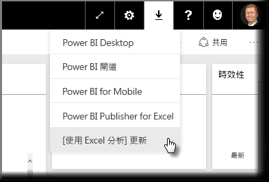
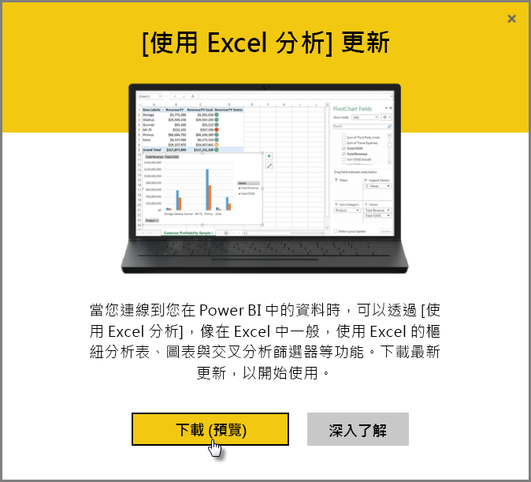
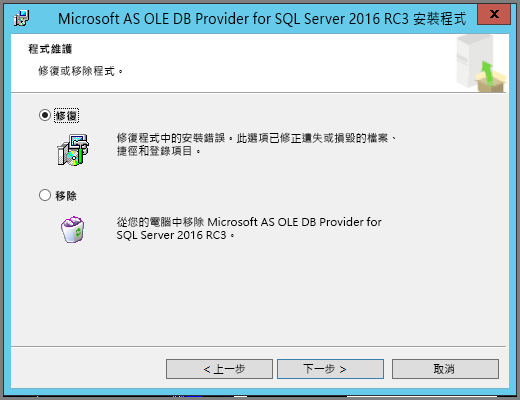
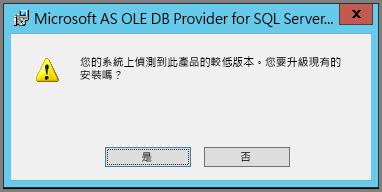

# 為 [使用 Excel 分析] 疑難排解

有時候使用 [使用 EXCEL 分析] 可能會取得非預期的結果，或功能無法如您預期般運作。 此頁面可提供使用 [使用 EXCEL 分析] 時的常見問題解決方案。

> [!NOTE]
> 沒有專門用來描述及啟用[使用 EXCEL 分析](service-analyze-in-excel.md)的個別頁面。
> 
> 如果您遇到下面沒有列出的案例且發生問題，您可以在[社群網站](https://community.powerbi.com/)上要求進一步協助，您也可以建立[支援票證](https://powerbi.microsoft.com/support/)。
> 
> 

本文包含下列疑難排解章節︰

* 更新 OLE DB 提供者的 Excel 文件庫
* 判斷是否需要更新您的 Excel 文件庫
* 「無法建立連線」錯誤
* 「禁止」錯誤
* 沒有資料模型
* 「權杖過期」錯誤
* 無法存取內部部署 Analysis services
* 無法將任何項目拖曳到樞紐分析表值區域 (沒有任何量值)

## 更新 OLE DB 提供者的 Excel 文件庫
若要使用 [使用 EXCEL 分析]  ，您的電腦必須安裝目前的 AS OLE DB 提供者。 此[社群文章](https://community.powerbi.com/t5/Service/Analyze-in-Excel-Initialization-of-the-data-source-failed/m-p/30837#M8081)是確認 OLE DB 提供者安裝或下載最新版本的絕佳來源。

Excel 文件庫必須在位元層級方面符合您的 Windows 版本。 如果您已安裝 64 位元 Windows，則必須安裝 64 位元 OLE DB 提供者。

若要下載最新的 Excel 文件庫，請瀏覽 Power BI，然後選取 Power BI 服務右上角的**向下鍵**，然後選取 [在 Excel 更新中分析]  。

在出現的對話方塊中，選取 [下載 (預覽)]  。

## 判斷是否需要更新您的 Excel 文件庫
您可以從上一節中的連結下載最新版本的 Excel OLE DB 提供者文件庫。 下載適當的 OLD DB 提供者文件庫並開始安裝後，系統會針對目前安裝的版本執行檢查。

如果 Excel OLE DB 提供者用戶端文件庫處於最新狀態，則會看到下列對話方塊︰

或者，如果您要安裝的新版本比電腦上的版本更新，則會出現下列對話方塊︰

如果看到提示您升級的對話方塊，您應該繼續進行安裝，以取得在電腦中安裝之 OLE DB 提供者的最新版本。

## 「無法建立連線」錯誤
「無法建立連線」  錯誤的主要原因是電腦的 OLE DB 提供者用戶端文件庫並非最新版本。 如需有關如何判斷正確更新和下載連結的資訊，請參閱本文上述的**更新 OLE DB 提供者的 Excel 文件庫**。

## 「禁止」錯誤
某些使用者擁有多個 Power BI 帳戶，且在 Excel 嘗試使用現有認證連線至 Power BI 時，其可能會使用沒有要存取之資料集或報表存取權的認證。

發生這種情況時，您可能會收到標題**禁止**的錯誤，這表示您可能透過沒有資料集權限的認證登入 Power BI。 發生**禁止**錯誤後，系統提示您輸入認證時，請使用具有要嘗試使用之資料集存取權限的認證。

如果您仍然遇到錯誤，透過具有權限的帳戶登入 Power BI，並確認您可以在 Power BI 中檢視並存取您嘗試在 Excel 中存取的資料集。

## 沒有資料模型
如果您遇到表示**找不到 OLAP Cube 模型**的錯誤，則您正在嘗試存取的資料集沒有資料模型，因此無法於 Excel 中進行分析。

## 「權杖過期」錯誤
如果您收到**權杖過期**錯誤，其表示您最近未在您使用中的電腦上使用 [使用 EXCEL 分析]  功能。 只需重新輸入您的認證或重新開啟檔案，該錯誤應該便會消失。

## 無法存取內部部署 Analysis services
如果您正在嘗試存取已連接至內部部署 Analysis Services 資料的資料集，您可能會收到錯誤訊息。 **使用 Excel 分析**支援使用連接字串連接至內部部署 **Analysis Services** 上的資料集和報表，只要您的電腦與 **Analysis Services** 伺服器位於相同的網域，且您的帳戶可存取該 **Analysis Services** 伺服器即可。

## 無法將任何項目拖曳到樞紐分析表值區域 (沒有任何量值)
當 [使用 Excel 分析]  連線到外部 OLAP 模型 (這是 Excel 連線到 Power BI 的方式) 時，「樞紐分析表」  [需要在外部模型中定義**量值**](https://support.microsoft.com/kb/234700)，因為所有計算都是在伺服器上執行。 這不同於您使用本機資料來源時 (例如 Excel 中的資料表，或是您在使用 **Power BI Desktop** 或 **Power BI 服務**中的資料集時)，在此情況下表格式模型可以在本機使用，且[您可以使用隱含量值](https://msdn.microsoft.com/library/gg399077.aspx)，這是動態產生的量值，並不會儲存在資料模型中。 在這些情況下，在 Excel 中的行為與 **Power BI Desktop** 或 **Power BI 服務**中的行為不同：資料中可能有資料行在 Power BI 中視為量值，但無法在 Excel 中作為值 (量值) 來使用。

若要解決此問題，您有幾個選項︰

1. [在 **Power BI Desktop**建立資料模型的量值](../transform-model/desktop-tutorial-create-measures.md)，然後將資料模型發行到 **Power BI 服務** 並從 Excel 存取該資料集。
2. [從 Excel PowerPivot 建立資料模型的量值](https://support.office.com/article/Create-a-Measure-in-Power-Pivot-d3cc1495-b4e5-48e7-ba98-163022a71198)。
3. 如果您從只有資料表 (且沒有任何資料模型) 的 Excel 活頁簿匯入資料，那麼您可以[將資料表加入資料模型](https://support.office.com/article/Add-worksheet-data-to-a-Data-Model-using-a-linked-table-d3665fc3-99b0-479d-ba09-a37640f5be42)，然後依照上述選項 2 中的步驟，建立資料模型中的量值。

一旦您的量值定義在 Power BI 服務的模型中，您就能夠在 Excel 樞紐分析表的 [值]  區域中使用它們。

## 後續步驟
[使用 Excel 分析](service-analyze-in-excel.md)

[教學課程：在 Power BI Desktop 中建立自己的量值](../transform-model/desktop-tutorial-create-measures.md)

[PowerPivot 中的量值](https://msdn.microsoft.com/library/gg399077.aspx)

[在 PowerPivot 中建立量值](https://support.office.com/article/Create-a-Measure-in-Power-Pivot-d3cc1495-b4e5-48e7-ba98-163022a71198)

[使用連結的資料表將工作表資料新增至資料模型](https://support.office.com/article/Add-worksheet-data-to-a-Data-Model-using-a-linked-table-d3665fc3-99b0-479d-ba09-a37640f5be42)
