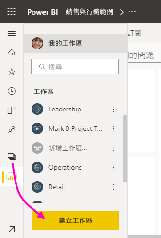
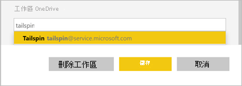

# 在 Power BI 中建立新工作區

此文章說明如何建立其中一個「新的工作區」而非「傳統」工作區。 這兩種「工作區」是與同事共同作業的地方。 在其中，您可以建立儀表板、報表和編頁報表的集合。 您也可以視需要將該集合搭售「應用程式」，並將其散發給更多對象。 如需詳細背景，請參閱[新工作區](service-new-workspaces.md)一文。

準備好移轉傳統工作區了嗎？ 如需詳細資訊，請參閱[將傳統工作區升級至 Power BI 中的新工作區](service-upgrade-workspaces.md)。

> [!NOTE]
> 您在尋找有關建立內容套件的內容嗎？ 內容套件即將淘汰。 現在是將內容套件升級為應用程式的好時機。 如需時間表，請參閱[宣告 Power BI 系統管理員可升級傳統工作區](https://powerbi.microsoft.com/blog/announcing-power-bi-admins-can-upgrade-classic-workspaces-and-roadmap-update/) (英文) 此部落格文章的＜工作區升級藍圖＞一節。
> 

## 建立其中一個新工作區

1. 開始建立工作區。 選取 [工作區] > [建立工作區]。
   
     

2. 您會自動建立已升級的工作區，除非您選擇 **還原至典型**。
   
     
     
     如果選取 [還原至傳統]，您會[建立以 Microsoft 365 群組為基礎的傳統工作區](service-create-workspaces.md)。

2. 提供工作區的唯一名稱。 如果該名稱無法使用，請將它編輯為唯一名稱。
   
     您從工作區建立的應用程式將具有與工作區相同的名稱和圖示。
   
1. 以下是您可以為工作區設定的一些選擇性項目：

    - 上傳 **工作區影像**。 檔案可為 .png 或 .jpg 格式。 檔案大小必須小於 45 KB。 
    - [指定工作區 OneDrive](#set-a-workspace-onedrive) 以使用 Microsoft 365 群組檔案儲存位置。    
    - [新增連絡人清單](#create-a-contact-list)。 根據預設，工作區系統管理員是連絡人。 
    - [允許參與者更新工作區的應用程式](#allow-contributors-to-update-the-app)
    - 若要將工作區指定為 **專用容量**，請在 [Premium] 索引標籤上，選取 [專用容量]。

        

1. 選取 [儲存]。

    Power BI 會建立並開啟工作區。 您會在您所屬的工作區清單中看到它。 

## 提供您工作區的存取權

在工作區中具有系統管理員角色的任何人都可透過將其他人新增至不同角色，而讓其存取該工作區。 工作區建立者會自動成為系統管理員。 請參閱[新工作區中的角色](service-new-workspaces.md#roles-in-the-new-workspaces)，以取得角色的說明。

> [!NOTE]
> 若要強制執行資料列層級安全性 (RLS)，讓 Power BI Pro 使用者瀏覽工作區中的內容，請將「檢視者」角色指派給使用者。 請參閱[新工作區中的角色](service-new-workspaces.md#roles-in-the-new-workspaces)，以取得不同角色的說明。

1. 因為您是系統管理員，所以在工作區內容清單頁面中，會看到 [存取]。

    

1. 在這些工作區中，將安全性群組、通訊群組清單、Microsoft 365 群組或個人新增為管理員、成員、參與者或檢視人員。 

    

9. 選取 [新增] > [關閉]。

## 設定工作區 OneDrive

工作區 OneDrive 功能可供您設定 Microsoft 365 群組，其 SharePoint 文件庫的檔案儲存體可供工作區使用者使用。 您先在 Power BI 外建立群組。 

Power BI 不會同步處理使用者或群組的權限，而這些使用者或群組會設定為可利用 Microsoft 365 群組成員資格存取工作區。 最佳做法是將[工作區存取權](#give-access-to-your-workspace)授與在此設定 Microsoft 365 群組所設定檔案儲存體的相同 Microsoft 365 群組。 然後藉由管理 Microsoft 365 群組的成員資格來管理工作區存取權。 

1. 使用兩個方法其中之一存取新 [工作區 OneDrive] 設定：

    當您第一次建立工作區時，在 [建立工作區] 窗格中。

    在導覽窗格中，選取 [工作區] 旁邊的箭號，選取工作區名稱旁邊的 [更多選項] (...) > [工作區設定]。 [設定] 窗格隨即開啟。

    

2. 在 [進階] > [工作區 OneDrive] 底下，鍵入稍早所建立 Microsoft 365 群組的名稱。 只輸入名稱，而不輸入 URL。 Power BI 會自動為該群組挑選 OneDrive。

    

3. 選取 [儲存]。

### 存取工作區 OneDrive 位置

建立 OneDrive 位置之後，您能以存取 Power BI 服務中其他資料來源的方式存取它。

1. 在導覽窗格中，選取 [取得資料]，然後在 [檔案] 方塊中選取 [取得]。

    ![[取得資料]、[取得檔案] 的螢幕擷取畫面。](media/service-create-the-new-workspaces/power-bi-get-data-files.png)

1.  [OneDrive – 商務用] 項目是您個人的商務用 OneDrive。 第二個 OneDrive 是您新增的。

    ![工作區檔案位置 - [取得資料] 的螢幕擷取畫面。](media/service-create-the-new-workspaces/power-bi-new-workspace-get-data-onedrive.png)

## 建立連絡人清單

您可以指定哪些使用者會收到工作區中發生問題的通知。 根據預設，指定為工作區系統管理員的任何使用者或群組都會收到通知，但您可以將其他人員新增至「連絡人清單」。 連絡人清單中的使用者或群組將會顯示在使用者介面 (UI) 中，以協助使用者取得與工作區相關的說明。

1. 使用兩個方法其中之一存取新 [連絡人清單] 設定：

    當您第一次建立工作區時，在 [建立工作區] 窗格中。

    在導覽窗格中，選取 [工作區] 旁邊的箭號，選取工作區名稱旁邊的 [更多選項] (...) > [工作區設定]。 [設定] 窗格隨即開啟。

    

2. 在 [進階] 的 [連絡人清單] 底下，接受預設 ([工作區系統管理員])，或新增自有的 [特定使用者或群組] 清單。 

    

3. 選取 [儲存]。

## 允許參與者更新應用程式

[允許參與者更新此工作區的應用程式] 設定允許工作區管理員，將更新工作區應用程式的能力委派給參與者角色中的使用者。 根據預設，只有工作區管理員和成員可以發佈及更新工作區的應用程式。 

1. 若要存取此設定，請在導覽窗格中，選取 [工作區] 旁邊的箭號，然後選取工作區名稱旁邊的 [更多選項] (...) > [工作區設定]。 [設定] 窗格隨即開啟。

    

2. 在 [進階] 底下展開 [安全性設定]。 選取 [允許參與者更新此工作區的應用程式]。 

啟用時，參與者可以：
* 更新應用程式中繼資料，例如，名稱、圖示、描述、支援網站及色彩
* 新增或移除應用程式中包含的項目，例如，新增報表或資料集
* 變更應用程式導覽或應用程式開啟的預設項目

然而，參與者無法：
* 首次發佈應用程式
* 變更具有應用程式權限的人員

## 新工作區中的應用程式

您可建立並取用新工作區體驗的「應用程式」，而不是內容套件。 應用程式是連線到協力廠商服務和組織資料的儀表板、報表和資料集的集合。 應用程式可讓您輕鬆地從 Microsoft Dynamics CRM、Salesforce 和 Google Analytics 等服務中取得資料。

在新工作區體驗中，您無法建立或取用組織內容套件。 詢問內部團隊，為您目前使用的任何內容套件提供應用程式。 

### 散發應用程式

若您想要將正式內容散發至貴組織中較多的對象，可以從工作區發佈「應用程式」。  當內容就緒時，您可選擇想要發佈的儀表板與報表，然後將其發佈為應用程式。 您可以從每個工作區建立一個應用程式。

請閱讀如何[從新工作區發佈應用程式](service-create-distribute-apps.md)。

## 後續步驟
* 請閱讀[在 Power BI 的新工作區體驗中組織工作](service-new-workspaces.md)
* [建立傳統工作區](service-create-workspaces.md)
* [在 Power BI 中從新工作區發佈應用程式](service-create-distribute-apps.md)
* 有問題嗎？ [嘗試在 Power BI 社群提問](https://community.powerbi.com/)
