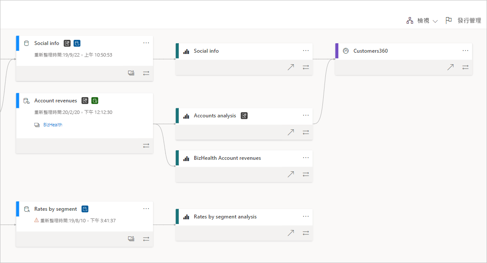
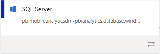
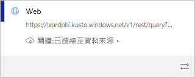
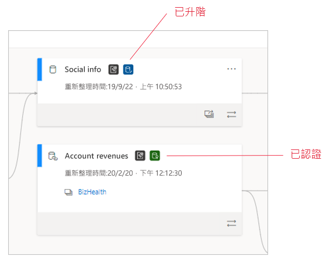
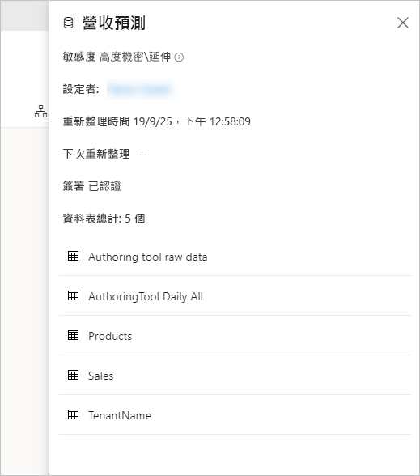
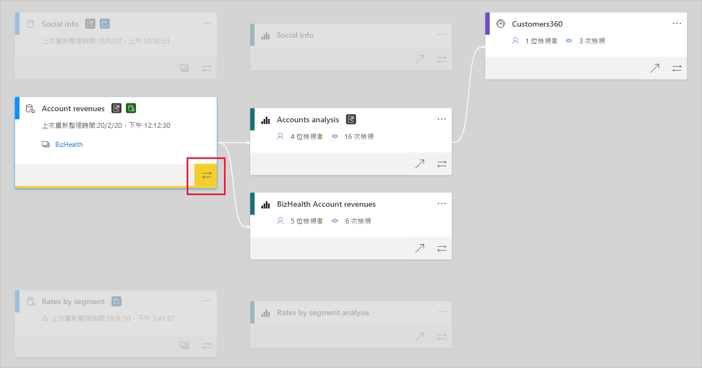

# 資料譜系
在新式商業智慧 (BI) 專案中，了解從資料來源到其目的地的資料流程，可能是一項挑戰。 如果您已建置跨多個資料來源、成品和相依性的進階分析專案，挑戰就會更加艱鉅。 「如果我變更此資料會發生什麼事？」 或「為什麼這份報表不是最新的？」 之類的問題，可能會變得難以回答。 您可能會需要一組專家或是進行深入調查，才能回答這些問題。 我們設計了資料譜系檢視來協助您回答這些問題。

 
Power BI 有數個成品類型，例如儀表板、報表、資料集和資料流程。 許多資料集和資料流程會連線到外部資料來源 (例如 SQL Server) 和其他工作區中的外部資料集。 當資料集不位於您所擁有的工作區內時，則可能位於 IT 人員或其他分析師所擁有的工作區內。 最後，外部資料來源和資料集會讓您更難得知資料的來源。 針對複雜的專案，我們引入了譜系檢視。

在譜系檢視中，您會看到工作區中所有成品之間的譜系關聯性以及其所有外部相依性。 它會顯示所有工作區成品之間的連線，包括上游和下游的資料流程連線。    

<iframe width="560" height="315" src="https://www.youtube.com/embed/rUj06dqB98g" frameborder="0" allowfullscreen></iframe>

> [!VIDEO https://youtu.be/rUj06dqB98g]

## 探索譜系檢視

每個工作區 (無論是新的或傳統的) 都會自動具有譜系檢視。 您至少需要具有工作區的參與者角色才能檢視。 如需詳細資料，請參閱本文中的[權限](#permissions)。

* 若要存取譜系檢視，請前往工作區清單檢視。 按一下 [清單檢視]  旁的箭號，然後選取 [譜系檢視]  。

   

您會在此檢視中看到所有工作區成品，以及資料如何從某個成品流向另一個成品。

**資料來源**

您會看到資料集和資料流程從中取得資料的資料來源。 在資料來源卡片上，您會看到可協助識別來源的詳細資訊。 例如，針對 Azure SQL Server，您也會看到資料庫名稱。

 
**閘道**

如果資料來源是透過內部部署閘道來連線，則會將閘道資訊新增至資料來源卡片。 如果您擁有閘道管理員或資料來源使用者的權限，則會看到詳細資訊，例如閘道名稱。

**資料集和資料流程**
 
在資料集和資料流程上，您會看到上次的重新整理時間，以及資料集或資料流程是否已經過認證或升級。

 
如果工作區中報表是以另一個工作區中的資料集為基礎，則您會在資料集卡片上看到來源工作區名稱。 選取要移至該工作區的來源工作區名稱。

* 針對任何成品，選取 [更多選項 (...)]  以檢視 [選項] 功能表。 其具有清單檢視中所有相同的動作。

若要查看任何成品的其他中繼資料，請選取成品卡片本身。 有關成品的其他資訊會顯示在側邊窗格中。 在下圖中，側邊窗格會顯示所選取資料集的中繼資料。

 
## 顯示任何成品的譜系 

假設您希望查看特定成品的譜系。

* 選取成品下方的雙箭號。

   

   Power BI 會醒目提示與該成品相關的所有成品，並讓其他的專案變暗。 

## 瀏覽和全螢幕 

譜系檢視是互動式畫布。 您可以使用滑鼠和觸控板在畫布中瀏覽、放大或縮小。

* 若要放大和縮小，請使用右下角的功能表，或是您的滑鼠或觸控板。
* 若要讓圖形本身擁有更多空間，請使用右下角的 [全螢幕] 選項。 

    

## 權限

* 您需要 Power BI Pro 授權才能查看譜系檢視。
* 譜系檢視僅適用於具有工作區存取權的使用者。
* 使用者必須具有工作區中的管理員、成員或參與者角色。 具有檢視者角色的使用者無法切換到歷程檢視。

## 考量與限制

- 譜系檢視不適用於 Internet Explorer。 請參閱[支援 Power BI 的瀏覽器](../fundamentals/power-bi-browsers.md)以取得詳細資料。

## 後續步驟

* [跨工作區的資料集簡介 (預覽)](../connect-data/service-datasets-across-workspaces.md)
* [資料集影響分析](service-dataset-impact-analysis.md)
