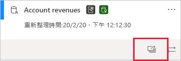

# 資料集影響分析

當對資料集進行變更，或考慮進行變更時，務必要能夠評定這些變更對相依於該資料集的下游報表和儀表板所造成影響。 **資料集影響分析**提供有助進行這項評定的資訊。
* 其顯示有多少工作區、報表和儀表板可能會受到變更影響，並可供輕鬆巡覽至受影響報表和儀表板所在的工作區，以便能夠進一步調查。
* 此分析會顯示有多少個唯一的檢視者，以及可能受影響項目上的檢視數目。 這有助判斷變更對下游項目的整體影響。 例如，針對具有 20,000 個唯一檢視者的報表調查其變更影響，可能比針對具有三個檢視者的報表調查其變更影響更為重要。
* 其提供一種簡單方式，可通知相關人員您所做的變更，或想要進行的工作。

您可輕鬆地從[資料譜系視圖](service-data-lineage.md)中啟動資料集影響分析。

## 識別共用資料集

您可對共用和非共用資料集執行資料集影響分析。 不過，此分析特別適用於跨工作區共用的資料集 (在這種情況下，要清楚了解下游相依性比使用非共用資料集複雜得多)，因為其所有相依性都會與資料集本身位於相同的工作區中。

在譜系檢視中，您可透過出現在資料集卡片左上角的圖示，以分辨共用資料集和非共用資料集之間的差異。

## 執行資料集影響分析

不論工作區中的任一資料集是否為共用，您都可以對其執行影響分析。 您無法對譜系檢視中顯示但實際上位於另一個工作區中的外部資料集執行影響分析。 為了對外部資料集執行影響分析，您需要巡覽至來源工作區。

若要執行資料集影響分析，請按一下資料集卡片上的影響分析按鈕。

[影響分析] 側邊面板隨即開啟。

![資料集 [影響分析] 側邊面板](media/service-dataset-impact-analysis/service-impact-analysis-pane.png)

* **影響摘要**會顯示可能受影響工作區、報表和儀表板的數目，以及所有資料集連線下游報表和儀表板的檢視總數。
* [通知連絡人]  連結會開啟一個對話方塊，您可在其中建立及傳送訊息，說明您對受影響工作區的連絡人清單所進行任何資料集變更。 
* **使用量明細**會針對每個工作區顯示其所含可能受影響報表和儀表板的檢視總數，以及針對每個報表和儀表板顯示檢視者和檢視總數，其中
   * 檢視者：檢視報表或儀表板的不同使用者數目。
   * Views:報表或儀表板的檢視數目

使用計量與過去 30 天相關，但不包括目前的日期。 此計數包含透過相關應用程式產生的使用量。 計量有助了解租用戶中的資料集使用方式，以及評定任何資料集變更所造成的影響。

## 通知連絡人

如果您對資料集進行了變更，或想要進行變更，則建議連絡相關使用者來告知相關資訊。 當通知連絡人時，便會將電子郵件傳送給所有受影響工作區的[連絡人清單](../service-create-the-new-workspaces.md#workspace-contact-list)。 您的名稱會出現在電子郵件中，以便連絡人能夠找到您並以新的電子郵件對話來進行回覆。 

1. 按一下 [影響分析] 側邊窗格中的 [通知連絡人]  。 [通知連絡人] 對話方塊隨即出現。

   ![[通知連絡人] 對話方塊](media/service-dataset-impact-analysis/notify-contacts-dialog.png)

1. 在文字方塊中，提供有關變更的一些詳細資料。
1. 當訊息準備好時，請按一下 [傳送]  。

> [!NOTE]
> 如果您正在執行影響分析的資料集位於典型工作區，則無法使用通知連絡人。

## 隱私權

若要對資料集執行影響分析，則必須擁有其寫入權限。 在 [影響分析] 側邊窗格中，您只會看到有權存取的工作區、報表和儀表板實際名稱。 您沒有存取權的項目則會列為**限制存取**。 這是因為有些項目名稱可能包含個人資訊。

即使沒有某些工作區的存取權，您仍會看到這些工作區的摘要使用計量，且通知連絡人訊息會送達這些工作區的連絡人清單。

## Power BI Desktop 中的影響分析

當對 Power BI Desktop 中的資料集進行變更，然後將其重新發佈到 Power BI 服務時，會顯示一則訊息，說明變更可能會影響多少個工作區、報表和儀表板，並要求確認是否要以您修改的資料集來取代目前已發佈的資料集。 此訊息也提供 Power BI 服務中完整資料集影響分析的連結，您可用以查看詳細資訊，並採取動作來降低變更的風險。

> [!NOTE]
> 訊息中顯示的資訊只表示可能影響，不一定表示有任何項目已中斷。 資料集變更對其下游報表和儀表板通常沒有負面影響，但您仍會收到此訊息，其可供清楚了解潛在影響。
>
>在訊息中，只有當一個以上的工作區包含受影響報表和儀表板時才會顯示工作區數目。

## 限制

* 傳統和個人工作區目前不支援使用計量。

## 後續步驟

* [跨工作區的資料集簡介 (預覽)](../service-datasets-across-workspaces.md)
* [資料譜系](service-data-lineage.md)
