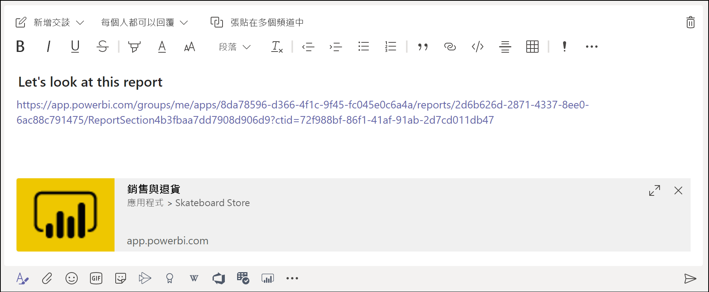
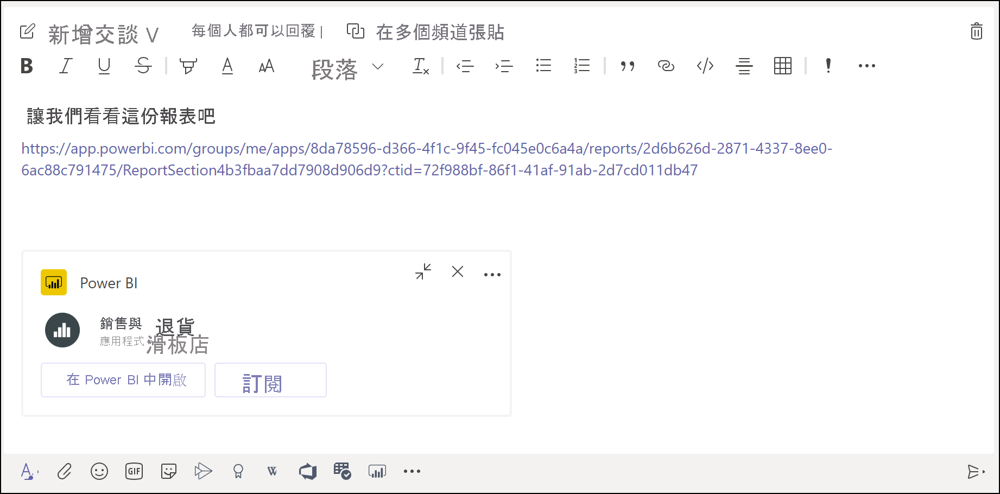
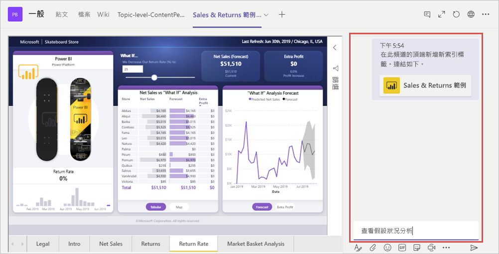

# 使用 Power BI 索引標籤在 Microsoft Teams 中內嵌報表

使用 Microsoft Teams 更新後的 Power BI 索引標籤，您可以輕鬆地在 Microsoft Teams 頻道和聊天中內嵌互動報表。 使用 Microsoft Teams 的 Power BI 標籤，可以協助同事尋找您小組使用的資料，並在小組頻道中討論資料。  當將報表、儀表板和應用程式的連結貼至 Microsoft Teams 訊息方塊時，連結預覽會顯示其相關資訊。 使用者可更輕鬆地了解該連結會通往哪一個項目。

## 需求

為了使 **Microsoft Teams 的 Power BI 索引標籤**能夠正常運作，請確定：

- 您擁有 Power BI Pro 授權，或報表包含於具備 Power BI 授權的 [Power BI Premium 容量 (EM 或 P SKU)](../admin/service-premium-what-is.md) 中。
- Microsoft Teams 必須具有 Power BI 索引標籤。
- 使用者必須登入 Power BI 服務，才能啟用 Power BI 授權並取用報表。
- 若要在具備 Power BI 索引標籤的 Microsoft Teams 中新增報表，則您在裝載報表的工作區中至少必須具備 Viewer (檢視人員) 角色。 請參閱[新工作區中角色](service-new-workspaces.md#roles-in-the-new-workspaces)以取得不同角色的資訊。
- 若要在 Microsoft Teams 中的 Power BI 索引標籤內查看報表，則使用者必須具備檢視報表的權限。

此外，若要讓**連結預覽**能夠正常運作，請確定：
- 使用者符合使用 Microsoft Teams 的 Power BI 索引標籤需求。
- 使用者已經登入 Power BI 服務。 

## 內嵌報表

遵循下列方式將報表內嵌到 Microsoft Teams 頻道或聊天中。

1. 在 Microsoft Teams 中開啟頻道或聊天，然後選取 **+** 圖示。

    

2. 選取 Power BI 索引標籤。

    

3. 使用提供的選項，從工作區或 Power BI 應用程式中挑選報表。

    

4. 索引標籤名稱會自動更新以符合報表名稱的名稱，但您可以變更該名稱。 

5. 按下 [儲存] 。

## 支援內嵌 Power BI 索引標籤的報表
您可在 Power BI 索引標籤中內嵌下列類型的報表：

- 互動式報表與編頁報表。
- [我的工作區] (全新的工作區體驗) 以及傳統工作區中的報表。
- Power BI 應用程式中的報表。

## 取得連結預覽

請遵循下列步驟來取得 Power BI 服務中的內容連結預覽。

1. 將連結複製到 Power BI 服務中的報表、儀表板或應用程式。 例如，從瀏覽器網址列複製連結。

2. 將連結貼至 Microsoft Teams 訊息方塊。 若出現提示，請登入連結預覽服務。 您可能需要等候幾秒鐘的時間才會載入連結預覽。

    

3. 成功登入之後會顯示基本的連結預覽。

    

4. 選取展開圖示以顯示豐富的預覽卡片。

    

5. 豐富的連結預覽卡片會顯示連結和相關動作按鈕

    

6. 傳送訊息。

## 授與報告存取權

在 Microsoft Teams 中內嵌報表，或為項目建立連結並不會自動提供使用者檢視報表的權限。您需要[允許使用者檢視 Power BI 中的報表](service-share-dashboards.md)。 針對小組，您可使用 Microsoft 365 群組讓這項過程更簡單。

> [!IMPORTANT]
> 請務必檢閱可以看到 Power BI 服務內報表的成員，並將存取權授與未列出的成員。

確保您小組中每一名成員都具備報表存取權限的其中一種方式是將報表放在 Power BI 中單一工作區內，並授與您小組 Microsoft 365 群組工作區的存取權。

## 連結預覽 

Power BI 中的下列項目可擁有連結預覽：
- 報表
- 儀表板
- 應用程式

連結預覽服務會要求使用者登入。 若要登出，請選取訊息方塊底部的 Power BI 圖示，然後選取 [登出]。

## 開始交談

當將 Power BI 報表索引標籤新增至 Teams 時，Teams 會自動為報表建立索引標籤交談。 

- 選取右上角的 [顯示索引標籤交談]。

    

    第一個註解是報表的連結。 該 Teams 頻道中的每個人都可以在交談中查看及討論報表。

    

## 已知的問題及限制

- Power BI 不支援 Microsoft Teams 所支援的相同當地語系化語言。 因此，您可能會在內嵌報表中看到未適當當地語系化的內容。
- Power BI 儀表板無法內嵌在 Microsoft Teams 的 Power BI 索引標籤中。
- 沒有 Power BI 授權或報表權限的使用者會看到「無法使用內容」的訊息。
- 若使用 Internet Explorer 10，則可能會遇到問題。 <!--You can look at the [browsers support for Power BI](../consumer/end-user-browsers.md) and for [Microsoft 365](https://products.office.com/office-system-requirements#Browsers-section). -->
- Microsoft Teams 的 Power BI 索引標籤不支援 [URL 篩選](service-url-filters.md)。
- 在全國性雲端中，新的 Power BI 索引標籤無法使用。 較舊的版本可能會無法在 Power BI 應用程式中支援全新工作區體驗工作區或報表。 
- 儲存索引標籤之後，即無法透過索引標籤設定來變更索引標籤名稱。 請使用重新命名選項來進行變更。
- 連結預覽服務不支援單一登入。
- 連結預覽在會議聊天或私人頻道中無法使用。

## 後續步驟
- [Share a dashboard with colleagues and others](service-share-dashboards.md) (與同事和其他人共用儀表板)  
- [在 Power BI 中建立和散發應用程式](service-create-distribute-apps.md)  
- [什麼是 Power BI Premium？](../admin/service-premium-what-is.md)

有其他問題嗎？ [嘗試在 Power BI 社群提問](https://community.powerbi.com/)
