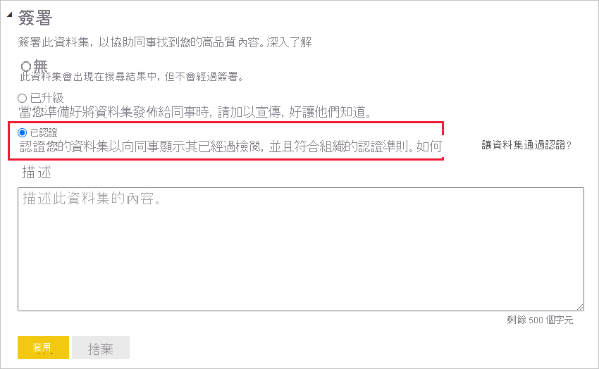
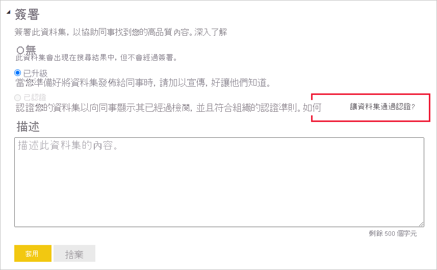
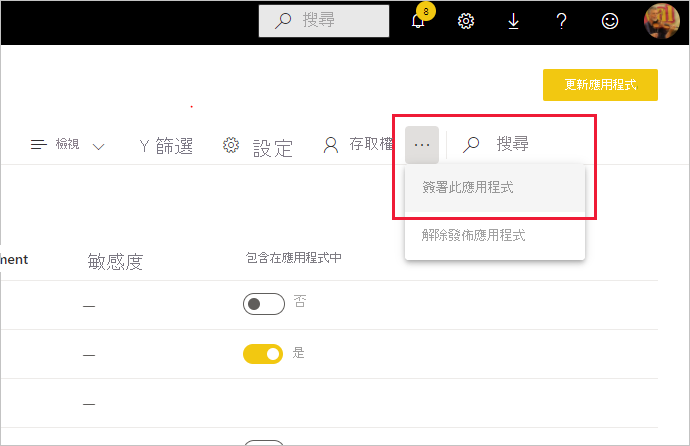

# 為內容簽署

Power BI 提供兩種方式來為有價值的高品質內容簽署，以增加其曝光率：**推廣** 與 **認證**。

* **升級**：推廣是一種將您認為有價值、值得供其他人使用的內容醒目提示的方式。 這可鼓勵人員在組織內合作，將內容進行運用和散佈。

    任何內容擁有者，以及內容所在工作區上具有寫入權限的任何成員，在認為該內容值得共用時，就可以推廣該內容。

* **認證**：認證表示內容符合組織的品質標準，且可視為能夠在整個組織中使用的可靠權威內容。

    只有授權的檢閱者可認證內容。 內容擁有者若想要看到內容經過認證，但未獲授權無法自行認證內容，則必須遵循其組織對於取得其內容認證的指導方針。

目前可以簽署
* 資料集
* 資料流程 (預覽)
* 報表 (預覽)
* 應用程式 (預覽)

本文描述如何[推廣內容](#promote-content)、如何[認證內容](#certify-content) (如果您是授權檢閱者)，以及如何[要求認證](#request-content-certification) (如果您不是授權檢閱者)。

如需詳細資訊，請參閱[簽署：推廣及認證 Power BI 內容](service-endorsement-overview.md)，以深入了解簽署。

## 推廣內容

若要推廣內容，您在要推廣內容所在工作區中必須具有寫入權限。

>[!NOTE]
>為方便說明，以下顯示資料集的 [簽署] 對話方塊。 其他內容類型的對話方塊幾乎完全相同，並具有相同的選項按鈕選項。 

1. 移至您所要推廣內容的[設定](#how-to-get-to-content-settings)。

1. 展開 [背書] 區段，然後選取 [推廣]  。 如果要推廣資料集，請提供資料集的簡短描述。

    ![選取 [已升級] 和 [套用]](media/service-endorse-content/power-bi-promote-content.png)

1. 選取 [ **套用**]。

## 認證內容

內容認證是一項重大責任，只有授權的使用者可認證內容。 其他使用者可[要求內容認證](#request-content-certification)。 本節描述如何認證內容。

>[!NOTE]
>為方便說明，以下顯示資料集的 [簽署] 對話方塊。 其他內容類型的對話方塊幾乎完全相同，並具有相同的選項按鈕選項。 

1. 在要認證內容所在的工作區上，取得寫入權限。 您可向內容擁有者或向工作區上具有系統管理員權限的任何人，要求這些權限。

1. 仔細檢閱內容，並判斷其是否符合組織的認證標準。

1. 如果決定要認證內容，請移至內容所在的工作區，然後開啟所要認證內容的[設定](#how-to-get-to-content-settings)。

1. 展開 [簽署] 區段，然後選取 [已認證]。 

    

1. 選取 [套用]  。

## 要求內容認證

如果想要認證內容，但未獲授權而無法認證，請遵循下列步驟。

>[!NOTE]
>為方便說明，以下顯示資料集的 [簽署] 對話方塊。 其他內容類型的對話方塊幾乎完全相同，並具有相同的選項按鈕選項。 

1. 移至要認證內容所在的工作區，然後開啟該內容的[設定](#how-to-get-to-content-settings)。

1. 展開 [簽署] 區段。 [已認證] 按鈕呈現灰色，因為您沒有認證內容的授權。 請按一下連結，以了解如何取得內容認證。

    
    
    >[!NOTE]
    >如果按一下上述連結，但已重新導向回此備註，這表示 Power BI 系統管理員尚未提供任何可用資訊。 在此情況下，請直接連絡 Power BI 系統管理員。

## 如何移至內容設定

[簽署] 對話方塊是透過所要簽署內容的設定來進行存取。 請遵循下列指示以移至每個內容類型的設定。

* **資料集**：在清單檢視中，將滑鼠暫留在所要簽署的資料集上方，按一下 [更多選項 (...)]，然後從出現的功能表中選擇 [設定]。
* **資料流程** (預覽)：在清單檢視中，將滑鼠暫留在所要簽署的資料流程上方，按一下 [更多選項 (...)]，然後從出現的功能表中選擇 [設定]。

* **報表** (預覽)：在清單檢視中，將滑鼠暫留在所要簽署的報表上方，按一下 [更多選項 (...)]，然後從出現的功能表中選擇 [設定]。 或者，如果報表已開啟，請選擇 [檔案] > [設定]。

* **應用程式** (預覽)：移至應用程式工作區，按一下功能表列上的 [更多選項 (...)]，然後選擇 [簽署此應用程式]。

    

## 後續步驟

* [深入了解內容簽署](service-endorsement-overview.md)
* [啟用內容認證](../admin/service-admin-setup-certification.md) (Power BI 系統管理員)
* 有問題嗎？ [嘗試在 Power BI 社群提問](https://community.powerbi.com/)
