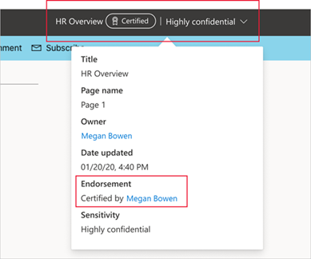

# 背書 - 推廣及認證 Power BI 內容

## 背書概觀

組織通常會有大量的 Power BI 內容，可供其 Power BI 使用者共用及重複使用，但識別值得信任的權威內容可能很困難。 背書方法可讓使用者更輕鬆地找到所需的高品質內容。 在 Power BI 和使用者尋找 Power BI 內容的其他位置 (例如 Excel) 中，已背書的內容均已清楚標示。 其在某些搜尋中也具有較高的優先順序，而您可在某些清單中對其進行排序。

有兩種類型的背書：**推廣** 和 **認證**。

* **升級**：推廣可讓使用者醒目提示其認為有價值、值得且準備好供其他人使用的內容。 這可鼓勵人員在組織內合作將內容進行散佈。

    任何內容擁有者，或內容所在工作區上具有寫入權限的任何成員，只要認為該內容值得共用，就可以推廣該內容。

    [了解如何推廣內容](service-endorse-content.md#promote-content)。

* **認證**：認證表示內容符合組織的品質標準，且可視為能夠在整個組織中使用的可靠權威內容。

    只有[選定的一組檢閱者 (由 Power BI 系統管理員定義)](../admin/service-admin-setup-certification.md) 才有權認證內容。 內容擁有者若想要看到其內容經過認證，但未獲授權無法自行認證內容，則必須遵循其組織對於取得其內容認證的指導方針。

    了解如何[認證內容](service-endorse-content.md#certify-content)或[要求認證](service-endorse-content.md#request-content-certification)。

    **只有在 Power BI 系統管理員已針對組織[啟用並設定認證](../admin/service-admin-setup-certification.md)時，才能使用認證**。

下圖說明當在搜尋建置報表所依據的資料集時，如何清楚識別已背書的內容 (推廣及認證)。

## 可背書的內容類型
Power BI 目前支援以下項目的背書：
* 資料集
* 資料流程 (預覽)
* 報表 (預覽)
* 應用程式 (預覽)

## 識別已背書的內容

在 Power BI 和您可找到 Power BI 內容的位置 (例如 Excel) 中，清單、卡片及其他位置中的已背書內容會以徽章和圖示標示。 下列徽章和圖示可識別已背書的內容。

|徽章|圖示|
|---------|---------|
|||
|||
|||

此外，若您是在報表或應用程式中，則可透過標頭查看背書狀態。
* 認證會顯示在標頭和標頭下拉式清單中，您也可以在其中查看進行認證的人員。

    

* 推廣只會顯示在標頭下拉式清單中。
 
    

## 決定是否要為應用程式或報表背書

背書主要用於您想要讓使用者尋找、使用及可能重新共用的內容項目 (應用程式、報表、資料集與資料流程)。

當與廣大的群眾共用資料時，Power BI 的最佳做法是透過應用程式共用該資料。 若要遵循這個最佳做法，您希望使用者能夠輕鬆地找到該應用程式。 在這種情況下，您應該為應用程式背書。 

不過，如果仍然發現直接共用報表很有用，則請為報表本身背書。 

不論您是共用報表或應用程式，如果基礎資料集很乾淨且可進行共用，那麼最好也要為資料集進行背書。 這同樣適用於資料流程。  

## 後續步驟

* [推廣或認證 Power BI 內容](service-endorse-content.md)
* [為組織啟用認證](../admin/service-admin-setup-certification.md) (Power BI 系統管理員)
* 有問題嗎？ [嘗試在 Power BI 社群提問](https://community.powerbi.com/)