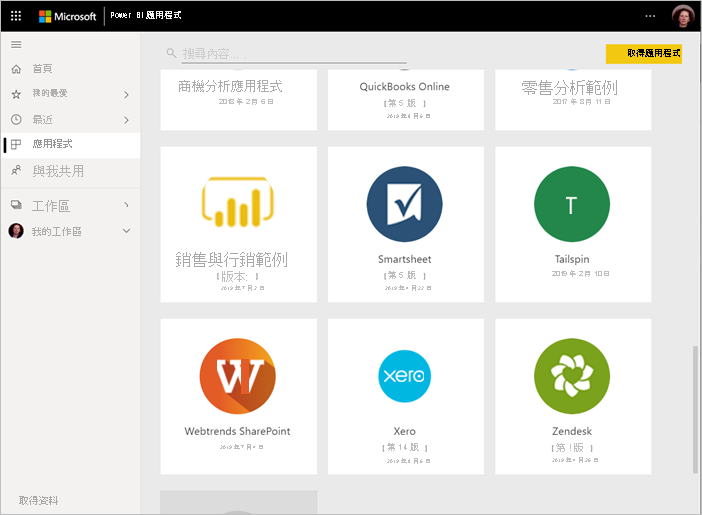
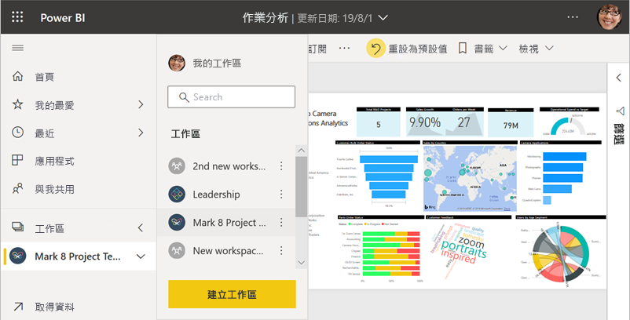
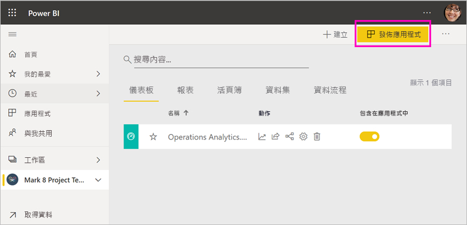
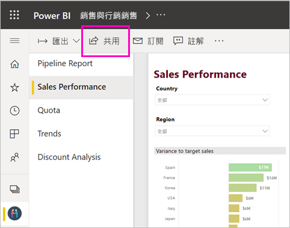
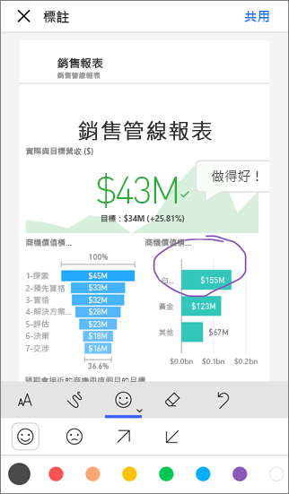

# 在 Power BI 中共用成品的方式

您已建立儀表板和報表。 或許您也已透過它們與同事共同作業。 現在，您希望其他人可以存取它們。 散發它們的最佳方式為何？ 在本文中，我們會比較在 Power BI 內共同作業與共用的以下選項：

* 與同事共同作業，以在「工作區」中建立有意義的報表和儀表板。
* 將這些儀表板和報告結合為「應用程式」，並將它們散發給較大群組或您的整個組織。
* 建立「共用資料集」，可讓同事在其工作區中用作為報表的基礎。
* 從服務或 Power BI 行動裝置應用程式，與一些人員共用儀表板或報表。
* 從 Power BI 行動裝置應用程式標註並共用。
* 在 Microsoft Teams 中內嵌報表。
* 列印報表。
* 在安全的入口網站或公用網站中「內嵌」報表。
* 建立可讓您透過 Microsoft AppSource 散發給外部 Power BI 使用者的「範本應用程式」。

無論您選擇哪個選項，都必須具有 [Power BI Pro 授權](../fundamentals/service-features-license-type.md)，或內容必須位於[進階容量](../admin/service-premium-what-is.md)中，才能共用您的內容。 根據您選擇的選項，檢視您內容的同事會有不同授權需求。 下列各節組說明詳細資料。 

*Power BI 服務中的應用程式*

## 在工作區中共同作業

當小組一起工作時，會需要存取同一份文件，以便快速執行共同作業。 在 Power BI 工作區中，小組可聚集在一起，以便針對他們的儀表板、報表、資料集和活頁簿共用其擁有權和管理。 有時候 Power BI 使用者會根據組織的結構組織其工作區，其他時間則是針對特定專案建立工作區。 還是有其他組織使用數個工作區，來儲存他們所使用之不同版本的報表或儀表板。 

工作區提供可決定您同事具有哪些權限的角色。 您可以使用這些角色來決定誰可以管理整個工作區，或編輯其內容以及散發其內容。

您可以自然地將內容放入 [我的工作區]，然後從該處共用。 但是工作區比 [我的工作區] 更適合共同作業，原因是它們允許內容的共同擁有權。 您和您的整個小組可以輕鬆地進行更新或授與其他人存取權。 [我的工作區] 最適合個人用於一次性或個人內容。

讓我們假設您有要與同事共用的已完成儀表板。 授與他們儀表板存取權的最佳方式為何？ 答案需視許多因素而定。 

- 如果您的同事需要將儀表板保持在最新狀態，或需要存取工作區中的所有內容，請考慮將他們新增至工作區。 
- 如果同事只需要查看該儀表板而不是工作區中的所有內容，您也有替代方案。 如果幾位人員只需要一個儀表板，那麼共用儀表板可能是最好的解決方案。
- 然而，如果儀表板是您必須散發給許多同事之更大內容集的一部分，則發佈「應用程式」可能是最佳選擇。

Power BI 具有新的工作區體驗。 讀取[建立新的工作區](service-create-the-new-workspaces.md)以查看工作區有哪些變更。 

## 在應用程式中散發見解

假設您想要將自己的儀表板散發給組織內廣大群眾。 您和同事已建立「工作區」，接著在工作區中建立並調整了儀表板、報表和資料集。 現在，您可以選取您要的儀表板和報表，並將它們發佈為應用程式，以供群組或整個組織使用。

在 Power BI 服務 ([https://app.powerbi.com](https://app.powerbi.com)) 中可輕鬆地找到及安裝應用程式。 您可以將應用程式的直接連結傳送給商務使用者，或者他們可以在 AppSource 中進行搜尋。 如果您的 Power BI 系統管理員賦予您權限，您可以在您同事的 Power BI 帳戶中自動安裝應用程式。 深入了解如何[發佈您的應用程式](service-create-distribute-apps.md)。

當他們安裝應用程式之後，就可以在瀏覽器或行動裝置中檢視此應用程式。

若要讓使用者檢視您的應用程式，他們也必須有 Power BI Pro 授權，否則，應用程式必須儲存在 Power BI Premium 容量中。 如需詳細資訊，請參閱[什麼是 Power BI Premium？](../admin/service-premium-what-is.md)。

您也可以將應用程式發佈給組織外部的人員。 他們可以檢視應用程式內容並與其互動，但不能與其他人共用應用程式內容。 現在您可以建立「範本應用程式」，將其部署至任何 Power BI 客戶。

## 共用資料集

讓我們面對現實吧，有些人比別人更擅長在報表中建立設計完善的高品質資料模型。 或許就是您。 您整個組織都可以受益於這些設計完善的資料模型。 「共用資料集」適合擔任該角色。 當您以每個人都應使用的資料模型建立報表時，可以將該報表儲存至 Power BI 服務，並將其使用權限提供給合適的人員。 然後他們就可以在您的資料集上建立報表。 如此一來，每個人的報告都會基於相同資料，並可看到相同的「真實版本」。

深入了解[建立和使用共用資料集](../connect-data/service-datasets-across-workspaces.md)。

## 共用儀表板和報表

假設您已在自己的 [我的工作區] 或在工作區中完成儀表板和報表，而且希望一些其他人可加以存取。 其中一項存取方法是「共用」它。 

您和內容的共用人員都必須具有 Power BI Pro 授權，或內容必須位於 [Premium 容量](../admin/service-premium-what-is.md)的工作區中，才能共用內容。 當您共用儀表板或報表時，接受者可以檢視此儀表板或報表並與其互動，但是無法編輯此儀表板或報表。 除非您為基礎資料集套用[資料列層級安全性 (RLS)](../admin/service-admin-rls.md)，否則他們可以看到您儀表板或報表中的相同資料，亦可存取基礎資料集中的所有資料。 如果您允許的話，您與其共用的同事可以與他們的同事共用。 

您也可以與組織外部人員共用。 他們也可以檢視儀表板或報表並其互動，但不能共用儀表板或報表。 

深入了解從 Power BI 服務[共用儀表板和報表](service-share-dashboards.md)。 您也可以將篩選新增至連結並[共用已篩選的報表檢視](service-share-reports.md)。

## 從 Power BI 行動裝置應用程式標註並共用

在 iOS 和 Android 裝置的 Power BI 行動裝置應用程式中，您可以標註磚、報表或視覺效果，然後透過電子郵件與任何人共用它。

您會共用磚、報表或視覺效果的快照集，而收件者會看到它與您送出郵件時完全相同的內容。 該郵件還包含儀表板或報告的連結。 如果收件者具有 Power BI Pro 授權，或內容位於[進階容量](../admin/service-premium-what-is.md)中，而且您已經與收件者共用物件，他們便可加以開啟。 您可以將磚的快照集傳送給任何人，而不只是同一電子郵件網域中的同事而已。

深入了解從 iOS 和 Android 的行動應用程式[標註並共用磚、報表和視覺效果](../consumer/mobile/mobile-annotate-and-share-a-tile-from-the-mobile-apps.md)。

您也可以從 Windows 10 裝置的 Power BI 應用程式[共用磚的快照集](../consumer/mobile/mobile-windows-10-phone-app-get-started.md)。

## 在 Microsoft Teams 中內嵌報表

藉由在 Microsoft Teams 中內嵌 Power BI 報表和 Power BI 編頁報表，即可增加組織中以資料導向的共同作業。 您可為每個個別報表新增不同的 Power BI 索引標籤，並為每個索引標籤提供報表的名稱或任何其他名稱。 同事可以在 Teams 的 Power BI 索引標籤上檢視報表。 他們也可以開啟 [交談] 視窗，並直接在 Teams 中對報表加上註解。 深入了解[在 Microsoft Teams 中內嵌報表](service-embed-report-microsoft-teams.md)。

## 列印或儲存為 PDF 或其他靜態檔案

您可以從 Power BI 服務列印整份儀表板、儀表板磚、報表頁面或視覺效果，或將其儲存為 PDF (或其他靜態檔案格式)。 一次只能列印一頁報表 - 您無法一次列印整份報表。 深入了解[列印或儲存為靜態檔案](../consumer/end-user-print.md)。

## 在安全的入口網站或公用網站中內嵌報表

### 在安全的入口網站中內嵌

您可在使用者想要看到 Power BI 報表的入口網站或網站中，予以內嵌。  
Power BI 服務中的 [在 SharePoint Online 內嵌] 和 [內嵌] 選項可讓您為內部使用者內嵌報表，而且安全無虞。 

- [在 SharePoint Online 內嵌] 可與 SharePoint Online 的 Power BI Web 組件搭配使用。 可提供單一登入體驗，掌控如何內嵌報表。 
- 只要是支援使用 URL 或 iFrame 內嵌內容的入口網站或網站，則皆可使用 [內嵌] 選項。 

無論您選擇哪種選項，Power BI 都會在使用者查看內容之前強制執行所有權限和資料安全性。 檢視報表的人必須有適當授權。 深入了解 Power BI 的[在 SharePoint Online 內嵌](service-embed-report-spo.md)和[內嵌](service-embed-secure.md)選項。

### 發佈到公用網站

您可以透過 [發佈到 Web] 將 Power BI 報表發佈到整個網際網路，方法是在任何裝置上將互動式視覺效果內嵌到部落格文章、網站、社交媒體和其他線上通訊。 網際網路上的任何人都可以檢視您的報表，而且您無法控制誰可以查看您的發行內容。 他們不需要 Power BI 授權。 您只能在可編輯的報表中使用發行至網站。 如果報表是與您共用，或報表是在應用程式中，則您無法將報表發行至網站。 深入了解[發行至網站](service-publish-to-web.md).

>[!Warning]
>僅使用 [發佈至網路](service-publish-to-web.md) 來公開共用內容，而不是內部共用。

## 建立及部署範本應用程式

「範本應用程式」設計用於公開散發，通常是在 Microsoft AppSource 中。 當您建置應用程式，甚至不必撰寫程式碼，就可以將其部署至任何 Power BI 客戶。 您的客戶連線到他們自有資料，並將他們自己的帳戶具現化。 深入閱讀 [Power BI 範本應用程式](../connect-data/service-template-apps-overview.md)。

## 後續步驟

* [與同事和其他人共用儀表板](service-share-dashboards.md)
* [在 Power BI 中建立和發佈應用程式](service-create-distribute-apps.md)
* [在安全入口網站或網站中內嵌報告](service-embed-secure.md)

有任何意見嗎？ 請移駕 [Power BI 社群網站](https://community.powerbi.com/)提供您的建議。

有其他問題嗎？ [試試 Power BI 社群](https://community.powerbi.com/)
