# 在新的工作區體驗中監視使用計量 (預覽)

了解您內容的使用方法，可協助您展示您的影響力及優先處理方向。 您的使用計量可能會顯示組織中有大部分人員每天都使用同一份報表， 也可能會顯示沒有任何人檢視過您建立的儀表板。 這種類型的意見反應對指引工作投入方向毫無價值。

若您在新式工作區中建立報表，就能利用改進的使用計量報表。 這些報表可讓您探索整個組織中使用這些報表的人員，以及他們使用報表的方式。 您也可以識別概略效能問題。 新式工作區體驗中改良的使用報表，取代了[監視 Power BI 儀表板與報表的使用計量](service-usage-metrics.md)中記載的現有使用計量報表。

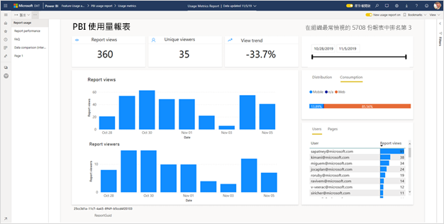

> [!NOTE]
> 您只能在 Power BI 服務中執行使用計量報表。 不過，如果您儲存使用計量報表或將其釘選到儀表板，您可以在行動裝置上開啟該報表並與其互動。

## 必要條件

- 您需要有 Power BI Pro 授權才能執行及存取使用計量資料。 不過，使用計量功能會擷取所有使用者的使用資訊，不論他們所被指派的授權為何。
- 若要針對報表存取改良的使用計量，報表必須位於新式工作區，而且您必須擁有該報表的編輯存取權。
- 您的 Power BI 系統管理員必須已為內容建立者啟用使用計量。 您的 Power BI 系統管理員可能也已啟用在使用計量中收集個別使用者資料。 請參閱如何[在管理入口網站中啟用這些選項](../admin/service-admin-portal.md#control-usage-metrics)。

## 建立並檢視改良的使用計量報表

只有具備系統管理員、成員或參與者權限的使用者才能檢視改良的使用計量報表。 檢視人員權限不足。 如果您至少是報表所在新式工作區上的參與者，您可以使用下列程序來顯示改良的使用計量：

1. 開啟包含您要分析其使用計量之報表的工作區。
2. 從工作區內容清單中，開啟報表的操作功能表，然後選取 [檢視使用計量報表]。 或者，開啟報表，然後開啟命令列上的操作功能表，然後選取 [使用計量]。

    ![選取 [使用計量]](media/service-modern-usage-metrics/power-bi-modern-view-usage-metrics.png)

1. 當您第一次執行此作業時，Power BI 會建立使用計量報表，讓您了解它準備好的時機。

    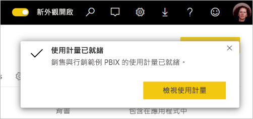

1. 若要查看結果，請選取 [檢視使用計量]。
2. 如果這是您第一次執行此動作，Power BI 可能會開啟舊的使用計量報表。 若要顯示改良的使用計量報表，請在右上角，將 [關閉新使用量報表] 開關切換至 [開啟]。

    

    > [!NOTE]
    > 只有當您的報表位於新式工作區時，您才能看到 [新使用量報表] 開關。 舊版工作區不提供改良的使用計量報表。

## 關於改良的使用計量報表

當您顯示此改進的使用計量報表時，Power BI 會產生預先建置的報表。 其中包含過去 30 天內該內容的使用計量。 這份報表和您已經熟悉的 Power BI 報表很相似。 您可以根據終端使用者接收存取的方式進行配量，不論他們是透過 Web 應用程式或行動裝置應用程式等進行存取。 隨著您的報表不斷地演進，使用計量報表也會演進。 其每天都會更新資料。

> [!NOTE]
> 使用計量報表不會出現在 [最近]、[工作區]、[我的最愛] 或其他內容清單中。 它們無法被新增至應用程式。 如果您從使用計量報表將磚釘選到儀表板，便無法將該儀表板新增至應用程式。

### 使用計量報表資料集

當您第一次啟動改進的使用計量報表時，Power BI 會自動建立使用計量報表資料集。 改進的使用計量報表會依賴該資料集。 Power BI 接著會每天重新整理此資料集。 雖然您無法變更重新整理排程，但您可以更新 Power BI 用來重新整理使用計量資料的認證。 若您的認證已到期，或是您從資料集所在的工作區中移除第一次啟動使用計量報表的使用者，則可能必須繼續進行排程的重新整理。

> [!NOTE]
> 使用計量資料集目前仍處於預覽階段，因此可能會出現少許變更並影響自訂報表。  

### 使用計量報表頁面

改良的使用計量報表包含下列報表頁面：

- **報表使用量**    提供報表檢視和報表檢視人員的相關資訊，例如，依日期排序檢視報表的使用者人數。
- **報表效能**    顯示依取用方法和瀏覽器類型細分的一般報表開啟時間。
- **常見問題集**     提供常見問題的解答，例如什麼是「檢視人員」，什麼是「檢視」？

### 報告哪些計量？

| **頁面** | **計量** | **描述** |
| --- | --- | --- |
| 報告使用方式 | 報表檢視/報表開啟 | 每次有人開啟報表，並在報表上代表不重複的登陸時，就會記錄報表檢視。 其會回答以下問題：「報表的存取頻率為何？」 此報表檢視的定義與先前的使用計量報表不同。 變更報表頁面不會再算作額外報表檢視。 反之，變更報表頁面會計入下一個計量，也就是報表頁面檢視。 活動 (例如共用和釘選) 不再被視為使用計量。 |
| 報告使用方式 | 報表頁面檢視 | 每次有人檢視報表頁面時，就會記錄報表頁面檢視。 這代表所有頁面的檢視次數總計。 其會回答以下問題：「報表頁面的存取頻率為何？」 因此，變更報表頁面會計入報表頁面檢視。 如需重要詳細資料，請參閱[考量與限制](#considerations-and-limitations)。 |
| 報告使用方式 | 唯一檢視人員 | 檢視人員是在一段時間內 (以 AAD 使用者帳戶為基礎) 至少開啟一次報表的人員。 |
| 報告使用方式 | 檢視趨勢 | 檢視趨勢反映了一段時間的檢視計數變更。 這會比較所選時段的前半段與後半段。 |
| 報告使用方式 | 日期交叉分析篩選器 | 您可以在 [報表使用量] 頁面上變更時間間隔，例如計算每週或每兩週的趨勢。 在 [報表使用量] 頁面的左下角，您可以判斷所選報表之可用使用量資料的最早和最晚日期。 |
| 報告使用方式 | 排名 | 排名以檢視計數為基礎，而且會顯示該報表與組織中所有其他報表相比的受歡迎程度。 排名 1 表示該報表在組織的所有報表中被查看最多次。   |
| 報告使用方式 | 每日的報表檢視 | 每日的報表檢視總數。 在報表層級計算時，不會考慮報表頁面檢視。 |
| 報告使用方式 | 每日的報表檢視人員 | 檢視報表的不同使用者總數 (以 AAD 使用者帳戶為基礎)。 |
| 報告使用方式 | 散發方法 | 使用者如何取得報表的存取權，例如成為工作區的成員、取得與其共用的報表，或是安裝應用程式。 |
| 報告使用方式 | 平台交叉分析篩選器 | 如果透過 Power BI 服務 (powerbi.com)、Power BI Embedded 或行動裝置存取報表。 |
| 報告使用方式 | 具有報表檢視的使用者 | 顯示曾開啟報表的使用者清單 (依檢視計數排序)。 |
| 報告使用方式 | 頁面 | 如果報表有 1 個以上的頁面，請依檢視的頁面分割報表。 「空白」表示報表頁面在新頁面出現於交叉分析篩選器清單中的 24 小時內新增，或是報表頁面已刪除。 [空白] 包含這類情況。 |
| 報表效能 | 一般開啟時間 | 一般報表開啟時間對應至開啟報表所需時間的第 50 個百分位數。 換句話說，這是低於完成 50% 開啟報表動作的時間。 [報表效能] 頁面也會依據取用方法與瀏覽器類型細分一般報表開啟時間。 目前，我們會測量初始報表載入與檢視第一頁的效能。 測量會在要求報表時開始，並在最後一個視覺效果完成轉譯時結束。 效能計量中不包含報表互動，例如配量、篩選或變更頁面。  |
| 報表效能 | 開啟時間趨勢 | 開啟時間趨勢會反映一段時間內的開啟報表效能變更。 它會比較所選時段前半段的報表開啟時間與後半段的開啟時間。 |
| 報表效能 | 日期交叉分析篩選器 | 您可以在 [報表效能] 頁面上變更時間間隔，例如計算每週或每兩週的趨勢。 在 [報表效能] 頁面的左下角，您可以判斷所選報表之可用使用量資料的最早與最晚日期。 |
| 報表效能 | 每日效能 | 針對每個日期計算的開啟報表動作之 10%、50% 與 90% 的效能。 |
| 報表效能 | 七天的效能 | 過去七天內，針對每個日期所計算開啟報表動作的 10%、50% 與 90% 效能。 |
| 報表效能 | 取用方法 | 使用者開啟報表的方式，例如透過 Power BI 服務 (powerbi.com)、Power BI Embedded 或行動裝置。 |
| 報表效能 | 瀏覽器 | 使用者用來開啟報表的瀏覽器，例如 Firefox、Edge 或 Chrome。 |

### 檢視與檢視人員計量的工作範例

假設我們有四份由三個使用者存取的報表，如下所示：

| **報表名稱** | **使用模式** |
| --- | --- |
| KPI 報表 | <ul><li>使用者 A 開啟第 1 頁的報表。 |
| HR 報表 | <ul><li>使用者 A 開啟第 1 頁的報表，然後檢視第 2 頁、第 3 頁與第 4 頁。 然後，他們再次檢視第 1 頁。 |
| 財務報表 | <ul><li>使用者 A 開啟第 1 頁的報表，然後檢視第 2 頁。</li><li>使用者 B 開啟第 1 頁的報表。</li><li>使用者 C 開啟第 1 頁的報表，然後檢視第 3 頁。</li></ul> |
| 銷售報表 | <ul><li>使用者 A 開啟第 1 頁的報表，然後檢視第 2 頁</li><li>使用者 C 開啟第 2 頁的報表 (例如，透過書籤)</li><li>當天稍晚，使用者 C 開啟第 1 頁的報表 </li></ul> |

假設所有用戶端遙測都連線到 Power BI，則產生的計量會是：

| **報表名稱** | **報表檢視** | **報表頁面檢視** | **檢視者** |
| --- | --- | --- | --- |
| KPI 報表 | 1 | 1 | 1 |
| HR 報表 | 1 | 5 | 1 | 
| 財務報表 | 3 | 5 | 3 |
| 銷售報表 | 3 | 4 | 2 |

## 更新使用計量報表認證

使用下列程序來接管使用計量報表資料集，並更新認證。

1. 開啟包含您要更新其使用計量報表資料集之報表的工作區。
2. 在頂端的黑色標題列中，選取 [設定] 圖示，然後選取 [設定]。

    ![選取 [設定]](media/service-modern-usage-metrics/power-bi-settings-settings.png)

3. 切換至 [資料集] 索引標籤。

1. 選取 [使用計量報表] 資料集 

    ![選取 [使用計量資料集]](media/service-modern-usage-metrics/power-bi-select-usage-metrics.png)
    
    如果您不是目前的資料集擁有者，您必須接管擁有權，才能更新資料來源認證。 
    
5. 選取 [接管] 按鈕，然後在 [接管資料集設定] 對話方塊中，再次選取 [接管]。

1. 在 [資料來源認證] 下，選取 [編輯認證]。

    

2. 在 [設定使用計量報表] 對話方塊中，選取 [登入]。

    ![選取 [登入]](media/service-modern-usage-metrics/power-bi-modern-usage-metrics-configure.png)

1. 完成登入順序，並記下已成功更新資料來源的通知。

    > [!NOTE]
    > 使用計量報表資料集包含過去 30 天的使用量資料。 最多可能需要 24 小時的時間，才能匯入新的使用量資料。 您無法使用 Power BI 使用者介面來觸發手動重新整理。

## 停用使用計量報表

使用計量報表是 Power BI 系統管理員或全域管理員可以開啟或關閉的功能。 系統管理員可以更精細地控制哪些使用者可以存取使用計量；針對組織中的所有使用者，它們預設為「開啟」。 請參閱管理入口網站文章中的[控制使用計量](../admin/service-admin-portal.md#control-usage-metrics)來取得這些設定的詳細資料。

> [!NOTE]
> 只有 Power BI 租用戶的系統管理員可以看見管理入口網站並編輯設定。

## 從使用計量報表排除使用者資訊

根據預設，會針對使用計量啟用每位使用者的資料。 內容取用者帳戶資訊會包含在計量報表中。 若管理員不想要針對部分或所有使用者公開此資訊，他們可以從您的使用量報表中排除使用者資訊。 在 Power BI 管理入口網站租用戶設定中，他們可以針對指定的安全性群組或整個組織，停用使用計量中每位使用者的資料。

1. 在管理入口網站的 [租用戶設定] 索引標籤中，於 [稽核與使用量設定] 下，展開 [內容建立者之使用計量內每位使用者的資料] 並選取 [停用]。

2. 決定是否 [刪除目前使用計量內容中所有現有的每位使用者資料]。 選取 [套用]  。

    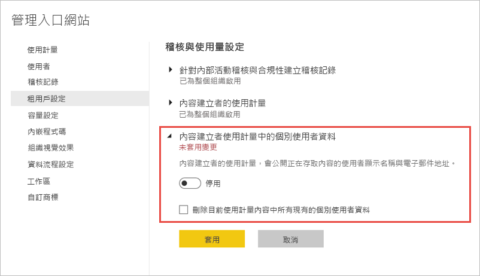

如果使用者資訊已排除，使用量報表會將使用者稱為「未命名」。

針對整個組織停用使用計量時，系統管理員可以使用 [刪除所有現有的使用計量內容] 選項，來刪除利用使用計量報表所建置的所有現有報表與儀表板磚。 此選項會移除組織中可能已使用它之所有使用者的使用計量資料之所有存取權。 刪除現有使用計量內容是無法復原的。

> [!NOTE]
> 只有 Power BI 租用戶的系統管理員可以看到管理入口網站，並在內容建立者設定的 [使用計量] 中設定每位使用者的資料。

## 自訂使用計量報表

若要深入鑽研報表資料，或針對底層資料集建置自己的報表，您有幾個選項：

- **在 Power BI 服務中 [建立報表複本](#create-a-copy-of-the-usage-report)。**   使用 [儲存複本] 來建立個別的使用計量報表執行個體，並根據您的特定需求加以自訂。
- **使用新的報表 [連線到資料集](#create-a-new-usage-report-in-power-bi-desktop)。**   針對每個工作區，資料集的名稱都是「使用計量報表」，如先前在[使用計量報表資料集](#usage-metrics-report-dataset)一節中所述。 您也可以使用 Power BI Desktop 來根據底層資料集建置自訂使用計量報表。
- **[使用 [在 Excel 中進行分析]](#analyze-usage-data-in-excel)。**   您也可以透過 Microsoft Excel 的樞紐分析表、圖表與交叉分析篩選器功能來分析 Power BI 使用量資料。 深入了解[在 Excel 中進行分析](service-analyze-in-excel.md)功能。

### 建立使用量報表的複本

當您建立唯讀且預先建置之使用量報表的複本時，Power BI 會建立該報表的可編輯執行個體。 乍看之下，它們是完全相同的。 不過，您現在可以在 [編輯] 檢視中開啟該報表；新增視覺效果、篩選和頁面；修改或刪除現有的視覺效果等。 Power BI 會將新報表儲存在目前的工作區中。

1. 在新的使用計量報表中，選取 [較多選項] 功能表 (...)，然後選取 [儲存複本]。

    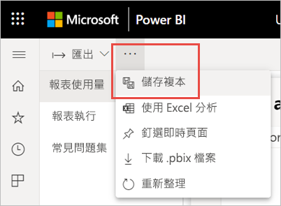

2. 在 [儲存您的報表] 對話方塊中，輸入名稱，然後選取 [儲存]。

    Power BI 會建立可編輯的 Power BI 報表、將它儲存在目前的工作區中，並開啟報表複本。 

3. 選取 [較多選項] 功能表 (...)，然後選取 [編輯] 以切換到 [編輯] 檢視。 

    例如，您可以變更篩選條件、新增新的頁面，以及建置新的視覺效果、設定字型與色彩格式等等。

1. 新的報表會儲存在目前工作區中的 [報表] 索引標籤中，而且也會新增至 [最近] 內容清單。

    ![[報表] 索引標籤上的新報表](media/service-modern-usage-metrics/power-bi-modern-usage-metrics-new-report.png)
    
> [!NOTE]
> 當您儲存使用計量報表的複本時，系統會將其視為一般 Power BI 報表。 在工作區中具有檢視權限的所有使用者都可以存取該報表，包括「檢視人員」角色中的使用者。

### 在 Power BI Desktop 中建立新的使用量報表

您可以根據使用計量報表資料集，在 Power BI Desktop 中建立新的使用量報表。 若要建立使用計量報表資料集的連線，並建立您自己的報表，您必須登入 Power BI Desktop 中的 Power BI 服務。 

1. 開啟 Power BI Desktop。

2. 如果您未登入 Power BI 服務，請在 [檔案] 功能表上，選取 [登入]。

1. 若要連線到使用計量報表資料集，請在 [常用] 功能區中選取 [取得資料]。

4. 在左窗格中，選取 [Power Platform]，然後選取 [Power BI 資料集] > [連線]。

    ![[取得資料] > [Power Platform]](media/service-modern-usage-metrics/power-bi-desktop-get-data.png)

1. 在 [搜尋] 方塊中，瀏覽至所需的資料集，或輸入「使用計量報表」。 

6. 在 [工作區] 欄中確認您選取了正確的資料集，然後選取 [建立]。 

    ![選取 [使用計量報表] 資料集](media/service-modern-usage-metrics/power-bi-desktop-select-usage-metrics.png)

7. 檢查 Power BI Desktop 中的 [欄位] 清單，該清單可讓您存取所選資料集中的資料表、資料行與計量。

    ![檢視 [使用計量報表] 欄位清單](media/service-modern-usage-metrics/power-bi-desktop-fields-list.png)

1. 現在您可以從相同的使用計量報表資料集建立及共用自訂的使用量報表。

### 在 Excel 中分析使用量資料

當您連線到 Excel 中的使用量資料時，您可以建立使用預先定義之量值的樞紐分析表。 請注意，當連線至 Power BI 資料集時，Excel 樞紐分析表不支援數值欄位的拖放功能彙總。

1. 首先，如果您尚未這麼做，請[建立使用計量報表的複本](#create-a-copy-of-the-usage-report)。 

2. 開啟新的使用計量報表，選取 [較多選項] 功能表 (…)，然後選取 [在 Excel 中進行分析]。

    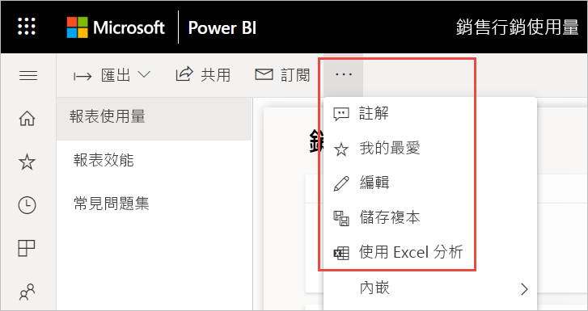

1. 若您看到 [首先，您需要一些 Excel 更新] 對話方塊，請選取 [下載] 並安裝最新的 Power BI 連線更新。 否則，請選取 [我已安裝這些更新]。

    

    > [!NOTE]
    > 某些組織可能會有防止安裝 [在 Excel 中進行分析] 必要更新的群組原則規則。 如果您無法安裝更新，請洽詢您的系統管理員。

1. 在詢問您想要對使用計量報表 .odc 檔案執行之動作的瀏覽器對話方塊中，選取 [開啟]。

    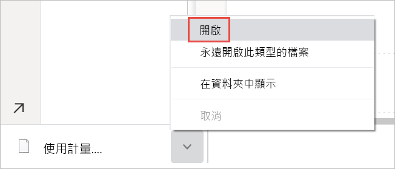

1. Power BI 會啟動 Excel。 確認 .odc 檔案的檔案名稱和路徑，然後選取 [啟用]。

    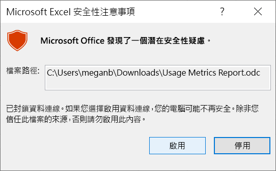

1. 現在，Excel 已開啟，而且您有空白的樞紐分析表，您可以將欄位拖曳到 [資料列]、[資料行]、[篩選] 與 [值] 方塊，並在使用量資料中建立自訂檢視。

    

## 在國家/地區雲端中的使用計量

Power BI 分別在不同的國家/地區雲端提供。 這些雲端提供與 Power BI 全域版本同層級的安全性、隱私權、合規性與透明度，結合了適用於當地法規獨特模型的服務傳遞、資料落地、存取與控制。 新式使用計量目前於下列國家/地區雲端中提供： 

- 美國 Government Community Cloud
- 美國政府社群雲端 - 高
- 美國國防部
- 中國

如需詳細資訊，請參閱[國家/地區雲端](https://powerbi.microsoft.com/clouds/)。

## 考量與限制

請務必了解比較改良的使用計量報表及其前身時，可能會產生差異。 特別是，報表檢視計量現在是以從 Power BI 服務收集的活動資料為基礎。 舊版的使用計量報表僅依賴用戶端遙測，這不一定會符合從服務收集的使用計量。 此外，改進的使用計量報表會針對「報表檢視」使用不同的定義。 「報表檢視」是開啟報表事件，每次有人開啟報表時，就會在服務中記錄。 變更報表頁面不會再算作額外報表檢視。 我們現在包含報表頁面檢視計量，其會特別計算每個頁面檢視。

> [!NOTE]
> 因為改進的使用計量報表依賴從 Power BI 服務收集的活動資料，所以報表檢視計量現在會符合稽核記錄與活動記錄中的活動彙總計數。 由於網路連線不一致、廣告封鎖程式或其他用戶端問題導致的活動低估與高估，不再使檢視人員與報表檢視計數產生扭曲。 然而，報表頁面檢視仍然依賴用戶端遙測，而且可能會受到影響。

除了上述舊版和改良的使用計量報表之間的差異之外，請注意下列預覽版本的限制：

- 儀表板使用計量仍依賴舊版的使用計量報表，而且尚未於新式使用計量中推出。
- 改良的使用計量報表僅適用於新式工作區中的報表。 舊版工作區中的報表僅支援舊版的使用計量報表。
- 效能資料與報表頁面檢視計量會依賴將資料傳送至 Power BI 的用戶端/裝置。 依據組織所設定的網路延遲、廣告封鎖程式、防火牆與網路規則，此資料也可能永遠無法傳送到 Power BI。 因此，效能與報表頁面檢視資料可能不會包含所有檢視或所有使用者。
- 特定類型的檢視不會包含在效能測量中。 例如，當使用者在電子郵件訊息中選取報表的連結時，就會在報表使用量中計入此報表檢視，但效能計量中不會出現任何事件。
- 報表效能計量不適用於編頁報表。 [報表使用量] 頁面上的 [頁面] 索引標籤以及 [報表效能] 頁面上的圖表，不會顯示這些類型的報表資料。
- 使用巢狀群組時，使用者遮罩不會如預期般運作。 如果您的組織已在 Power BI 管理入口網站租用戶設定中，針對內容建立者停用使用計量中的個別使用者資料，則只會遮罩最上層的成員。 子群組的成員仍然可見。
- 初始化使用計量報表資料集可能需要幾分鐘的時間，而導致顯示空白的使用計量報表，因為 Power BI 的使用者介面不會等待重新整理完成。 檢查使用計量報表資料集設定中的重新整理記錄，以確認重新整理作業已成功。
- 初始化使用計量報表資料集可能會因為重新整理期間發生逾時而失敗。 若要解決此問題，請參閱下面的＜疑難排解＞一節。
- 已針對使用計量報表停用「共用」。 若要為使用者授與報表的讀取權限，您必須先為其授與工作區的存取權。
- 在某些情況下，您可能會注意到效能資料遺失。 若使用者在報表開啟但載入還沒完成就與其互動，或報表在載入期間發生錯誤，就可能發生這種情況。 
- 如果組織使用 [Private Link](../admin/service-security-private-links.md)，則新式使用計量報表僅會包含部分資料 (僅限報表檢視)。 目前透過 Private Link 傳送用戶端資訊仍有所限制，使我們無法透過 Private Link 擷取報表頁面檢視與效能資料。 

## 常見問題集

除了上述的考量與限制之外，下列有關使用計量的問題和回答，可能對使用者與系統管理員有幫助：

**問：** 為什麼我看到的報表頁面檢視比報表檢視少，不是應該至少會相同嗎？ 
**答：** 報表檢視會依賴第一次開啟報表時所產生的伺服器遙測。 報表開啟之後，其頁面定義便已載入使用者裝置。 報表頁面檢視會依賴連線到 Power BI 的使用者裝置使用資訊。 這有時會遭到封鎖，如[考慮與限制](#considerations-and-limitations)中所述。

**問：** 我無法在報表上執行使用計量。
**答：** 您只能看到您所擁有或有編輯權限之報表的使用計量。

**問：** 為什麼我無法在現有的使用計量報表右上角看到 [開啟新使用量報表] 切換開關？
**答：** 改良的使用計量報表僅適用於新式工作區中的報表。

**問：** 報表涵蓋了哪一段時間？
**答：** 使用量報表是以過去 30 天的活動資料為基礎，不包括當天的活動。 您可以使用 [報表使用量] 頁面上的日期交叉分析篩選器來縮小時間間隔，例如，只分析上週的資料。

**問：** 我何時會看到最新的活動資料？
**答：** 使用量報表以 UTC 時區為基礎，包含到最後一天為止的活動資料。 報表中顯示的資料也取決於資料集的重新整理時間。 Power BI 每天重新整理一次資料集。

**問：** 資料似乎不是最新的。
**答：** 請注意，最多可能需要 24 小時的時間，新的活動資料才會出現在使用量報表中。

**問：** 使用量資料的資料來源是什麼？
**答：** 使用計量報表資料集會使用自訂使用計量資料連接器，從 Power BI 內部使用計量存放區匯入資料。 您可以在 [使用計量報表資料集設定] 頁面上，更新使用計量資料連接器的認證。

**問：** 我要如何連線到資料？ 或者變更預設報表？
**答：** 您可以建立唯讀、預先建立的使用量報表複本。 報表複本會連線到相同的使用計量報表資料集，並讓您編輯報表詳細資料。

**問：** 什麼是「檢視人員」，什麼是「檢視」？
**答：** 檢視人員是在一段時間內至少開啟一次報表的人員。 檢視是一種開啟報表事件。 每次有人開啟報表時，就會記錄報表檢視。
請注意，檢視的定義與先前的使用計量報表不同。 變更報表頁面不再被視為額外的檢視。

**問：** 「檢視趨勢」的計算方式為何？
**答：** 檢視趨勢反映了一段時間的檢視計數變更。 這會比較所選時段的前半段與後半段。 您可以在 [報表使用量] 頁面上使用日期交叉分析篩選器來變更時間間隔，例如計算每週或每兩週的趨勢。

**問：** 「散發」和「平台」代表什麼意思？
**答：** 「散發」會顯示檢視人員如何取得報表的存取權：直接共用、透過工作區存取，或透過應用程式。
「平台」會指出檢視人員用來開啟報表的技術：透過 PowerBI.com、行動裝置或 Embedded。

**問：** 報表排名如何運作？
**答：** 排名以檢視計數為基礎，而且會顯示該報表與組織中所有其他報表相比的受歡迎程度。 排名 1 表示該報表在組織的所有報表中被查看最多次。

**問：** 什麼是「未命名的使用者」？
**答：** 您的組織可以決定將使用者資訊從您的使用量報表中排除。 如果已排除，使用量報表會將使用者稱為「未命名」。

**問：** 什麼是「一般報表開啟時間」？
**答：** 一般報表開啟時間對應至開啟報表所需時間的第 50 個百分位數。 換句話說，這是低於完成 50% 開啟報表動作的時間。 [報表效能] 頁面也會依據取用方法和瀏覽器類型細分一般報表開啟時間。

**問：** 「開啟時間趨勢」的計算方式為何？
**答：** 開啟時間趨勢會反映一段時間內的開啟報表效能變更。 它會比較所選時段前半段的報表開啟時間與後半段的開啟時間。 您可以在 [報表效能] 頁面上使用日期交叉分析篩選器來變更時間間隔，例如計算每週或每兩週的趨勢。

**問：** 舊版的使用計量報表中有四個報表，但改良的版本只會顯示三個。
**答：** 改良的使用計量報表只包含過去 30 天內開啟的報表，而舊版則涵蓋過去 90 天。 如果報表未包含在改良的使用計量報表中，表示其可能未在 30 天內使用。

## 疑難排解：刪除資料集

如果您懷疑有資料一致性或重新整理問題，刪除現有的使用計量報表資料集可能會有用。 然後您可以再次執行 [檢視使用計量]，以產生新的資料集及其相關聯的改良式使用計量報表。 請遵循下列步驟。

### 刪除資料集

1. 開啟包含您要重設其使用計量報表資料集之報表的工作區。

2. 在頂端的黑色標題列中，選取 [設定] 圖示，然後選取 [設定]。

    ![選取 [設定]](media/service-modern-usage-metrics/power-bi-settings-settings.png)

3. 切換至 [資料集] 索引標籤，然後選取 [使用計量報表資料集]。 

    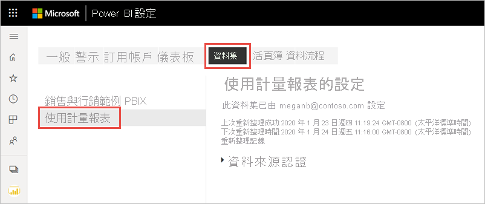

5. 從瀏覽器網址列中顯示的 URL 複製工作區和資料集識別碼。

    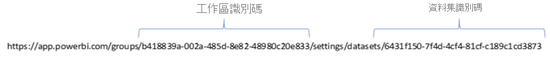

1. 在您的瀏覽器中，移至 [https://docs.microsoft.com/rest/api/power-bi/datasets/deletedatasetingroup](/rest/api/power-bi/datasets/deletedatasetingroup)，然後選取 [試試看] 按鈕。

    ![刪除資料集 [試試看]](media/service-modern-usage-metrics/power-bi-delete-dataset-try-it.png)

1. 登入 Power BI，將工作區識別碼貼到 [groupId] 文字方塊中，並將資料集識別碼貼到 [datasetId] 文字方塊中，然後選取 [執行]。 

    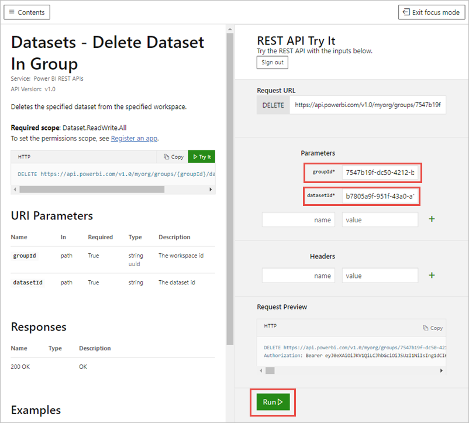

1. 在 [執行] 按鈕下，確認服務傳回回應碼 **200**。 該代碼表示已成功刪除資料集及其相關聯的使用計量報表。

    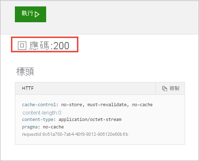

### 建立全新的使用計量報表

1. 回到 Power BI 服務中，您會看到資料集已消失。

    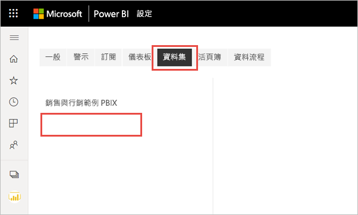

2. 如果您仍然在 [報表] 清單中看到使用計量報表，請重新整理瀏覽器。

3. [建立全新的使用計量報表](#create--view-an-improved-usage-metrics-report)。

## 後續步驟

[在系統管理入口網站中管理 Power BI](../admin/service-admin-portal.md)

有其他問題嗎？ [試試 Power BI 社群](https://community.powerbi.com/)
