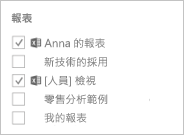

# 教學課程：建立及發佈 Power BI 組織內容套件

在本教學課程中，您將建立組織內容套件、提供特定群組的存取權，並將該套件發佈至 Power BI 上的組織內容套件庫。

建立內容套件與共用儀表板或對群組中的儀表板共同作業不同。 請參閱[在 Power BI 中共用成品的方式](service-how-to-collaborate-distribute-dashboards-reports.md)來為情況決定最佳選項。

建立組織內容套件需要用到您和同事的 [Power BI Pro 帳戶](https://powerbi.microsoft.com/pricing)。

> [!NOTE]
> 您無法在新的工作區體驗中建立或安裝組織內容套件。 如果您尚未開始，現在是將內容套件升級為應用程式的好時機。 深入了解[新的工作區體驗](service-create-the-new-workspaces.md)。

## 建立並發佈內容套件

假設您是 Contoso 發佈經理，而且您正在為新產品上市作準備。  您已建立儀表板，其中包含您想要共用的報表。 其他管理上市的員工可能會發現它們很有用。 您需要有方法將儀表板及報表作為解決方案封裝，供您的同事使用。

想要跟著做嗎？ 在 [Power BI 服務](https://powerbi.com)中，移至 [我的工作區]。 然後移至 [取得資料] > [範例] > [商機分析範例] > [連接]，取得自己的複本。

1. 在導覽窗格中，選取 [工作區] >  [我的工作區]。

1. 從頂端導覽窗格，選取齒輪圖示 。 > [建立內容套件]。

   ![焦點在齒輪圖示和 [建立內容套件] 選項的 UI 螢幕擷取畫面。](media/service-organizational-content-pack-create-and-publish/pbi_create_contpk.png)

1. 在 [建立內容套件] 視窗中，輸入下列資訊。  

   請記住，您組織的內容套件庫可能很快就會填滿。 套件庫最後可能會含有用於發佈給組織或群組的上百個內容套件。 花點時間來提供內容套件有意義的名稱、新增合適的描述，以及選取適當的對象。  使用的文字必須讓內容套件可輕易透過搜尋找到。 這可讓您日後更輕鬆地尋找。

      ![完整 [建立內容套件] 表單的螢幕擷取畫面。](media/service-organizational-content-pack-create-and-publish/cpwindow.png)

    1. 選取 [特定群組]。

    1. 輸入個人、[Microsoft 365 群組](https://support.office.com/article/Create-a-group-in-Office-365-7124dc4c-1de9-40d4-b096-e8add19209e9)、通訊群組或安全性群組的完整電子郵件地址。 例如：salesmgrs@contoso.com、sales@contoso.com

        在本教學課程中，請試著使用您群組的電子郵件地址。

    1. 將內容套件命名為*銷售商機*。

        > [!TIP]
        > 請考慮將儀表板名稱包含在內容套件名稱中。 如此一來，當您的同事連接到您的內容套件之後，就能更輕鬆地找到儀表板。

    1. 建議︰新增描述。 這有助於同事更輕鬆地找到所需的內容套件。 除了描述之外，還新增同事可能用來搜尋此內容套件的關鍵字。 另外加上連絡資訊，萬一您的同事有疑問或需要協助時可派上用場。

    1. 上傳影像或標誌，讓群組成員更輕鬆地找到內容套件。

        掃描影像的速度會比掃描文字更快。 此螢幕擷取畫面顯示 [商機計數] 直條圖磚的影像。

    1. 選取 [商機分析範例] 儀表板，將它加入內容套件。

        Power BI 會自動加入相關聯的報表和資料集。 如果您要的話，您可以新增其他項目。

       > [!NOTE]
       > Power BI 只會列出可以編輯的儀表板、報表、資料集和活頁簿。 因此，應用程式不會顯示任何已與您共用的資源。

   1. 如果您有 Excel 活頁簿，這些活頁簿會顯示在 [報表] 下方，並有 Excel 圖示。 您也可以將它們加入內容套件中。

      

      > [!NOTE]
      > 如果群組的成員無法檢視 Excel 活頁簿，您可能需要[在商務用 OneDrive 中與他們共用活頁簿](https://support.office.com/article/Share-documents-or-folders-in-Office-365-1fe37332-0f9a-4719-970e-d2578da4941c)。

1. 選取 [發佈]  將內容套件加入群組的組織內容套件庫。  

   成功發佈之後，您可以看到成功訊息。

1. 當您的群組成員移至 [取得資料] > [組織內容套件] 時，他們會看到您的內容套件。

   ![[AppSource] 對話方塊中 [銷售商機] 內容套件的螢幕擷取畫面。](media/service-organizational-content-pack-create-and-publish/powerbi-find-content-pack-organization.png)

   > [!TIP]
   > 您的瀏覽器中顯示的 URL 是此內容套件的專屬位址。  想通知同事這個新的內容套件？  您可以將 URL 貼入電子郵件。

1. 當您的群組成員選取 [連接] 時，他們可以[檢視和使用您的內容套件](service-organizational-content-pack-copy-refresh-access.md)。

## 後續步驟

* [Power BI 中的組織內容套件簡介](service-organizational-content-pack-introduction.md)。

* [管理、更新和刪除組織內容套件](service-organizational-content-pack-manage-update-delete.md)。

* [使用 Power BI 發佈應用程式](service-create-distribute-apps.md)。

* [商務用 OneDrive 是什麼？](https://support.office.com/article/What-is-OneDrive-for-Business-187f90af-056f-47c0-9656-cc0ddca7fdc2)

* 有其他問題嗎？ [試試 Power BI 社群](https://community.powerbi.com/)
