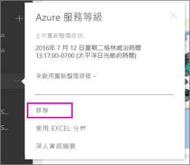

# 移除與 Power BI 組織內容套件的連接

> [!NOTE]
> 組織內容套件即將淘汰。 如果您尚未開始，現在是將您的內容套件升級為應用程式的好時機。 如需時間表，請參閱[宣告 Power BI 系統管理員可升級傳統工作區](https://powerbi.microsoft.com/blog/announcing-power-bi-admins-can-upgrade-classic-workspaces-and-roadmap-update/) (英文) 此部落格文章的＜工作區升級藍圖＞一節。
> 

假設有位同事建立了內容套件， 您在 AppSource 中找到了該套件，並將其新增到您的 Power BI 工作區中。 現在，您不再需要該套件了。  該如何移除呢？

若要移除內容套件，請移除其資料集。  

* 在導覽窗格中，選取資料集右方的省略符號，然後選取 [移除] **\> [是]** 。  
  
  

移除資料集的同時，也會移除所有相關聯的報表和儀表板。 不過，移除與內容套件的連線並不會從組織的 AppSource 中刪除該內容套件。  您可以隨時回到 AppSource，將內容套件再次新增回工作區。 如果您是內容套件建立者，就只能[從 AppSource 中刪除內容套件](service-organizational-content-pack-manage-update-delete.md)。

## 後續步驟
* [組織內容套件簡介](service-organizational-content-pack-introduction.md) 
* [在 Power BI 中建立和散發應用程式](service-create-distribute-apps.md) 
* [Power BI 服務中的設計工具基本概念](../fundamentals/service-basic-concepts.md)  
* 有其他問題嗎？ [試試 Power BI 社群](https://community.powerbi.com/)
