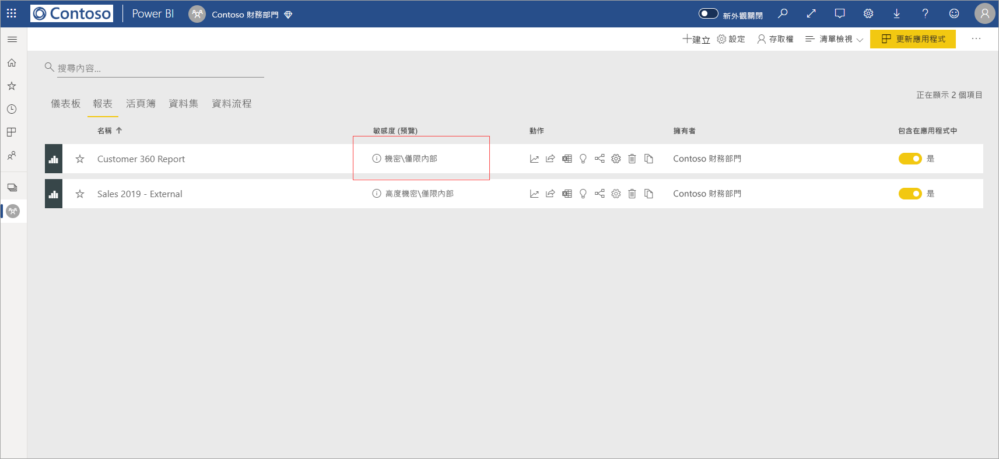
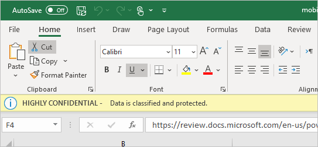

# 在 Power BI 中啟用資料敏感度標籤 (預覽)

當您在 Power BI 服務中啟用敏感度標籤時，可以對您的儀表板、報表、資料集與資料流程套用資料敏感度標籤，以防未經授權的存取與外洩。 使用資料敏感度標籤正確標示您的資料，可以確保只有經過授權的人員，才能存取您的資料。

當您啟用資料保護時，敏感度標籤會出現在儀表板、報表、資料集與資料流程清單檢視的敏感度資料行中。

> [!NOTE]
> 您必須具備特定的授權與權限，才可以將敏感度標籤套用至 Power BI 儀表板、報表、資料集與資料流程。 如需詳細資訊，請參閱[套用敏感度標籤](#applying-sensitivity-labels)。

## 套用敏感度標籤

您與您的組織滿足下列需求，才可以在 Power BI 中套用敏感度標籤：

* 您的組織必須已在 [Microsoft 365 安全性中心](https://security.microsoft.com/) 或 [Microsoft 365 合規性中心](https://compliance.microsoft.com/)中定義了敏感度標籤。
* 如同[在 Power BI 中啟用資料敏感度標籤 (預覽)](../admin/service-security-enable-data-sensitivity-labels.md#enable-data-sensitivity-labels) 一文所述，您必須屬於有權套用資料敏感度標籤的安全性群組。
* 您必須擁有 Power BI Pro 授權與編輯權限，才能對您想要標示的資源套用敏感度標籤。 
* 您必須具備 Azure 資訊保護進階 P1 或進階 P2 授權。 Microsoft Azure 資訊保護可以單獨選購，也可以透過任一種 Microsoft 授權套件購得。 如需詳細資訊，請參閱 [Azure 資訊保護價格](https://azure.microsoft.com/pricing/details/information-protection/)。

若要對報表套用或變更敏感度標籤，請按一下工作區清單項目上的報表設定圖示，然後移至 [設定] 側邊窗格中的 [資料敏感度] 區段。 選擇適當的敏感度標籤，然後儲存設定。

更新後的敏感度標籤會出現在 [敏感度] 資料行中。 

您可以遵循與上述報表流程，對儀表板套用或變更敏感度標籤。 

您也可以對資料集與資料流程設定敏感度標籤。 下圖顯示如何對資料集設定敏感度標籤；資料流程的設定步驟大同小異。

若要對資料集設定敏感度標籤，請選取 [資料集] 索引標籤，再按一下您要套用標籤之資料集上的三點圖示，然後選擇 [設定]  。

在資料集的 [設定] 頁面上，開啟 [敏感度標籤] 區段，再選擇所需的敏感度標籤，然後按一下 [套用]  。

您可以遵循與上述資料集設定流程，套用或變更資料流程的敏感度標籤。

## 移除敏感度標籤
若要從報表、儀表板、資料集或資料流程中移除敏感度標籤，請遵循[套用標籤所使用的相同程序](#applying-sensitivity-labels)，但當系統提示您分類資料的敏感度時，請選擇 [(無)]  。 

## 匯出檔案的資料保護

當您從設有敏感度標籤的[報表匯出資料](https://docs.microsoft.com/power-bi/consumer/end-user-export)時，所產生的檔案 (支援 Excel、PowerPoint 與 PDF，但不支援 CSV) 會繼承該敏感度標籤。 敏感度標籤會顯示在檔案中，但只有具備足夠權限的使用者，才能存取該檔案。

## 考量與限制

套用資料敏感度標籤時，必須需要考量下列條件：

* 在 Power BI 中套用及檢視 Microsoft 資訊保護敏感度標籤，需有 Azure 資訊保護進階 P1 或進階 P2 授權。 Microsoft Azure 資訊保護可以單獨選購，也可以透過任一種 Microsoft 授權套件購得。 如需詳細資訊，請參閱 [Azure 資訊保護價格](https://azure.microsoft.com/pricing/details/information-protection/)。
* 敏感度標籤只能套用到儀表板、報表、資料集與資料流程。
* 只有 Excel、PowerPoint 與 PDF 檔案才支援匯出檔案上所施行的標籤與保護控制。 若將資料匯出至 CSV 檔案、訂閱電子郵件、內嵌視覺效果及列印，將不會施行標籤與保護。
* 從 Power BI 匯出檔案的使用者，有權根據敏感度標籤設定來存取與編輯該檔案。 但匯出資料的使用者不會取得檔案擁有者權限。 
* 敏感度標籤目前不適用於[編頁報表]( https://docs.microsoft.com/power-bi/paginated-reports-report-builder-power-bi)與活頁簿。 
* Power BI 資產的敏感度標籤只會顯示在工作區清單與歷程檢視中，目前不會顯示在 [我的最愛]、[與我共用]、[最近項目] 或 [應用程式檢視] 中。 但請注意，即使看不見套用至 Power BI 資產的標籤，其也一律保存在匯出至 Excel、PowerPoint 與 PDF 檔案的資料上。
* *Microsoft 365 安全性中心*或 [Microsoft 365 合規性中心](https://security.microsoft.com/)設定的敏感度標籤[檔案加密](https://compliance.microsoft.com/)設定，只會套用至從 Power BI *匯出*的檔案，而不會在 *Power BI* 中施行。
* Power BI 中套用的標籤不支援 [HYOK 保護](https://docs.microsoft.com/azure/information-protection/configure-adrms-restrictions)。
* 必須滿足[授權需求](https://docs.microsoft.com/microsoft-365/compliance/get-started-with-sensitivity-labels#subscription-and-licensing-requirements-for-sensitivity-labels)，以在 Office 應用程式中檢視與套用標籤。
* 只有全域 (公用) 雲端中的租用戶，才能使用敏感度標籤。 其他雲端中的租用戶無法使用敏感度標籤。
* [外部使用者 (Azure Active Directory B2B 來賓使用者)](../admin/service-admin-azure-ad-b2b.md) 不支援敏感度標籤。 這表示外部使用者無法檢視標籤，且遭到封鎖而無法將資料匯出至 Excel、PDF 和 PPTX 檔案。 [移除標籤](#removing-sensitivity-labels)可讓外部使用者將資料匯出至這些檔案類型。

## 後續步驟

本文說明如何在 Power BI 中啟用資料敏感度標籤。 下列文章提供如何在 Power BI 中保護資料保護的更多詳細資料。 

* [Power BI 的資料保護概觀](../admin/service-security-data-protection-overview.md)
* [在 Power BI 中啟用資料敏感度標籤](../admin/service-security-enable-data-sensitivity-labels.md)
* [在 Power BI 中使用 Microsoft Cloud App Security 控制項](../admin/service-security-using-microsoft-cloud-app-security-controls.md)