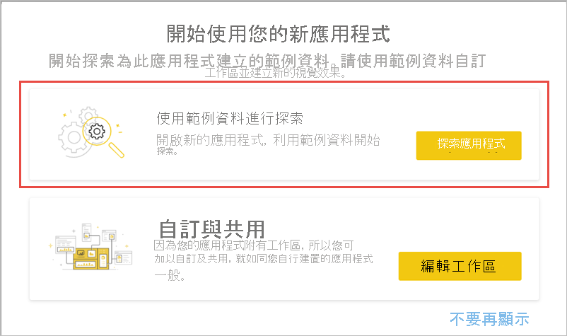
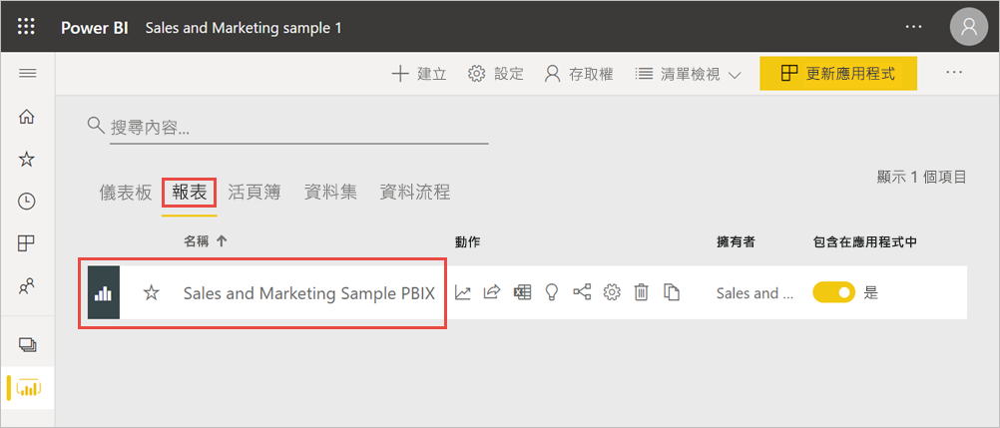
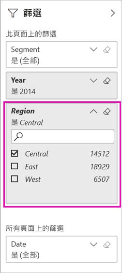
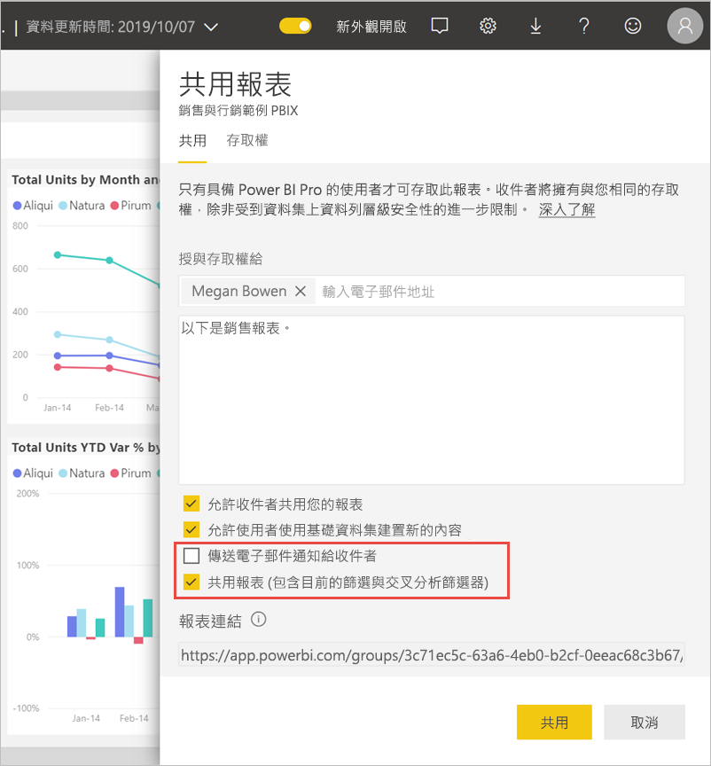
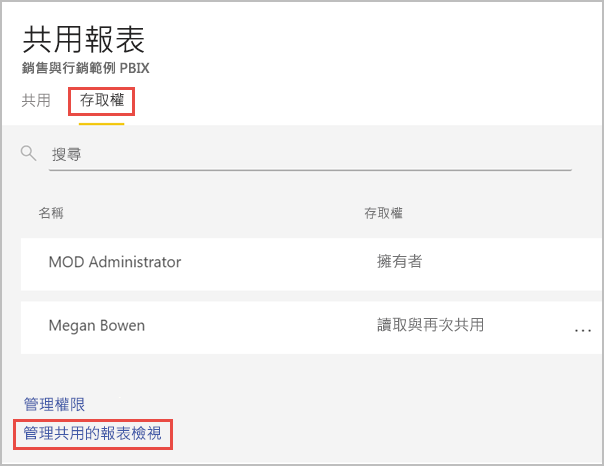
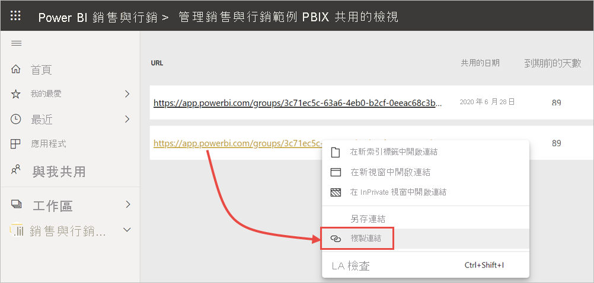

# 篩選並共用 Power BI 報表
「共用」是讓一些人存取您儀表板和報表的一種好方法。 如果要共用報表的篩選版本呢？ 您可能想讓報表僅顯示特定城市、銷售人員或年份的資料。 此文章說明如何篩選報表，以及共用已篩選版本的報表。 另一個共用已篩選報表的方式，是[將查詢參數新增到報表 URL](service-url-filters.md)。 在這兩種情況下，當收件者第一次開啟報表時，系統便會篩選該報表。 他們可以清除報表中的篩選選項。

Power BI 還提供[可進行共同作業及散發您報表的其他方式](service-how-to-collaborate-distribute-dashboards-reports.md)。 若要共用，您和您的收件者必須具有 [Power BI Pro 授權](../fundamentals/service-features-license-type.md)，或內容必須位於[進階容量](../admin/service-premium-what-is.md)中。 

## 使用範例資料依步驟執行

此文章使用行銷與銷售範例範本應用程式。 想要試用嗎？ 

1. 安裝[安裝行銷與銷售範例範本應用程式](https://appsource.microsoft.com/product/power-bi/microsoft-retail-analysis-sample.salesandmarketingsample?tab=Overview) \(英文\)。
2. 選取應用程式，並選取 [探索應用程式]。

   

3. 選取鉛筆圖示以開啟您搭配應用程式安裝的工作區。

    

4. 在工作區內容清單中，選取 [報表]，然後選取 [銷售與行銷範例 PBIX] 報表。

    

    您現在準備好依步驟執行了。

## 在報表中設定篩選

在 [[編輯] 檢視](../consumer/end-user-reading-view.md)中開啟報表並套用篩選。

在此範例中，我們要篩選行銷與銷售範例範本應用程式的 [YTD Category] \(YTD 類別\) 頁面，只顯示 [Region] \(區域\) 等於 [Central] \(中部\) 的值。 
 

儲存報表。

## 共用篩選過的報表

1. 選取 [共用] 。

   ![選取 [共用]](media/service-share-reports/power-bi-share.png)

2. 清除 [將電子郵件通知傳送給收件者] 來改為傳送已篩選的連結，選取 [共用報表 (包含目前的篩選與交叉分析篩選器)]，然後選取 [共用]。

    

4. 再次選取 [共用]。

   ![選取 [共用]](media/service-share-reports/power-bi-share.png)

5. 選取 [存取] 索引標籤，然後選取 [管理共用的報表檢視]。

    

6. 以滑鼠右鍵按一下所需的 URL，然後選取 [複製連結]。

    

7. 當您共用此連結時，收件者將會看到已篩選的報表。 

## 限制與考量
共用報表時的重要事項︰

* 當您透過管理權限、共用報表或儀表板，或透過發行應用程式來共用資料集時，除非[資料列層級安全性 (RLS)](../admin/service-admin-rls.md) 限制其存取權，否則您會授與整個資料集的存取權。 報表作者可以使用相關功能，來自訂使用者的報表檢視或報表互動體驗，例如隱藏資料行、限制對視覺效果的動作等。 這些自訂的使用者體驗，不會限制使用者在資料集中可以存取的資料。 您可以在資料集內使用[資料列層級安全性 (RLS)](../admin/service-admin-rls.md)，根據每個人的認證來判斷其可以存取哪些資料。

## 後續步驟
* [在 Power BI 中共用成品的方式](service-how-to-collaborate-distribute-dashboards-reports.md)
* [共用儀表板](service-share-dashboards.md)
* 有其他問題嗎？ [試試 Power BI 社群](https://community.powerbi.com/)。
* 有任何意見嗎？ 請移駕 [Power BI 社群網站](https://community.powerbi.com/)提供您的建議。
