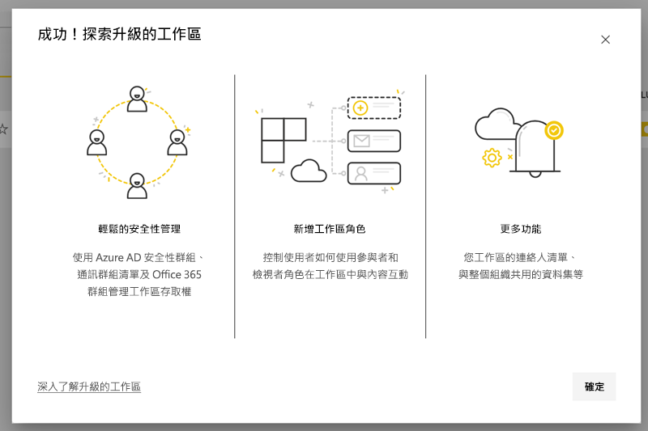
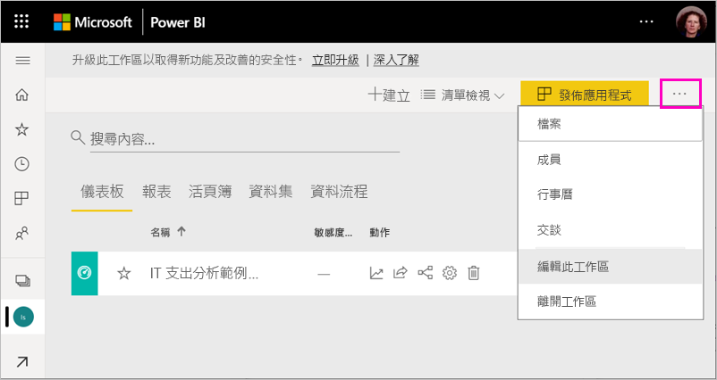
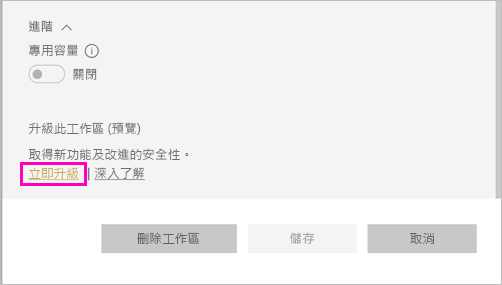
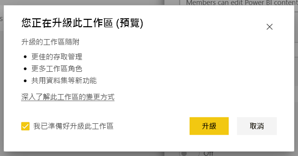
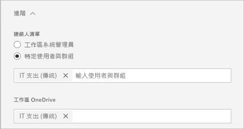
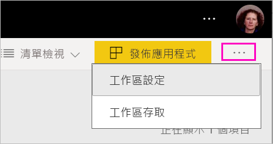
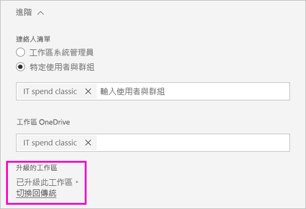
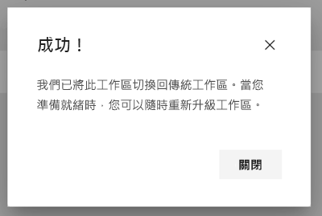

# 將傳統工作區升級至 Power BI 中的新工作區

此文章說明如何將傳統工作區升級或「移轉」至新的工作區體驗。 您可以升級任何傳統工作區。 新的工作區具有更細微的工作區角色，因此您可以更有效地管理內容的存取權。 因為已升級工作區與原始 Microsoft 365 群組的連線過於鬆散，所以，管理這些工作區的彈性也很大。 了解[新的工作區體驗](service-new-workspaces.md)。

>[!NOTE]
>工作區升級是以公開預覽的形式提供。 

不過，您的工作區可能會有所變更，您必須注意並進行規劃。 例如，新的工作區體驗中不支援內容套件。 請參閱此文章稍後的[升級考量與限制](#upgrade-considerations-and-limitations)一節。

## 升級後要做的事

升級之後，您應該進行幾件事。 升級之前，最好先進行規劃：
- 請檢閱存取清單，並了解[升級後的權限](#permissions-after-upgrade)。
- 請檢閱[連絡人清單](#modify-the-contact-list)，並確定已依照您的需求設定。
- 如果還沒有，請了解[新的工作區體驗](service-new-workspaces.md)。

## 升級傳統工作區

任何工作區系統管理員都可以升級工作區。 針對傳統工作區，若要成為工作區系統管理員，則必須是基礎 Microsoft 365 群組的擁有者。 若要升級工作區，請遵循下列步驟。

1. 在工作區內容清單中，選取 [更多選項 (...)]  > [編輯此工作區]。

    

1. 展開 [進階]，然後選取 [立即升級]。

    

1. 檢閱對話方塊資訊。 如果您已在工作區中發佈或安裝內容套件，您會看到警告。 當您準備好時，請核取 [我已準備好升級此工作區]，然後選取 [升級]。

    

2. 升級期間，您會看到 [正在升級] 訊息。 升級您的工作區通常需要不到一分鐘的時間。

1. 升級完成後，您會看到 [成功] 對話方塊。 我們建議您閱讀[在 Power BI 的新工作區中組織工作](service-new-workspaces.md)，讓您熟悉新的工作區與傳統工作區有何不同。

### 對其他工作區使用者的影響

我們建議您在離峰時段，當很少有使用者主動查看或編輯工作區中的項目時進行升級。

主動使用工作區的使用者會被要求重新整理其瀏覽器。 編輯報表的使用者可以選擇在重新整理之前儲存。

## 升級考量與限制

- 您工作區的 URL 和識別碼、它所包含的內容，以及從工作區發佈的應用程式不會變更。 安裝在工作區中的內容套件內容會分開處理。 如需詳細資訊，請參閱此文章中的[升級期間的內容套件](#content-packs-during-upgrade)。
- 新的工作區體驗中不支援內容套件。 請閱讀[已發佈的內容套件](#published-content-packs)或[已安裝的內容套件](#installed-content-packs)的相關章節，以了解如何在升級期間處理它們。 我們建議您先刪除工作區中已安裝或已發佈的內容套件，然後再進行升級。
- Power BI 中工作區升級不會影響到傳統工作區的 Microsoft 365 群組。 任何小組、SharePoint 網站、信箱或由 Microsoft 365 管理的其他資源都不會變更。 升級 Power BI 工作區之後，它們會保持不變。 Microsoft 365 群組會繼續以先前的方式存在。
- 在升級之後，您的工作區受到保護的方式有所變更。 如需詳細資訊，請參閱[升級後的工作區權限](#permissions-after-upgrade)一節。
- 如果需要，可以選擇**返回傳統工作區**。 但是，它在升級之前無法完全還原工作區的某些層面。 如果您開始使用僅在新的工作區體驗中可用的功能，則將無法返回。 升級之後，返回選項會提供 30 天的時間。

## 升級後的權限

在工作區內容清單頂端的功能表列中選取 [存取]，以檢閱升級後的權限。

每個 Microsoft 365 群組擁有者都會分別新增到已升級工作區的系統管理員角色。 Microsoft 365 群組本身會新增至工作區角色。 其新增的角色取決於傳統工作區是「唯讀」或「讀寫」：

- 當工作區設定為 [成員可以編輯 Power BI 內容] 時，升級後，Microsoft 365 群組就會新增至具有**成員**角色的工作區存取清單。
- 當工作區設定為 [Members can only read Power BI content] \(成員僅能讀取 Power BI 內容\) 時，升級後，Microsoft 365 群組就會新增至具有**檢視人員**角色的工作區存取清單。

因為 Microsoft 365 群組已在工作區中獲得角色，所以在升級後新增至 Microsoft 365 群組的任何使用者，都具有工作區的該角色。 不過，如果在升級後將新的擁有者新增至 Microsoft 365 群組，則其不會擁有工作區的系統管理員角色。

### 升級前後的角色差異

傳統和新的工作區中的工作區角色是不同的。 新的工作區體驗可供將工作區角色提供給 Microsoft 365 群組、安全性群組或通訊群組清單。

- **成員**可以共用個別的項目，並透過「成員」、「參與者」或「檢視人員」角色，提供整個工作區的存取權
- **檢視人員**只能查看內容，不能匯出基礎資料或在 Excel 中分析任何工作區資料集，除非他們擁有建置權限。

任何可透過共用或應用程式權限存取工作區中項目的使用者，都會繼續擁有這些項目的存取權。 具有工作區存取權的任何人也都可以存取從工作區發佈的應用程式。 這些使用者不會列在應用程式存取清單中。

我們建議您評估是否要使用新的「參與者」角色。 升級之後，即可在 [存取] 窗格中將 Microsoft 365 群組變更為具有參與者角色。

升級之後，您可考慮為工作區系統管理員建立安全性群組或 Microsoft 365 群組或通訊群組清單，而不是透過對個別使用者的角色指派來管理存取權。

深入了解[新的工作區中的角色](service-new-workspaces.md#roles-in-the-new-workspaces)。

## 升級後的授權

「系統管理員」、「成員」或「參與者」工作區角色中的使用者需要 Power BI Pro 授權才能存取工作區。

如果工作區在共用的容量中，則「檢視人員」工作區角色中的使用者也需要 Power BI Pro 授權才能存取工作區。 不過，如果工作區是在 Premium 容量中，則「檢視人員」工作區角色中的使用者不需要 Pro 授權即可存取工作區。

## 其他新的工作區功能

新的工作區體驗具有傳統工作區所沒有的功能。 其中一個差異是設定連絡人清單的能力，與工作區系統管理員或擁有者不同。 其中一個相似之處為其仍然連線到 Microsoft 365 群組 SharePoint 文件庫。

### 修改連絡人清單

1. 在工作區內容清單頂端的功能表列中，選取 [設定] 以存取工作區設定。

    

2. 在 [進階] 下，工作區 [連絡人清單] 已設定為工作區升級來源的 Microsoft 365 群組。 您可以將更多使用者或群組新增至連絡人清單，或將其切換至工作區系統管理員。

    

### 工作區 OneDrive 

升級之後，工作區 **OneDrive** 會連線到 Microsoft 365 群組 SharePoint 文件庫。 此文件庫會在 [取得資料] > [檔案] 體驗中顯示為 [OneDrive] 選項。 請注意，如有工作區使用者不屬於 Microsoft 365 群組，則並非所有工作區使用者都可擁有該文件庫的權限。

## 升級期間的內容套件

新的工作區體驗不支援內容套件。 相反地，請使用應用程式和共用資料集，在工作區中發佈內容。 建議您在升級之前，先從工作區移除已發佈或已安裝的內容套件。 不過，如果您升級時有已發佈或已安裝的內容套件，升級程序會嘗試保留內容，如下所述。  升級之後，就無法還原內容套件或將內容的關聯還原至內容套件。

### 已發佈的內容套件

升級期間會移除從工作區發佈的內容套件。 您將無法在升級之後發佈或更新它們，即使還原回傳統工作區也一樣。 如果其他人已在自己的工作區中安裝您的內容套件，則在升級之後，他們會在其工作區中看到內容套件內容的複本。 如需詳細資訊，請參閱＜已安裝的內容套件＞一節。

### 已安裝的內容套件

當您升級工作區，或升級內容套件時所發行的工作區時，已安裝的內容套件會發生重要的變更。 升級之後，您的工作區會包含內容套件內容的複本。 它會連線到原始工作區中的原始資料集。

不過，有重要的變更：

- 如果內容套件已更新，內容就不會再更新。
- URL 和項目識別碼會變更，並且需要更新您與他人共用的任何書籤或連結。
- 從您的工作區對原始內容套件進行的任何使用者自訂都會遺失。 自訂包括訂用帳戶、警示、個人書籤、常設篩選和我的最愛。
- 新使用者可能無法存取內容套件中的資料集。 您需要與資料集擁有者合作，以確保工作區使用者可以存取資料。

## 返回傳統工作區

在升級體驗的過程中，您可以選擇在升級後的 30 天內返回傳統工作區。 這項功能會還原工作區內容與原始 Microsoft 365 群組的關聯。 如果您的組織在使用新的工作區體驗時遇到重大問題，就可以使用它。 不過，有一些限制。 請先閱讀此文章中的[切換回傳統的考量](#considerations-for-switching-back-to-classic)。

若要返回，您必須是工作區升級前所建立關聯 Microsoft 365 群組的擁有者。 請遵循下列步驟。

1. 在工作區內容清單中，選取 [更多選項 (…)]  > [工作區設定]。

    

1. 展開 [進階]，然後選取 [切換回傳統]。 如果您無法使用此選項，請參閱此文章中的[切換回傳統的考慮](#considerations-for-switching-back-to-classic)。

    

1. 當您準備好時，請核取 [我已準備好切換回傳統] 方塊，然後選取 [切換回傳統]。  在此對話方塊中，您可能會看到警告或封鎖器。 如果您遇到這些問題，請參閱此文章中[切換回傳統的考量](#considerations-for-switching-back-to-classic)。

    

1. 完成切換後，您會看到確認對話方塊。

    

### 切換回傳統的考量

如果您的工作區符合下列任何一項陳述，就無法切換：

- 已刪除 Microsoft 365 群組。
- 升級後已超過 30 天。
- 工作區中的資料集是由其他工作區中的報表或儀表板所使用。 這是怎麼發生的？ 假設您在升級之前從工作區發佈了內容套件，而有人在另一個工作區中安裝了內容套件。 升級之後，這些資料集會由該內容套件中的報表和儀表板使用。
- 工作區是應用程式生命週期管理管線的一部分。
- 此工作區會用於範本應用程式。
- 工作區會使用大型模型功能。
- 工作區會使用新的使用計量功能。

當您切換回傳統工作區時，並沒有還原原始工作區的精確複本。 會發生下列變更：

- 工作區權限是由已升級工作區原先連線的 Microsoft 365 群組所設定。
  - Microsoft 365 群組的任何系統管理員都會成為傳統工作區系統管理員。
  - Microsoft 365 群組的任何成員都會成為傳統工作區成員。 如果傳統工作區設定為 [成員只能讀取 Power BI 內容]，則會還原此設定。
  - 升級完成後才新增至工作區的任何使用者或使用者群組 (在 Office 365 群組外部)，都將無法繼續存取工作區。 請將其新增至 Microsoft 365 群組以授與存取權。 請注意，Microsoft 365 群組不允許成員資格中有巢狀安全性群組或通訊群組。
  - 有權存取該工作區之應用程式的使用者，將可以繼續存取該應用程式。
  - 透過共用取得工作區中項目存取權的使用者，將可以繼續存取這些項目。
- 升級之前從傳統工作區發佈的內容套件不會還原。
- 升級之前安裝在傳統工作區中的內容套件不會還原。
- 升級之後，使用者在工作區中所建立的訂用帳戶將被刪除。 升級之前已存在的訂用帳戶會繼續如預期般運作。
- 不會保留資料警示。 它們會被移除。
- 如果在升級之後重新命名工作區，則工作區名稱會還原以符合 Microsoft 365 群組的名稱。
- 進行中的作業 (如重新整理) 不會受到工作區升級的影響。

## 管理租用戶到新工作區的移轉 

有些組織想要將許多或所有工作區移至新的工作區體驗。 工作區升級工具著重於讓工作區系統管理員能夠進行升級。 對於想要管理此類程序的組織，他們可以採取下列步驟。

1. Power BI 系統管理員入口網站中的工作區清單和對應的 API 會提供 Power BI 中所有工作區的清單。 傳統工作區在清單中會顯示為「群組」類型。
2. 與個別群組擁有者或 Microsoft 365 的系統管理員合作，讓其升級工作區。 如果您想要升級工作區，您必須成為群組的「擁有者」。

工作區升級功能不提供大量或以程式設計方式升級的工具。 此外，在組織中建立的新 Microsoft 365 群組仍會繼續出現在 Power BI 中。
   
   
## 已知問題

您可能會遇到幾個已知問題：
- 升級之後，使用者可能會看到 [無法載入模型] 警告對話方塊。 這則訊息為錯誤地顯示且可以忽略。 
- 升級之後，部分工作區名稱與升級前不同。 發生這種情況時，工作區名稱會還原為先前的工作區名稱，或工作區名稱會變成空白。 若要解決此問題，請將工作區重新命名為想要的名稱。
- 升級已安裝內容套件的工作區之後，您可能會在工作區中看到在升級前看不到的其他儀表板。 在某些情況下，如果內容套件最近未更新，就會發生這種情況。 您可以安全地移除這些儀表板。

## 後續步驟

* [在新的工作區體驗中組織工作](service-new-workspaces.md)
* [建立新的工作區](service-create-the-new-workspaces.md)
* [建立傳統工作區](service-create-workspaces.md)
* 有問題嗎？ [嘗試在 Power BI 社群提問](https://community.powerbi.com/)
