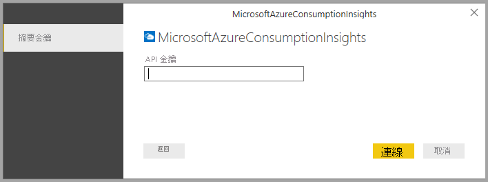
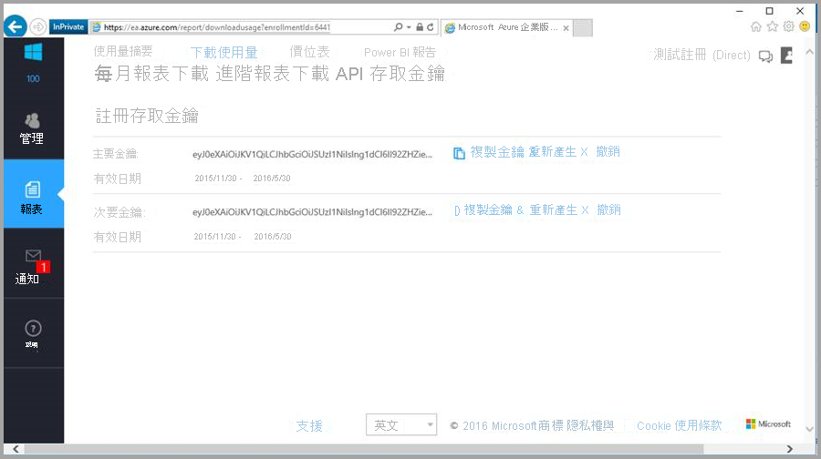
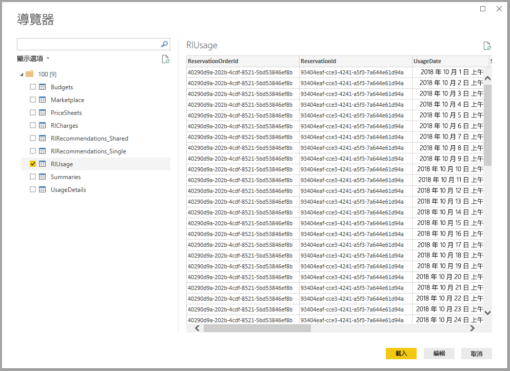
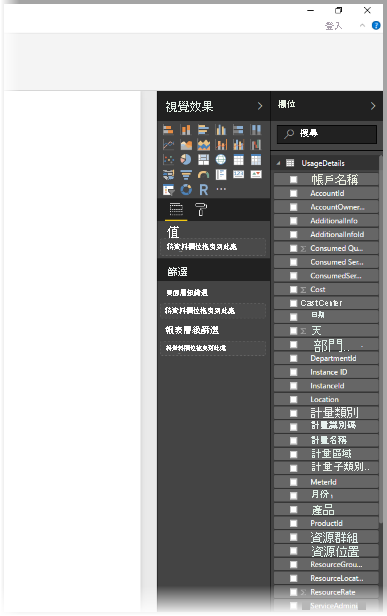
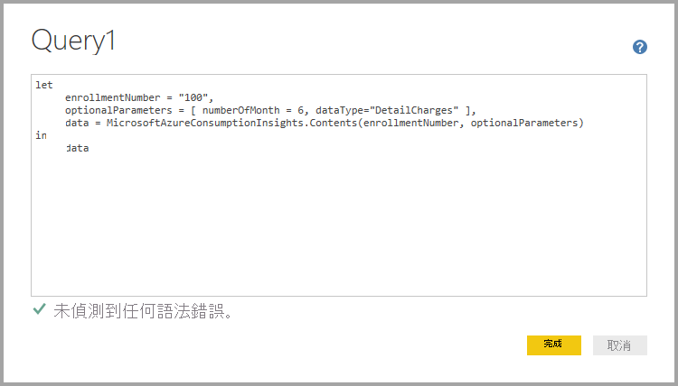

# 在 Power BI Desktop 中連線到 Azure 使用量見解資料

您可以使用 Power BI Desktop 連線至 Azure，並取得有關貴組織 Azure 服務使用量的深入資料。 有了此資料，您就可以建立自訂報表與量值，以便更充分了解並分析您的 Azure 費用。

> [!NOTE]
> 對 Microsoft Azure 使用量見解 (搶鮮版 (Beta)) 的支援有限。 針對新功能，請使用[適用於 Power BI 的 Azure 成本管理連接器](desktop-connect-azure-cost-management.md)。

## 與 Azure 使用量見解進行連線

Azure 使用量見解可讓您連線至 Azure Enterprise 合約的帳單帳戶。

在本節中，您會了解如何使用 Azure 企業版連接器取得您需要遷移的資料。 您也可以在 **ACI** (Azure 使用量見解) API 中找到可用的「使用量詳細資料資料行」對應。

若要成功使用 **Azure 使用量見解**連接器，您需要存取 Azure 入口網站企業版的功能。

在 **Power BI Desktop** 中使用 **Azure 使用量見解**連接器： 

1. 從 [常用] 功能區選取 [取得資料]。

1. 從左側的類別中選取 [線上服務]。  

1. 選取 [Microsoft Azure 使用量見解 (搶鮮版 (Beta))]。 

1. 選取 [連接]。

   

   在出現的對話方塊中，輸入您的 **Azure 註冊號碼**。

   

   * 您可以從 [Azure 企業版入口網站](https://ea.azure.com)取得註冊號碼，位置如下圖所示：

  

   此連接器版本只支援來自 https://ea.azure.com 的 Enterprise 註冊。 中國目前不支援註冊。

   接下來，提供連接用的「存取金鑰」。

   

   * 您的註冊用存取金鑰可以在 [Azure 企業版入口網站](https://ea.azure.com)找到。

  

在您提供「存取金鑰」並選取 [連線] 後，隨即會出現一個 [導覽器] 視窗，顯示九個可用的資料表：

| 資料表        | 描述 |
|------------- | -------------------------------------------------------------|
| **Budgets** | 預算詳細資料，讓您檢視實際成本或現有預算目標的使用情況。 |
| **MarketPlace** | 用量型 Azure Marketplace 費用。 |
| **PriceSheets** | 註冊計量的適用費率。 |
| **RICharges** | 過去 24 個月與您保留執行個體相關聯的費用。 |
| **RIRecommendations_Single** | 根據您單一訂用帳戶上，過去 7、30 或 60 天的使用量趨勢所提供的保留執行個體購買建議。 |
| **RIRecommendations_Shared** | 根據您所有訂用帳戶上，過去 7、30 或 60 天的使用量趨勢所提供保留執行個體購買建議。 |
| **RIUsage** | 您現有保留執行個體過去一個月的使用詳細資料。 |
| **Summaries** | 餘額、新購買、Azure Marketplace 服務費用、調整和超額費用的每月摘要。 |
| **UsageDetails** | 取用量明細和估計註冊費用。 |

您可以選取任何資料表旁邊的核取方塊，以便查看預覽。 您可以藉由核取名稱旁邊的方塊，選取一或多個資料表，然後選擇 [載入]。

> [!NOTE]
> *Summary* 和 *PriceSheet* 資料表只可供註冊層級 API 金鑰之用。 此外，這些資料表中的資料預設具有目前月份的 *Usage* 和 *PriceSheet* 資料。 *Summary* 和 *MarketPlace* 資料表不受限於目前月份。
>
>

當您選取 [載入] 時，資料會載入 **Power BI Desktop**。

您選取的資料載入後，可以在 [欄位] 窗格看到您所選取的資料表和欄位。

## 使用 Azure 使用深入解析
若要使用 **Azure 使用量見解**連接器，您可以存取 Azure 入口網站企業版的功能。

使用 **Azure 使用量見解**連接器成功載入資料後，您可以使用 [查詢編輯器] 建立您自己的自訂量值和資料行。 您也可以建立視覺效果、報表和儀表板，以在 **Power BI 服務**中共用。

使用空白查詢，您可以擷取範例 Azure 自訂查詢集合。 您可以透過兩種方式進行此種擷取： 

在 **Power BI Desktop** 中： 

1. 選取 [常用] 功能區 
2. 選取 [取得資料] > [空白查詢] 

或者，在 [查詢編輯器] 中： 

1. 在左側的 [查詢] 窗格中以滑鼠右鍵按一下 
2. 在出現的功能表中選取 [新查詢] > [空白查詢]

在 [公式列] 中，鍵入：

    = MicrosoftAzureConsumptionInsights.Contents

下圖顯示隨即出現的範例集合。

使用報表和建立查詢時，您可以：

* 若要定義從目前日期開始的月份數，請使用 *numberOfMonth*
  * 使用介於一到 36 之間的值。 代表您要匯入的月份數 (從目前的日期開始)。 我們建議您不要取得超過 12 個月份的資料。 這項限制可以避免到達 Power BI 查詢匯入條件約束和資料量閾值。
* 若要定義歷程記錄時間範圍中的月份期間，請使用 *startBillingDataWindow* 和 *endBillingDataWindow*
* 請不要與 *startBillingDataWindow* 或 *endBillingDataWindow* 一同搭配使用 *numberOfMonth*

## 從 Azure 企業版連接器遷移

有些客戶已使用「Azure 企業版連接器 (搶鮮版 (Beta))」來建立視覺效果。 該連接器最終會由 **Azure 使用量見解**連接器取代。 新的連接器具備的功能和加強功能包括：

* 適用於 *Balance Summary* 和 *Marketplace Purchases* 的其他資料來源
* 新參數和進階參數，例如 *startBillingDataWindow* 和 *endBillingDataWindow*
* 較佳的效能和回應

接下來的步驟會示範如何轉換到 **Azure 使用量見解**連接器。 這些步驟可以保留您在建立自訂儀表板或報表時已完成的工作。

### 步驟 1：使用新的連接器連線到 Azure
第一個步驟是使用本文稍早所詳述的 **Azure 使用量見解**。 在此步驟中，從 **Power BI Desktop** 的 [首頁] 功能區選取 **[取得資料] > [空的查詢]** 。

### 步驟 2：在進階查詢器中建立查詢
在 [查詢編輯器] 中，從 [常用] 功能區的 [查詢] 區段選取 [進階編輯器]。 在出現的 [進階編輯器] 視窗中，輸入此查詢：

    let    
        enrollmentNumber = "100",
        optionalParameters = [ numberOfMonth = 6, dataType="DetailCharges" ],
        data = MicrosoftAzureConsumptionInsights.Contents(enrollmentNumber, optionalParameters)   
    in     
        data

您需要將 *enrollmentNumber* 值替換成您的註冊號碼。 您可以從 [Azure 企業版入口網站](https://ea.azure.com)取得您的號碼。 *numberOfMonth* 參數是您要傳回幾個月的資料，從目前的日期起算。 使用零 (0) 代表目前的月份。

在 [進階編輯器] 視窗中選取 [完成] 之後，預覽會重新整理，且資料表中會出現指定月份範圍的資料。 選取 [關閉並套用] 然後返回。

### 步驟 3：將量值和自訂資料行移至新的報表
接下來，您必須將任何自訂資料行或您所建立量值移至新的詳細資料資料表。 以下是步驟。

1. 開啟 [記事本] \(或其他文字編輯器)。
2. 選取您想要移動的量值，並從 [公式] 欄位複製文字且放在 [記事本] 中。

   
3. 將 *Query1* 重新命名為原始的詳細資料資料表名稱。
4. 若要建立新的資料表量值和自訂資料行，請以滑鼠右鍵按一下資料表，然後選擇 [新量值]。 然後，請剪下並貼上您儲存的量值和資料行，直到全部完成為止。

### 步驟 4：重新連結具有關聯性的資料表
許多儀表板有其他用來查閱或篩選的資料表，例如日期資料表或用於自訂專案的資料表。 重新建立這些關聯性，可以解決大部分剩餘的問題。 以下說明如何執行這項作業。

- 在 **Power BI Desktop**的 [模型] 索引標籤中，選取 [管理關聯性]，以顯示視窗讓您管理模型內的關聯性。 視需要重新連結您的資料表。

    

### 步驟 5：驗證視覺效果，然後視需要調整欄位格式設定
此時，您大部分的原始視覺效果、資料表和向下鑽研應該都已正常運作。 但是您可能需要進行一些小幅度的調校，來精確地設定外觀及操作的格式。 請花費一些時間查看每個儀表板和視覺效果，確保它們看起來與您想要的外觀一致。

## 使用 Azure 使用深入解析 (ACI) API 來取得使用資料
Azure 也提供 [**Azure 使用深入解析 (ACI) API**](https://azure.microsoft.com/blog/announcing-general-availability-of-consumption-and-charge-apis-for-enterprise-azure-customers/)。 您可以建立自己的自訂解決方案，來使用 ACI API 收集、報告和視覺化 Azure 使用資訊。

### 在入口網站、連接器和 API 之間對應名稱和使用詳細資料
Azure 入口網站資料行和詳細資料名稱在 API 和連接器中非常相似，雖然並非完全相同。 為了協助您進行釐清，下表提供對應。 同時也指出資料行是否已經淘汰。 如需詳細資訊和字詞定義，請參閱 [Azure 計費資料字典](https://docs.microsoft.com/azure/billing/billing-enterprise-api-usage-detail)。

| ACI 連接器 / ContentPack ColumnName | ACI API 資料行名稱 | EA 資料行名稱 | 已淘汰/為了回溯相容性而存在 |
| --- | --- | --- | --- |
| AccountName |accountName |帳戶名稱 |否 |
| AccountId |accountId | |是 |
| AccountOwnerId |accountOwnerEmail |AccountOwnerId |否 |
| AdditionalInfo |additionalInfo |AdditionalInfo |否 |
| AdditionalInfold | | |是 |
| Consumed Quantity |consumedQuantity |Consumed Quantity |否 |
| Consumed Service |consumedService |Consumed Service |否 |
| ConsumedServiceId |consumedServiceId | |是 |
| 成本 |cost |ExtendedCost |否 |
| Cost Center |costCenter |Cost Center |否 |
| 日期 |date |日期 |否 |
| 日 | |日 |否 |
| DepartmentName |departmentName |部門名稱 |否 |
| DepartmentID |departmentId | |是 |
| Instance ID | | |是 |
| InstanceId |instanceId |Instance ID |否 |
| 位置 | | |是 |
| Meter Category |meterCategory |Meter Category |否 |
| Meter ID | | |是 |
| 計量名稱 |meterName |計量名稱 |否 |
| Meter Region |meterRegion |Meter Region |否 |
| Meter Sub-Category |meterSubCategory |Meter Sub-Category |否 |
| MeterId |meterId |Meter ID |否 |
| Month | |Month |否 |
| 產品 |product |產品 |否 |
| ProductId |productId | |是 |
| 資源群組 |resourceGroup |資源群組 |否 |
| Resource Location |resourceLocation |Resource Location |否 |
| ResourceGroupId | | |是 |
| ResourceLocationId |resourceLocationId | |是 |
| ResourceRate |resourceRate |ResourceRate |否 |
| ServiceAdministratorId |serviceAdministratorId |ServiceAdministratorId |否 |
| ServiceInfo1 |serviceInfo1 |ServiceInfo1 |否 |
| ServiceInfo1Id | | |是 |
| ServiceInfo2 |serviceInfo2 |ServiceInfo2 |否 |
| ServiceInfo2Id | | |是 |
| Store Service Identifier |storeServiceIdentifier |Store Service Identifier |否 |
| StoreServiceIdentifierId | | |是 |
| 訂用帳戶名稱 |subscriptionName |訂用帳戶名稱 |否 |
| 標籤 |標籤 |標籤 |否 |
| TagsId | | |是 |
| Unit Of Measure |unitOfMeasure |Unit Of Measure |否 |
| 年 | |年 |否 |
| SubscriptionId |subscriptionId |SubscriptionId |是 |
| SubscriptionGuid |subscriptionGuid |SubscriptionGuid |否 |

## 後續步驟

您可以使用 Power BI Desktop 連線到許多不同的資料來源。 如需詳細資訊，請參閱下列文章：

* [在 Power BI Desktop 中連線到 Azure 成本管理資料](desktop-connect-azure-cost-management.md)
* [Power BI Desktop 是什麼？](../fundamentals/desktop-what-is-desktop.md)
* [Power BI Desktop 中的資料來源](desktop-data-sources.md)
* [使用 Power BI Desktop 合併資料並使其成形](desktop-shape-and-combine-data.md)
* [在 Power BI Desktop 中連接至 Excel 活頁簿](desktop-connect-excel.md)   
* [直接將資料輸入 Power BI Desktop 中](desktop-enter-data-directly-into-desktop.md)   
