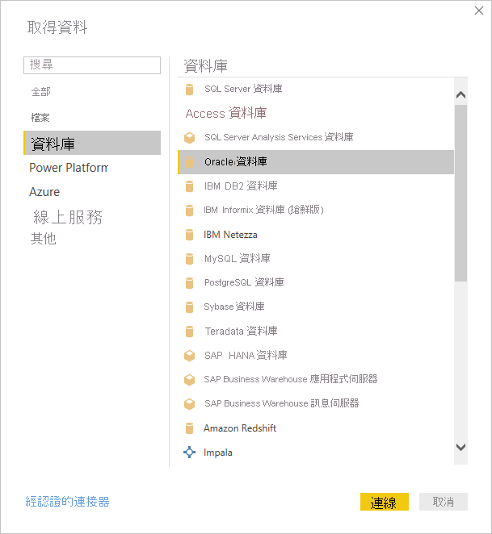
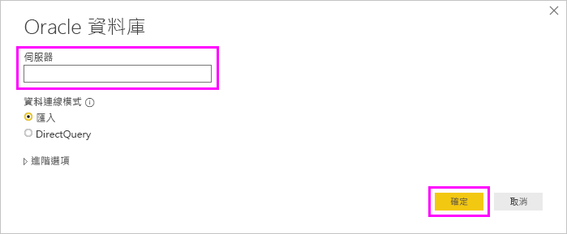

# 使用 Power BI Desktop 連線至 Oracle 資料庫
若要使用 Power BI Desktop 連接到 Oracle 資料庫，則執行 Power BI Desktop 的電腦上必須安裝正確的 Oracle 用戶端軟體。 您使用的 Oracle 用戶端軟體取決於已安裝的 Power BI Desktop 版本：32 位元或 64 位元。 其也取決於 Oracle Server 版本。

支援的 Oracle 版本： 
- Oracle Server 9 和更新版本
- Oracle 資料存取用戶端 (ODAC) 軟體 11.2 和更新版本

> [!NOTE]
> 如果要設定適用於 Power BI Desktop、內部部署的資料閘道或 Power BI 報表伺服器的 Oracle 資料庫，請參閱 [Oracle 連線類型](/sql/reporting-services/report-data/oracle-connection-type-ssrs)一文中的資訊。 

## 判斷您已安裝的 Power BI Desktop 版本
若要判斷您已安裝的 Power BI Desktop 版本，請選取 [檔案] > [說明] > [關於]，然後檢查 [版本] 行。 在下圖中，已安裝 64 位元版本的 Power BI Desktop：

## 安裝 Oracle 用戶端
- 如需 32 位元版本的 Power BI Desktop，請[下載並安裝 32 位元的 Oracle 用戶端](https://www.oracle.com/technetwork/topics/dotnet/utilsoft-086879.html)。

- 如需 64 位元版本的 Power BI Desktop，請[下載並安裝 64 位元的 Oracle 用戶端](https://www.oracle.com/database/technologies/odac-downloads.html)。

> [!NOTE]
> 選擇與 Oracle Server 相容的 Oracle 資料存取用戶端 (ODAC) 版本。 例如，ODAC 12.x 並不一定支援 Oracle Server 第 9 版。
> 選擇 Oracle 用戶端的 Windows Installer。
> 在設定 Oracle 用戶端期間，請務必在安裝精靈期間選取對應的核取方塊，以啟用「在全機器層級設定適用於 ASP.NET 的 ODP.NET 和/或 Oracle 提供者」。 有些 Oracle 用戶端精靈版本根據預設會選取核取方塊，其他則否。 請務必確認已選取核取方塊，讓 Power BI 能夠連線到 Oracle 資料庫。

## 連接到 Oracle 資料庫
安裝相符的 Oracle 用戶端驅動程式之後，您可以連接到 Oracle 資料庫。 請採取下列步驟建立連線：

1. 從 [首頁] 索引標籤，選取 [取得資料]。 

2. 從顯示的 [取得資料] 視窗，依序選取 [更多] (如有必要) 和 [資料庫] > [Oracle 資料庫]，然後選取 [連接]。
   
   
3. 在顯示的 [Oracle 資料庫] 對話方塊中，提供 [伺服器] 的名稱，然後選取 [確定]。 如果需要 SID，請使用以下格式加以指定：*ServerName/SID*，其中 *SID* 是資料庫的唯一名稱。 如果 *ServerName/SID* 格式沒有用，請使用 *ServerName/ServiceName*，其中 *ServiceName* 是用來連接的別名。

   

   > [!NOTE]
   > 如果您使用本機資料庫或自發資料庫連線，您可能需要將伺服器名稱放在引號中，以避免發生連線錯誤。 
      
4. 如果您想要使用原生資料庫查詢來匯入資料，請將您的查詢放在展開 [Oracle 資料庫] 對話方塊的 [進階選項] 區段時所顯示 [SQL 陳述式] 方塊中。  Power BI Desktop 不支援在「開始 ...」中執行預存程式和 Oracle 原生查詢的 Oracle 原生查詢end "block 不會傳回任何結果集。  
   
   ![展開 [進階選項]](media/desktop-connect-oracle-database/connect-oracle-database_4.png)

5. 在 [Oracle 資料庫] 對話方塊中輸入 Oracle 資料庫資訊之後 (包括任何選擇性資訊，例如 SID 或原生資料庫查詢)，請選取 [確定] 進行連接。
5. 如果 Oracle 資料庫需要資料庫使用者認證，出現提示時，請在對話方塊中輸入這些認證。

## 疑難排解

當命名語法不正確或未正確設定時，可能會遇到來自 Oracle 的任一種錯誤：

* ORA-12154:TNS：無法解析指定的連接識別碼。
* ORA-12514:TNS：接聽程式目前不了解連接描述元中要求的服務。
* ORA-12541:TNS：沒有任何接聽程式。
* ORA-12170:TNS：發生連接逾時。
* ORA-12504:TNS 接聽程式在 CONNECT_DATA 中未得到 SERVICE_NAME。

若未安裝或未正確設定 Oracle 用戶端，便可能會發生這些錯誤。 若已安裝，請驗證 tnsnames.ora 檔案已正確設定，且您使用的是適當的 net_service_name。 您也必須確定使用 Power BI Desktop 的電腦與執行閘道的電腦所使用的 net_service_name 相同。 如需詳細資訊，請參閱[安裝 Oracle 用戶端](#install-the-oracle-client)。

您也可能遇到 Oracle Server 版本與 Oracle 資料存取用戶端版本之間的相容性問題。 一般而言，因為某些組合不相容，所以您會希望這些版本能夠相符。 例如，ODAC 12.x 並不支援 Oracle Server 第 9 版。

若您從 Microsoft Store 下載了 Power BI Desktop，則可能因 Oracle 驅動程式問題，而無法連線到 Oracle 資料庫。 若您發生此問題，會傳回錯誤訊息：「未設定物件參考」。 若要解決此問題，請執行下列其中一個步驟：

* 從[下載中心](https://www.microsoft.com/download/details.aspx?id=58494) (而不是 Microsoft Store) 下載 Power BI Desktop。

* 如果您想要使用來自 Microsoft Store 的版本：請在您的本機電腦上，將 oraons.dll 從 _12.X.X\client_X_ 複製到 _12.X.X\client_X\bin_，其中 _X_ 代表版本和目錄號碼。

如果您在連接到 Oracle 資料庫時，於 Power BI Gateway 中看到錯誤訊息「未設定物件參考」，請遵循[管理您的資料來源 - Oracle](service-gateway-onprem-manage-oracle.md) 中的指示進行。

如要使用 Power BI 報表伺服器，請參閱 [Oracle 連線類型](/sql/reporting-services/report-data/oracle-connection-type-ssrs)一文中的指引。

