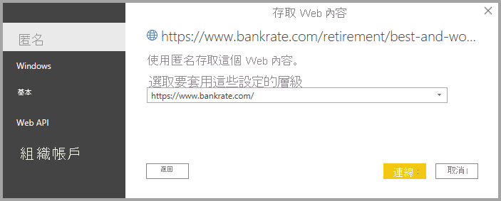

# 從 Power BI Desktop 連線至網頁

您可以連線至網頁並將其資料匯入 Power BI Desktop，以在您的視覺效果和資料模型中使用。

在 Power BI Desktop 中，從 [主資料夾]  功能區選取 [取得資料] > [Web]。

![Power B I Desktop 的螢幕擷取畫面，其中顯示 [Web] 選取項目。](media/desktop-connect-to-web/connect-to-web-01.png)

對話方塊隨即出現，並詢問您要從中匯入資料的網頁 URL。

![[Web] 對話方塊的螢幕擷取畫面，其中顯示 [URL] 欄位。](media/desktop-connect-to-web/connect-to-web-02.png)

您輸入 (或貼上) URL 之後，選取 [確定]。 Power BI Desktop 會提示您指定存取 Web 內容的方式。

Power BI Desktop 會連線至網頁，然後在 [導覽器] 視窗中顯示網頁的可用資料。 當您選取其中一個可用的資料元素，例如整個網頁的資料表，[導覽] 視窗會在視窗的右側顯示該資料的預覽。

![[導覽] 對話方塊的螢幕擷取畫面，其中顯示所選資料表資料的預覽。](media/desktop-connect-to-web/connect-to-web-04.png)

您可以選擇 [轉換資料] 按鈕，其會啟動 [查詢編輯器]，讓您可以先在網頁上將資料具體化並進行轉換，然後再將其匯入 Power BI Desktop。 或著您可以選取 [載入] 按鈕，然後匯入您在左窗格中選取的所有資料元素。

當我們選取 [載入] 時，Power BI Desktop 會匯入選取的項目，並使其能夠在 [欄位] 窗格中使用，其會出現在 Power BI Desktop 中 [報表] 檢視的右側。

![[欄位] 窗格的螢幕擷取畫面，其中顯示已選取資料表的清單。](media/desktop-connect-to-web/connect-to-web-05.png)

這樣就可以連接到網頁，並將其資料帶入 Power BI Desktop。

您可以從這裡將這些欄位拖曳到報表畫布上，並建立您想要的所有視覺效果。 您也可以從該網頁使用此資料，就像使用任何其他資料一樣：您可以加以修改、可以在模型中建立該資料與其他資料來源之間的關聯性，或是以您喜歡的方式建立您想要的 Power BI 報表。

若要查看連接至網頁的深入探討，請看看 [Power BI Desktop 入門指南](../fundamentals/desktop-getting-started.md)。

## 憑證撤銷檢查

Power BI 會套用適用於 Web 連線的安全性，以保護您的資料。 在某些案例中 (例如，使用 Fiddler 來擷取 Web 要求)，Web 連線可能無法正常運作。 若要實現這類案例，您可以在 Power BI Desktop 中取消選取 [啟用憑證撤銷檢查] 選項，然後重新啟動 Power BI Desktop。 

若要變更此選項，請選取 [檔案] > [選項]，然後選取左窗格中的 [安全性]。 下圖顯示此核取方塊。 取消選取此方塊，將會讓 Web 連線變得較不安全。 

## 後續步驟
您可以使用 Power BI Desktop 連接至各式各樣的資料。 如需有關資料來源的詳細資訊，請參閱下列資源︰

* [Power BI Desktop 中的資料來源](desktop-data-sources.md)
* [使用 Power BI Desktop 合併資料並使其成形](desktop-shape-and-combine-data.md)
* [在 Power BI Desktop 中連接至 Excel 活頁簿](desktop-connect-excel.md)   
* [連接至 Power BI Desktop 中的 CSV 檔案](desktop-connect-csv.md)   
* [直接將資料輸入 Power BI Desktop 中](desktop-enter-data-directly-into-desktop.md)   
