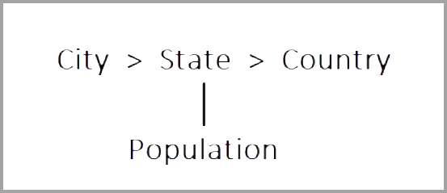
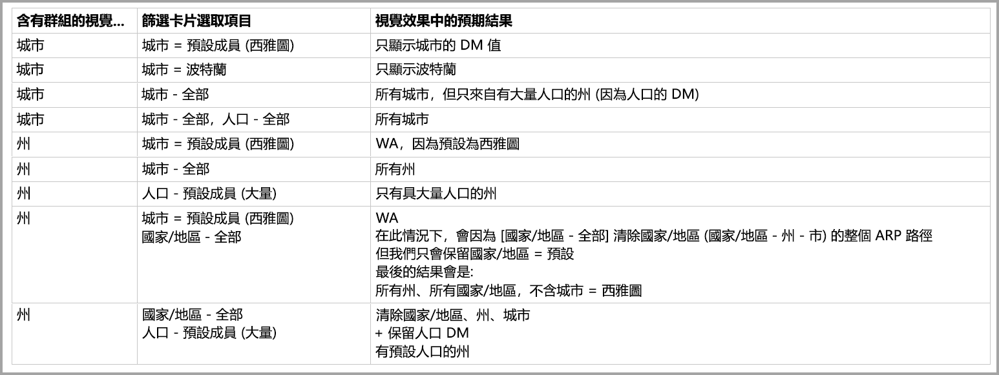

# 使用 Power BI 中的多維度模型

您可以在 Power BI 中連線到多維度模型，然後建立能將模型內的各種資料視覺化的報表。 搭配多維度模型運作時，Power BI 會根據定義為「預設成員」  的資料行，套用規則以決定其處理資料的方式。 

搭配多維度模型運作時，Power BI 會根據使用包含 **DefaultMember** 之資料行的位置，處理來自模型的資料。 *DefaultMember* 屬性會針對多維度模型中的特定資料行以 CSDL (概念結構定義語言) 設定。 若要深入了解預設成員，請參閱其[屬性內容文章](/sql/analysis-services/multidimensional-models/attribute-properties-define-a-default-member?view=sql-server-2017) \(機器翻譯\)。 執行 DAX 查詢時，系統會自動套用在模型中指定的預設成員。

本文會描述根據「預設成員」  位置的不同，Power BI 在搭配多維度模型運作時於各種情況下的行為。 

## 搭配篩選卡片運作

搭配預設成員在欄位上建立篩選卡片時，系統會自動在篩選卡片中選取預設成員欄位值。 結果會是所有被篩選卡片影響的視覺效果都會保留其在資料庫中的預設模型。 這些篩選卡片中的值會反映預設成員。

如果移除預設成員，取消選取該值將會從套用篩選卡片的所有視覺效果中清除它，且所顯示的值不會反映預設成員。

例如，假設我們有一個將預設成員設定為 [USD]  \(美元\) 的 [Currency]  \(貨幣\) 資料行：

* 在此範例中，如果我們有一個顯示 [Total Sales]  \(總銷售額\) 的卡片，該值將會套用預設成員，且我們會看到對應至美元的銷售額。
* 如果我們將 [Currency]  \(貨幣\) 拖曳到篩選卡片窗格，我們會看到 [USD]  \(美元\) 作為所選取的預設值。 [Total Sales]  \(總銷售額\) 的值會保持不變，因為已套用預設成員。
* 不過，如果我們從篩選卡片取消選取 [USD]  \(美元\) 值，將會清除 [Currency]  \(貨幣\) 的預設成員，且現在 [Total Sales]  \(總銷售額\) 將會反映所有貨幣。
* 因此，當我們在篩選卡片中選取另一個值 (假設我們選取 [EURO]  \(歐元\)) 時，在搭配預設成員的情況下，[Total Sales]  \(總銷售額\) 便會反映 *Currency IN {USD, EURO}* 篩選。

## 群組行為

在 Power BI 中，每當您針對具有「預設成員」  之資料行上的視覺效果進行群組時，Power BI 會清除該資料行的「預設成員」  及其屬性關聯性路徑。 這能確保視覺效果顯示所有的值，而非只顯示預設值。

## 屬性關聯性路徑 (ARP)

屬性關聯性路徑 (ARP) 能提供具有強大功能的「預設成員」  ，但也會帶來一定程度的複雜度。 遇到 ARP 時，Power BI 會遵循 ARP 的路徑以清除其他資料行的額外預設成員，以提供一致且精準的視覺效果資料處理。

讓我們透過範例來釐清該行為。 假設有下列 ARP 設定：

假設已針對這些資料行設定下列「預設成員」  ：

* City (縣/市) > Seattle (西雅圖)
* State (州/省) > WA (華盛頓)
* Country (國家/地區) > US (美國)
* Population (人口) > Large (大量)

現在讓我們看看在 Power BI 中使用每個資料行時會發生什麼事。 當視覺效果在下列資料行上進行群組時，會產生下列結果：

* **City** \(縣/市\)：Power BI 會透過清除 [City]  \(縣/市\)、[State]  \(州/省\)、[Country]  \(國家/地區\) 的所有*預設成員*，但保留 [Population]  \(人口\) 的*預設成員*來顯示所有縣/市；Power BI 會清除 [City]  \(縣/市\) 的整個 ARP。
    > [!NOTE]
    > [Population]  \(人口\) 並沒有位於 [City]  \(縣/市\) 的 ARP 路徑中，它單純只與 [State]  \(州/省\) 相關，因此 Power BI 不會清除它。
* **State** \(州/省\)：Power BI 會透過清除 [City]  \(縣/市\)、[State]  \(州/省\)、[Country]  \(國家/地區\) 和 [Population]  \(人口\) 的所有*預設成員*，來顯示所有「州/省」  。
* **Country** \(國家/地區\)：Power BI 會透過清除 [City]  \(縣/市\)、[State]  \(州/省\) 和 [Country]  \(國家/地區\) 的所有*預設成員*，但保留 [Population]  \(人口\) 的*預設成員*來顯示所有縣/市。
* **City and State** \(縣/市和州/省\)：Power BI 會清除所有資料行的所有**預設成員**。

針對顯示於視覺效果中的群組，系統會清除它們的整個 ARP 路徑。 

如果群組未顯示於視覺效果中，但為另一個已群組資料行之 ARP 路徑的一部分，則會套用下列動作：

* 系統不會自動清除 ARP 路徑的所有分支。
* 該群組仍會依那個未清除的**預設成員**進行篩選。

### 交叉分析篩選器和篩選卡片

搭配交叉分析篩選器或篩選卡片運作時，會發生下列行為：

* 當交叉分析篩選器或篩選卡片已載入資料時，Power BI 會針對視覺效果中的資料行進行群組，因此其顯示行為和上一節所描述的相同。

由於交叉分析篩選器和篩選卡片經常被用來與其他視覺效果進行互動，針對被影響視覺效果清除**預設成員**，會依下表所說明的方式發生。 

針對此表格，我們會使用本文先前所用的相同範例資料：

Power BI 在這些情況下的運作方式會遵循下列規則。

在下列情況下，Power BI 會清除特定資料行的**預設成員**：

* Power BI 在該資料行上進行群組
* Power BI 在與該資料行相關聯的資料行 (可位於 ARP 中的任何位置，上或下) 上進行群組
* Power BI 在位於 ARP 中的資料行 (上或下) 上進行群組
* 資料行具有擁有 [全部]  狀態的篩選卡片
* 資料行具有已選取任何值的篩選卡片 (Power BI 會針對該資料行接收到篩選)

在下列情況下，Power BI 不會清除特定資料行的**預設成員**：

* 資料行具有擁有預設狀態的篩選卡片，且 Power BI 在其 ARP 中的資料行上進行群組。
* 資料行位於 ARP 中的另一個資料行上方，且 Power BI 具有適用於該資料行且處於預設狀態的篩選卡片。

## 後續步驟

本文已說明 Power BI 在搭配多維度模型中的預設成員運作時的行為。 您可能也會對下列文章感興趣： 

* [在 Power BI 中顯示沒有資料的項目](../create-reports/desktop-show-items-no-data.md)
* [Power BI Desktop 中的資料來源](desktop-data-sources.md)