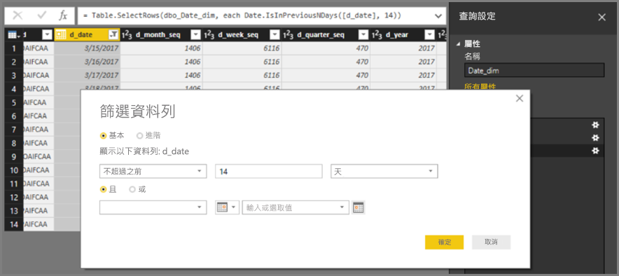
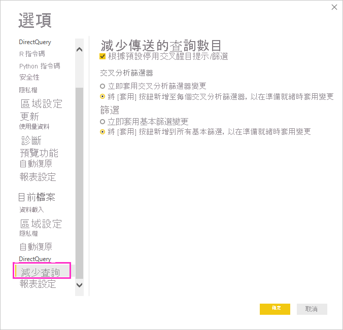
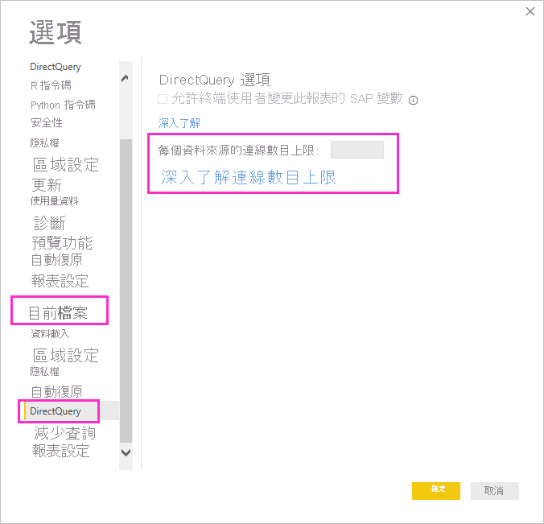
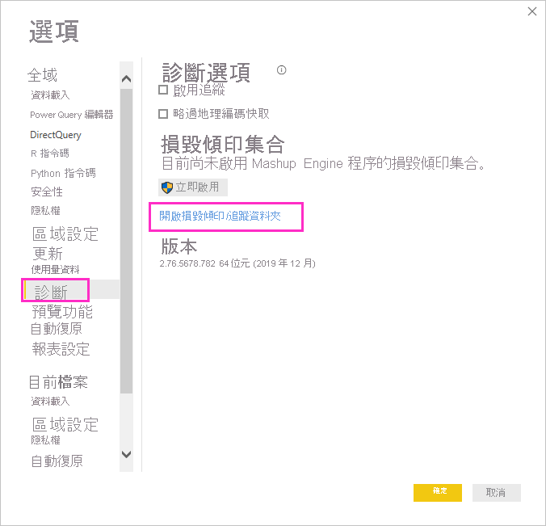
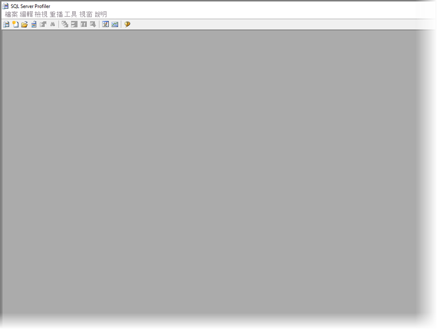
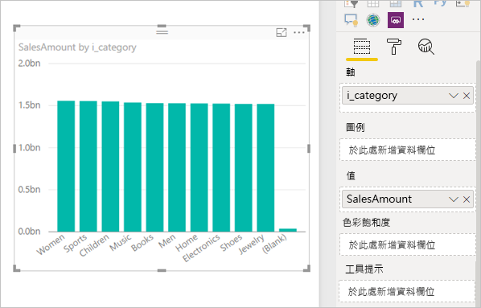

# <a name="about-using-directquery-in-power-bi"></a>如何在 Power BI 中使用 DirectQuery

您可以在使用 *Power BI Desktop* 或 *Power BI 服務* 時連接到各種不同的資料來源，且可以利用不同的方法來進行這些資料連接。 您可以將資料「匯入」Power BI (這是取得資料的最常見方法)，或直接連線至原始來源存放庫中的資料 (也稱為 *DirectQuery*)。 本文將說明 DirectQuery 的功能：

* DirectQuery 的不同連接選項
* 何時應該考慮使用 DirectQuery 而不是匯入的指引
* 使用 DirectQuery 的缺點
* 使用 DirectQuery 的最佳做法

依照使用匯入或 DirectQuery 的最佳做法操作：

* 您應該盡可能將資料匯入 Power BI。 如此即可利用 Power BI 的高效能查詢引擎，並提供資料的高度互動和功能完整的體驗。
* 如果您的目標無法透過匯入資料來達成，則可以考慮使用 DirectQuery。 例如，如果資料經常變更且報表必須反映最新資料，則 DirectQuery 可能是最佳選擇。 不過，只有在基礎資料來源可以針對一般彙總查詢提供互動式查詢 (不到 5 秒)，且能夠處理即將產生的查詢負載時，才適合使用 DirectQuery。 此外，您應仔細考量 DirectQuery 的限制清單。

Power BI 為匯入和 DirectQuery 所提供的功能集，會隨著時間持續演進。 這些變更包括使用匯入的資料時可提供更大的彈性 (例如可在更多情況下使用匯入)，以及排除使用 DirectQuery 的一些缺點。 不論有哪些改進，在使用 DirectQuery 時，基礎資料來源的效能一律是主要考量。 如果基礎資料來源緩慢，則仍不適合對該來源使用 DirectQuery。

本文將說明與 Power BI 搭配使用的 DirectQuery，但不說明 *SQL Server Analysis Services*。 DirectQuery 也是 SQL Server Analysis Services 的功能之一。 本文中說明的許多詳細資料皆適用於該功能。 但也有若干重要差異。 如需搭配 SQL Server Analysis Services 使用 DirectQuery 的相關資訊，請參閱 [SQL Server 2016 Analysis Services 中的 DirectQuery](https://download.microsoft.com/download/F/6/F/F6FBC1FC-F956-49A1-80CD-2941C3B6E417/DirectQuery%20in%20Analysis%20Services%20-%20Whitepaper.pdf)。

本文著重於在 Power BI Desktop 中建立報表的建議 DirectQuery 工作流程，但也會說明在 Power BI 服務中直接連接的方式。

## <a name="power-bi-connectivity-modes"></a>Power BI 連接模式

Power BI 會連接到大量的各種資料來源，包括：

* 線上服務 (Salesforce、Dynamics 365 等)
* 資料庫 (SQL Server、Access、Amazon Redshift 等)
* 簡易檔案 (Excel、JSON 等)
* 其他資料來源 (Spark、網站、Microsoft Exchange 等)

針對這些來源，您可以將資料匯入 Power BI。 對於某些來源，您也可以使用 DirectQuery 來連線。 如需支援 DirectQuery 來源的摘要，請參閱 [DirectQuery 支援的資料來源](power-bi-data-sources.md)。 未來將有更多來源啟用 DirectQuery，主要是預期可提供良好互動式查詢效能的來源。

SQL Server Analysis Services 是特殊案例。 連線至 SQL Server Analysis Services 時，您可以選擇匯入資料，或使用「即時連線」。 使用即時連線的效用與 DirectQuery 相似。 此時不會匯入任何資料，而一律會查詢基礎資料來源以重新整理視覺效果。 即時連線在其他許多方面都不相同，因此會使用 DirectQuery 一詞與「即時連線」區分。

連線至資料的選項共有三種：匯入、DirectQuery 和即時連線。

### <a name="import-connections"></a>匯入連接

若使用匯入，在 Power BI Desktop 中使用 **取得資料** 連線至 SQL Server 等資料來源時，該連線的行為如下：

* 在初次使用「取得資料」時，選取的資料表集分別會定義將傳回一組資料的查詢。 在載入資料之前，可以先編輯這些查詢，例如，套用篩選、彙總資料，或聯結不同的資料表。
* 載入時，由這些查詢定義的所有資料都將匯入 Power BI 快取。
* 在 Power BI Desktop 中建置視覺效果時，即會查詢匯入的資料。 Power BI 存放區可確保查詢的速度。 視覺效果的所有變更都會立即反映出來。
* 基礎資料的任何變更都不會反映在任何視覺效果中。 您必須重新整理以重新匯入資料。
* 將報表以 *.pbix* 檔案的形式發佈至 Power BI 服務時，將會建立資料集並上傳至 Power BI 服務。 該資料集會包含匯入的資料。 接著，您可以設定排程該資料的重新整理，例如每天重新匯入資料。 視原始資料來源的位置而定，您可能必須設定內部部署資料閘道。
* 在 Power BI 服務中開啟現有的報表或撰寫新的報表時，會重新查詢匯入的資料，以確保彼此互動。
* 視覺效果或整個報表頁面可以釘選為儀表板磚。 每次重新整理基礎資料集都會自動重新整理這些磚。

### <a name="directquery-connections"></a>DirectQuery 連接

若使用 DirectQuery，當您在 Power BI Desktop 中使用「取得資料」連線至資料來源時，該連線的行為如下：

* 在初次使用「取得資料」時，會選取來源。 針對關聯式來源，會選取一組資料表，而每個資料表仍會定義一個查詢，而以邏輯方式傳回一組資料。 對於多維度來源，如 SAP BW，只會選取該來源。
* 但在載入時，並不會將資料匯入 Power BI 存放區中。 其行為是，在 Power BI Desktop 中建立視覺效果時，會將查詢傳送至基礎資料來源以擷取必要的資料。 重新整理視覺效果所需的時間，取決於基礎資料來源的效能。
* 基礎資料的任何變更都不會立即反映在任何現有的視覺效果中。 您仍須重新整理。 系統會針對每個視覺效果重新傳送必要的查詢，並視需要更新視覺效果。
* 將報表發佈至 Power BI 服務時，系統會在 Power BI 服務中再次產生資料集，如同匯入一樣。 不過，該資料集「不會包含任何資料」。
* 在 Power BI 服務中開啟現有的報表或撰寫新的報表時，會重新查詢基礎資料來源以擷取必要的資料。 根據原始資料來源的位置，您可能必須設定內部部署資料閘道，如同重新整理資料時需要的匯入模式設定一樣。
* 視覺效果或整個報表頁面可以釘選為儀表板磚。 為了確保能快速開啟儀表板，這些磚會依排程自動重新整理，例如每小時一次。 您可以控制此重新整理的頻率，以反映資料變更的頻率，以及查看最新資料的重要性。 在開啟儀表板時，磚會反映上次重新整理時的資料，而不一定是對基礎來源所做的最新變更。 您可以重新整理開啟的儀表板，以確保其內容是最新的。

### <a name="live-connections"></a>即時連接

連線至 SQL Server Analysis Services (SSAS) 時，可以選擇從選取的資料模型匯入資料，或即時連線至選取的資料模型。 如果使用匯入，然後定義對該外部 SQL Server Analysis Services 來源的查詢，則會正常匯入資料。 如果使用即時連線，則不會定義任何查詢，且整個外部模型都會顯示在欄位清單中。

前一個段落中說明的情況也適用於連線至下列來源的案例，但無法選擇匯入資料：

* Power BI 資料集，例如，連線至先前已建立並發佈至服務的 Power BI 資料集，以在其上撰寫新的報表。
* Microsoft Dataverse。

透過 SQL Server Analysis Services 的報表在發佈至 Power BI 服務時的行為，與 DirectQuery 報表有下列相似之處：

* 在 Power BI 服務中開啟現有的報表或撰寫新報表時，會查詢基礎 SQL Server Analysis Services 來源 (可能需要內部部署資料閘道)。
* 儀表板磚會依排程自動重新整理，例如每小時一次。

但也有若干重要差異。 例如，在進行即時連線時，開啟報表的使用者身分識別一律會傳遞至基礎 SQL Server Analysis Services 來源。

撇開這些比較不談，我們在本文的其餘部分將僅著重於 DirectQuery。

## <a name="when-is-directquery-useful"></a>何時適合使用 DirectQuery？

下表說明使用 DirectQuery 進行連線時可能特別有用的情況。 其中包括將資料保留在原始來源中將有所助益的情況。 該描述包含指定的情況是否適用於 Power BI 的相關討論。

| 限制 | 描述 |
| --- | --- |
| 資料經常變更，且需要幾近即時的報告 |具有匯入資料的模型最多可以每小時重新整理一次 (使用 Power BI Pro 或 Power BI Premium 訂用帳戶可提高重新整理頻率)。 如果資料持續變更，且報表必須顯示最新資料，則使用匯入與排程重新整理可能無法滿足這些需求。 您可以將資料直接串流到 Power BI 中，但在此情況下，支援的資料量有限。 <br/> <br/> 相較之下，使用 DirectQuery，意味著開啟或重新整理報表或儀表板時一律會顯示來源中的最新資料。 此外，可以更頻繁地更新儀表板磚，最高每 15 分鐘一次。 |
| 資料很大 |資料很大時，將無法全部匯入。 相較之下，DirectQuery 是就地查詢，因此不需要傳輸大量資料。 <br/> <br/> 不過，資料較大時，也可能表示對該基礎來源的查詢效能太慢，如[使用 DirectQuery 的影響](#implications-of-using-directquery)中所述。 您不一定要匯入完整的詳細資料。 相對地，您可以在匯入期間預先彙總資料。 「查詢編輯器」可讓您在匯入期間輕鬆地預先彙總。 如有必要，您可以只匯入每個視覺效果所需的彙總資料。 雖然 DirectQuery 是處理大型資料最簡單的方法，但匯入彙總資料將可解決基礎來源效能太慢的問題。 |
| 安全性規則是在基礎來源中定義 |匯入資料之後，Power BI 會使用目前的使用者認證 (從 Power BI Desktop)，或使用設定排程重新整理時所定義的認證 (從 Power BI 服務) 連線至資料來源。 在「匯入」模式中發佈及共用具有資料的這類報表時務必謹慎，請只與可查看相同資料的使用者共用，或定義資料列層級安全性作為資料集的一部分。 <br/> <br/> DirectQuery 允許將報表檢視者的認證傳遞至基礎來源，並在該處套用安全性規則。 支援對 SQL Azure 資料來源進行單一登入，以及透過資料閘道對內部部署 SQL Server 進行單一登入。 [Power BI 中閘道的單一登入 (SSO) 概觀](service-gateway-sso-overview.md)對此會有更詳細的說明。 |
| 套用資料主權限制 |某些組織設有資料主權相關原則，換句話說，資料不可以離開組織內部。 採用匯入的解決方案很明顯會有問題。 相對之下，使用 DirectQuery 可將資料保留在基礎來源中。 <br/> <br/> 不過，即使是使用 DirectQuery，還是會有一些視覺效果層級的資料快取保留在 Power BI 服務中，因為磚會進行排定的重新整理。 |
| 基礎資料來源是包含量值的 OLAP 來源 |如果基礎資料來源包含「量值」(例如 SAP HANA 或 SAP Business Warehouse)，則匯入資料會衍生其他問題。 這表示匯入的資料會位於由查詢所定義的特定彙總層級。 例如，依 **Class**、**Year** 和 **City** 測量 **TotalSales**。 如果您建置的視覺效果需要更高層級彙總的資料 (例如，依 **Year** 測量的 **TotalSales**)，則系統會進一步彙總此彙總值。 此彙總對於加總量值 (例如 **Sum** 和 **Min**) 不構成問題，但對非加總量值 (例如 **Average**、**DistinctCount**) 則有問題。 <br/> <br/> 若要輕鬆地直接從來源取得正確的彙總資料 (特定視覺效果所需的資料)，則必須像是在 DirectQuery 中一樣就個別的視覺效果傳送查詢。 <br/> <br/> 連接到 SAP Business Warehouse (BW) 時，選擇 DirectQuery 可進行此量值處理。 如需 SAP BW 的詳細資訊，請參閱 [DirectQuery 和 SAP BW](desktop-directquery-sap-bw.md)。 <br/> <br/> 不過，透過 SAP HANA 的 DirectQuery 目前會將其視同關聯式來源，而提供類似於匯入的行為。 [DirectQuery 和 SAP HANA](desktop-directquery-sap-hana.md) 將進一步說明此方法。 |

整體而言，Power BI 中的 DirectQuery 目前提供的功能在下列情況下會有所幫助：

* 資料經常變更，且需要幾近即時的報告。
* 處理非常大型的資料，而不需要預先彙總。
* 套用資料主權限制。
* 來源是包含量值的多維度來源 (例如 SAP BW)。

上述清單中的詳細資料與單獨使用 Power BI 相關。 您可以使用外部 SQL Server Analysis Services 或 Azure Analysis Services 模型來匯入資料。 然後，再使用 Power BI 連線至該模型。 雖然該方法需要額外的設定，但將可提供更大的彈性。 您可以匯入更大量的資料。 重新整理資料的頻率並無限制。

## <a name="implications-of-using-directquery"></a>使用 DirectQuery 的影響

如本節所述，使用 DirectQuery 並沒有潛在負面影響。 視所使用的實際來源而定，其中一些限制會稍微不同。 我們會在適當情況下說明限制，並以個別文章探討截然不同的來源。

### <a name="performance-and-load-on-the-underlying-source"></a>基礎來源的效能和負載

使用 DirectQuery 時，整體體驗絕大部分取決於基礎資料來源的效能。 例如，如果在變更交叉分析篩選器值之後重新整理每個視覺效果需要幾秒鐘的時間 (通常不到 5 秒)，體驗就是合理的。 相較於將資料匯入 Power BI 時的立即回應，此體驗可能會顯得緩慢。 如果來源緩慢的回應導致個別視覺效果需耗時數十秒以上，則體驗會變得很差。 查詢甚至可能逾時。

除了基礎來源的效能以外，也應留意來源承受的負載。 負載會影響效能。 開啟共用報表的每位使用者，以及定期重新整理的每個儀表板磚，都會針對每個視覺效果傳送至少一個查詢至基礎來源。 因此，來源必須能夠處理這類查詢負載，同時仍維持合理的效能。

### <a name="security-implications-when-combining-data-sources"></a>合併資料來源時的安全性影響

在 DirectQuery 模型中，可以使用多個資料來源，就像您在匯入資料時一樣，方法是使用[複合模型](../transform-model/desktop-composite-models.md)功能。 當您使用多個資料來源時，請務必了解在基礎資料來源之間來回移動資料的方式，以及其產生的[安全性影響](../transform-model/desktop-composite-models.md#security-implications)。

### <a name="limited-data-transformations"></a>有限的資料轉換

同樣地，您可以在查詢編輯器中套用資料轉換限制。 匯入資料後，您可以輕鬆套用一組精細的轉換，將資料清除並重整，再使用此資料建立視覺效果，例如剖析 JSON 文件，或將資料行中的資料轉換到資料列表單。 這些轉換在 DirectQuery 中有更多限制。

首先，在連線至 SAP Business Warehouse 等 OLAP 來源時，完全無法定義轉換，而且會從來源取出整個外部模型。 至於 SQL Server 等關聯式來源，您仍可對每個查詢定義一組轉換，但基於效能考量，這些轉換會受到限制。

您必須對基礎來源的每個查詢套用任何這類轉換，而不是在資料重新整理時套用一次，因此轉換僅限於可合理轉譯成單一原生查詢的轉換。 如果您使用的轉換太過複雜，則會出現錯誤，指出必須加以刪除，或將模型切換至匯入。

此外，從 [取得資料] 對話方塊或查詢編輯器產生的查詢，將用於為擷取視覺效果必要資料所產生及傳送之查詢內的子選擇。 在查詢編輯器中定義的查詢，在此內容中必須是有效的。 尤其是，您將無法使用採用通用資料表運算式的查詢，也無法使用叫用預存程序的查詢。

### <a name="modeling-limitations"></a>模型限制

「模型」一詞在此內容中表示精簡及擴充未經處理資料的功能，屬於撰寫使用模型之報表的一部分。 範例包括：

* 定義資料表之間的關聯性
* 新增計算 (計算結果欄和量值)
* 重新命名及隱藏資料行和量值
* 定義階層
* 定義資料行的格式、預設摘要和排序次序
* 群組或叢集值

使用 DirectQuery 時，仍可進行許多這類模型擴充，且當然也有擴充未經處理資料的原則，以便改善後續的使用。 不過，使用 DirectQuery 時，某些模型功能將無法使用或受到限制。 為避免效能問題，通常會套用這些限制。 以下列出所有 DirectQuery 來源常見的一組限制。 個別來源可能還會有其他限制，如[後續步驟](#next-steps)所說明。

* **沒有內建日期階層：** 匯入資料時，每個日期/日期時間資料行依預設也會有內建日期階層可用。 例如，如果匯入包含 **OrderDate** 資料行的銷售訂單資料表，則在視覺效果中使用 **OrderDate** 時，可以選擇要使用的適當層級 (Year、Month、Day)。 使用 DirectQuery 時無法使用此內建日期階層。 如果基礎來源中有可用的 **Date** 資料表 (這在許多資料倉儲中很常見)，則可以如往常般使用 DAX 時間智慧函式。
* **日期/時間僅支援到秒精確度：** 當您在資料集中使用時間資料行時，Power BI 只會向基礎來源發出查詢到秒的詳細資料層級。 傳送至 DirectQuery 來源的查詢不會到毫秒的層級。 從您的來源資料行中移除這部分的時間。
* **計算結果欄限制：** 計算結果欄僅限於內部資料列，換句話說，它們只會參考相同資料表之其他資料行的值，而不會使用任何彙總函式。 此外，允許的 DAX 純量函式 (例如 `LEFT()`) 僅限於可推送至基礎來源的函式。 此類函式會根據來源的確切功能而有所不同。 撰寫導出資料行的 DAX 時，不會在自動完成功能中列出不支援的函式，而且如果使用這些函式，將會導致錯誤。
* **不支援父子式 DAX 函式：** 在 DirectQuery 模型中，您無法使用一般用來處理父子式結構 (例如會計科目表或員工階層) 的 `DAX PATH()` 函式系列。
* **不支援導出資料表：** DirectQuery 模式不支援使用 DAX 運算式來定義導出資料表的功能。
* **關聯性篩選：** 如需雙向篩選的相關資訊，請參閱 [雙向交叉篩選](https://download.microsoft.com/download/2/7/8/2782DF95-3E0D-40CD-BFC8-749A2882E109/Bidirectional%20cross-filtering%20in%20Analysis%20Services%202016%20and%20Power%20BI.docx)。 此白皮書提供 SQL Server Analysis Services 內容中的範例。 相關基本重點同樣適用於 Power BI。
* **無叢集：** 使用 DirectQuery 時，您無法使用「叢集」功能自動尋找群組。

### <a name="reporting-limitations"></a>報告限制

DirectQuery 模型支援幾乎所有報告功能。 因此，只要基礎來源提供適當的效能等級，則可以使用一組相同的視覺效果。 Power BI 服務所提供的一些其他功能在發佈報表之後有某些重要限制：

* **不支援快速見解：** Power BI 快速見解可搜尋資料集的不同子集，同時套用一組複雜的演算法來探索潛在相關見解。 這項功能需要很高效能的查詢，因此無法用於使用 DirectQuery 的資料集。
* **不支援問答集：** Power BI 問與答可讓您使用直覺式的自然語言功能來探索資料，並以圖表和圖形形式接收回應。 不過，目前不支援使用 DirectQuery 的資料集。
* **使用 [在 Excel 中探索] 很可能會導致較差的效能：** 您可以在資料集上使用「在 Excel 中探索」功能來探索資料。 此方法可在 Excel 中建立樞紐分析表和樞紐分析圖。 雖然使用 DirectQuery 的資料集支援這項功能，但效能通常會比在 Power BI 中建立視覺效果還要慢，因此如果您必須要使用 Excel，則應將此事項列入決定使用 DirectQuery 的考量。
* **文字資料行的最大長度：** 使用 DirectQuery 之資料集的文字資料行中資料的最大長度為 32,764 個字元。 若報告的文字長度大於該長度，則將導致錯誤。

### <a name="security"></a>安全性

如本文先前所述，DirectQuery 中的報表一律會在發佈至 Power BI 服務之後，使用相同的固定認證連線至基礎資料來源。 這是 DirectQuery 的行為 (而不是 SQL Server Analysis Services 的即時連線)，後者在這方面的行為並不相同。 您必須在發佈 DirectQuery 報表之後，立即設定所將使用的使用者認證。 在設定認證之前，在 Power BI 服務中開啟報表將會產生錯誤。

一旦提供使用者認證，「不論是哪位使用者開啟報表」，都會使用這些認證。 如此，就與匯入的資料完全相同。 除非將資料列層級安全性定義為報表的一部分，否則所有使用者都會看到相同的資料。 如果基礎來源中定義了任何安全性規則，在共用報表時也必須注意這一點。

此外，從 Power BI Desktop 進行 SQL Server 的 DirectQuery 連線時，不支援「替代認證」。 您可使用目前的 Windows 認證或資料庫認證。

### <a name="behavior-in-the-power-bi-service"></a>Power BI 服務中的行為

本節說明 Power BI 服務中的 DirectQuery 報表行為，以闡明將放置於後端資料來源上的負載量、將共用報表和儀表板的指定使用者數目、報表的複雜度，以及是否已在報表中定義資料列層級安全性。

#### <a name="reports--opening-interacting-with-editing"></a>報表 - 開啟、互動、編輯

開啟報表之後，目前可見頁面上的所有視覺效果都會重新整理。 每個視覺效果通常需要傳送至少一個查詢至基礎資料來源。 某些視覺效果可能需要多個查詢。 例如，視覺效果可能會顯示來自兩個不同事實資料表的彙總值、包含更複雜的量值，或包含 Count Distinct 之類的非加總量值。 移至新頁面時，會重新整理這些視覺效果。 重新整理時會將一組新的查詢傳送至基礎來源。

報表上的每個使用者互動都可能會導致重新整理視覺效果。 例如，在交叉分析篩選器上選取不同的值時，必須傳送一組新查詢，以重新整理所有受影響的視覺效果。 相同規則也適用於在視覺效果上按一下以交叉醒目提示其他視覺效果，或是變更篩選。

同樣地，在編輯新的報表時，必須針對路徑上的每個步驟傳送查詢，以產生最終的視覺效果。

這會產生一些結果快取。 如果最近取得了完全相同的結果，則會即時重新整理視覺效果。 若已定義資料列層級安全性，則不會在使用者之間共用這類快取。

#### <a name="dashboard-refresh"></a>儀表板重新整理

個別視覺效果或整個頁面可以釘選為儀表板磚。 以 DirectQuery 資料集為基礎的磚會根據排程自動重新整理。 磚會將查詢傳送至後端資料來源。 根據預設，資料集重新整理會每小時執行一次，但可以在資料集設定中設定為每週與每 15 分鐘之間的值。

如果模型中未定義資料列層級安全性，則每個磚將會重新整理一次，且所有使用者將共用這些結果。 若已定義，則可能會有很大的乘數效應。 每個磚必須就個別使用者將個別的查詢傳送至基礎來源。

假設儀表板有 10 個磚、與 100 位使用者共用、在使用 DirectQuery 且具有資料列層級安全性的資料集上建立，且設定為每 15 分鐘重新整理一次，則會導致每 15 分鐘傳送至少 1000 個查詢至後端來源。

在使用資料列層級安全性，以及設定重新整理排程時，請務必仔細考量。

#### <a name="time-outs"></a>逾時

Power BI 服務中的個別查詢套用四分鐘的逾時值。 耗時超過此值的查詢將會失敗。 如先所述，如果來源提供幾近互動的查詢效能，建議您使用 DirectQuery。 此限制的目的是為了防止因執行時間過長而產生問題。

### <a name="other-implications"></a>其他影響

使用 DirectQuery 時會產生的其他一般影響如下：

* **如果資料持續變更，則必須藉由重新整理來確保顯示的是最新資料：** 在使用快取，無法保證視覺效果一律會顯示最新的資料。 例如，視覺效果可能會顯示最後一天的交易。 由於交叉分析篩選器會變更，因此可能會經由重新整理顯示最後兩天的交易。 這些交易可能包括最近的新進交易。 將交叉分析篩選器回復為原始值，會導致其再次顯示先前取得的快取值。

  選取 [重新整理] 將會清除任何快取，並重新整理頁面上的視覺效果以顯示最新資料。

* **如果資料持續變更，則無法保證視覺效果之間的一致性：** 不同的視覺效果可能會在不同的時間重新整理，無論它們是否位於相同的頁面上。 如果基礎來源中的資料持續變更，則無法保證每個視覺效果會顯示相同時間點的資料。 事實上，由於有時候單一視覺效果需要多個查詢 (例如，為了取得詳細資料和總計)，單一視覺效果內也不見得能保有一致性。 若要確實保有此一致性，則必須在每次有任何視覺效果重新整理時另行重新整理所有視覺效果，同時在基礎資料來源中使用高成本的功能，例如快照隔離。

  同樣地，選取 [重新整理] 來重新整理頁面上的所有視覺效果，可大幅減輕此問題。 即使使用匯入模式，從多個資料表匯入資料時，在確保一致性方面還是會發生類似的問題。

* **需要在 Power BI Desktop 中進行重新整理，以反映所有中繼資料變更：** 發佈報表之後，**重新整理** 將會重新整理報表中的視覺效果。 如果基礎來源的結構描述已變更，則不會自動套用這些變更以改變欄位清單中可用的欄位。 如果已從基礎來源中移除資料表或資料行，可能會導致查詢在重新整理時失敗。 在 Power BI Desktop 中開啟報表，然後選擇 [重新整理]，將會更新模型中的欄位以反映變更。

* **任何查詢最多可傳回一百萬個資料列的限制：** 對基礎來源的任何單一查詢可傳回的資料列數目有固定限制，即一百萬個資料列。 此限制通常不會造成實際影響，而且視覺效果本身不會顯示那麼多的點。 不過，如果 Power BI 未將傳送的查詢完整最佳化，而且有些要求的中繼結果超過限制，就可能達到此限制。 在建置視覺效果時，為了產生更合理的最終狀態，也可能會發生此狀況。 例如，若未套用篩選條件，而客戶超過一百萬人時，納入 [客戶] 和 [總銷售量] 將會達到此限制。

  傳回的錯誤將是：「外部資料來源的查詢結果集超過允許列數的最大值 '1000000'。」

* **無法從匯入模式變更為 DirectQuery 模式：** 雖然您通常可以將模型從 DirectQuery 模式切換為使用匯入模式，但您必須匯入所有必要的資料。 您也無法切換回之前的模式，這主要是由於功能集在 DirectQuery 模式中不受支援所致。 若是透過 SAP BW 等多維度來源的 DirectQuery 模型，由於處理外部量值的方式不同，因此也無法從 DirectQuery 切換為匯入。

## <a name="directquery-in-the-power-bi-service"></a>Power BI 服務中的 DirectQuery

所有來源均可從 Power BI Desktop 取得。 某些來源也可以直接從 Power BI 服務取得。 例如，您可以讓商務使用者使用 Power BI 連線至其在 Salesforce 中的資料，並立即取得儀表板，而不需要使用 Power BI Desktop。

只有兩個啟用 DirectQuery 的來源可以在服務中直接使用：

* Spark
* Azure SQL 資料倉儲

不過，建議在 Power BI Desktop 中開始使用任何來自這兩種來源的 DirectQuery。 其原因是，在 Power BI 服務中初次進行連線時，會套用許多重要限制。 從 Power BI 服務展開作業雖然很簡單，但若要進一步強化產生的報表，將會受到限制。 例如，您後續無法建立任何計算，或使用許多分析功能，甚或重新整理中繼資料以反映對基礎結構描述所做的任何變更。

## <a name="guidance-for-using-directquery-successfully"></a>成功使用 DirectQuery 的指引

如果您打算使用 DirectQuery，請參考本節提供的一些高階指引，以確保能順利運作。 本節中的指引衍生自本文稍早所述的＜使用 DirectQuery 的影響＞。

### <a name="back-end-data-source-performance"></a>後端資料來源效能

驗證簡單視覺效果可在合理的時間內重新整理。 重新整理時間應在 5 秒以內才能有合理的互動體驗。 如果視覺效果耗時超過 30 秒，則很有可能在發行報表後發生其他問題。 這些問題可能導致解決方案無法運作。

如果查詢速度緩慢，請檢查傳送至基礎來源的查詢，以及查詢效能緩慢的原因。 本文並未說明在整組潛在基礎來源之間進行資料庫最佳化的各種最佳做法。 本文討論的是適用於大多數情況的標準資料庫實務準則：

* 以整數資料行為基礎的關聯性，效能通常會優於其他資料類型的資料行聯結。
* 應建立適當的索引。 建立索引通常意味著會在支援的來源 (例如 SQL Server) 中使用資料行存放區索引。
* 應更新來源中任何必要的統計資料。

### <a name="model-design-guidance"></a>模型設計指引

定義模型時，建議您遵循下列指引：

* **避免在 [查詢編輯器] 中有複雜的查詢。** 查詢編輯器會將複雜的查詢轉譯成單一 SQL 查詢。 單一查詢會出現在每個傳送至該資料表之查詢的子選擇中。 如果該查詢很複雜，可能會導致每個傳送的查詢發生效能問題。 在 [查詢編輯器] 中選取最後一個步驟，然後從操作功能表選擇 [檢視原生查詢]，即可取得一組步驟的實際 SQL 查詢。
* **確保量值很簡單。** 至少在一開始，建議您將量值限定為簡單的彙總。 然後，如果這些量值的效用令人滿意，則可以定義更複雜的量值，但請注意每個量值的效能。
* **避免計算結果欄上有關聯性。** 這項指南與需要執行多重資料行聯結的資料庫有關。 Power BI 目前不允許以多個作為 FK/PK 的資料行為基礎的關聯性。 常見的因應措施，是使用導出資料行將資料行串連在一起，再讓聯結以該資料行依據。 雖然此因應措施適用於匯入的資料，但對於 DirectQuery，則會導致運算式的聯結。 該結果常會妨礙任何索引的應用，而導致效能不佳。 唯一的因應措施是實際將多個資料行具體化為基礎資料庫中的單一資料行。
* **避免 uniqueidentifier 資料行上有關聯性。** Power BI 原本就不支援 `uniqueidentifier` 資料類型。 在 `uniqueidentifier` 類型資料行之間定義關聯性，會導致使用聯結的查詢需要轉換。 同樣地，此方法也常會導致效能不佳。 在此案例經過特別最佳化之前，唯一的因應措施是將資料行具體化為基礎資料庫中的替代類型。
* **隱藏關聯性的 to 資料行。** 關聯性的 *to* 資料行通常是 *to* 資料表上的主索引鍵。 該資料行應隱藏。 如果隱藏，就不會出現在欄位清單中，且無法在視覺效果中使用。 通常，關聯性所依據的資料行事實上是「系統資料行」，例如資料倉儲中的 Surrogate 索引鍵。 隱藏這類資料行是很好的做法。 如果資料行具有意義，請導入可見、且具有相當於主索引鍵之簡單運算式的導出資料行，如下列範例所示：

  ```sql  
      ProductKey_PK   (Destination of a relationship, hidden)
      ProductKey (= [ProductKey_PK],   visible)
      ProductName
      ...
  ```

* **檢查計算結果欄的所有使用和資料類型變更。** 使用這些功能不一定有害。 這類做法會導致傳送至基礎來源的查詢包含運算式，而不是簡單的資料行參考。 同樣地，這可能會導致無法使用索引。
* **避免針對關聯性使用雙向交叉篩選。** 使用雙向交叉篩選可能會導致查詢陳述式無法順利執行。
* **嘗試設定 [採用參考完整性]。** 關聯性上的 [採用參考完整性] 設定可讓查詢使用 `INNER JOIN` 陳述式，而不是 `OUTER JOIN`。 此指引通常可改善查詢效能，不過這取決於資料來源的詳細資料。
* **請勿在查詢編輯器中使用相對資料篩選。** 您無法在 [查詢編輯器] 中定義相對資料篩選。 例如，篩選日期落在過去 14 天內的資料列。
  
  
  
  不過，此篩選會轉譯成依撰寫查詢時的固定日期進行的篩選。 檢視原生查詢時可能會看到此結果。
  
  
  
  這可能不是您想要的結果。 若要確保會根據執行報表時的日期套用篩選，請改為在報表中套用「報表篩選」形式的篩選。 目前若要使用此方法，請建立計算過往天數的導出資料行 (使用 `DAX DATE()` 函式)，然後在篩選中使用該導出資料行。

### <a name="report-design-guidance"></a>報表設計指引

使用 DirectQuery 連線建立報表時，請遵循下列指引：

* **考慮使用 [減少查詢] 選項：** Power BI 在報表中提供的某些選項會傳送較少查詢，並且停用會導致較差體驗的特定互動，可供您在產生的查詢執行耗時過久時使用。 若要在 Power BI Desktop 中存取這些選項，請移至 [檔案] > [選項及設定] > [選項]，並選取 [減少查詢]。

   

    選取 [減少查詢] 上的核取方塊可讓您停用整份報告的交叉醒目提示。 您也可以顯示交叉分析篩選器或篩選選取項目的 [套用] 按鈕。 此方法可讓您在套用多個交叉分析篩選器和篩選之前進行其選取。 在您選取交叉分析篩選器上的 [套用] 按鈕之前，將不會傳送任何查詢。 您的選取範圍即可用來篩選資料。

    當您在 Power BI Desktop 中與報表互動時，這些選項會套用至您的報表。 當您的使用者在 Power BI 服務中使用報表時，也會套用這些選項。

* **先套用篩選：** 請一律在建立視覺效果一開始就套用任何適用的篩選。 例如，您可以一開始就套用 [年份] 篩選，而不要在 [總銷售額] 和 [產品名稱] 中拖曳，然後篩選為特定年份。 在建置視覺效果的每個步驟中，都會傳送查詢。 雖然後續可在完成第一個查詢之前進行其他變更，但此方法仍會對基礎來源產生不必要的負載。 藉由及早套用篩選，通常可降低這些中繼查詢的成本。 此外，未能及早套用篩選，即可能會達到一百萬個資料列的限制。
* **限制單頁上的視覺效果數目：** 當您開啟頁面或變更頁面層級交叉分析篩選器或篩選時，頁面上的所有視覺效果都會重新整理。 平行傳送的查詢數目也有所限制。 當視覺效果數目增加時，其中一些視覺效果會循序重新整理，而增加重新整理整個頁面所需的時間。 因此，建議您限制單一頁面上的視覺效果數目，而改用較多較簡單的頁面。
* **考慮關閉視覺效果之間的互動：** 報表頁面上的視覺效果預設可用於交叉篩選和交叉醒目提示頁面上的其他視覺效果。 例如，在圓形圖上選取 **1999** 時，橫條圖上會交叉醒目提示，以顯示 **1999** 類別的銷售量。
  
  
  
  若要在 DirectQuery 中的交叉篩選和交叉醒目提示，必須將查詢提交至基礎來源。 如果回應使用者選取的所需時間會相當長，則應將互動關閉。 您可以關閉此互動。 您可以對整份報告 (如上述的「減少查詢」選項) 或就個別案例將互動關閉。 如需詳細資訊，請參閱[如何在 Power BI 報表中相互進行視覺效果交叉篩選](../consumer/end-user-interactions.md)。

除了上述建議清單之外，下列各項報告功能也可能會導致效能問題：

* **量值篩選：** 含有量值 (或資料行彙總) 的視覺效果可能會對這些量值使用篩選。 例如，下圖依 **類別** 顯示 **SalesAmount**，但只包含銷售量超過 **2000 萬** 的類別。
  
  
  
  此方法會導致兩個查詢傳送至基礎來源：
  
  * 第一個查詢會擷取符合條件 (**SalesAmount** 超過 2000 萬) 的類別。
  * 第二個查詢會接著擷取視覺效果的必要資料，包括與 `WHERE` 子句中的條件相符的類別。
  
  如果像此範例中有數百個或數千個類別，此方法執行起來通常沒有問題。 如果類別數目遠高於此，效能就可能會降低。 如果符合條件的類別達超過一百萬個，查詢將會失敗。 先前已討論過一百萬個資料列的限制。

* **TopN 篩選：** 您可以定義進階篩選，而僅根據依特定量值排名的前 (或最後) N 個值進行篩選。 例如，篩選可包含上一個視覺效果中的前 10 個類別。 此方法同樣會導致兩個查詢傳送至基礎來源。 不過，第一個查詢會傳回基礎來源中的所有類別，然後根據傳回的結果來決定前 N 項。 根據涉及的資料行基數，此方法可能會導致效能問題，或因一百萬個資料列的限制而導致查詢失敗。

* **中位數**：一般而言，任何彙總 (例如 `Sum` 或 `Count Distinct`) 都會發送至基礎來源。 但中位數則不然，因為基礎來源通常不支援此彙總。 在這種情況下，將會從基礎來源擷取詳細資料，然後從傳回的結果計算中位數。 透過相對較少的結果來計算中位數時，此方法是可行的。 如果基數較高，就可能會發生效能問題，或因一百萬個資料列的限制而導致查詢失敗。 例如，計算 **國家/地區人口的中位數** 或許是可行的，但 **售價的中位數** 則否。

* **進階文字篩選 (「包含」與類似的篩選)：** 篩選文字資料行時，進階篩選允許「包含」與「開頭為」等篩選。 這些篩選肯定會導致某些資料來源的效能降低。 特別是，如果需要的是完全相符，則不應使用預設的 *包含* 篩選。 雖然結果可能相同，但根據實際資料，效能可能會因使用索引而有相當大的差異。

* **複選交叉分析篩選器：** 根據預設，交叉分析篩選器只可單選。 在篩選器中允許複選，可能會因為使用者在交叉分析篩選器中選取了一組項目，而導致某些效能問題。 例如，如果使用者選取了 10 個感興趣的產品，則每個新的選取項目都會導致查詢傳送至來源。 雖然使用者可在查詢完成前選取下一個項目，但此做法會對基礎來源產生額外的負載。

* **考慮關閉視覺效果上的總計：** 根據預設，資料表和矩陣會顯示總計和小計。 在許多情況下，個別查詢必須傳送到基底來源以取得此類總計的值。 每當使用 *DistinctCount* 彙總時，或在所有對 SAP BW 或 SAP HANA 使用 DirectQuery 的案例中，都適用此原則。 此類總計應使用 [格式] 窗格予以關閉。

### <a name="maximum-number-of-connections-option-for-directquery"></a>DirectQuery 的最大連線數目選項

您可以設定 DirectQuery 為每個基礎資料來源開啟的最大連線數目，以控制同時傳送至每個資料來源的查詢數目。

DirectQuery 依預設可開啟最大並行連線數目為 10 個。 您可以在 Power BI Desktop 中變更目前檔案的最大數目。 請移至 [檔案] > [選項及設定] > [選項]。 在左窗格的 [目前檔案] 區段中，選取 [DirectQuery]。



目前報表中至少一個 DirectQuery 來源時，才會啟用此設定。 值適用於所有 DirectQuery 來源，以及新增至相同報表中的任何新 DirectQuery 來源。

增加 [每個資料來源的連線數量上限]，可確保有更多查詢 (最多可達指定的最大數目) 可傳送至基礎資料來源。 此方法在單一頁面上有許多視覺效果時，或是許多使用者同時存取報表時，將有其效用。 一旦達到最大連線數目，進一步的查詢會排入佇列，直到有連線可供使用。 增加此限制會導致基礎來源有更多的負載，所以設定不保證能改善整體效能。

報表發佈後，傳送至基礎資料來源的並行查詢數量上限也會以固定限制為準。 這些限制取決於發佈報表的目標環境。 不同的環境 (例如 Power BI、Power BI Premium 或 Power BI 報表伺服器) 可能施加不同的限制。

> [!NOTE]
> 當[增強中繼資料](desktop-enhanced-dataset-metadata.md)啟用時，DirectQuery 連線設定的最大數目會應用所有 DirectQuery 來源，這是從 2020 年 10 月起，Power BI Desktop 中所建立所有模型的預設設定。 

### <a name="diagnosing-performance-issues"></a>診斷效能問題

本節說明如何診斷效能問題，或如何取得更詳細的資訊以便對報表進行最佳化。

建議您在 Power BI Desktop 中開始進行效能問題的診斷，而不是在 Power BI 服務中進行。 效能問題通常與基礎來源的效能有關。 在 Power BI Desktop 的隔離環境中，您可以更輕鬆地找出並診斷問題。 此方法會先排除某些元件，例如 Power BI 閘道。 如果效能問題與 Power BI Desktop 無關，請調查 Power BI 服務中所含報表的詳細資料。 [效能分析器](../create-reports/desktop-performance-analyzer.md)是一個實用的工具，可以識別這整個流程中的問題。

同樣地，建議您先嘗試隔離個別視覺效果的任何問題，而不是頁面上許多視覺效果的問題。

假設您已執行過本節前幾個段落中的步驟。 但在 Power BI Desktop 中的頁面上，仍有一個報表的效能表現不佳。 請使用[效能分析器](../create-reports/desktop-performance-analyzer.md)，判斷由 Power BI Desktop 傳送至基礎來源的查詢。 您也可以檢視可能由基礎資料來源發出的追蹤和診斷資訊。 追蹤也可能包含有關於查詢的執行方式以及如何加以改進的實用詳情。

此外，即使來源中沒有這類追蹤，您也可以檢視 Power BI 所傳送的查詢及其執行時間，如下一節所說明。

#### <a name="determining-the-queries-sent-by-power-bi-desktop"></a>判斷 Power BI Desktop 所傳送的查詢

根據預設，Power BI Desktop 會在指定的工作階段期間，將事件記錄到名為 *FlightRecorderCurrent.trc* 的追蹤檔案。

對於某些 DirectQuery 來源，此記錄包含所有傳送至基礎資料來源的查詢。 其餘 DirectQuery 來源將於日後納入。 會將查詢傳送至記錄的來源如下：

* SQL Server
* Azure SQL Database
* Azure SQL 資料倉儲
* Oracle
* Teradata
* SAP HANA

追蹤檔案可能位於目前使用者的 *AppData* 資料夾中：

*\<User>\AppData\Local\Microsoft\Power BI Desktop\AnalysisServicesWorkspaces*

若要取得此資料夾，請在 Power BI Desktop 中選取 [檔案] > [選項及設定] > [選項]，然後選取 [診斷]。 此時會出現下列對話方塊：



當選取 [Open crash dump/traces folder] \(開啟損毀傾印/追蹤資料夾\) 時，[診斷選項] 下會開啟下列資料夾： *\<User>\AppData\Local\Microsoft\Power BI Desktop\Traces*。

瀏覽至該資料夾的父資料夾時，會顯示包含 *AnalysisServicesWorkspaces* 的資料夾，而其中會有一個工作區資料夾，包含每個已開啟的 Power BI Desktop 執行個體。 這些資料夾會在名稱後面加上整數來命名，例如 *AnalysisServicesWorkspace2058279583*。

該資料夾內會有 *\\Data* 資料夾。 其中包含目前 Power BI 工作階段的追蹤檔案 *FlightRecorderCurrent.trc*。 當相關聯的 Power BI Desktop 工作階段結束時，即會刪除對應的工作區資料夾。

追蹤檔案可使用 *SQL Server Profiler* 工具來讀取。 您可以經由 [SQL Server Management Studio](/sql/ssms/download-sql-server-management-studio-ssms) 的免費下載加以取得。

下載並安裝 SQL Server Management Studio 之後，請執行 SQL Server Profiler。



若要開啟追蹤檔案，請執行下列步驟：

1. 在 SQL Server Profiler 中，選取 [檔案] > [開啟] > [追蹤檔案]。

1. 輸入目前開啟之 Power BI 工作階段的追蹤檔案路徑，例如：*C:\Users\<user>\AppData\Local\Microsoft\Power BI Desktop\AnalysisServicesWorkspaces\AnalysisServicesWorkspace2058279583\Data*.

1. 開啟 *FlightRecorderCurrent.trc*。

目前工作階段中的所有事件會隨即顯示。 註解的範例會顯示於此處，並醒目提示事件群組。 每個群組分別具有下列事件：

* `Query Begin` 和 `Query End` 事件，分別代表 UI (例如，從視覺效果或透過在篩選 UI 中填入值清單) 所產生之 DAX 查詢的開始和結束。
* `DirectQuery Begin` 與 `DirectQuery End` 事件的一或多個配對，代表在評估 DAX 查詢過程中傳送至基礎資料來源的查詢。

多個 DAX 查詢可以平行執行，因此來自不同群組的事件可以相互交錯。 `ActivityID` 的值可用來判斷哪些事件屬於相同的群組。


其他重要的資料行如下：

* **TextData：** 事件的文字詳細資料。 `Query Begin/End` 事件的詳細資料是 DAX 查詢。 `DirectQuery Begin/End` 事件的詳細資料則是傳送至基礎來源的 SQL 查詢。 目前所選事件的 **TextData** 也會顯示在底部區域中。
* **EndTime：** 事件完成的時間。
* **Duration：** 執行 DAX 或 SQL 查詢所需的持續時間 (毫秒)。
* **Error：** 指出是否發生錯誤 (若發生錯誤，該事件將會以紅色顯示)。

在上圖中，一些較不相關的資料行已縮窄，好讓其他資料行較容易檢視。

我們建議採用如下的方法來擷取追蹤，以利診斷潛在的效能問題：

* 開啟單一 Power BI Desktop 工作階段，以避免混淆多個工作區資料夾。
* 在 Power BI Desktop 中執行一組想要執行的動作。 請額外加入一些動作，以確保相關事件會排清到追蹤檔案中。
* 如前所述，開啟 SQL Server Profiler 並檢查追蹤。 請記住，關閉 Power BI Desktop 後，便會刪除追蹤檔案。 此外，Power BI Desktop 中進一步的動作也不會立即出現。 您應關閉並重新開啟追蹤檔案，以查看新的事件。
* 將個別工作階段保持為適當大小，即約 10 秒鐘的動作，而不是數百秒。 此方法可讓您更輕鬆地解譯追蹤檔案。 追蹤檔案的大小也有限制。 在較長的工作階段中，可能會出現卸除早期事件的情況。

#### <a name="understanding-the-form-of-query-sent-by-power-bi-desktop"></a>了解 Power BI Desktop 所傳送的查詢格式

Power BI Desktop 所建立及傳送的一般查詢格式，會對每個參考的資料表使用子選擇。 子選擇由查詢編輯器中的查詢所定義。 例如，假設 SQL Server 中有下列 TPC DS 資料表：


請考慮下列查詢：


該查詢會產生下列視覺效果：



重新整理該視覺效果，將會產生此處顯示的 SQL 查詢。 如您所見，`Web Sales`、`Item` 和 `Date_dim` 有三個子選擇，分別會傳回相關資料表的所有資料行，不過視覺效果實際上只會參考四個資料行。 加網底的子選擇中所含的查詢，也就是查詢編輯器中定義之查詢的結果。 以此方式使用子選擇不會影響效能，因為 DirectQuery 目前支援這些資料來源。 SQL Server 等資料來源會直接最佳化，而不需要參考其他資料行。

Power BI 之所以採用此模式，是因為分析師可以直接提供所使用的 SQL 查詢。 查詢可「依提供時的現狀」使用，而不會嘗試重寫查詢。


## <a name="next-steps"></a>後續步驟

本文說明常見於所有資料來源的 DirectQuery 層面。 某些詳細資料特別針對個別來源。 請參閱涵蓋特定來源的下列文章：

* [DirectQuery 和 SAP HANA](desktop-directquery-sap-hana.md)
* [DirectQuery 和 SAP BW](desktop-directquery-sap-bw.md)

如需 DirectQuery 的詳細資訊，請參閱下列資源：

* [DirectQuery 支援的資料來源](power-bi-data-sources.md)
