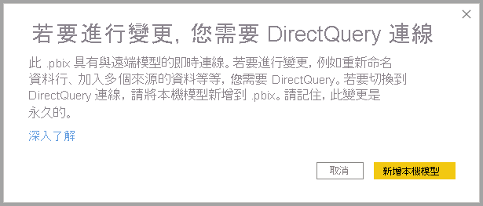
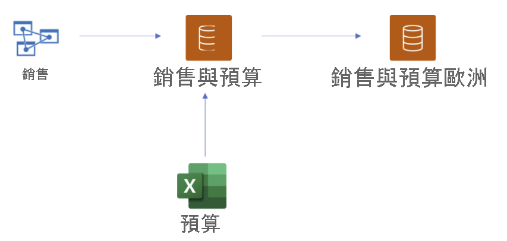
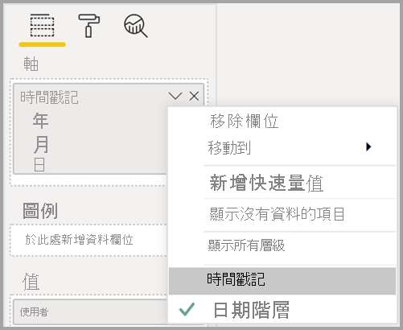

# 使用適用於 Power BI 資料集和 Azure Analysis Services 的 DirectQuery (預覽)

使用 **適用於 Power BI 資料集和 Azure Analysis Services (AAS) 的 DirectQuery**，您可以使用 DirectQuery 連線到 AAS 或 Power BI 資料集，並視需要將其與其他 DirectQuery 和匯入的資料合併。 若報表作者想要將其企業語意模型的資料與其擁有的其他資料 (例如 Excel 試算表) 合併，或者想要將其企業語意模型的中繼資料個人化或加以擴充，則會發現此功能特別有用。

## 啟用預覽功能

由於此功能目前為預覽狀態，因此，您必須先加以啟用。 若要這麼做，請在 Power BI Desktop 中，移至 [檔案] > [選項及設定] > [選項]，然後在 [預覽功能] 區段中，選取 [適用於 Power BI 資料集和 Analysis Services 的 DirectQuery] 核取方塊，以啟用此預覽功能。 您可能必須重新啟動 Power BI Desktop，變更才會生效。

## 使用 DirectQuery 進行即時連線

使用適用於 Power BI 資料集和 Azure Analysis Services 的 DirectQuery 時，您的報表必須具備本機模型。 您可以從即時連線開始，然後新增或升級至本機模型，或開始使用 DirectQuery 連線或匯入的資料，這會在您的報表中自動建立本機模型。

若要查看您的模型中正在使用哪些連線，請檢查 Power BI Desktop 右下角的狀態列。 如果您只連線到 Azure Analysis Services 來源，則會看到如下圖所示的訊息：

如果您連線到 Power BI 資料集，就會看到一則訊息，告知您已連線到哪個 Power BI 資料集：

如果您想要在即時連線資料集中自訂欄位的中繼資料，請在狀態列中選取 [對此模型進行變更]。 或者，您可以按一下功能區中的 [對此模型進行變更] 按鈕，如下圖所示。 在 [報表檢視] 中，[對此模型進行變更] 按鈕位於 [模型化] 索引標籤中。在 [模型檢視] 中，該按鈕位於 [常用] 索引標籤中。

![[對此模型進行變更] 按鈕](media/desktop-directquery-datasets-azure-analysis-services/directquery-datasets-02.png)

選取此按鈕，即會顯示一個對話方塊來確認要新增本機模型。 選取 [新增本機模型]，以針對來自 Power BI 資料集或 Azure Analysis Services 的欄位，建立新的資料行或修改中繼資料。 下圖為顯示的對話方塊。 

當您即時連線到 Analysis Services 來源時，不會有本機模型。 若要針對即時連線來源 (例如 Power BI 資料集和 Azure Analysis Services) 使用 DirectQuery，您必須在報表中新增本機模型。 當您將具有本機模型的報表發佈至 Power BI 服務時，也會發佈該本機模型的資料集。

## 鏈結

資料集及其所依據的資料集和模型會形成一個「鏈結」。 此程序稱為 **鏈結**，可讓您根據其他 Power BI 資料集發佈報表和資料集，這是前所未有的功能。

例如，假設您的同事發佈稱為「銷售與預算」的 Power BI 資料集，該資料集以稱為「銷售」的 Azure Analysis Services 模型為基礎，而且與稱為「預算」的 Excel 工作表合併。

當您發佈稱為「歐洲銷售與預算」的新報表 (和資料集) 時，會以您同事發佈的「銷售與預算」Power BI 資料集為基礎。當您進行某些進一步修改或擴充時，可以有效地將報表和資料集新增至長度三的鏈結中，這會從「銷售」Azure Analysis Services 模型開始，並以您的「歐洲銷售與預算」Power BI 資料集作為結尾。 下圖將此鏈結程序視覺化。

上圖中的鏈結長度為三，這是此預覽期間的最大長度。 不支援鏈結長度超過三的延伸，而且會導致錯誤。

## 安全性警告

使用 **適用於 Power BI 資料集和 Azure Analysis Services (AAS) 的 DirectQuery** 功能將會顯示安全性警告對話方塊，如下圖所示。

資料可能會從一個資料來源推送至另一個，這與在資料模型中合併 DirectQuery 和匯入來源的安全性警告相同。 若要深入了解此行為，請參閱[在 Power BI Desktop 中使用複合模型](../transform-model/desktop-composite-models.md)。

## 可嘗試的功能和案例

下列清單提供您如何自行探索 **適用於 Power BI 資料集和 Azure Analysis Services (AAS) 的 DirectQuery** 的相關建議：

- 從各種不同來源連線到資料：匯入 (例如檔案)、Power BI 資料集、Azure Analysis Services
- 建立不同資料來源之間的關聯性
- 撰寫使用來自不同資料來源之欄位的量值
- 針對來自 Azure Analysis Services 之 Power BI 資料集的資料表建立新資料行
- 建立使用來自不同資料來源之資料行的視覺效果

## 考量與限制

使用 **適用於 Power BI 資料集和 Azure Analysis Services (AAS) 的 DirectQuery** 時，請記住下列數個 **考量**：

- 如果您重新整理資料來源，且發生欄位或資料表名稱相衝突的錯誤，Power BI 會為您解決錯誤。

- 若要在以另一個資料集為基礎的複合模型上，於 Power BI 服務中建置報表，必須設定所有認證。 在 [重新整理認證設定] 頁面上，針對 Azure Analysis Services 來源，即使已設定認證，還是會出現下列錯誤：
    
    
- 因為這會造成混淆且不正確，所以我們很快就注意到這一點。

- RLS 規則將會在其定義所在的來源上套用，但不會套用到模型中的任何其他資料集。 報表中定義的 RLS 將不會套用到遠端來源，而且遠端來源上設定的 RLS 將不會套用到其他資料來源。

- 在此預覽版本中，將不會從來源匯入顯示資料夾、KPI、日期資料表、資料列層級安全性及翻譯。 您仍然可以在本機模型中建立顯示資料夾。

- 使用日期階層時，您可能會看到一些非預期的行為。 若要解決此問題，請改為使用日期資料行。 將日期階層新增至視覺效果之後，您可以透過按一下欄位名稱中的向下箭號，然後按一下該欄位的名稱，而不是使用 [日期階層]，來切換到日期資料行：

    

    如需使用日期資料行與日期階層的詳細資訊，請參閱此文章。

- 使用 AI 功能搭配具有與 Azure Analysis Services 之 DirectQuery 連線的模型時，您可能會看到毫無用處的錯誤訊息。 

- 使用 ALLSELECTED 搭配 DirectQuery 來源會產生不完整的結果。

- 篩選條件和關聯性：
    - 從資料來源套用到來自另一個 DirectQuery 來源之資料表的篩選條件，只能在單一資料行上設定

    - 使用來源之外的資料表進行篩選，以交叉篩選 DirectQuery 來源中的兩個資料表，並不是建議的設計，而且也不受支援。

    - 篩選條件一次只能觸及一個資料表。 不支援透過 DirectQuery 來源之外多個資料表的其中一個，將相同的篩選條件套用到某個資料表兩次。

- 在預覽期間，模型鏈結的最大長度為三。 不支援鏈結長度超過三的延伸，而且會導致錯誤。 

- 使用協力廠商工具時，可以在模型上設定「不鼓勵鏈結」旗標，以防止建立或延伸鏈結。 若要進行設定，請在模型上尋找 *DiscourageCompositeModels* 屬性。 

另外還有幾個您必須記住的 **限制**：

- 目前已停用資料庫和伺服器名稱的參數。 

- 不支援在來自遠端來源的資料表上定義 RLS。

- 目前不支援使用 SQL Server Analysis Services (SSAS) 作為 DirectQuery 來源。 

- 目前不支援在來自「我的工作區」的資料集上使用 DirectQuery。 

- 目前不支援刪除使用 DirectQuery 與遠端來源的連線。

- 目前不支援使用 Power BI Embedded 搭配包含與 Power BI 資料集或 Azure Analysis Services 模型之 DirectQuery 連線的資料集。

- 資料行上的格式字串和來自遠端來源的量值都不會匯入複合模型。

- 不支援具有未定義查詢結果之遠端來源上的計算群組。

- 當遠端來源中的計算資料表和資料表之間具有關聯性時，某些查詢可能會傳回錯誤的結果。 不支援透過遠端資料集建立計算資料表，儘管目前在介面中並未封鎖此功能也一樣。

- 目前不支援依資料行排序。

- 視資料來源類型而定，只有在某些情況下，才支援自動頁面重新整理 (APR)。 如需詳細資訊，請參閱 [Power BI 中的自動頁面重新整理](../create-reports/desktop-automatic-page-refresh.md)文章。

## 後續步驟

如需 DirectQuery 的詳細資訊，請參閱下列資源：

- [在 Power BI Desktop 中使用 DirectQuery](desktop-use-directquery.md)
- [Power BI Desktop 中的 DirectQuery 模型](desktop-directquery-about.md)
- [Power BI Desktop 中的 DirectQuery 模型指南](../guidance/directquery-model-guidance.md)
- 有問題嗎？ [嘗試在 Power BI 社群提問](https://community.powerbi.com/)
