# <a name="dynamic-m-query-parameters-in-power-bi-desktop-preview"></a>Power BI Desktop 中的動態 M 查詢參數 (預覽)

透過 **動態 M 查詢參數** ，模型作者可以讓 **報表檢視者** 使用篩選條件或交叉分析篩選器來設定 [M 查詢參數](/power-query/power-query-query-parameters)的值，這對查詢效能最佳化特別有用。 使用動態 M 查詢參數，模型作者可以進一步控制篩選選取項目併入 DirectQuery 來源查詢的方式。 

當模型作者了解其篩選條件的預期語意時，通常會知道如何針對其資料來源撰寫有效率的查詢，從而可以確保在正確的位置將篩選選取項目併入來源查詢，以達到其預期的結果，並提升效能。

## <a name="enabling-dynamic-m-query-parameters"></a>啟用動態 M 查詢參數

**動態 M 查詢參數** 目前為預覽狀態，而且必須啟用才能使用。 選取 [檔案] > [選項及設定] > [選項]，然後從左窗格選取 [預覽功能]。 確定已選取 [動態 M 查詢參數] 核取方塊。 您必須重新啟動 Power BI Desktop，才會啟用變更。

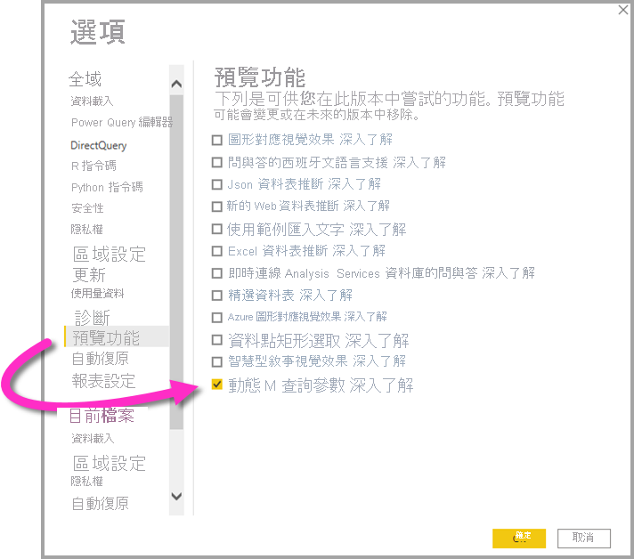

作為此功能的必要條件，您必須建立有效的 [M 查詢參數](/power-query/power-query-query-parameters)，並在一或多個直接查詢資料表中參考。 讓我們逐步執行一個範例，以動態方式將 **單一值** 傳遞給某個參數：

1. 在 Power BI Desktop 中，從 [資料] 索引標籤啟動 **Power Query** ，然後選取功能區中 [管理參數] 按鈕底下的 [新增參數]。

    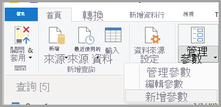

2. 接著，填寫下列有關參數的資訊。

    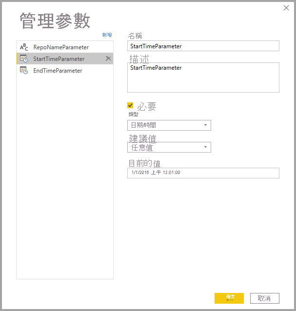

3. 如果您有其他要新增的參數，請再按一下 [新增]。

    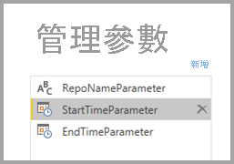

4. 建立參數之後，您可以在 M 查詢中參考這些參數。 若要修改 M 查詢，請選取要修改的查詢，然後開啟進階編輯器：

    

5. 接下來，參考 M 查詢中的參數 (在下圖中以黃色反白顯示)。 

    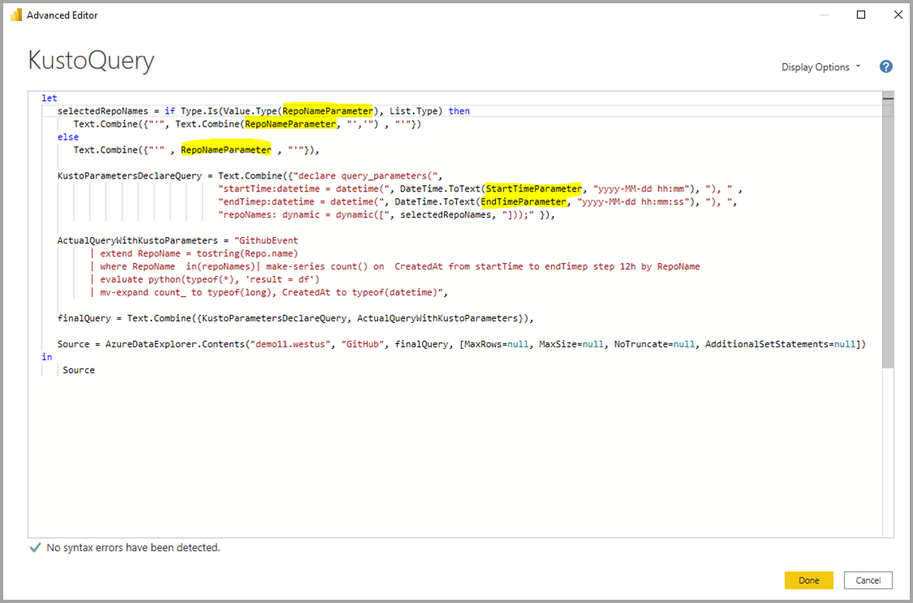

6. 既然您已經建立參數，並在 M 查詢中參考這些參數，接下來，您將必須建立一個資料表，其中包含可為該參數提供可用可能值的資料行。 這可讓您根據篩選選取項目，來動態設定參數。 在此範例中，我們想要將 *StartTime* 參數與 *EndTime* 參數設為動態。 因為這些參數需要 Date/Time 參數，所以我想要產生可用於設定參數日期的日期輸入。 首先，我們要建立新的資料表：

    

7. 以下是我為 *StartTime* 參數的值所建立的第一個資料表：

    ```StartDateTable = CALENDAR (DATE(2016,1,1), DATE(2016,12,31))```

    

8. 以下是我為 EndTime 參數的值所建立的第二個資料表：

    ```EndDateTable = CALENDAR (DATE(2016,1,1), DATE(2016,12,31))```

    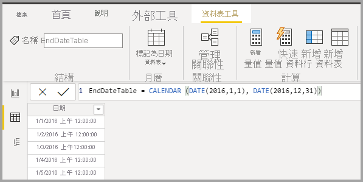

    > [!NOTE]
    > 建議使用不在實際資料表中的其他資料行名稱。 如果名稱相同，則選取的值將會套用為實際查詢的篩選條件。

9. 既然已經建立具有 [日期] 欄位的資料表，我們就可以將每個欄位繫結至參數。 將欄位繫結至參數基本上表示，當欄位的所選值變更時，該值將會傳遞給參數，並更新參考該參數的查詢。 因此，若要繫結欄位，請移至 [模型] 索引標籤、選取新建立的欄位，然後移至 [進階] 屬性：

    > [!NOTE]
    > 資料行資料類型應與 M 參數類型相符。

    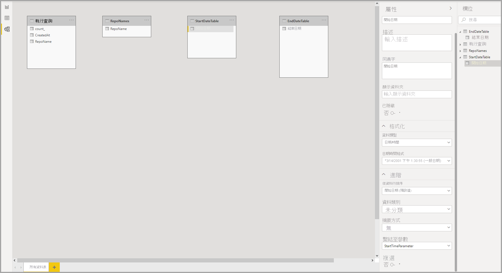

10. 選取 [繫結至參數] 底下的下拉式清單，然後選取您想要繫結至欄位的參數：

    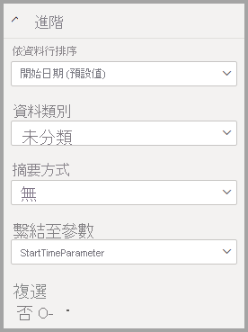

    此範例適用於單選值 (將參數設定為單一值)，因此您必須將 [複選] 設定為 [否]，這是預設值：

    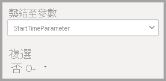

    如果您的使用案例需要使用複選 (將多個值傳遞給單一參數)，則必須將開關切換至 [是]，並確定您的 M 查詢已正確設定，才能在 M 查詢中接受多個值。 以下是 *RepoNameParameter* 的範例，其允許多重值：

    

11. 如果您有要繫結至其他參數的其他欄位，可以重複這些步驟：

    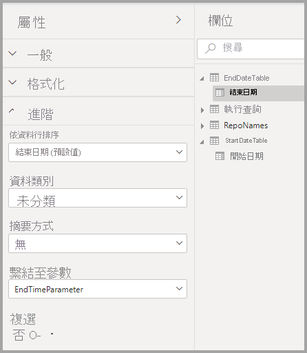

12. 最後，您可以在交叉分析篩選器中參考此欄位或當作篩選條件：

    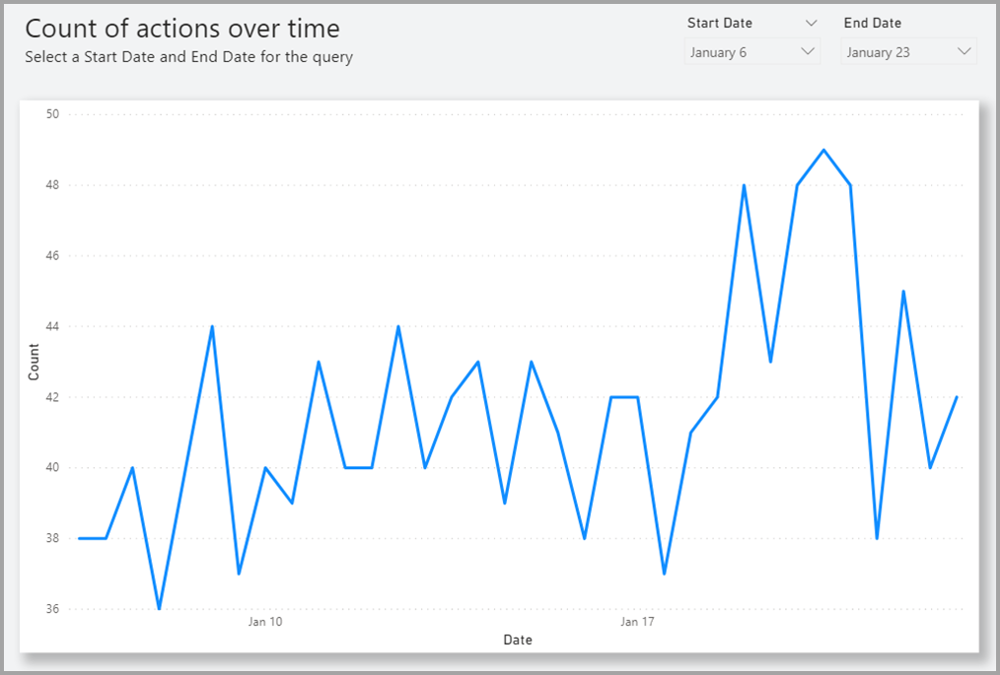

如果對應的資料行將 [複選] 設定為 [否]，則您必須在交叉分析篩選器中使用單選模式，或在篩選卡片中要求單選。

## <a name="potential-security-risk"></a>潛在的安全性風險

根據參數在 M 查詢中的參考方式，以及要傳遞給該參數的值而定，如果您允許報表讀者動態設定 M 查詢參數的值，其可能能夠存取其他資料或使用 **插入式攻擊** 觸發對來源系統的修改。

例如，假設您有一個參數化的 Kusto 查詢，且其建構為下面的樣子：

```
Products
| where Category == [Parameter inserted here] & HasReleased == 'True'
 | project ReleaseDate, Name, Category, Region```
```

對於傳遞適當參數值的友好使用者可能沒有問題，例如， *Games* ：

```
| where Category == 'Games' & HasReleased == 'True'
```

不過，攻擊者可能能夠傳遞一個修改查詢的值，以存取其他資料，例如， *'Games' //* ：

```
Products
| where Category == 'Games'// & HasReleased == 'True'
| project ReleaseDate, Name, Category, Region
```

在此範例中，攻擊者可以透過將部分查詢變更為註解，以存取還未發行之遊戲的資訊。

**如何降低風險**

為降低安全性風險，最好在查詢內避免 M 參數值的字串串連。  而是在對應至來源查詢的 M 作業中取用那些參數值，讓 M 引擎與連接器能夠建構最終的查詢。 或者，如果可行，請使用內建於來源查詢語言與連接器的參數傳遞機制。 例如，[Azure 資料總管](/azure/data-explorer/kusto/query/queryparametersstatement?pivots=azuredataexplorer)已內建查詢參數功能，其設計目的是為了防範插入式攻擊。

以下是一些範例：

* 使用 M 查詢之篩選作業的範例：
    ```
    Table.SelectRows(Source, (r) =\&gt; r[Columns] = Parameter)
    ```

* 在來源查詢中宣告參數 (或傳遞參數值作為來源查詢函式的輸入) 的範例：
    ```
    declare query\_parameters (Name of Parameter : Type of Parameter);
    ```

## <a name="considerations-and-limitations"></a>考量與限制

使用動態 M 查詢參數時，有一些考量事項與限制：

* 單一參數無法繫結至多個欄位，反之亦然。
* 此功能僅支援以 M 為基礎的資料來源，且不支援原生 SQL 查詢。
* 不支援的現成參數類型如下：
  * 任意
  * Duration
  * True/False
  * Binary

* 不支援的篩選條件：
  * 相對時間交叉分析篩選器或篩選條件
  * 相對日期
  * 階層交叉分析篩選器
  * 多欄位包含篩選條件
  * 排除篩選條件/非篩選條件
  * 交叉醒目提示
  * 向下切入篩選條件
  * 交叉切入篩選條件
  * 前 N 個篩選條件
* 不支援的作業：
  * And
  * 包含
  * 小於
  * 大於
  * 開始於
  * 開頭不是
  * 不是
  * 不包含
  * 全選
  * 是空白
  * 不是空白


## <a name="next-steps"></a>後續步驟

您可以使用 Power BI Desktop 執行各種作業。 如需有關其功能的詳細資訊，請參閱下列資源：

* [如何在 Power BI 中使用 DirectQuery](desktop-directquery-about.md)
* [Power BI Desktop 是什麼？](../fundamentals/desktop-what-is-desktop.md)
* [Power BI Desktop 的查詢概觀](../transform-model/desktop-query-overview.md)
* [Power BI Desktop 中的資料類型](desktop-data-types.md)
* [使用 Power BI Desktop 合併資料並使其成形](desktop-shape-and-combine-data.md)
* [Power BI Desktop 中的常見查詢工作](../transform-model/desktop-common-query-tasks.md)