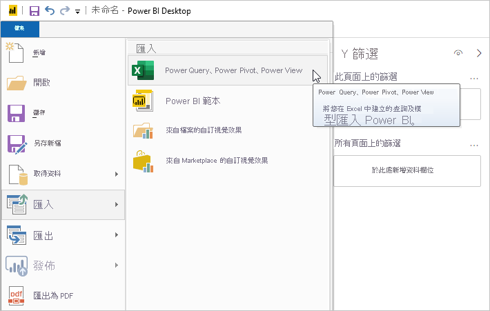
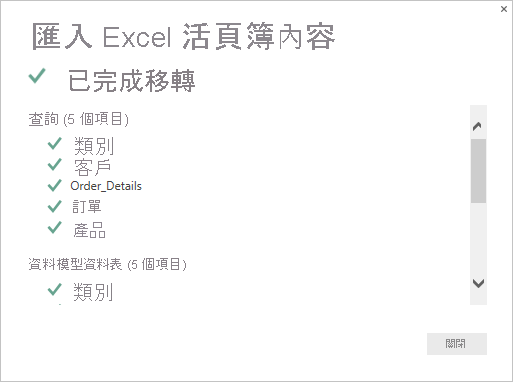
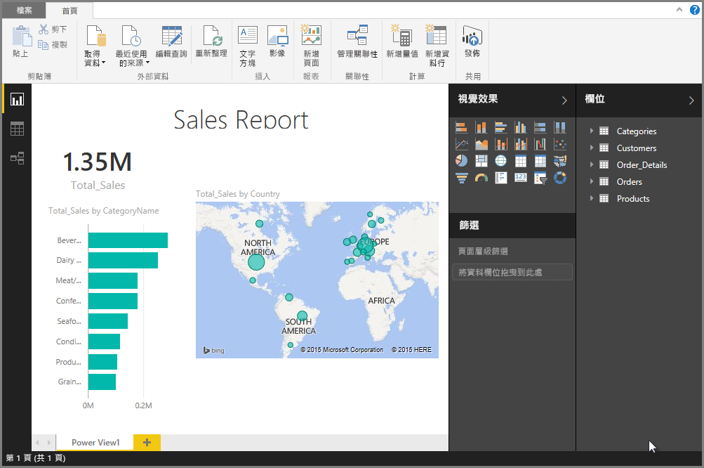

# 將 Excel 活頁簿匯入 Power BI Desktop
使用 Power BI Desktop，您可以輕鬆地將內含 Power Query 查詢、Power Pivot 模型和 Power View 工作表的 Excel 活頁簿，匯入至 Power BI Desktop。 Power BI Desktop 會根據 Excel 活頁簿來自動建立報表和視覺效果。 一旦匯入，您即可使用現有功能及隨 Power BI Desktop 每月更新所發行的新功能，持續改善及精簡這些報表。

## 如何匯入 Excel 活頁簿？
1. 若要將 Excel 活頁簿匯入至 Power BI Desktop，請選取 [檔案] > [匯入] > [Power Query、Power Pivot、Power View]。

   

2. 從 [開啟] 視窗中，選取要匯入的 Excel 活頁簿。 

   雖然活頁簿中的物件大小或數目目前沒有限制，但針對較大的活頁簿，Power BI Desktop 需要較長的時間進行分析及匯入。

   > [!NOTE]
   > 若要從 [共用商務用 OneDrive] 資料夾或從 [Microsoft 365 群組] 資料夾載入或匯入 Excel 檔案，請使用 Excel 檔案的 URL，並將檔案匯入 Power BI Desktop 中的 Web 資料來源。 您需要遵循幾個步驟才能使用正確的商務用 OneDrive URL 格式；如需資訊及正確的步驟順序，請參閱[在 Power BI Desktop 中使用商務用 OneDrive 連結](desktop-use-onedrive-business-links.md)。
   > 
   > 

3. 從出現的 [匯入] 對話方塊中，選取 [開始]。

   

   Power BI Desktop 會分析活頁簿，並將其轉換成 Power BI Desktop 檔案 (.pbix)。 這個動作是一次性事件；一旦使用上述步驟建立 Power BI Desktop 檔案，則 Power BI Desktop 檔案與原始 Excel 活頁簿不會有相依關係，因此您可以修改、儲存和共用，而不會影響原始活頁簿。

   匯入完成之後，會隨即顯示摘要頁面，其除了描述已轉換的項目之外，也會列出任何無法匯入的項目。

   

4. 選取 [關閉]。 

   Power BI Desktop 會匯入 Excel 活頁簿，並根據活頁簿內容載入報表。

   

匯入活頁簿之後，您可以繼續處理報表。 您可以使用 Power BI Desktop 中包含的任何特性與功能來建立新視覺效果、新增資料或建立新報表頁面。

## 可匯入哪些活頁簿項目？
Power BI Desktop 可匯入 Excel 中的下列項目，通常稱為「物件」 。

| Excel 活頁簿中的物件 | Power BI Desktop 檔案中的最終結果 |
| --- | --- |
| Power Query 查詢 |所有來自 Excel 的 Power Query 查詢都會轉換成 Power BI Desktop 中的查詢。 如果 Excel 活頁簿中有已定義的查詢群組，則將在 Power BI Desktop 中複寫相同的組織。 除非在 Excel 對話方塊的 [匯入資料] 中設定為 [只建立連線]，否則所有查詢都會載入。 您可以在 Power BI Desktop 中，於 [查詢編輯器] 的 [首頁] 索引標籤選取 [屬性] 對話方塊來自訂載入行為。 |
| Power Pivot 外部資料連線 |所有 Power Pivot 外部資料連線都會轉換成 Power BI Desktop 中的查詢。 |
| 連結的資料表或目前活頁簿資料表 |如果 Excel 中有工作表資料表連結到資料模型，或連結到查詢 (使用 [從資料表] 或 M 中的 *Excel.CurrentWorkbook()* 函式)，則會顯示下列選項： <ol><li><b>將資料表匯入至 Power BI Desktop 檔案</b>。 此資料表是一次性的資料快照集，之後資料在 Power BI Desktop 的資料表中即為唯讀。 使用這個選項所建立資料表有一百萬個字元的大小限制 (結合所有資料行標頭和資料格的總計)。</li><li><b>保留原始活頁簿的連線</b>。 或者，您可以保留原始 Excel 活頁簿的連接，Power BI Desktop 會在每次重新整理時擷取這個資料表中的最新內容，就像是針對 Power BI Desktop 中的 Excel 活頁簿建立的其他任何查詢一樣。</li></ul> |
| 資料模型的計算結果欄、量值、KPI、資料類別和關聯性 |這些資料模型物件會轉換成 Power BI Desktop 中的對等物件。 請注意，Power BI Desktop 目前不提供某些資料類別，例如映像。 在這些情況下，有問題資料行的資料類別資訊會重設。 |
| Power View 工作表 |您可以針對 Excel 中的每個 Power View 工作表建立新的報表頁面。 這些報表頁面的名稱和順序會符合原始 Excel 活頁簿。 |

## 匯入活頁簿有任何限制嗎？
將活頁簿匯入至 Power BI Desktop 有一些限制：

* **SQL Server Analysis Services 表格式模型的外部連線：** 在 Excel 2013 中，您可以建立 SQL Server Analysis Services 表格式模型的連線，並在這些模型之上建立 Power View 報表，而不需要匯入資料。 目前不支援使用這種連線類型將 Excel 活頁簿匯入至 Power BI Desktop。 因應措施是在 Power BI Desktop 中建立這些外部連接。
* **階層：** Power BI Desktop 目前不支援這種資料模型物件類型。 因此，將 Excel 活頁簿匯入至 Power BI Desktop 時會略過階層。
* **二進位資料行：** Power BI Desktop 目前不支援這種資料模型資料行類型。 二進位資料行已從 Power BI Desktop 的結果資料表中移除。
* **不支援的 Power View 元素：** Power BI Desktop 不提供 Power View 中的一些功能，例如佈景主題或特定視覺效果類型 (具有播放軸的散佈圖、向下切入行為等)。 這些不支援的視覺效果會導致在 Power BI Desktop 報表中的對應位置出現「視覺效果不受支援」  的訊息，您可以視需要予以刪除或重新設定。
* **使用 Power Query 中的** **_From Table_ *_ _* ，或 M 中的** **_Excel.CurrentWorkbook_ *_ _* 的具名範圍：** 目前不支援將此具名範圍資料匯入至 Power BI Desktop，但這是已規劃的更新。 目前，這些具名範圍會當做外部 Excel 活頁簿的連接，載入 Power BI Desktop。
* **PowerPivot 至 SSRS：** 因為 Power BI Desktop 目前無法取得該資料來源，所以目前不支援 SQL Server Reporting Services (SSRS) 的 PowerPivot 外部連線。

