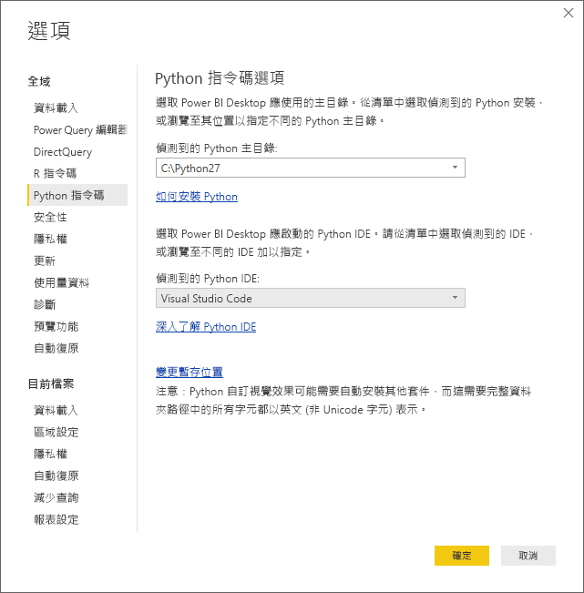
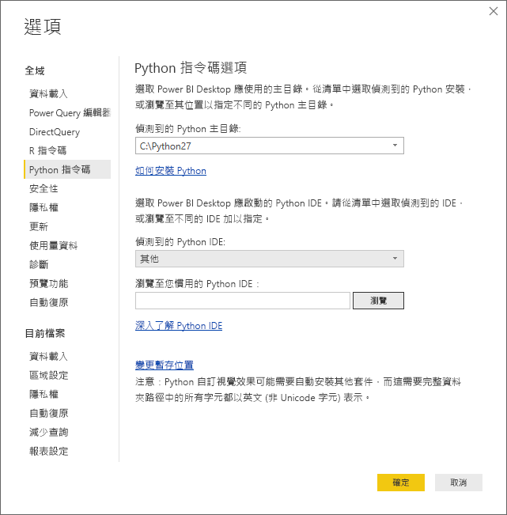
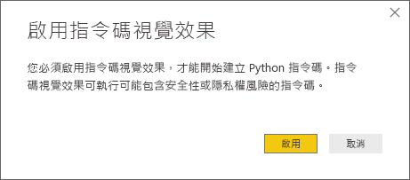
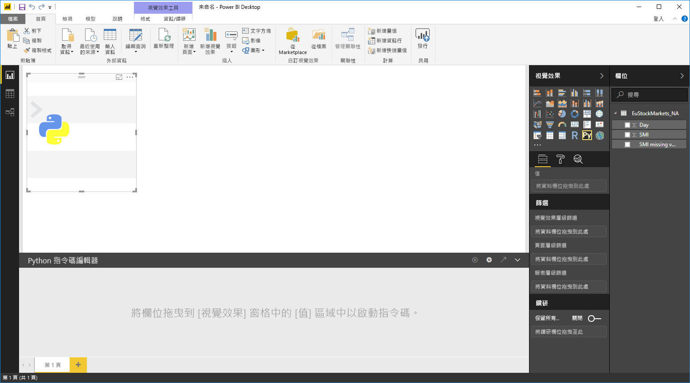
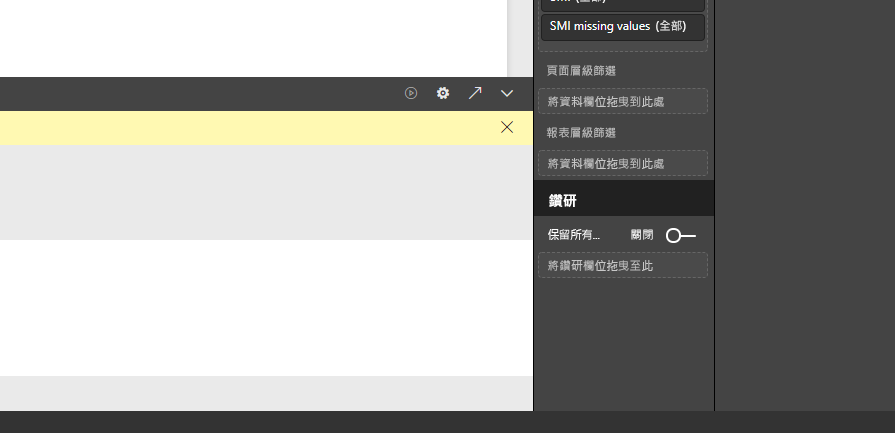

# 搭配 Power BI 使用外部 Python IDE
透過 **Power BI Desktop**，您可以使用您的外部 Python IDE (整合式開發環境) 來建立並精簡 Python 指令碼，然後在 Power BI 中使用這些指令碼。

## 啟用外部 Python IDE
您可以從 **Power BI Desktop** 啟動外部 Python IDE，並將您的資料自動匯入及顯示在 Python IDE 中。 您可以在該處修改外部 Python IDE 中的指令碼，然後將其貼回 **Power BI Desktop** 以建立 Power BI 視覺效果和報表。

您可以指定您要使用哪個 Python IDE，並讓它從 **Power BI Desktop** 中自動啟動。

### 要求
若要使用這項功能，您需要在本機電腦上安裝 **Python IDE**。 **Power BI Desktop** 不會包含、部署或安裝 Python 引擎，所以您必須在本機電腦上個別安裝 **Python**。 您可以使用下列選項選擇要使用哪個 Python IDE：

* 您可以安裝您最喜愛的 Python IDE，其中有許多為免費使用，例如 [Visual Studio Code 下載頁面](https://code.visualstudio.com/download/)。
* **Power BI Desktop** 也支援 **Visual Studio**。
* 您也可以安裝不同的 Python IDE，並讓 **Power BI Desktop** 啟動該 **Python IDE**，方法是執行下列其中一項：
  
  * 您可建立 **.PY** 檔案與您想要啟動 **Power BI Desktop** 的外部 IDE 之間的關聯。
  * 您可以指定 **Power BI Desktop** 應該啟動的 .exe，方法是從 [選項]  對話方塊的 [Python 指令碼選項]  區段選取 [其他]  。 您可前往 [檔案] > [選項和設定] > [選項]  ，即可看見 [選項]  對話方塊。
    
    

如果您已安裝多個 Python IDE，則可以指定要啟動哪一項，方法是從 [選項]  對話方塊的 [偵測到的 Python IDE]  下拉式清單中加以選取。

根據預設，**Power BI Desktop** 將會啟動 **Visual Studio Code** 作為外部 Python IDE (如果它安裝在本機電腦上)；如果未安裝 **Visual Studio Code**，而您具有 **Visual Studio**，則會改為啟動該項目。 如果上述所有 Python IDE 皆未安裝，就會啟動與 **.PY** 檔案建立關聯的應用程式。

如果 **.PY** 檔案關聯未存在，則可以在 [選項]  對話方塊的 [瀏覽至您慣用的 Python IDE]  區段中指定自訂 IDE 的路徑。 您也可以啟動不同的 Python IDE，方法是選取 **Power BI Desktop** 中**啟動 Python IDE** 箭號圖示旁邊的**設定**齒輪圖示。

## 從 Power BI Desktop 啟動 Python IDE
若要從 **Power BI Desktop** 啟動 Python IDE，請採取下列步驟：

1. 將資料載入 **Power BI Desktop**。
2. 從 [欄位]  窗格中選取幾個您想要使用的欄位。 如果您尚未啟用指令碼視覺效果，系統會提示您執行這項操作。
   
   
3. 啟用指令碼視覺效果後，您可以從 [視覺效果]  窗格中選取 Python 視覺效果，這會建立準備好顯示指令碼結果的空白 Python 視覺效果。 [Python 指令碼編輯器]  窗格也會出現。
   
   
4. 現在您可以選取要在 Python 指令碼中使用的欄位。 當您選取欄位時，[Python 指令碼編輯器]  欄位會自動根據您選取的欄位建立指令碼。 您可以直接在 [Python 指令碼編輯器]  窗格中建立 (或貼上) Python 指令碼，也可以將其保留空白。
   
   
   
   > [!NOTE]
   > Python 視覺效果的預設彙總類型為「不摘要」  。
   > 
   > 
5. 您現在可以直接從 **Power BI Desktop** 啟動 Python IDE。 選取 [Python 指令碼編輯器]  標題列右側的 [啟動 Python IDE]  按鈕，如下所示。
   
   
6. Power BI Desktop 會啟動您指定的 Python IDE，如下圖所示 (在此圖中，**Visual Studio Code** 是預設的 Python IDE)。
   
   
   
   > [!NOTE]
   > **Power BI Desktop** 新增會指令碼的前三行，以便在您執行指令碼之後從 **Power BI Desktop** 匯入您的資料。
   > 
   > 
7. 您在 **Power BI Desktop** [Python 指令碼編輯器]  窗格中建立的任何指令碼，會從 Python IDE 的第 4 行開始出現。 此時，您可以在 Python IDE 中建立 Python 指令碼。 在 Python IDE 中完成 Python 指令碼之後，您需要將其複製並貼回 **Power BI Desktop** 的 [Python 指令碼編輯器]  窗格中，*Power BI Desktop* 自動產生的前三行指令碼「除外」  。 請勿將指令碼前三行複製回 **Power BI Desktop**，這幾行只用於將資料從 **Power BI Desktop** 匯入 Python IDE 中。

### 已知的限制
從 Power BI Desktop 直接啟動 Python IDE 有一些限制：

* 不支援自動將您的指令碼從 Python IDE 匯出到 **Power BI Desktop**。

## 後續步驟
請查看下列有關 Power BI 中 Python 的其他資訊。

* [在 Power BI Desktop 中執行 Python 指令碼](desktop-python-scripts.md)
* [使用 Python 建立 Power BI 視覺效果](desktop-python-visuals.md)

