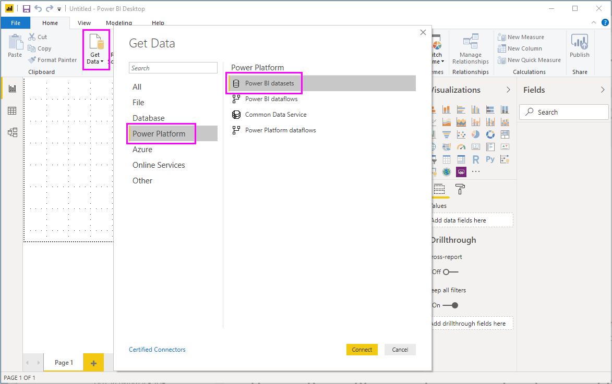
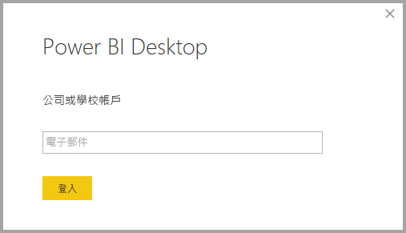
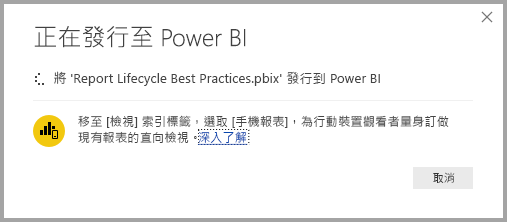
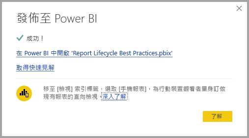

# 從 Power BI Desktop 連線到 Power BI 服務中的資料集

您可在 Power BI 服務  中建立連到共用資料集的即時連線，並從同一個資料集建立許多不同的報表。 您可以在 Power BI Desktop 中建立完美的資料模型，並將它發佈到 Power BI 服務。 然後，您和其他人便可以從通用資料模型建立多個不同報表 (分別位於不同的 .pbix  檔案中)，並儲存到不同的工作區。 這項功能稱為 Power BI 服務即時連線  。

這項功能有各種優點，包括最佳做法，而我們會在本文加以討論。 我們建議您參閱這項功能的[考量與限制](#limitations-and-considerations)。

## 使用 Power BI 服務即時連線進行報表生命週期管理

Power BI 的熱門程度帶來一項挑戰，也就是報表、儀表板及其基礎資料模型數量激增。 人們能夠輕鬆在 Power BI Desktop 中建立引人入勝的報表，然後在 Power BI 服務中[發佈](../create-reports/desktop-upload-desktop-files.md)這些報表，以及從資料集建立優質的儀表板。 由於這樣做的人為數眾多，而且時常使用相同 (或幾乎相同) 的資料集，因此要知道哪個報表以哪個資料集為基礎、各資料集的更新時間有多近，便成了一大挑戰。 Power BI 服務即時連線解決了這項難題，並且讓建立、共用及擴展通用資料集的報表及儀表板變得更簡單、一致。

### 建立任何人都能使用的資料集並加以共用

假設 Anna 是小組的商務分析師。 Anna 很擅長建立良好的資料模型，通常稱為資料集。 Anna 能夠建立資料集和報表，然後在 Power BI 服務中共用該報表。

![顯示 Power BI 服務 [發佈] 按鈕的螢幕擷取畫面。](media/desktop-report-lifecycle-datasets/report-lifecycle_02a.png)

每個人都熱愛 Anna 的報表和資料集。 但這就是問題所在。 Anna 小組中每個人都嘗試建立「自己的」  資料集版本，然後與小組共用自己的報表。 於是小組在 Power BI 服務中的工作區，一下子就有了大量報表 (來自不同資料集)。 哪一個是最新的？ 資料集內容完全相同，或只是幾乎相同？ 差別在哪裡？ 有了 Power BI 服務即時連線功能，這一切問題都能迎刃而解。 在下一節中，我們會知道其他人可以如何在他們自己的工作區，並在自己的報表使用 Anna 發佈的資料集，以及讓所有人都能使用同一個穩固、通過檢驗且已發佈資料集來打造自己的獨特報表。

### 使用即時連線來連線到 Power BI 服務資料集

Anna 會建立報表，並根據其建立資料集。 然後 Anna 會將其發佈到 Power BI 服務。 報表會顯示在 Power BI 服務的小組工作區中。 如果 Anna 將其儲存至「新的體驗工作區」  。 Anna 便可以設定「建置」  權限，讓每個進入和離開其工作區的人都可以看到並使用。

若要深入了解新的體驗工作區，請參閱[工作區](../collaborate-share/service-new-workspaces.md)。

Anna 的工作區內外其他成員現在可以使用 Power BI 服務即時連線功能，建立與 Anna 共用資料模型的即時連線。 他們可以在自己的新體驗工作區  中，從他們的原始資料集  建立自己的獨特報表。

在下圖中，您可以看到 Anna 如何建立一份 Power BI Desktop 報表，然後將報表 (包括其資料模型) 發佈到 Power BI 服務。 接著，其他人就可以使用 Power BI 服務即時連線來連線到 Anna 的資料模型，並依據 Anna 的資料集在他們自己工作區中建立自有唯一報表。

> [!NOTE]
> 若您將資料集儲存到[傳統共用工作區](../collaborate-share/service-create-workspaces.md)，只有該工作區的成員會在您的資料集上建置報表。 若要建立 Power BI 服務即時連線，您要連上的資料集必須位在您所在的共用工作區中。
> 
> 

## 使用 Power BI 服務即時連線的逐步解說

現在我們已經知道 Power BI 服務即時連線有多好用，以及如何將這個方法當作報表生命週期管理的最佳做法使用，接著為您逐步解說步驟，從 Anna 的優質報表和資料集前進到她 Power BI 小組成員可以使用的共用資料集。

### 發佈 Power BI 報表和資料集

使用 Power BI 服務即時連線管理報表生命週期的第一步，是擁有團隊成員想要使用的報表和資料集。 因此，Anna 必須先從 Power BI Desktop「發佈」  報表。 在 Power BI Desktop 的 [首頁]  功能區上，選取 [發佈]  。

如果 Anna 未登入 Power BI 服務帳戶，則 Power BI 會提示 Anna 執行此動作。

Anna 可以從該處選擇報表和資料集要發佈的工作區目的地。 請記得，若 Anna 將它儲存到新的體驗工作區，則任何具備「建置」權限的人員都可以存取該資料集。 建置權限可在發佈之後於 Power BI 服務中進行設定。 若工作儲存到傳統工作區，則只有擁有報表發佈目標工作區存取權的成員，才能使用 Power BI 服務即時連線來存取報表的資料集。

發佈程序隨即開始，而 Power BI Desktop 會顯示進度。

完成後，Power BI Desktop 會顯示您已成功，並提供一組讓您連上 Power BI 服務中實際報表的連結，以及取得報表深入資訊摘要的連結。

現在您包含其資料集的報表已在 Power BI 服務中，您也可以「宣傳」  它。 證明其品質和可靠性。 您甚至可以要求它通過您 Power BI 租用戶中中央授權單位的「認證」  。 透過這些保證，您的資料集便一律會在其他人尋找資料集時，出現在清單頂端。 如需詳細資訊，請參閱[認可內容](../collaborate-share/service-endorse-content.md)。

最後一個步驟是為作為報表基礎的資料集設定「建置」權限。 建置權限會決定誰可以看見及使用您的資料集。 您可以在工作區本身中設定它，或是在您從工作區共用應用程式時設定它。 如需詳細資訊，請參閱[共用資料集的建置權限](service-datasets-build-permissions.md)。

接下來，我們來看看其他擁有報表和資料集發佈目標工作區存取權的團隊成員可以如何連線到資料集，及建立他們自己的報表。

### 對發佈的資料集建立 Power BI 服務即時連線

若要對發佈的報表建立連線，並建立自己以發佈資料集為基礎的報表，請從 Power BI Desktop 中的 [首頁]  功能區選取 [取得資料]  ，從左側窗格選取 [Power Platform]  ，然後選取 [Power BI 資料集]  。

如果您尚未登入，Power BI 會提示您登入。 登入之後，Power BI 會顯示您所隸屬的工作區。 您可以選取哪個工作區包含您要建立 Power BI 服務即時連線所在的資料集。

清單中資料集是您在任何工作區中具備「建置」權限的所有共用資料集。 您可以搜尋特定資料集並查看其名稱、擁有者、所在的工作區，以及最後重新整理的時間。 在清單的頂端，也會為經過認證或升階的資料集顯示 **簽署** 。

當您選取 [建立]  時，就會對選取的資料集建立即時連線。 Power BI Desktop 會將您看到的欄位及其值，即時載入 Power BI Desktop。

![[欄位] 窗格中的資料集欄位](media/desktop-report-lifecycle-datasets/report-lifecycle_10.png)

現在您和其他人可從同一個資料集建立及共用自訂報表。 這種方法是讓一個具有知識的人員建立格式正確資料集的絕佳方式，就像是 Anna 所做的一樣。 許多小組成員都可以使用該共用資料集來建立自己的報表。

## 限制與考量

使用 Power BI 服務即時連線須留意幾項限制和考量。

* 只有具備資料集「建置」權限的使用者可以使用 Power BI 服務即時連線來連線到發佈的資料集。
* 免費使用者只會看到 [我的工作區]  和以進階為基礎工作區中的資料集。
* 由於此連線是即時連線，因此會停用左側導覽和模型化。 您只能連線到每個報表中的一個資料集。 這個行為類似於連線到 SQL Server Analysis Services  時的行為。
* 由於此連線是即時連線，因此會強制執行資料列層級安全性 (RLS) 和其他此類連線行為。 這與連線到 SQL Server Analysis Services 時相同。
* 如果擁有者修改原本共用的 .pbix  檔案，就會覆寫 Power BI 服務中共用的資料集和報表。 以該資料集為基礎的報表不會遭到覆寫，但任何對資料集進行的變更都會反映在報表上。
* 工作區成員無法取代原先共用的報表。 嘗試這樣做會導致產生警告，提示您為檔案重新命名再發佈。
* 若您刪除了 Power BI 服務中的共用資料集，則其他以該資料集為基礎的報表都將無法正常運作或顯示視覺效果。
* 若是內容套件，您必須先建立內容套件的複本，再將其當作將 .pbix  報表和資料集共用到 Power BI 服務的基礎。
* 若是來自「我的組織」  的內容套件，在複製後，您就無法取代服務上建立的報表或透過即時連線時複製內容套件而建立的報表。 嘗試這樣做會導致產生警告，提示您為檔案重新命名再發佈。 在此情況下，您只能取代已發行的即時連線報表。
* 刪除 Power BI 服務中的共用資料集表示不再有任何人能夠從 Power BI Desktop 繼續存取該資料集。
* 在 Power BI 服務上共用資料集的報表，不支援使用 Power BI REST API 進行自動化部署。
