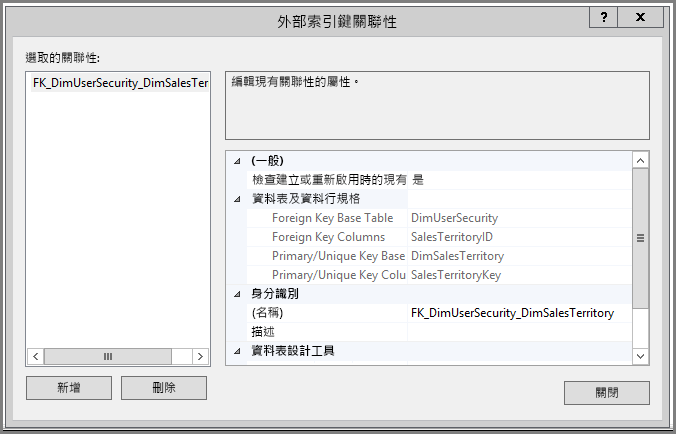
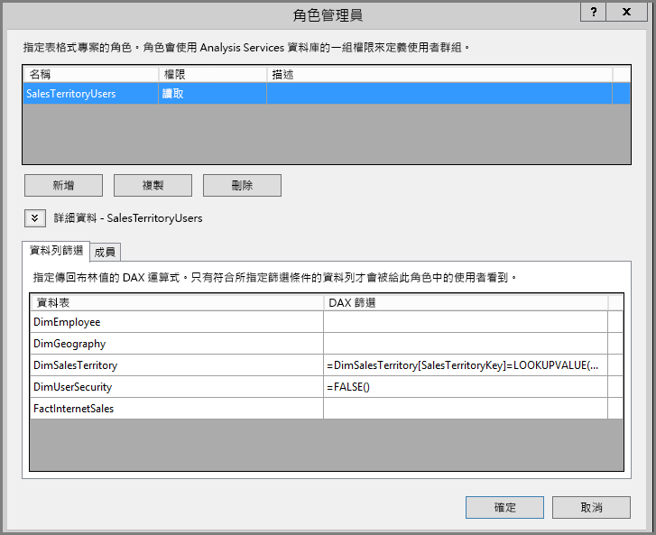
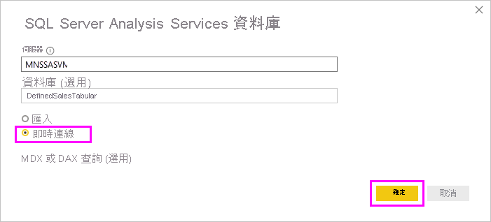
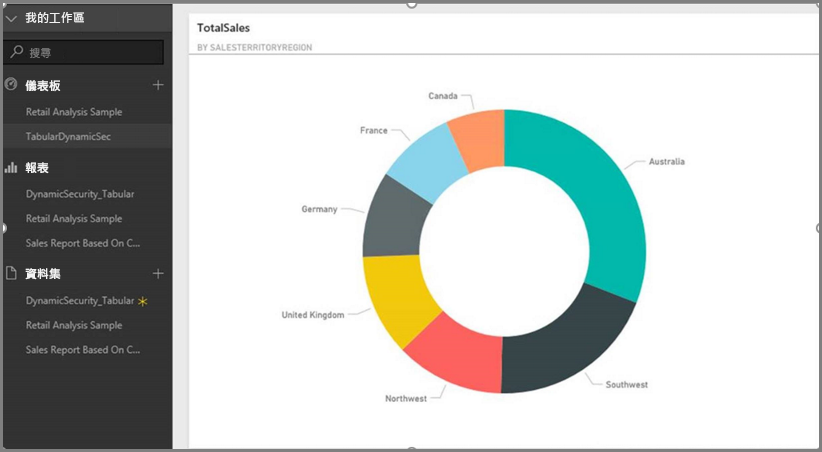
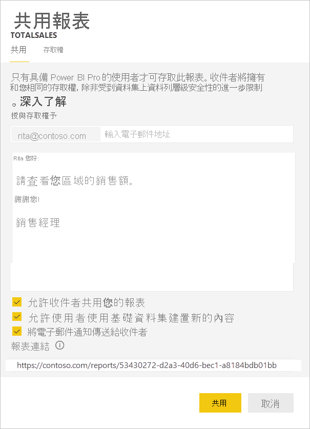

# <a name="implement-row-level-security-in-an-analysis-services-tabular-model"></a>在 Analysis Services 表格式模型中實作資料列層級安全性

本教學課程使用範例資料集進行以下步驟，為您示範如何在「Analysis Services 表格式模型」  中實作[**資料列層級安全性**](../admin/service-admin-rls.md)，並將其用於 Power BI 報表。

* 在 [AdventureworksDW2012 資料庫](https://github.com/Microsoft/sql-server-samples/releases/tag/adventureworks)中建立新的安全性資料表
* 使用所需的事實和維度資料表建立表格式模型
* 定義使用者角色和權限
* 將模型部署到 *Analysis Services 表格式*執行個體
* 建置 Power BI Desktop 報表，以顯示為存取報表之使用者量身訂做的資料
* 將報表部署至 *Power BI 服務*
* 根據報表建立新的儀表板
* 與同事共用儀表板

本教學課程需要 [AdventureworksDW2012 資料庫](https://github.com/Microsoft/sql-server-samples/releases/tag/adventureworks)。

## <a name="task-1-create-the-user-security-table-and-define-data-relationship"></a>工作 1︰建立使用者安全性資料表，並定義資料關聯性

您可以找到許多描述如何以「SQL Server Analysis Services (SSAS) 表格式」  模型來定義資料列層級動態安全性的文章。 我們的範例使用 [Implement Dynamic Security by Using Row Filters](/analysis-services/tutorial-tabular-1200/supplemental-lesson-implement-dynamic-security-by-using-row-filters) (使用資料列篩選來實作動態安全性)。

此處的步驟需要使用 AdventureworksDW2012 關聯式資料庫。

1. 在 AdventureworksDW2012 中建立 `DimUserSecurity` 資料表，如下所示。 您可以使用 [SQL Server Management Studio (SSMS)](/sql/ssms/download-sql-server-management-studio-ssms) 來建立資料表。

   

1. 在建立並儲存資料表後，您必須建立 `DimUserSecurity` 資料表 `SalesTerritoryID` 資料行與 `DimSalesTerritory` 資料表 `SalesTerritoryKey` 資料行之間的關聯性，如下所示。

   在 SSMS 中，以滑鼠右鍵按一下 **DimUserSecurity** 並選取 [設計]  。 然後，選取 [資料表設計工具]   > [關聯性...]  。完成後，儲存資料表。

   

1. 將使用者新增至資料表。 以滑鼠右鍵按一下 **DimUserSecurity** 並選取 [編輯前 200 個資料列]  。 新增使用者後，`DimUserSecurity` 資料表看起來應該會類似下列範例：

   

   您會在稍後的工作中看到這些使用者。

1. 接下來，使用 `DimSalesTerritory` 資料表來進行「內部聯結」  ，該資料表顯示與使用者相關聯的區域詳細資料。 此處的 SQL 程式碼會執行內部聯結，且隨後會出現顯示資料表應如何出現的影像。

    ```sql
    select b.SalesTerritoryCountry, b.SalesTerritoryRegion, a.EmployeeID, a.FirstName, a.LastName, a.UserName from [dbo].[DimUserSecurity] as a join [dbo].[DimSalesTerritory] as b on a.[SalesTerritoryID] = b.[SalesTerritoryKey]
    ```

   根據您在步驟 2 中建立的關聯性，聯結的資料表會顯示各個銷售區域分別由誰負責。 例如，您可以看到 *Rita Santos* 負責「澳洲」  。

## <a name="task-2-create-the-tabular-model-with-facts-and-dimension-tables"></a>工作 2︰使用事實和維度資料表建立表格式模型

在您的關聯式資料倉儲就緒之後，您需要定義表格式模型。 您可以使用 [SQL Server Data Tools](/sql/ssdt/sql-server-data-tools) (SSDT) 來建立模型。 如需詳細資訊，請參閱[建立新的表格式模型專案](/analysis-services/tutorial-tabular-1400/as-lesson-1-create-a-new-tabular-model-project)。

1. 將所有必要的資料表匯入模型中，如下所示。

    

1. 在匯入必要的資料表後，您必須使用讀取權限來定義稱為 *SalesTerritoryUsers* 的角色。 選取 SQL Server Data Tools 中的 [模型]  功能表，然後選取 [角色]  。 在 [角色管理員]  中選取 [新增]  。

1. 在 [角色管理員]  的 [成員]  下方，新增您在[工作 1](#task-1-create-the-user-security-table-and-define-data-relationship) 中 `DimUserSecurity` 資料表所定義的使用者。

    ![在 [角色管理員] 中新增使用者](media/desktop-tutorial-row-level-security-onprem-ssas-tabular/rolemanager.png)

1. 接下來，針對 `DimSalesTerritory` 和 `DimUserSecurity` 資料表新增適當的函式，如 [資料列篩選]  索引標籤下方所示。

    

1. `LOOKUPVALUE` 函式會傳回資料行的值，其中 Windows 使用者名稱與 `USERNAME` 函式所傳回的使用者名稱相同。 然後，您可以將查詢限制在 `LOOKUPVALUE` 傳回值符合相同或相關資料表中值的位置。 在 [DAX 篩選]  資料行中，輸入下列公式︰

    ```dax
        =DimSalesTerritory[SalesTerritoryKey]=LOOKUPVALUE(DimUserSecurity[SalesTerritoryID], DimUserSecurity[UserName], USERNAME(), DimUserSecurity[SalesTerritoryID], DimSalesTerritory[SalesTerritoryKey])
    ```

    在此公式中，`LOOKUPVALUE` 函式會傳回所有 `DimUserSecurity[SalesTerritoryID]` 資料行的值，其中 `DimUserSecurity[UserName]` 與目前登入的 Windows 使用者名稱相同，且 `DimUserSecurity[SalesTerritoryID]` 與 `DimSalesTerritory[SalesTerritoryKey]`相同。

    > [!IMPORTANT]
    > 使用資料列層級安全性時不支援 DAX 函式 [USERELATIONSHIP](/dax/userelationship-function-dax)。

   接著，一組銷售 `SalesTerritoryKey` 的 `LOOKUPVALUE` 傳回會用於限制 `DimSalesTerritory` 中顯示的資料列。 只有當資料列的 `SalesTerritoryKey` 值位於由 `LOOKUPVALUE` 函式所傳回的識別碼集中，該資料列才會顯示。

1. 針對 `DimUserSecurity` 表格，請於 [DAX 篩選]  資料行中新增下列公式：

    ```dax
        =FALSE()
    ```

    此公式會指定將所有資料行都解析成 `false`；亦即無法查詢 `DimUserSecurity` 資料表資料行。

現在您需要處理並部署該模型。 如需詳細資訊，請參閱[部署](/analysis-services/tutorial-tabular-1200/lesson-13-deploy)。

## <a name="task-3-add-data-sources-within-your-on-premises-data-gateway"></a>工作 3︰在您的內部部署資料閘道中新增資料來源

部署表格式模型以供使用之後，您需要將資料來源連線新增到內部部署 Analysis Services 表格式伺服器中。

1. 若要允許 Power BI 服務存取您內部部署的分析服務，則必須在環境中安裝及設定[內部部署資料閘道](service-gateway-onprem.md)。

1. 當正確設定閘道之後，必須為 *Analysis Services* 表格式執行個體建立資料來源連接。 如需詳細資訊，請參閱[管理您的資料來源 - Analysis Services](service-gateway-enterprise-manage-ssas.md)。

   

此程序完成後，即完成了閘道設定，且可立即與內部部署的 Analysis Services 資料來源互動。

## <a name="task-4-create-report-based-on-analysis-services-tabular-model-using-power-bi-desktop"></a>工作 4︰使用 Power BI Desktop 建立以 Analysis Services 表格式模型為基礎的報表

1. 啟動 Power BI Desktop 並選取 [取得資料]   > [資料庫]  。

1. 從資料來源清單中，選取 **SQL Server Analysis Services 資料庫**，然後選取 [連線]  。

   

1. 填寫您的 Analysis Services 表格式執行個體詳細資料，然後選取 [即時連線]  。 然後選取 [確定]  。
  
   

   使用 Power BI，動態安全性僅適用於即時連線。

1. 您可以看到部署的模型位於 Analysis Services 執行個體中。 選取個別模型，然後選取 [確定]  。

   Power BI Desktop 現在會在 [欄位]  窗格中畫布右方顯示所有可用的欄位。

1. 在 [欄位]  窗格上，選取 [FactInternetSales]  資料表的 [SalesAmount]  量值，以及 [SalesTerritory]  資料表的 [SalesTerritoryRegion]  維度。

1. 為了將這份報表保持簡潔，我們現在不會新增任何其他的欄位。 為了讓資料以更能表達意義的方式呈現，請將視覺效果變更為**環圈圖**。

   

1. 在報表準備就緒之後，您可以直接將其發行至 Power BI 入口網站。 在 Power BI Desktop 的 [主資料夾]  功能區上，選取 [發佈]  。

## <a name="task-5-create-and-share-a-dashboard"></a>工作 5︰建立及共用儀表板

您已建立報表並將其發佈至 **Power BI** 服務。 現在，您可以使用在先前步驟中建立的範例來示範模型安全性案例。

身為「銷售經理」  角色，使用者 Grace 可以在所有不同的銷售區域查看資料。 Grace 已建立此報表並將其發佈至 Power BI 服務。 此報表已在先前的工作中建立。

Grace 發佈報表之後，下一步就是根據該報表在 Power BI 服務中建立稱為 *TabularDynamicSec* 的儀表板。 在下圖中，請注意 Grace 可以看到對應至所有銷售區域的資料。

   

現在 Grace 和她的同事 Rita (負責澳洲區域的銷售) 共用儀表板。

   

當 Rita 登入 Power BI 服務並檢視 Grace 建立的共用儀表板時，只會看到澳洲區域的銷售狀況。

恭喜！ Power BI 服務會顯示在內部部署 Analysis Services 表格式模型中定義的資料列層級安全性。 Power BI 使用 `EffectiveUserName` 屬性，將目前的 Power BI 使用者認證傳送到內部部署資料來源以執行查詢。

## <a name="task-6-understand-what-happens-behind-the-scenes"></a>工作 6︰了解幕後發生的情況

此工作假設您熟悉 [SQL Server Profiler](/sql/tools/sql-server-profiler/sql-server-profiler)，因為您需要擷取內部部署 SSAS 表格式執行個體上的 SQL Server Profiler 追蹤。

使用者 Rita 在 Power BI 服務中存取儀表板時，就會立刻將工作階段初始化。 您可以看到 **salesterritoryusers** 角色立即生效，並使用有效的使用者名稱 **<EffectiveUserName>rita@contoso.com</EffectiveUserName>**
```
       <PropertyList><Catalog>DefinedSalesTabular</Catalog><Timeout>600</Timeout><Content>SchemaData</Content><Format>Tabular</Format><AxisFormat>TupleFormat</AxisFormat><BeginRange>-1</BeginRange><EndRange>-1</EndRange><ShowHiddenCubes>false</ShowHiddenCubes><VisualMode>0</VisualMode><DbpropMsmdFlattened2>true</DbpropMsmdFlattened2><SspropInitAppName>PowerBI</SspropInitAppName><SecuredCellValue>0</SecuredCellValue><ImpactAnalysis>false</ImpactAnalysis><SQLQueryMode>Calculated</SQLQueryMode><ClientProcessID>6408</ClientProcessID><Cube>Model</Cube><ReturnCellProperties>true</ReturnCellProperties><CommitTimeout>0</CommitTimeout><ForceCommitTimeout>0</ForceCommitTimeout><ExecutionMode>Execute</ExecutionMode><RealTimeOlap>false</RealTimeOlap><MdxMissingMemberMode>Default</MdxMissingMemberMode><DisablePrefetchFacts>false</DisablePrefetchFacts><UpdateIsolationLevel>2</UpdateIsolationLevel><DbpropMsmdOptimizeResponse>0</DbpropMsmdOptimizeResponse><ResponseEncoding>Default</ResponseEncoding><DirectQueryMode>Default</DirectQueryMode><DbpropMsmdActivityID>4ea2a372-dd2f-4edd-a8ca-1b909b4165b5</DbpropMsmdActivityID><DbpropMsmdRequestID>2313cf77-b881-015d-e6da-eda9846d42db</DbpropMsmdRequestID><LocaleIdentifier>1033</LocaleIdentifier><EffectiveUserName>rita@contoso.com</EffectiveUserName></PropertyList>
```
根據有效的使用者名稱要求，Analysis Services 會在查詢本機 Active Directory 後將要求轉換為實際 `contoso\rita` 認證。 一旦 Analysis Services 取得認證，Analysis Services 會傳回使用者具有檢視和存取權的資料。

如果儀表板發生更多的活動，您即可使用 SQL Profiler 來看到特定查詢會作為 DAX 查詢回到 Analysis Services 表格式模型。 例如，如果 Rita 從儀表板前往基礎報表，則會發生下列查詢。

   

您也可以在下方看到正在執行以開始填入報表資料的 DAX 查詢。
   
   ```dax
   EVALUATE
     ROW(
       "SumEmployeeKey", CALCULATE(SUM(Employee[EmployeeKey]))
     )
   
   <PropertyList xmlns="urn:schemas-microsoft-com:xml-analysis">``
             <Catalog>DefinedSalesTabular</Catalog>
             <Cube>Model</Cube>
             <SspropInitAppName>PowerBI</SspropInitAppName>
             <EffectiveUserName>rita@contoso.com</EffectiveUserName>
             <LocaleIdentifier>1033</LocaleIdentifier>
             <ClientProcessID>6408</ClientProcessID>
             <Format>Tabular</Format>
             <Content>SchemaData</Content>
             <Timeout>600</Timeout>
             <DbpropMsmdRequestID>8510d758-f07b-a025-8fb3-a0540189ff79</DbpropMsmdRequestID>
             <DbPropMsmdActivityID>f2dbe8a3-ef51-4d70-a879-5f02a502b2c3</DbPropMsmdActivityID>
             <ReturnCellProperties>true</ReturnCellProperties>
             <DbpropMsmdFlattened2>true</DbpropMsmdFlattened2>
             <DbpropMsmdActivityID>f2dbe8a3-ef51-4d70-a879-5f02a502b2c3</DbpropMsmdActivityID>
           </PropertyList>
   ```

## <a name="considerations"></a>考量

* 搭配 Power BI 的內部部署資料列層級安全性僅適用於即時連線。

* 從 Power BI 服務使用即時連線存取報表的使用者，可立即使用處理模型後所的任何資料變更。
