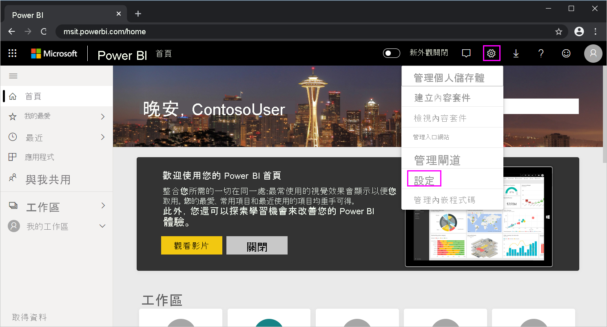

# <a name="use-directquery-in-power-bi-desktop"></a>在 Power BI Desktop 中使用 DirectQuery
有了 *Power BI Desktop*，當連線到資料來源時，隨時可將資料的複本匯入 Power BI Desktop。 對於某些資料來源，可用的替代方式是：使用 DirectQuery 直接連線到資料來源。

## <a name="supported-data-sources"></a>支援的資料來源
如需支援 DirectQuery 的資料來源完整清單，請參閱 [DirectQuery 支援的資料來源](power-bi-data-sources.md)。

## <a name="how-to-connect-using-directquery"></a>如何使用 DirectQuery 連線
當您使用 [取得資料] 連線到 DirectQuery 所支援的資料來源時，連線對話方塊可讓您選取想要的連線方式。 例如，在 Power BI Desktop 的 [常用] 功能區底下，選取 [取得資料] > [SQL Server]。 在 [SQL Server 資料庫] 對話方塊中，[資料連線模式] 會顯示 [匯入] 和 [DirectQuery] 的選項：

![Power BI Desktop、[SQL Server 資料庫] 對話方塊、[匯入] 和 [DirectQuery] 選項](media/desktop-use-directquery/directquery_sqlserverdb.png)

以下是選取 [匯入] 和 [DirectQuery] 之間的差異：

- **匯入**：將選取的資料表和資料行匯入至 Power BI Desktop。 當您建立視覺效果或與其互動時，Power BI Desktop 會使用匯入的資料。 若要查看自初始匯入或最近重新整理之後的基礎資料變更，您必須重新整理資料，以再次匯入完整的資料集。

- **DirectQuery**：沒有任何資料匯入或複製到 Power BI Desktop。 針對關聯式來源，選取的資料表和資料行會出現在 [欄位] 清單。 針對多維度來源，例如 SAP Business Warehouse，選取 Cube 的維度及量值會出現在 [欄位] 清單。 當您建立視覺效果或與其互動時，Power BI Desktop 會查詢基礎資料來源，因此您一律都在檢視當下的資料。

使用 DirectQuery 時，有許多資料模型和資料轉換可以使用，但仍有一些限制。 當您建立視覺效果或與其互動時，必須查詢基礎來源。 重新整理視覺效果所需時間取決於基礎資料來源的效能。 當服務要求所需資料在最近已被要求時，Power BI Desktop 便會使用最新資料來減少顯示視覺效果所需的時間。 如果您從 [常用] 功能區選取 [重新整理]，則所有視覺效果都會以目前的資料重新整理。

您可以從 [Power BI 和 DirectQuery](desktop-directquery-about.md) 一文中取得 DirectQuery 的詳細描述。 如需使用 DirectQuery 時的優點、限制和重要考量等詳細資訊，請參閱下列各節。

## <a name="benefits-of-using-directquery"></a>使用 DirectQuery 的優點
使用 DirectQuery 有一些好處：

- DirectQuery 可讓您透過非常大型的資料集來建置視覺效果，因無法使用預先彙總來先行匯入所有資料。
- 基礎資料變更可能需要重新整理資料。 針對某些報表，顯示目前的資料可能需要大量資料傳輸，因而無法重新匯入資料。 相較之下，DirectQuery 報表一律會使用目前的資料。
- 1 GB 的資料集限制「不」適用於 DirectQuery。

## <a name="limitations-of-directquery"></a>DirectQuery 的限制
目前使用 DirectQuery 會有一些限制：

- 如果 [查詢編輯器] 查詢過於複雜，則會發生錯誤。 若要修正錯誤，請在 [查詢編輯器] 中刪除有問題的步驟，或「匯入」資料，而不要使用 DirectQuery。 針對 SAP Business Warehouse 之類的多維度來源，不存在 [查詢編輯器]。

- DirectQuery 中不提供時間智慧功能。 例如，DirectQuery 模式不支援日期資料行 (例如年、季、月或日) 的特殊處理。

- 在 Power BI 服務中，若導出資料表與導出資料行所參考的 DirectQuery 資料表來自具有單一登入 (SSO) 驗證的資料來源，則不提供支援。

- 系統對量值中允許的 DAX 運算式有所限制，這是為了確保傳送至基礎資料來源的查詢皆具有足夠效能。

- 針對雲端來源，有 1 百萬個資料列的限制，內部部署來源限制為每個資料列大約 4 MB 的已定義承載 (視專屬的壓縮演算法而定)，或整個視覺效果 16 MB 資料大小。 使用 Premium 容量時可能會引發某些限制。 這項限制不會影響使用 DirectQuery 傳回時，用來建立資料集的彙總或計算。 只會影響傳回的資料列。 Premium 容量可以設定資料列上限，如[這篇文章](https://powerbi.microsoft.com/blog/five-new-power-bi-premium-capacity-settings-is-available-on-the-portal-preloaded-with-default-values-admin-can-review-and-override-the-defaults-with-their-preference-to-better-fence-their-capacity/) \(英文\) 所述。 

    例如，您可以使用在資料來源上執行的查詢來彙總 1 千萬個資料列。 如果傳回的 Power BI 資料小於1 百萬個資料列，則查詢會使用 DirectQuery 正確地將該彙總的結果傳回到 Power BI。 如果 DirectQuery 傳回超過 1 百萬個資料列，Power BI 會傳回錯誤 (除非是使用 Premium 容量，且資料列計數低於系統管理員所設定的限制)。


## <a name="important-considerations-when-using-directquery"></a>使用 DirectQuery 時的重要考量
使用 DirectQuery 時，應考慮下列三點：

- **效能和負載**：所有 DirectQuery 要求都會傳送到來源資料庫，因此所需視覺效果重新整理時間取決於該後端來源以一或多個查詢結果進行回應所花費的時間。 針對視覺效果使用 DirectQuery 的建議回應時間 (正在傳回要求的資料) 為 5 秒以下；建議的時間上限為 30 秒。 超過此時間會讓取用報表的使用者體驗低落至無法接受的程度。 將報表發佈到 Power BI 服務之後，超過數分鐘的任何查詢都會逾時，且使用者會收到錯誤。
  
    您也必須考慮來源資料庫上的負載，這會視取用已發行報表的 Power BI 使用者數目而定。 使用 **資料列層級安全性** (RLS) 可能也會有顯著的影響。 由多位使用者共用的非 RLS 儀表板磚會導致產生資料庫的單一查詢。 不過，在儀表板磚上使用 RLS，通常表示重新整理磚需要「每個使用者」執行一個查詢，進而大幅增加源資料庫的負載，且可能會影響效能。
  
    Power BI 會建立盡可能有效率的查詢。 不過在特定情況下，產生的查詢可能效率不足，而無法避免重新整理失敗。 這種情況的其中一個範例是，產生的查詢會從後端資料來源擷取非常大量資料列。 在此情況下，會發生下列錯誤：

    ```output
    The resultset of a query to external data source has exceeded
    ```
  
    如果有一個簡單圖表包含基數很高的資料行，而且彙總選項設定為 [不摘要]，就可能會發生此情況。 此視覺效果必須只能包含其基數低於 1 百萬的資料行，否則就必須套用適當的篩選。

- **安全性**：取用已發佈報表的所有使用者，預設都會使用發佈至 Power BI 服務之後輸入的認證來連接到後端資料來源。 此程序對於匯入的資料而言都相同：不論後端來源中是否有定義任何安全性規則，所有使用者都會看到相同的資料。

    想要使用 DirectQuery 來源實作每個使用者安全性的客戶，應使用 RLS 或針對來源設定 Kerberos 限制驗證。 Kerberos 無法供所有來源使用。 [深入了解 RLS](../admin/service-admin-rls.md)。 [深入了解 DirectQuery中的 Kerberos](service-gateway-sso-kerberos.md)。

- **支援的功能**：DirectQuery 模式不支援 Power BI Desktop 的某些功能，或有一些限制。 此外，Power BI 服務的某些功能 (例如 [快速見解]) 不適用於使用 DirectQuery 的資料集。 在決定是否要使用 DirectQuery 時，您應該考慮這些功能限制。

> [!NOTE]
> 搭配 Azure SQL Database 和私人 IP 位址使用 DirectQuery 時，需要內部部署閘道。 

## <a name="publish-to-the-power-bi-service"></a>發行至 Power BI 服務
使用 DirectQuery 建立的報表可以發佈至 Power BI 服務。

如果使用的資料來源不需要 **內部部署資料閘道** (**Azure SQL Database**、**Azure SQL 資料倉儲** 或 **Redshift**)，就必須先提供認證，Power BI 服務才會顯示已發佈的報表。 請遵循下列指示來提供認證：

1. 登入 [Power BI](https://www.powerbi.com/)。
2. 在 Power BI 服務中，選取 **設定** 齒輪圖示，然後選擇 [設定] 功能表項目。

    

3. 在 Power BI 服務的 [設定] 頁面中，選取 [資料集] 索引標籤，選擇使用 DirectQuery 的資料集，然後選取 [編輯認證]。

4. 新增認證。 否則，當您開啟已發佈的報表或探索以 DirectQuery 連線所建立資料集時，就會發生錯誤。

若要在使用 DirectQuery 的 **Azure SQL Database**、**Azure SQL 資料倉儲**、**Redshift** 或 **Snowflake 資料倉儲** 之外建立其他資料來源的資料連線，請安裝 **內部部署資料閘道**，並註冊資料來源。 如需詳細資訊，請參閱[什麼是內部部署資料閘道？](service-gateway-onprem.md)

## <a name="next-steps"></a>後續步驟
如需 DirectQuery 的詳細資訊，請參閱下列資源：

- [使用 Power BI 中的 DirectQuery](desktop-directquery-about.md)
- [DirectQuery 支援的資料來源](power-bi-data-sources.md)
- [DirectQuery 和 SAP Business Warehouse (BW)](desktop-directquery-sap-bw.md)
- [DirectQuery 和 SAP HANA](desktop-directquery-sap-hana.md)
- [什麼是內部部署的資料閘道？](service-gateway-onprem.md)
