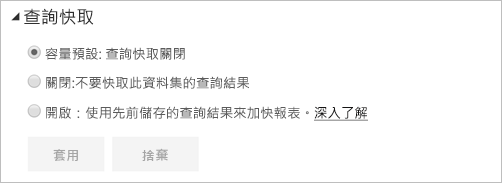

# Power BI Premium/Embedded 中的查詢快取

使用 Power BI Premium 或 Power BI Embedded 之組織可以利用「查詢快取」  來加速與資料集建立關聯的報表。 查詢快取會指示 Premium/Embedded 容量使用其本機快取服務來維護查詢結果，避免讓基礎資料來源計算這些結果。

> [!IMPORTANT]
> 查詢快取僅適用於 Power BI Premium 或 Power BI Embedded。 不適用於運用 Azure Analysis Services 或 SQL Server Analysis Services 的 LiveConnect 資料集。

快取的查詢結果特定於使用者和資料集內容，且一律遵循安全性規則。 目前，服務僅會對您登陸的初始頁面進行查詢快取。 換句話說，當您與報表互動時，查詢並不會快取。 查詢快取涉及[個人書籤](../consumer/end-user-bookmarks.md#personal-bookmarks)和[永續性篩選](https://powerbi.microsoft.com/blog/announcing-persistent-filters-in-the-service/)，因此會快取個人化報表所產生的查詢。 查詢完成快取後，由相同查詢提供的[儀表板圖格](../create-reports/service-dashboard-tiles.md)也會受益。 頻繁存取資料集且不需要經常重新整理時，會特別有益於效能。 查詢快取也可以減少查詢總數來降低 Premium/Embedded 容量的負載。

您可以在 Power BI 服務中資料集的 [設定]  頁面上控制查詢快取行為。 有三個可能的設定：

- **容量預設**：查詢快取關閉
- **關閉**：不為此資料集使用查詢快取。
- **開啟**：為此資料集使用查詢快取。

    

## 考量與限制

- 當您將快取設定從 [開啟]  變更為 [關閉]  時，先前所有已儲存的資料集查詢結果都會從容量快取中移除。 您可以用明確方式，或是還原至系統管理員設定為 [關閉]  的容量預設設定來關閉快取。 將其關閉可能會在下一次任何報表針對此資料集執行查詢時造成小量延遲。 延遲是因隨需執行的報表查詢所造成，而不是因利用已儲存的結果。 此外，必要的資料集可能需要先載入至記憶體，才能提供查詢。
- 重新整理查詢快取時，Power BI 必須針對基礎資料模型執行查詢，以取得最新的結果。 如果大量資料集啟用了查詢快取，且 Premium/Embedded 容量負載過重，則可能會在快取重新整理期間發生效能降低的情況。 效能會隨著執行的查詢量增加而降低。

## 後續步驟

* [什麼是 Power BI Premium？](../admin/service-premium-what-is.md)
* [什麼是 Azure Power BI Embedded？](../developer/embedded/azure-pbie-what-is-power-bi-embedded.md)
