# <a name="data-refresh-in-power-bi"></a>Power BI 的資料重新整理

Power BI 可讓您快速地將資料轉化成見解再轉化成動作，但您必須確定 Power BI 報表和儀表板中資料是最新的。 了解如何重新整理資料通常對於提供正確結果至關重要。

本文描述 Power BI 資料重新整理功能及其在概念層級的相依性。 它也提供最佳做法和祕訣來避免常見的重新整理問題。 該內容為協助您了解資料重新整理運作方式奠定了基礎。 如需設定資料重新整理的目標逐步指示，請參閱本文結尾＜後續步驟＞一節中列出的教學課程和操作指南。

## <a name="understanding-data-refresh"></a>了解資料重新整理

每當您重新整理資料時，Power BI 必須查詢基礎資料來源、可能會將來源資料載入資料集，然後更新您報表或儀表板中依賴已更新資料集的任何視覺效果。 根據您資料集的儲存模式，整個程序會包含多個階段，如下列各節中所述。

若要了解 Power BI 如何重新整理您的資料集、報表和儀表板，您必須注意下列概念：

- **儲存模式和資料集類型**：Power BI 所支援儲存模式和資料集類型有不同的重新整理需求。 您可以選擇將資料重新匯入 Power BI 以查看發生的任何變更，或直接在來源查詢資料。
- **Power BI 重新整理類型**：不論資料集詳細資料為何，了解各種重新整理類型可協助您了解 Power BI 在重新整理作業期間將其時間花在何處。 而結合這些詳細資料與儲存模式詳細資料，則有助於了解當您針對資料集選取 [立即重新整理] 時，Power BI 實際執行的動作。

### <a name="storage-modes-and-dataset-types"></a>儲存模式和資料集類型

Power BI 資料集可在下列其中一種模式中運作，以從各種資料來源存取資料。 如需詳細資訊，請參閱 [Power BI Desktop 中的儲存模式](../transform-model/desktop-storage-mode.md)。

- 匯入模式
- DirectQuery 模式
- LiveConnect 模式
- 推送模式

下圖說明不同的資料流程，視儲存模式而定。 最重要的一點是只有匯入模式資料集需要重新整理來源資料。 之所以需要重新整理是因為只有這種類型的資料集會從其資料來源匯入資料，且匯入的資料可能會定期或特別更新。 DirectQuery 資料集和連接到 Analysis Services 的 LiveConnect 模式資料集不會匯入資料；它們會在每次與使用者互動時查詢基礎資料來源。 推送模式資料集不會直接存取任何資料來源，但會預期您將資料推送到 Power BI。 資料集重新整理需求會因儲存模式/資料集類型而有所不同。

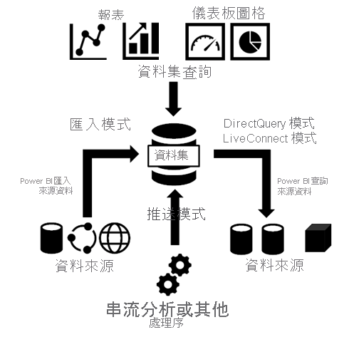

#### <a name="datasets-in-import-mode"></a>匯入模式資料集

Power BI 會從原始資料來源將資料匯入資料集。 提交給資料集的 Power BI 報表和儀表板查詢會從所匯入資料表和資料行傳回結果。 您可以將這類資料集視為時間點複本。 因為 Power BI 會複製資料，所以您必須重新整理資料集才能從基礎資料來源擷取變更。

因為 Power BI 會快取資料，所以匯入模式資料集大小可能很大。 請參閱下表以了解每個容量的資料集大小上限。 保持遠低於資料集大小上限，可避免資料集在重新整理作業期間要求超過可用資源數目上限時可能發生的重新整理問題。

| 容量類型 | 資料集大小上限 |
| --- | --- |
| 共用、A1、A2 或 A3 | 1 GB |
| A4 或 P1 | 3 GB |
| A5 或 P2 | 6 GB |
| A6 或 P3 | 10 GB |
| | |

#### <a name="datasets-in-directqueryliveconnect-mode"></a>DirectQuery/LiveConnect 模式資料集

Power BI 不會透過連接匯入在 DirectQuery/LiveConnect 模式中運作的資料。 相反地，每當報表或儀表板查詢資料集時，資料集就會從基礎資料來源傳回結果。 Power BI 會轉換查詢並將其轉送到資料來源。

雖然 DirectQuery 模式和 LiveConnect 模式很類似 (Power BI 在這兩種模式中都會將查詢轉送到來源)，但請務必注意，Power BI 不需要在 LiveConnect 模式中轉換查詢。 查詢會直接進入裝載資料庫的 Analysis Services 執行個體，而不會使用共用容量或 Premium 容量的資源。

因為 Power BI 不會匯入資料，所以您不需要執行資料重新整理。 不過，Power BI 仍會執行磚重新整理並可能執行報表重新整理，如下一節的重新整理類型中所述。 磚是釘選到儀表板的報表視覺效果，而儀表板磚會大約每小時重新整理一次，以確保磚顯示最新結果。 您可以在資料集設定中變更排程 (如下列螢幕擷取畫面所示)，或使用 [立即重新整理] 選項強制儀表板手動更新。

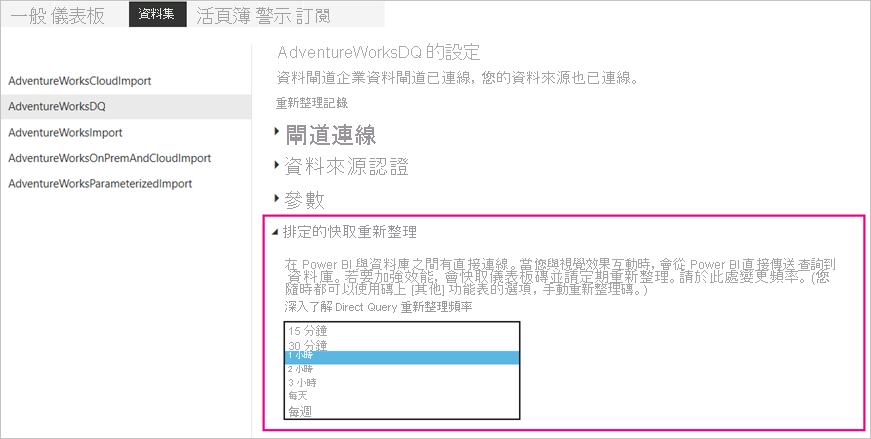

> [!NOTE]
> [資料集] 索引標籤的 [排定的快取重新整理] 區段不適用於匯入模式資料集。 這些資料集不需要重新整理每個磚，因為 Power BI 會在每個排程或隨選資料重新整理期間自動重新整理磚。

#### <a name="push-datasets"></a>推送資料集

推送資料集不會包含資料來源的正式定義，因此您不需要在 Power BI 中執行資料重新整理。 您會透過外部服務或程序 (例如 Azure 串流分析) 將資料推送到資料集來重新整理。 這是使用 Power BI 進行即時分析的常見方法。 Power BI 仍可對推送資料集上所使用的任何磚執行快取重新整理。 如需詳細的逐步解說，請參閱[教學課程：串流分析及 Power BI：適用於串流資料的即時分析儀表板](/azure/stream-analytics/stream-analytics-power-bi-dashboard)。

> [!NOTE]
> 推送模式有幾項限制，如 [Power BI REST API 限制](../developer/automation/api-rest-api-limitations.md)中所述。

### <a name="power-bi-refresh-types"></a>Power BI 重新整理類型

Power BI 重新整理作業可能是由多個重新整理類型組成，包括資料重新整理、OneDrive 重新整理、查詢快取的重新整理、磚重新整理，以及報表視覺效果的重新整理。 雖然 Power BI 會自動決定指定資料集所需的重新整理步驟，但您應該知道這些步驟的複雜度和重新整理作業持續時間。 如需快速參考，請參閱下表。

| 儲存模式 | 資料重新整理 | OneDrive 重新整理 | 查詢快取 | 磚重新整理 | 報表視覺效果 |
| --- | --- | --- | --- | --- | --- |
| 匯入 | 排程及隨選 | 是，適用於已連接的資料集 | 在 Premium 容量上啟用時 | 自動及隨選 | 否 |
| DirectQuery | 不適用 | 是，適用於已連接的資料集 | 在 Premium 容量上啟用時 | 自動及隨選 | 否 |
| LiveConnect | 不適用 | 是，適用於已連接的資料集 | 在 Premium 容量上啟用時 | 自動及隨選 | 是 |
| 推送 | 不適用 | 不適用 | 不可行 | 自動及隨選 | 否 |
| | | | | | |

#### <a name="data-refresh"></a>資料重新整理

對於 Power BI 使用者，重新整理資料通常表示會根據重新整理排程或隨選從原始資料來源將資料匯入資料集。 您可以每天執行多次資料集重新整理，這在基礎來源資料經常變更的情況下為必要。 Power BI 限制共用容量的資料集每天可重新整理八次。 如果資料集位於 Premium 容量上，則您可在資料集設定中排程每天最多重新整理 48 次。 如需詳細資訊，請參閱本文稍後的[設定排程重新整理](#configure-scheduled-refresh)。 當您使用 TMSL 或 PowerShell 以程式設計方式設定時，具有 [XMLA 端點](../admin/service-premium-connect-tools.md)的 Premium 容量上資料集會針對讀寫支援無限制重新整理作業啟用。

另請務必注意，每日重新整理次數的共用容量限制同時適用於排程重新整理及 API 重新整理，為兩者的合計。 您也可以在 [資料集] 功能表中選取 [立即重新整理]，以觸發隨選重新整理，如下列螢幕擷取畫面所示。 重新整理限制不包含隨選重新整理次數。 另請注意，Premium 容量上的資料集不限制 API 重新整理次數。 如有興趣使用 Power BI REST API 建置自己的重新整理解決方案，請參閱[資料集 - 重新整理資料集](/rest/api/power-bi/datasets/refreshdataset)。

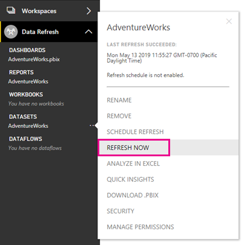

> [!NOTE]
> 共用容量資料重新整理必須在 2 小時內完成。 如果您的資料集需要較長時間執行重新整理作業，請考慮將資料集移至 Premium 容量。 在 Premium，重新整理持續時間上限為 5 小時。

#### <a name="onedrive-refresh"></a>OneDrive 重新整理

如果您根據 Power BI Desktop 檔案、Excel 活頁簿或是 OneDrive 或 SharePoint Online 上的逗點分隔值 (.csv) 檔案建立資料集和報表，Power BI 會執行另一種類型的重新整理，稱為 OneDrive 重新整理。 如需詳細資訊，請參閱[針對 Power BI 從檔案取得資料](service-get-data-from-files.md)。

不同於資料集重新整理期間，Power BI 會從資料來源將資料匯入資料集，OneDrive 重新整理會將資料集和報表與其來源檔案進行同步。 根據預設，如果連接到 OneDrive 或 SharePoint Online 上檔案的資料集需要同步處理，Power BI 會大約每小時檢查一次。

Power BI 會根據 OneDrive 中的項目識別碼執行重新整理，因此在考慮更新與取代時請謹慎。 當將 OneDrive 檔案設定為資料來源時，Power BI 會在執行重新整理時參考檔案的項目識別碼。 請考慮下列情況：您有一個主要檔案 _A_ 和該檔案的生產環境複本 _B_，並為檔案 B 設定 OneDrive 重新整理。如果接著將檔案 A「複製」到檔案 B，則複製作業會刪除舊的檔案 B，並使用不同項目識別碼來建立新的檔案 B，但這會中斷 OneDrive 重新整理。 若要避免發生這種情況，您可改為上傳並取代檔案 B，這會保留其相同的項目識別碼。

您可將檔案移到另一個位置 (例如使用拖放)，且重新整理會繼續執行，因為 Power BI 仍然知道檔案識別碼。 不過，如果您將該檔案複製到其他位置，則會建立檔案的新執行個體和新的 fileID。 因此，您的 Power BI 檔案參考不再有效，重新整理將會失敗。

> [!NOTE]
> 即使已在本機電腦上完成同步處理，以及在 Power BI 服務中使用了「立即重新整理」之後，Power BI 最多可能需要 60 分鐘來重新整理資料集。

若要檢閱過去的同步處理週期，請檢查 [重新整理記錄] 中的 [OneDrive] 索引標籤。 下列螢幕擷取畫面顯示範例資料集的同步處理週期已完成。

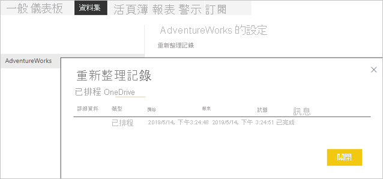

如上方螢幕擷取畫面所示，Power BI 將此 OneDrive 重新整理識別為**排程**重新整理，但無法設定重新整理間隔。 您只能在資料集的設定中停用 OneDrive 重新整理。 如果您不希望 Power BI 中的資料集和報表自動從來源檔案選取任何變更，則停用重新整理會很有用。

請注意，如果資料集連接到 OneDrive 或 SharePoint Online 中的檔案，資料集設定頁面只會顯示 [OneDrive 認證] 和 [OneDrive 重新整理] 區段，如下列螢幕擷取畫面所示。 未連接到 OneDrive 或 SharePoint Online 中來源檔案的資料集不會顯示這些區段。


如果您停用資料集的 OneDrive 重新整理，您仍可視需要在 [資料集] 功能表中選取 [立即重新整理] 來同步資料集。 在隨選重新整理的過程中，Power BI 會檢查 OneDrive 或 SharePoint Online 上的來源檔案是否比 Power BI 中資料集更新；如果是，則會同步資料集。 [重新整理記錄] 會將這些活動列為 [OneDrive] 索引標籤上的隨選重新整理。

請注意，OneDrive 重新整理不會從原始資料來源提取資料。 OneDrive 重新整理只會更新 Power BI 中其中繼資料和資料來自 .pbix、.xlsx 或 .csv 的資源，如下圖所示。 為了確保資料集包含資料來源中的最新資料，Power BI 也會在隨選重新整理的過程中觸發資料重新整理。 如果您切換為 [已排程] 索引標籤，則可以在 [重新整理記錄] 中驗證這點。


如果您針對連接到 OneDrive 或 SharePoint Online 的資料集保持啟用 OneDrive 重新整理，並想要根據排程執行資料重新整理，請務必設定排程，讓 Power BI 在 OneDrive 重新整理之後執行資料重新整理。 例如，如果您建立了自己的服務或程序，在每天晚上凌晨 1 點更新 OneDrive 或 SharePoint Online 中的來源檔案，您可以設定在凌晨 2:30 執行排程重新整理，讓 Power BI 有足夠的時間完成 OneDrive 重新整理，再開始資料重新整理。

#### <a name="refresh-of-query-caches"></a>查詢快取的重新整理

如果您的資料集位於 Premium 容量上，您就可以藉由啟用查詢快取來改善任何相關聯報表和儀表板的效能，如下列螢幕擷取畫面所示。 查詢快取會指示 Premium 容量使用其本機快取服務來維護查詢結果，避免讓基礎資料來源計算這些結果。 如需詳細資訊，請參閱 [Power BI Premium 中的查詢快取](power-bi-query-caching.md)。

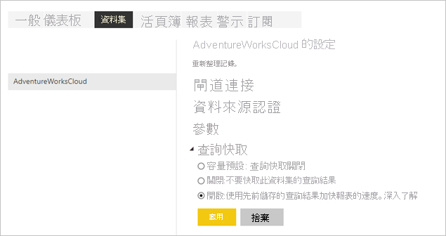

不過，在資料重新整理之後，先前快取的查詢結果將不再有效。 Power BI 會捨棄這些快取的結果，且必須加以重建。 基於這個理由，查詢快取可能不利於與您經常重新整理 (例如每天 48 次) 的資料集建立關聯的報表和儀表板。

#### <a name="tile-refresh"></a>磚重新整理

Power BI 會為儀表板上的每個磚視覺效果維護一個快取，並在資料變更時主動更新磚快取。 換句話說，磚重新整理會在資料重新整理之後自動發生。 這對排程及隨選重新整理作業均適用。 您也可以選取儀表板右上方的 [更多選項] (...)，然後選取 [更新儀表板的磚] 來強制執行重新整理磚。

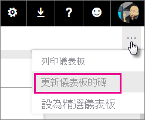

因為這會自動發生，所以您可以考慮在資料重新整理期間重新整理磚。 此外，您可能注意到重新整理持續時間會隨著磚數目增加。 磚重新整理額外負荷很可觀。

根據預設，Power BI 會為每個磚維護一個快取，但如果您使用動態安全性根據使用者角色限制資料存取 (如 [Power BI 的資料列層級安全性 (RLS)](../admin/service-admin-rls.md) 一文中所述)，則 Power BI 必須為每個角色和每個磚維護一個快取。 磚快取數目會乘以角色數目。

如果資料集使用即時連接來連接具有 RLS 的 Analysis Services 資料模型，則情況可能會變得更複雜，如[動態資料列層級安全性與 Analysis Services 表格式模型](desktop-tutorial-row-level-security-onprem-ssas-tabular.md)教學課程中所強調。 在此情況下，Power BI 必須為每個磚和每個曾經檢視儀表板的使用者維護及重新整理一個快取。 這類資料重新整理作業的磚重新整理部分通常會遠超過從來源擷取資料所需時間。 如需磚重新整理的詳細資訊，請參閱[磚錯誤進行疑難排解](refresh-troubleshooting-tile-errors.md)。

#### <a name="refresh-of-report-visuals"></a>報表視覺效果的重新整理

此重新整理程序較不重要，因為它只與 Analysis Services 的即時連接相關。 針對這些連接，Power BI 會快取報表視覺效果的最近狀態，因此當您再次檢視報表時，Power BI 不需要查詢 Analysis Services 表格式模型。 當您與報表互動時 (例如透過變更報表篩選)，Power BI 會查詢表格式模型並自動更新報表視覺效果。 如果您懷疑報表顯示過時資料，您也可以選取報表的 [重新整理] 按鈕來觸發所有報表視覺效果的重新整理，如下列螢幕擷取畫面所示。

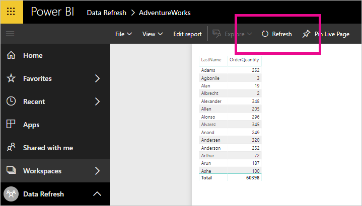

## <a name="review-data-infrastructure-dependencies"></a>檢閱資料基礎結構相依性

不論儲存模式為何，除非可存取基礎資料來源，否則資料重新整理可能會失敗。 有三個主要的資料存取案例：

- 資料集使用位於內部部署的資料來源
- 資料集使用雲端中的資料來源
- 資料集使用來自內部部署和雲端來源的資料

### <a name="connecting-to-on-premises-data-sources"></a>連接到內部部署資料來源

如果您的資料集使用 Power BI 無法透過直接網路連線存取的資料來源，您必須設定此資料集的閘道連接，才能啟用重新整理排程或執行隨選資料重新整理。 如需資料閘道及其運作方式的詳細資訊，請參閱[什麼是內部部署的資料閘道？](service-gateway-onprem.md)

您有下列選項：

- 選擇具有必要資料來源定義的企業資料閘道
- 部署個人資料閘道

> [!NOTE]
> 您可以在[管理您的資料來源 - 匯入/已排程的重新整理](service-gateway-enterprise-manage-scheduled-refresh.md)一文中，找到需要資料閘道的資料來源類型清單。

#### <a name="using-an-enterprise-data-gateway"></a>使用企業資料閘道

Microsoft 建議使用企業資料閘道 (而不是個人閘道) 將資料集連接到內部部署資料來源。 請確定閘道已正確設定，這表示閘道必須具有最新的更新和所有必要的資料來源定義。 資料來源定義為 Power BI 提供指定來源的連接資訊，包括連接端點、驗證模式和認證。 如需管理閘道上資料來源的詳細資訊，請參閱[管理您的資料來源 - 匯入/已排程的重新整理](service-gateway-enterprise-manage-scheduled-refresh.md)。

如果您是閘道管理員，將資料集連接到企業閘道會相當簡單。 透過管理員權限，您可以立即更新閘道，並視需要新增遺漏的資料來源。 事實上，您可以直接從資料集設定頁面，將遺漏的資料來源新增至閘道。 展開切換按鈕以檢視資料來源，然後選取 [新增至閘道] 連結，如下列螢幕擷取畫面所示。 反之，如果您不是閘道管理員，則必須連絡閘道管理員，才能新增必要的資料來源定義。

> [!NOTE]
> 只有閘道管理員可以將資料來源新增至閘道。 此外，請確認閘道管理員已將您的使用者帳戶新增至具有資料來源使用權限的使用者清單。 在資料集設定頁面中，您僅能選取與所具資料來源使用權限相符的企業閘道。

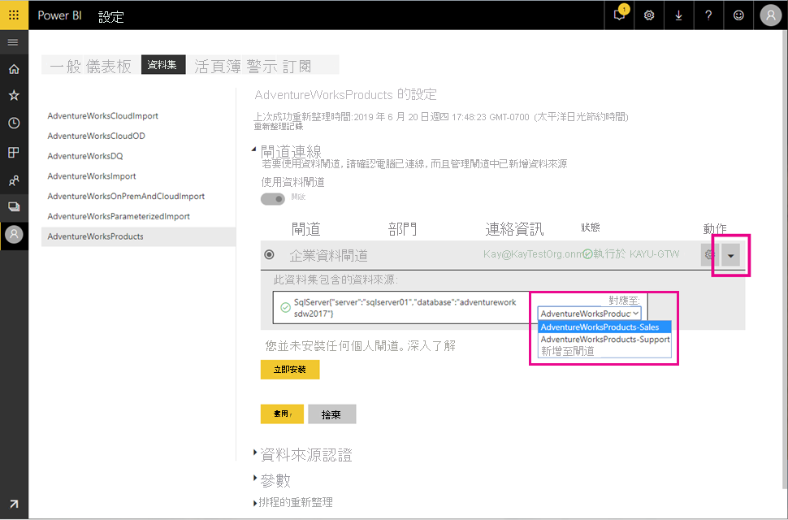

請確認您將正確的資料來源定義對應到您的資料來源。 如上方螢幕擷取畫面所示，閘道系統管理員可以在連線到同一個資料來源的單一閘道上，建立多個定義，並各有不同的認證。 在所示範例中，銷售部門中的資料集擁有者會選擇 AdventureWorksProducts-Sales 資料來源定義，而支援部門中的資料集擁有者會將資料集對應至 AdventureWorksProducts-Support 資料來源定義。 如果無法憑直覺挑選資料來源定義的名稱，請連絡您的閘道系統管理員，以釐清該挑選哪個定義。

> [!NOTE]
> 一個資料集只能使用一個閘道連接。 換句話說，您無法跨多個閘道連接存取內部部署資料來源。 因此，您必須將所有必要的資料來源定義新增至同一個閘道。

#### <a name="deploying-a-personal-data-gateway"></a>部署個人資料閘道

如果您沒有企業資料閘道存取權，且您是管理資料集的唯一人員，因此不需要與其他人共用資料來源，則可以在個人模式中部署資料閘道。 在 [閘道連接] 區段的 [您並未安裝任何個人閘道] 下，選取 [立即安裝]。 個人資料閘道有幾項限制，如[內部部署資料閘道 (個人模式)](service-gateway-personal-mode.md) 中所述。

不同於企業資料閘道，您不需要將資料來源定義新增至個人閘道。 相反地，您會透過使用資料集設定中的 [資料來源認證] 區段來管理資料來源設定，如下列螢幕擷取畫面所示。

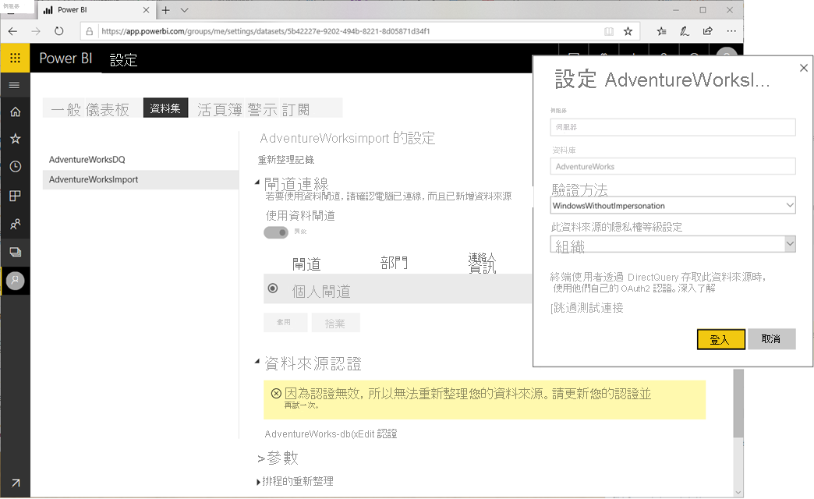


### <a name="accessing-cloud-data-sources"></a>存取雲端資料來源

如果 Power BI 可以建立來源的直接網路連線，則使用雲端資料來源 (例如 Azure SQL DB) 的資料集不需要資料閘道。 因此，您可以使用資料集設定中的 [資料來源認證] 區段，來管理這些資料來源的設定。 如下列螢幕擷取畫面所示，您不需要設定閘道連接。

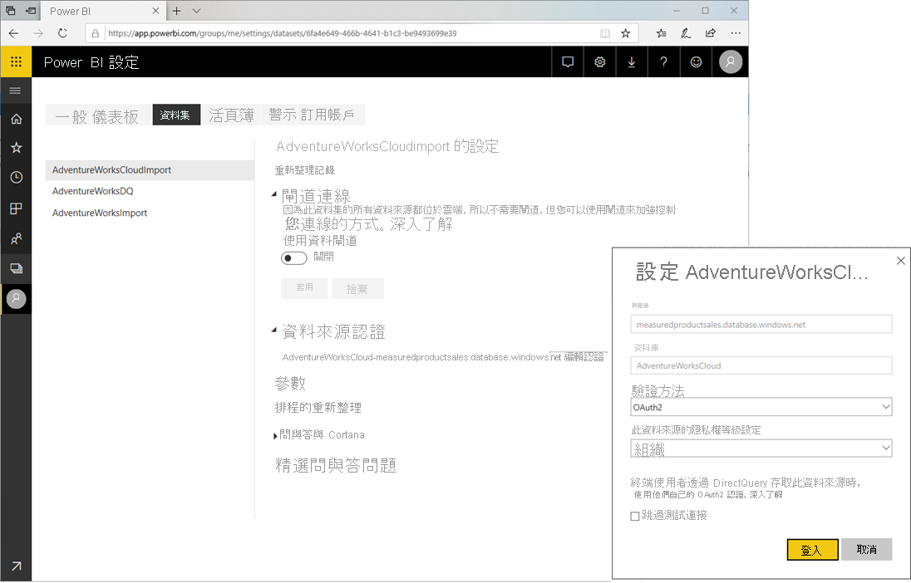

> [!NOTE]
> 無論資料集位於哪個工作區，每位使用者在其擁有的所有資料集內，每個資料來源只能有一組認證。 

### <a name="accessing-on-premises-and-cloud-sources-in-the-same-source-query"></a>在同一個來源查詢中存取內部部署和雲端來源

資料集可以從多個來源取得資料，且這些來源可以位於內部部署或雲端。 不過，一個資料集只能使用一個閘道連接，如稍早所述。 雖然雲端資料來源不一定需要閘道，但如果資料集在單一混搭查詢中連接到內部部署和雲端來源，則需要閘道。 在這種情況下，Power BI 也必須針對雲端資料來源使用閘道。 下圖說明這類資料集如何存取其資料來源。


> [!NOTE]
> 如果資料集使用個別混搭查詢來連接到內部部署和雲端來源，Power BI 會使用閘道連接來連接到內部部署來源，並使用直接網路連線來連接到雲端來源。 如果混搭查詢會合併或附加來自內部部署和雲端來源的資料，Power BI 會切換為閘道連接，即使是雲端來源也一樣。

Power BI 資料集依賴 Power Query 存取並擷取來源資料。 下列交互式清單顯示一個基本的查詢範例，合併來自內部部署來源和雲端來源的資料。

```
Let

    OnPremSource = Sql.Database("on-premises-db", "AdventureWorks"),

    CloudSource = Sql.Databases("cloudsql.database.windows.net", "AdventureWorks"),

    TableData1 = OnPremSource{[Schema="Sales",Item="Customer"]}[Data],

    TableData2 = CloudSource {[Schema="Sales",Item="Customer"]}[Data],

    MergedData = Table.NestedJoin(TableData1, {"BusinessEntityID"}, TableData2, {"BusinessEntityID"}, "MergedData", JoinKind.Inner)

in

    MergedData
```

您有兩個選項來設定資料閘道，以支援合併或附加來自內部部署和雲端來源的資料：

- 除了內部部署資料來源，請將雲端來源的資料來源定義新增至資料閘道。
- 啟用 [允許使用者的雲端資料來源透過此閘道叢集進行重新整理] 核取方塊。


如果您啟用閘道設定中的 [允許使用者的雲端資料來源透過此閘道叢集進行重新整理] 核取方塊 (如上方螢幕擷取畫面所示)，Power BI 就可以使用使用者在資料集設定中 [資料來源認證] 下為雲端來源定義的設定。 這可協助降低閘道設定額外負荷。 相反地，如果您想要更進一步控制閘道所建立的連接，則不應該啟用此核取方塊。 在此情況下，您必須針對每個想要支援的雲端來源，將明確資料來源定義新增至您的閘道。 您也可以啟用核取方塊，然後針對雲端來源，將明確的資料來源定義新增至閘道。 在此情況下，閘道會針對所有相符的來源使用資料來源定義。

### <a name="configuring-query-parameters"></a>設定查詢參數

您使用 Power Query 建立的交互式或 (M) 查詢可能會有不同的複雜度，從簡單步驟到參數化建構。 下列清單顯示一個簡單的交互式查詢範例，使用兩個參數 _SchemaName_ 和 _TableName_ 來存取 AdventureWorks 資料庫中的指定資料表。

```
let

    Source = Sql.Database("SqlServer01", "AdventureWorks"),

    TableData = Source{[Schema=SchemaName,Item=TableName]}[Data]

in

    TableData
```

> [!NOTE]
> 只有匯入模式資料集支援查詢參數。 DirectQuery/LiveConnect 模式不支援查詢參數定義。

為了確保參數化資料集存取正確資料，您必須在資料集設定中設定交互式查詢參數。 您也可以使用 [Power BI REST API](/rest/api/power-bi/datasets/updateparametersingroup)，透過程式設計方式更新參數。 下列螢幕擷取畫面顯示使用者介面，為使用上述交互式查詢的資料集設定查詢參數。

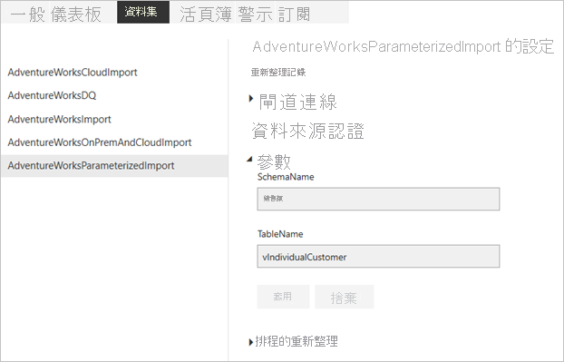


## <a name="refresh-and-dynamic-data-sources"></a>重新整理和動態資料來源
 
「動態資料來源」是一種資料來源，在 Power Query 執行其查詢之前，無法判斷連線所需的部分或全部資訊，因為資料會以程式碼產生或從另一個資料來源傳回。 範例包括：SQL Server 資料庫的執行個體名稱和資料庫、CSV 檔案的路徑或 Web 服務的 URL。 
 
在大多數情況下，使用動態資料來源的 Power BI 資料集無法在 Power BI 服務中重新整理。 有一些例外狀況可在 Power BI 服務中重新整理動態資料來源，例如，搭配 Web.Contents M 函式使用 RelativePath 和 Query 選項時。 參考 Power Query 參數的查詢也可以重新整理。
 
若要判斷您的動態資料來源是否可以重新整理，請在 [Power Query 編輯器] 中開啟 [資料來源設定] 對話方塊，然後選取 [目前檔案中的資料來源]。 在出現的視窗中，尋找下列警告訊息，如下圖所示：
 
> [!NOTE]
> 因為手寫查詢，所以可能不會列出部分資料來源。


如果出現的 [資料來源設定] 對話方塊中顯示該警告，則會顯示無法在 Power BI 服務中重新整理的動態資料來源。

## <a name="configure-scheduled-refresh"></a>設定排程的重新整理

在 Power BI 與您的資料來源之間建立連接，是設定資料重新整理方面到目前為止最具挑戰性的工作。 其餘步驟則相當簡單，包括設定重新整理排程和啟用重新整理失敗通知。 如需逐步指示，請參閱[設定排程重新整理](refresh-scheduled-refresh.md)操作指南。

### <a name="setting-a-refresh-schedule"></a>設定重新整理排程

[排程重新整理] 區段可讓您定義資料集重新整理的頻率和時段。 如稍早所述，如果您的資料集在共用容量，您可以設定最多每天八個時段；如果在 Power BI Premium，則可以設定 48 個時段。 下列螢幕擷取畫面顯示十二個小時間隔的重新整理排程。

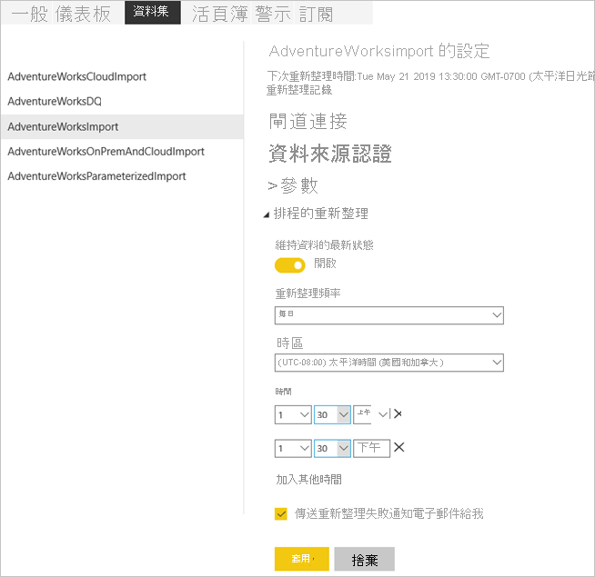

設定重新整理排程之後，資料集設定頁面會通知您下次重新整理時間，如上方螢幕擷取畫面所示。 如果您想要更快重新整理資料 (例如測試閘道和資料來源設定)，請使用導覽窗格中資料集功能表裡的 [立即重新整理]  選項來執行隨選重新整理。 隨選重新整理不會影響下次排程重新整理時間。

另請注意，已設定重新整理時間可能不是 Power BI 開始下一個排程程序的確切時間。 Power BI 會盡可能準時開始排程重新整理。 目標是在排程時段 15 分鐘內重新整理，但如果服務無法及時配置所需的資源，則最多會延遲一小時。

> [!NOTE]
> Power BI 會在連續失敗四次之後，或在服務偵測到無法復原的錯誤而需要設定更新時 (例如認證無效或已過期)，停用您的重新整理排程。 您無法變更連續失敗閾值。

### <a name="getting-refresh-failure-notifications"></a>取得重新整理失敗通知

根據預設，Power BI 會透過電子郵件傳送重新整理失敗通知給資料集擁有者，讓擁有者可以在發生重新整理問題時及時採取動作。 當服務因為連續失敗而停用您的排程時，Power BI 也會傳送通知給您。 Microsoft 建議您保持啟用 [傳送重新整理失敗通知電子郵件給我] 核取方塊。

您也可以使用 [Email these users when the refresh fails] \(重新整理失敗時，傳送電子郵件給這些使用者\) 文字方塊來指定其他收件者。 除了資料集擁有者之外，指定的收件者也會收到重新整理失敗通知。 這可能是您的同事，負責在您休假時處理您的資料集。 也可能是您支援小組的電子郵件別名，負責處理您部門或組織的重新整理問題。 除了資料集擁有者以外，將重新整理失敗通知傳送給其他人，有助於確保及時注意到問題並妥善解決。

請注意，Power BI 不只會在重新整理失敗時，也會在服務因為處於非使用狀態而暫停排程重新整理時傳送通知。 兩個月後，當沒有使用者瀏覽以資料集建置的任何儀表板或報表時，Power BI 會將資料集視為非使用中。 在此情況下，Power BI 會傳送電子郵件訊息給資料集擁有者，指出服務已暫停資料集的重新整理排程。 如需這類通知的範例，請參閱下列螢幕擷取畫面。

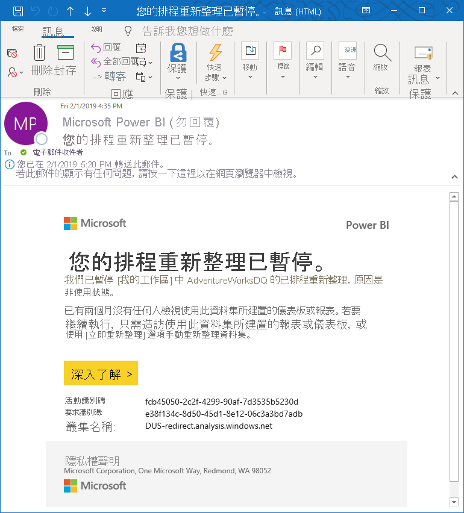

若要繼續排程重新整理，請瀏覽使用此資料集建置的報表或儀表板，或是使用 [立即重新整理] 選項手動重新整理資料集。

### <a name="checking-refresh-status-and-history"></a>檢查重新整理狀態和記錄

除了失敗通知，定期檢查您資料集中是否有重新整理錯誤也是很好的方法。 一個快速方式是檢視工作區中的資料集清單。 有錯誤的資料集會顯示一個小型警告圖示。 選取警告圖示以取得其他資訊，如下列螢幕擷取畫面所示。 如需為特定重新整理錯誤進行疑難排解的詳細資訊，請參閱[重新整理案例進行疑難排解](refresh-troubleshooting-refresh-scenarios.md)。


警告圖示有助於指出目前的資料集問題，但不時檢查重新整理記錄也是很好的方法。 如名稱所指，重新整理記錄可讓您檢閱過去同步處理週期的成功或失敗狀態。 例如，閘道管理員可能已更新一組過期的資料庫認證。 如下列螢幕擷取畫面所示，重新整理記錄顯示受影響的重新整理何時重新開始運作。


> [!NOTE]
> 您可以在資料集設定中找到顯示重新整理記錄的連結。 您也可以使用 [Power BI REST API](/rest/api/power-bi/datasets/getrefreshhistoryingroup)，透過程式設計方式擷取重新整理記錄。 透過使用自訂解決方案，您可以集中監視多個資料集的重新整理記錄。

## <a name="automatic-page-refresh"></a>自動重新整理頁面

自動頁面重新整理會在報表頁面層級運作，並可讓報表作者設定頁面中視覺效果 (只有在取用頁面時才會是作用中) 的重新整理間隔。 自動頁面重新整理僅適用於 DirectQuery 資料來源。 最小重新整理間隔取決於發行報表的工作區類型，以及進階工作區和[內嵌工作區](../developer/embedded/embedding.md)的容量管理員設定。

若要深入了解自動頁面重新整理，請參閱[自動頁面重新整理](../create-reports/desktop-automatic-page-refresh.md)一文。

## <a name="best-practices"></a>最佳作法

定期檢查資料集的重新整理記錄，是您可以採用來確保報表和儀表板使用目前資料的最重要最佳做法之一。 如果您發現問題時，請立即加以解決，並在必要時連絡資料來源擁有者和閘道管理員。

此外，請考慮下列建議來為您的資料集建立和維護可靠的資料重新整理程序：

- 排程在較空閒的時間重新整理，特別是您的資料集在 Power BI Premium 時。 如果您將資料集的重新整理週期分散到更廣泛的時間範圍，則可以協助避免可能造成可用資源負擔過重的尖峰。 延遲開始重新整理週期是資源超載的指標。 如果 Premium 容量已完全耗盡，Power BI 可能甚至會略過重新整理週期。
- 請注意重新整理限制。 如果來源資料經常變更或資料量很大，且在來源增加的負載與對查詢效能造成的影響可接受，請考慮使用 DirectQuery/LiveConnect 模式，而不是匯入模式。 避免經常重新整理匯入模式資料集。 不過，DirectQuery/LiveConnect 模式有幾項限制，例如傳回資料有一百萬個資料列限制及執行查詢有 225 秒回應時間限制，如[在 Power BI Desktop 中使用 DirectQuery](desktop-use-directquery.md) 中所述。 這些限制可能仍會要求您使用匯入模式。 針對非常大的資料量，請考慮使用 [Power BI 中的彙總](../transform-model/desktop-aggregations.md)。
- 確認您的資料集重新整理時間不超過重新整理持續時間上限。 使用 Power BI Desktop 來檢查重新整理持續時間。 如果需要超過 2 小時，請考慮將您的資料集移至 Power BI Premium。 您的資料集在共用容量可能無法重新整理。 另請考慮對大於 1GB 或重新整理需要數小時之資料集使用 [Power BI Premium 中的累加式重新整理](../admin/service-premium-incremental-refresh.md)。
- 將您的資料集最佳化，僅包含您的報表和儀表板所使用資料表和資料行。 盡可能將您的交互式最佳化查詢最佳化，以避免動態資料來源定義和昂貴的 DAX 計算。 特別是避免測試資料表中每個資料列的 DAX 函式，因為這會造成高記憶體耗用量和處理額外負荷。
- 套用與 Power BI Desktop 相同的隱私權設定，以確保 Power BI 可產生有效率的來源查詢。 請注意，Power BI Desktop 不會發佈隱私權設定。 您必須在發佈資料集之後，手動重新套用資料來源定義中的設定。
- 限制您儀表板上的視覺效果數目，特別是使用[資料列層級安全性 (RLS)](../admin/service-admin-rls.md) 時。 如本文稍早所述，過多的儀表板磚可能會大幅增加重新整理持續時間。
- 使用可靠的企業資料閘道部署，以將您的資料集連接到內部部署資料來源。 如果您注意到與閘道相關的重新整理失敗 (例如閘道無法使用或超載)，請連絡閘道管理員以將其他閘道新增至現有的叢集，或部署新的叢集 (相應增加與向外延展)。
- 針對匯入資料集和 DirectQuery/LiveConnect 資料集使用個別資料閘道，讓排程重新整理期間的資料匯入不會影響 DirectQuery/LiveConnect 資料集上的報表和儀表板效能，這類資料集會在每次與使用者互動時查詢資料來源。
- 確保 Power BI 可以將重新整理失敗通知傳送至您的信箱。 垃圾郵件篩選可能會封鎖電子郵件訊息或將其移至其他資料夾，而導致您可能不會立即注意到。


## <a name="next-steps"></a>後續步驟

[設定排定的重新整理](refresh-scheduled-refresh.md)  
[對重新整理問題進行疑難排解的工具](service-gateway-onprem-tshoot.md)  
[對重新整理進行疑難排解的案例](refresh-troubleshooting-refresh-scenarios.md)  

有其他問題嗎？ [嘗試在 Power BI 社群提問](https://community.powerbi.com/)
