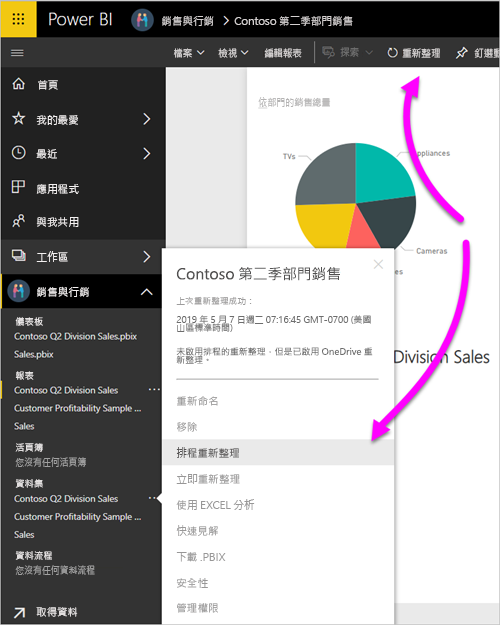

# 重新整理 OneDrive 或 SharePoint Online 上儲存的資料集
將檔案從 OneDrive 或 SharePoint Online 匯入至 Power BI 服務，是確定您在 Power BI Desktop中的工作與 Power BI 服務保持同步的好方法。

## 將 Power BI Desktop 檔案儲存在 OneDrive 或 SharePoint Online 的優點
將 Power BI Desktop 檔案儲存在 OneDrive 或 SharePoint Online 時，任何已載入檔案模型的資料都會匯入至資料集。 任何您已在該檔案中建立的報表都會載入至 Power BI 服務中的 [報表]  。 假設您對 OneDrive 或 SharePoint Online 上的檔案進行變更。 這些變更可以包括新增量值、變更資料行名稱，或編輯視覺效果。 一旦您儲存檔案，Power BI 服務也會與這些變更同步，通常需要大約一小時。

您可以選取 [主資料夾]  功能區的 [重新整理]  ，直接在 Power BI Desktop 手動執行一次性的重新整理。 當您選取 [重新整理]  時，就會使用原始資料來源的更新資料重新整理檔案的模型。 這種重新整理完全可從 Power BI Desktop 應用程式本身內進行。 它不同於 Power BI 中的手動或排程重新整理，請務必了解其差異。

當您從 OneDrive 或 SharePoint Online 匯入 Power BI Desktop 檔案時，會將資料和模型資訊載入至 Power BI 中的資料集。 您想要重新整理 Power BI 服務中的資料集，因為這是您報表的基礎所在。 因為資料來源位於外部，所以您可以使用 [立即重新整理]  手動重新整理資料集，或您可以使用 [排程重新整理]  設定重新整理排程。 

當您重新整理資料集時，Power BI 不會連接到 OneDrive 或 SharePoint Online 上的檔案來查詢更新資料。 它會使用資料集中的資訊，直接連接到資料來源，並查詢更新的資料。 然後，它會將該資料載入至資料集。 此資料集內重新整理的資料不會同步回到 OneDrive 或 SharePoint Online 上的檔案。

## 支援的項目有哪些？
Power BI 支援從 Power BI Desktop 檔案建立的資料集進行 [重新整理]  和 [排程重新整理]  ，這些檔案是從本機磁碟匯入，而您會在本機磁碟使用 [取得資料]  或 [查詢編輯器]  ，來連接至下列任何資料來源並載入其中資料。

> [!NOTE]
> 支援即時連線資料集的 Onedrive 重新整理。 不過，OneDrive 重新整理案例並不支援在已發行的報表中，將即時連線資料集從某個資料集變更為另一個。

### Power BI Gateway - Personal
* Power BI Desktop 的 [取得資料]  和 [查詢編輯器]  都會顯示所有線上資料來源。
* Power BI Desktop 的 [取得資料]  和 [查詢編輯器]  都會顯示所有內部部署資料來源，但 Hadoop 檔案 (HDFS) 與 Microsoft Exchange 除外。

<!-- Refresh Data sources-->
[!INCLUDE [refresh-datasources](../includes/refresh-datasources.md)]

> [!NOTE]
> 必須安裝並執行閘道器，才能讓 Power BI 連接至內部部署資料來源並重新整理資料集。
> 
> 

## OneDrive 或商務用 OneDrive。 有何不同？
如果您有個人 OneDrive 和商務用 OneDrive，則應該保留任何您想要匯入至商務用 OneDrive 中 Power BI 的檔案。 原因如下：您可能使用兩個不同的帳戶來登入它們。

當您連接至 Power BI 中的商務用 OneDrive 時，連線很容易，因為您的 Power BI 帳戶通常與您的商務用 OneDrive for Business 帳戶相同。 如果使用個人 OneDrive，您通常會以不同的 [Microsoft 帳戶](https://account.microsoft.com)登入。

當您使用 Microsoft 帳戶登入時，請確定選取 [讓我保持登入]  。 Power BI 之後可將您在 Power BI Desktop 檔案中進行的任何更新與在 Power BI 中資料集同步處理。

如果您已變更 Microsoft 認證，則無法同步處理 OneDrive 上的檔案與 Power BI 中的資料集之間的變更。 您需要連接至 OneDrive，並從中重新匯入您的檔案。

## 我要如何排程重新整理？
當您設定重新整理排程時，Power BI 會直接連接至資料來源。 Power BI 會使用資料集中的連線資訊和認證來查詢更新的資料。 然後，Power BI 會將更新的資料載入至資料集。 接著，它會根據 Power BI 服務中的該資料集更新任何報表視覺效果和儀表板。

如需如何設定排程重新整理的詳細資訊，請參閱[設定排程重新整理](refresh-scheduled-refresh.md)。

## 發生錯誤時
發生錯誤時，通常是因為 Power BI 無法登入資料來源。 如果資料集嘗試連接至內部部署資料來源，但閘道離線，則也可能發生錯誤。 若要避免這些問題，請確定 Power BI 可以登入資料來源。 請嘗試在 [資料來源認證]  中登入您的資料來源。 有時候，您用來登入資料來源的密碼會變更，或 Power BI 從資料來源登出。

當您將變更儲存至 OneDrive 上的 Power BI Desktop 檔案，且在一小時左右之內未看到這些變更時，有可能是因為 Power BI 無法連接到您的 OneDrive。 請嘗試再次連接到位於 OneDrive 的檔案。 如果系統提示您登入，請確定您已選取 [讓我保持登入]  。 因為 Power BI 無法連接到您的 OneDrive 來同步處理檔案，所以您將需要再次匯入您的檔案。

請務必核取 [傳送重新整理失敗通知電子郵件給我]  。 您會想要立刻知道排定的重新整理是否失敗。

## 疑難排解
有時候重新整理資料可能不會如預期執行。 當透過閘道連接時，您通常會碰到資料重新整理問題。 請參閱閘道疑難排解文章，以取得工具和已知的問題。

[為內部部署資料閘道進行疑難排解](service-gateway-onprem-tshoot.md)

[對 Power BI Gateway - Personal 進行疑難排解](service-admin-troubleshooting-power-bi-personal-gateway.md)

有其他問題嗎？ 請嘗試詢問 [Power BI 社群](https://community.powerbi.com/)。
