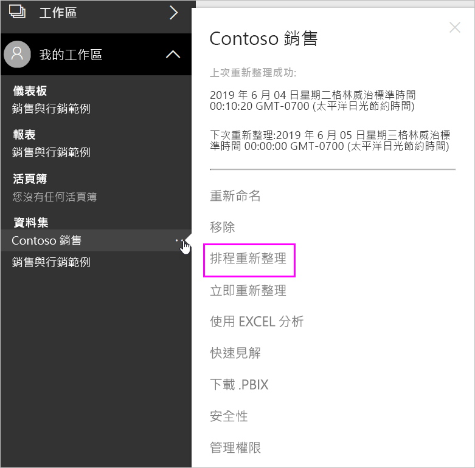
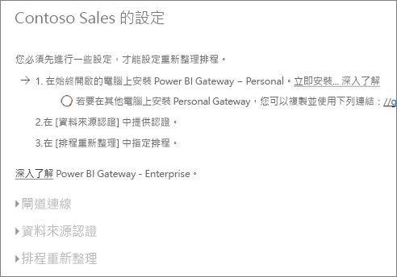
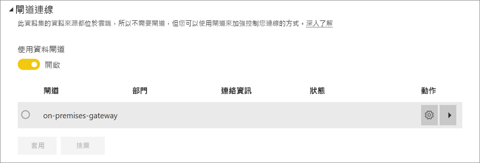

# 設定排程的重新整理

>[!NOTE]
>閒置兩個月之後，就會暫停資料集重新整理排程。 如需詳細資訊，請參閱本文稍後的[排程重新整理](#scheduled-refresh)  。

本文描述可用來對[內部部署的資料閘道 (個人模式)](service-gateway-personal-mode.md) 及[內部部署的資料閘道](service-gateway-onprem.md)進行排程重新整理的選項。 您可以在 Power BI 服務的下列區域中，指定重新整理選項：[閘道連線]  、[資料來源認證]  和 [排程重新整理]  。 我們將輪流探討每個選項。 如需資料重新整理的詳細資訊，包括重新整理排程的限制，請參閱[資料重新整理](refresh-data.md#data-refresh)。

若要前往 [排程重新整理]  畫面：

1. 在瀏覽窗格中，選取 [資料集]  底下所列資料集旁的 [更多選項]  (...)。
2. 選取 [排程重新整理]  。

    

## 閘道連線

依據您是否有個人或企業閘道在線上且可供使用而定，您會在此處看到不同選項。

如果沒有可用的閘道，您就會看到 [閘道連線]  為停用。 您也會看到一則指出如何安裝個人閘道的訊息。

如果您已設定個人閘道且閘道在線上，該閘道便可供選取。 如果無法使用，則會顯示為離線。

如果適用的話，您也可以選取企業閘道。 如果在針對指定閘道設定之資料來源的 [使用者]  索引標籤中列出您的帳戶，您就只會看到企業閘道。

## 資料來源認證

### Power BI Gateway - Personal

如果您是使用個人閘道來重新整理資料，則必須提供認證以連線至後端資料來源。 如果您是透過線上服務連線至內容套件，則已排定重新整理會沿用您輸入的連線認證。

您只有在第一次對該資料集使用重新整理時，才需要登入資料來源。 進入之後，這些認證會隨資料集保留。

> [!NOTE]
> 就某些驗證方法而言，如果您用來登入資料來源的密碼到期或已變更，您就必須也在 [資料來源認證]  中為資料來源變更密碼。

如果發生錯誤，問題通常起因於閘道無法登入 Windows 並啟動服務而導致離線，或 Power BI 無法登入資料來源以查詢已更新的資料。 如果重新整理失敗，請檢查資料集設定。 如果閘道服務離線，您可以在 [狀態]  查看錯誤。 如果 Power BI 無法登入資料來源，您可以在 [資料來源認證] 查看錯誤。

### 內部部署的資料閘道

如果您使用內部部署資料閘道來重新整理資料，就不需要提供認證，因為閘道管理員會定義資料來源的認證。

> [!NOTE]
> 連線到內部部署 SharePoint 以進行資料重新整理時，Power BI 僅支援「匿名」  、「基本」  及 Windows (NTLM/Kerberos)  驗證機制。 Power BI 不支援使用 *ADFS* 或任何「表單型驗證」  機制進行內部部署 SharePoint 資料來源重新整理。

## 排程重新整理

[排定的重新整理]  區段可讓您定義資料集重新整理的頻率和時段。 某些資料來源不需要可設定的閘道以進行重新整理；其他資料來源則需要閘道。

將 [維持資料的最新狀態]  滑桿設為 [開啟]  以進行設定。

> [!NOTE]
> 目標是在排程時段 15 分鐘內重新整理，但如果服務無法及時配置所需的資源，則最多會延遲一小時。

![[排定的重新整理] 對話方塊](media/refresh-scheduled-refresh/scheduled-refresh.png)

> [!NOTE]
> 閒置兩個月之後，就會暫停資料集重新整理排程。 當沒有使用者瀏覽以資料集建置的任何儀表板或報表時，資料集會視為非使用中。 屆時，資料集擁有者會收到電子郵件，指出暫停已排程的重新整理。 然後，該資料集的重新整理排程會顯示為 [停用]  。 若要繼續已排程的重新整理，只需重新瀏覽以該資料集建置的任何儀表板或報表即可。

## 支援的項目？

> [!NOTE]
> 已排定的重新整理在連續四次錯誤之後也會自動停用。

針對不同的閘道，有些特定資料集可支援排定的重新整理。 下列參考可讓您了解哪些項目適用。

### Power BI Gateway - Personal

**Power BI Desktop**

* Power BI Desktop 的 [取得資料]  和 [查詢編輯器] 中顯示的所有線上資料來源。
* Power BI Desktop 的 [取得資料]  和 [查詢編輯器] 中顯示的所有內部部署資料來源，但 Hadoop 檔案 (HDFS) 與 Microsoft Exchange 除外。

**Excel**

* Power Query 中顯示的所有線上資料來源。
* Power Query 中顯示的所有內部部署資料來源，但 Hadoop 檔案 (HDFS) 與 Microsoft Exchange 除外。
* Power Pivot 中顯示的所有線上資料來源。
* Power Pivot 中顯示的所有內部部署資料來源，但 Hadoop 檔案 (HDFS) 與 Microsoft Exchange 除外。

> [!NOTE]
> Excel 2016 和更新版本已將 Power Query 列在功能區的 [資料]  區段中，[取得和轉換資料]  下。

### Power BI Gateway

如需支援的資料來源資訊，請參閱 [Power BI 資料來源](power-bi-data-sources.md)。

## 疑難排解
有時候重新整理資料可能不會如預期執行。 這通常是閘道連線問題之故。 請參閱閘道疑難排解文章，以取得工具和已知的問題。

- [為內部部署資料閘道進行疑難排解](service-gateway-onprem-tshoot.md)
- [對 Power BI Gateway - Personal 進行疑難排解](service-admin-troubleshooting-power-bi-personal-gateway.md)

## 後續步驟

- [Power BI 的資料重新整理](refresh-data.md)  
- [Power BI Gateway - Personal](service-gateway-personal-mode.md)  
- [內部部署資料閘道 (個人模式)](service-gateway-onprem.md)  
- [為內部部署資料閘道進行疑難排解](service-gateway-onprem-tshoot.md)  
- [對 Power BI Gateway - Personal 進行疑難排解](service-admin-troubleshooting-power-bi-personal-gateway.md)  

有其他問題嗎？ [嘗試在 Power BI 社群提問](https://community.powerbi.com/)