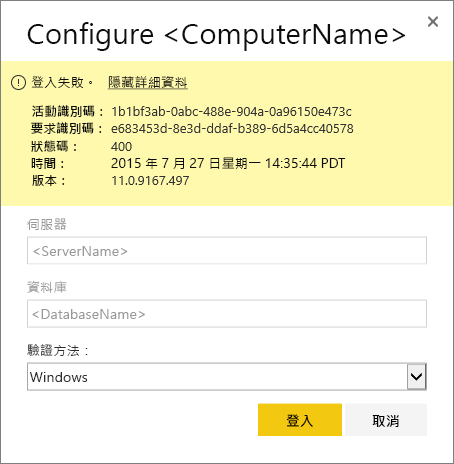
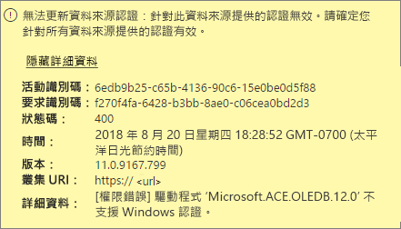
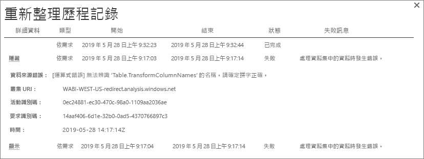
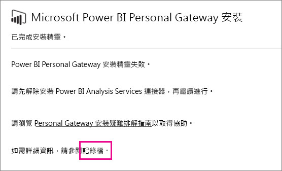
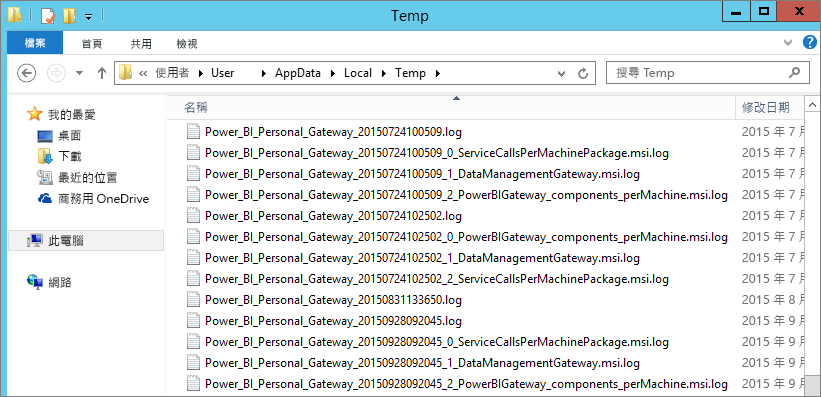

# 針對 Power BI 閘道進行疑難排解 (個人模式)

[!INCLUDE [gateway-rewrite](../includes/gateway-rewrite.md)]

下列各節會探討使用 Power BI 內部部署資料閘道 (個人模式) 時可能會發生的一些常見問題。

## 更新為最新版本

目前供個人使用的閘道版本是內部部署資料閘道 (個人模式)。 請更新您的安裝來使用該版本。

當閘道版本過期時就會出現很多問題。 確認您維持在最新版本是一個良好的一般做法。 若您超過一個月或更久沒有更新閘道，建議您考慮安裝最新版的閘道。 然後，查看您是否可以重現問題。

## 安裝
**閘道 (個人模式) 是在 64 位元的版本上運作：** 若您的電腦是 32 位元版本，您便無法安裝閘道 (個人模式)。 您的作業系統必須是 64 位元版本。 請安裝 64 位元的 Windows 版本，或是在 64 位元的電腦上安裝閘道 (個人模式)。

**即使您已經是電腦的本機系統管理員，閘道 (個人模式) 仍無法作為服務安裝：** 若使用者位於電腦的本機系統管理員群組，但群組原則並未允許該使用者名稱作為服務登入，安裝便可能會失敗。 請確認群組原則可讓使用者作為服務登入。 我們正努力修正這個問題。 如需詳細資訊，請參閱 [Add the Log on as a service right to an account](https://technet.microsoft.com/library/cc739424.aspx) (將作為服務登入的權限新增至帳戶)。

**作業逾時：** 若您要安裝閘道 (個人模式) 的電腦 (實體機器或 VM) 具有單一核心處理器，則通常會出現此訊息。 請關閉任何應用程式和非必要的處理序，並再次嘗試進行安裝。

**無法在與閘道 (個人模式) 相同的電腦上安裝資料管理閘道或 Analysis Services 連接器：** 若您已安裝 Analysis Services 連接器或資料管理閘道，您必須先解除安裝連接器或閘道。 然後再嘗試安裝閘道 (個人模式)。

> [!NOTE]
> 如果您在安裝期間遇到問題，安裝記錄檔可以提供協助您解決問題的資訊。 如需詳細資訊，請參閱[安裝程式記錄](#SetupLogs)。
> 
> 

 **Proxy 設定：** 若您的環境需要使用 Proxy，則在您設定閘道 (個人模式) 時便可能發生問題。 若要深入了解如何設定 Proxy 資訊，請參閱[為內部部署資料閘道設定 Proxy 設定](/data-integration/gateway/service-gateway-proxy)。

## 排程重新整理
**錯誤：遺漏儲存在雲端中的認證。**

若您在具有已排程重新整理的情況下解除安裝並重新安裝閘道 (個人模式)，您便可能會在 \<dataset\> 的設定中遇到此錯誤。 當您解除安裝閘道 (個人模式) 時，即會從 Power BI 服務中移除針對重新整理而設定的資料集資料來源認證。

**解決方案：** 在 Power BI 中，移至資料集的重新整理設定。 在 [管理資料來源]  中，針對任何發生錯誤的資料來源，選取 [編輯認證]  。 然後再次登入資料來源。

**錯誤：為此資料集提供的認證不正確。請更新重新整理過程中或在 [資料來源設定] 對話方塊中的認證以繼續。**

**解決方案：** 如果您收到認證訊息，可能表示：

* 您用來登入資料來源的使用者名稱和密碼並非處於最新狀態。 在 Power BI 中，移至該資料集的 [重新整理] 設定。 在 [管理資料來源]  中，選取 [編輯認證]  來更新資料來源的認證。
* 若其中一個來源使用 OAuth 進行驗證，則單一查詢內雲端來源和內部部署來源的混搭便無法在閘道 (個人模式) 中重新整理。 此問題的範例為：CRM Online 和本機 SQL Server 執行個體之間的混搭。 由於 CRM Online 需要 OAuth，因此混搭會失敗。
  
  這項錯誤是已知問題，且我們正在進行調查。 若要針對此問題採取因應措施，請針對雲端來源和內部部署來源使用不同的查詢。 然後使用合併或附加查詢合併它們。

**錯誤：不支援的資料來源。**

**解決方案：** 若您在 [排程重新整理]  設定中看到不支援資料來源的訊息，這可能表示： 

* 資料來源目前不支援在 Power BI 中重新整理。 
* Excel 活頁簿不包含資料模型，僅包含工作表資料。 目前僅當上傳的 Excel 活頁簿包含資料模型時，Power BI 才支援重新整理。 當您使用 Power Query 匯入 Excel 中的資料時，請選擇 [載入]  選項來將資料載入資料模型。 此選項可確保將該資料匯入資料模型。 

**錯誤：[無法合併資料] &lt;查詢部分&gt;/&lt;…&gt;/&lt;…&gt;正在存取具有隱私權等級的資料來源，而其無法一起使用。請重建這個資料組合。**

**解決方案：** 這項錯誤是由於隱私權等級限制及所使用的資料來源類型所致。

**錯誤：資料來源錯誤:無法將值 "\[Table\]" 轉換成類型 Table。**

**解決方案：** 這項錯誤是由於隱私權等級限制及所使用的資料來源類型所致。

**錯誤：這個資料列沒有足夠空間。**

**解決方案：** 若您有大小超過 4 MB 的單一資料列，就會發生這個錯誤。 請從資料來源中尋找該資料列，然後嘗試篩選掉該資料列或減少該資料列的大小。

## 資料來源
**遺漏資料提供者：** 閘道 (個人模式) 只能在 64 位元版本上運作。 您必須要在安裝閘道 (個人模式) 之相同電腦上安裝資料提供者的 64 位元版本。 例如，如果該資料集中的資料來源是 Microsoft Access，您就必須將 64 位元 ACE 提供者安裝在安裝了閘道 (個人模式) 的相同電腦上。 

>[!NOTE]
>若您擁有 32 位元版本的 Excel，您便無法在相同電腦上安裝 64 位元版本的 ACE 提供者。

**Access 資料庫不支援 Windows 驗證：** Power BI 目前僅支援 Access 資料庫的匿名驗證。

**錯誤：在您輸入資料來源的認證時，發生登入錯誤：** 若您在針對資料來源輸入 Windows 認證時收到與此錯誤相似的錯誤： 

  

您可能仍在使用舊版閘道 (個人模式)。 

**解決方案：** 如需詳細資訊，請參閱[安裝最新版本的 Power BI 閘道 (個人模式)](https://powerbi.microsoft.com/gateway/)。

**錯誤：在您針對使用 ACE OLEDB 的資料來源選取 Windows 驗證時發生登入錯誤：** 若您在針對使用 ACE OLEDB 提供者的資料來源輸入資料來源認證時，收到以下錯誤：

Power BI 目前針對使用 ACE OLEDB 提供者的資料來源不支援 Windows 驗證。

**解決方案：** 若要因應處理此錯誤，請選取 [匿名驗證]  。 針對舊版 ACE OLE DB 提供者，匿名認證與 Windows 認證相同。

## 磚重新整理
若您在儀表板磚重新整理時收到錯誤，請參閱[針對磚錯誤進行疑難排解](refresh-troubleshooting-tile-errors.md)。

## 疑難排解的工具
### 重新整理歷程記錄
透過**重新整理歷程記錄**，您可以查看發生的錯誤並在您需要建立支援要求時尋找有用資料。 您可以檢視排程及隨選重新整理。 以下是取得**重新整理歷程記錄**的方法。

1. 在 Power BI 導覽窗格的 [資料集]  中，選取資料集。 開啟功能表，然後選取 [排程重新整理]  。

   ![選取 [排程重新整理]](media/service-admin-troubleshooting-power-bi-personal-gateway/scheduled-refresh.png)
1. 在 [設定...]  中，選取 [重新整理歷程記錄]  。 

   ![選取 [重新整理歷程記錄]](media/service-admin-troubleshooting-power-bi-personal-gateway/scheduled-refresh-2.png)
   
   

### 事件記錄檔
有數個事件記錄檔可以提供資訊。 若您是電腦的系統管理員，前兩個是**資料管理閘道**和 **PowerBIGateway**。 若您不是系統管理員，且若您正在使用資料閘道 (個人模式)，您會在 [應用程式]  記錄中看到記錄項目。

**Data Management Gateway** 和 **PowerBIGateway** 記錄檔位於 **Application and Services Logs**下。

### Fiddler 追蹤
[Fiddler](https://www.telerik.com/fiddler) 是 Telerik 所提供的免費工具，可監視 HTTP 流量。 您可以從用戶端電腦看到與 Power BI 服務的通訊。 此通訊可能會顯示錯誤及其他相關資訊。

### 安裝程式記錄
若無法安裝閘道 (個人模式) ，則您會看到顯示安裝程式記錄的連結。 安裝記錄檔會顯示失敗的相關詳細資料。 這些記錄檔是 Windows 安裝記錄檔，也稱為 MSI 記錄檔。 可能相當複雜且難以閱讀。 產生的錯誤通常會在底部，但判斷錯誤的原因並非易事。 這可能是由不同記錄中的錯誤所導致。 這也可能是記錄中於較高位置發生的錯誤所導致。

或者，您可以前往您的暫存資料夾 (%temp%) 並尋找開頭為 *Power\_BI\_* 的檔案。

> [!NOTE]
> 前往 %temp% 可能會將您引導至暫存的子資料夾。*Power\_BI\_* 檔案位於暫存目錄的根中。 您可能需要往上一或兩個層級。
> 
> 

## 後續步驟
- [設定內部部署資料閘道的 Proxy 設定](/data-integration/gateway/service-gateway-proxy)- [資料重新整理](refresh-data.md)  
- [Power BI gateway - Personal](service-gateway-personal-mode.md)  
- [為磚錯誤進行疑難排解](refresh-troubleshooting-tile-errors.md)  
- [為內部部署資料閘道進行疑難排解](service-gateway-onprem-tshoot.md) 
 
有其他問題嗎？ 請嘗試詢問 [Power BI 社群](https://community.powerbi.com/)。
